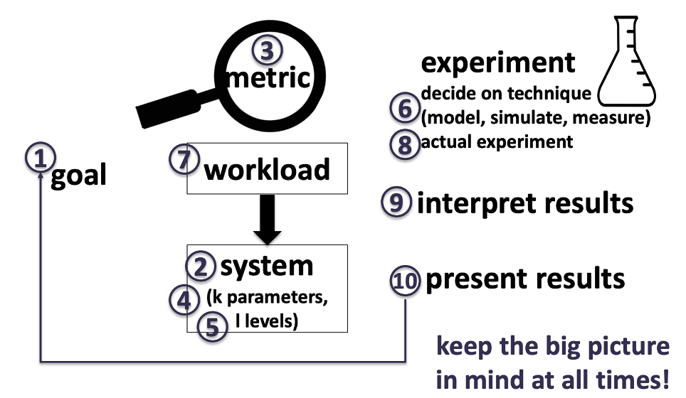
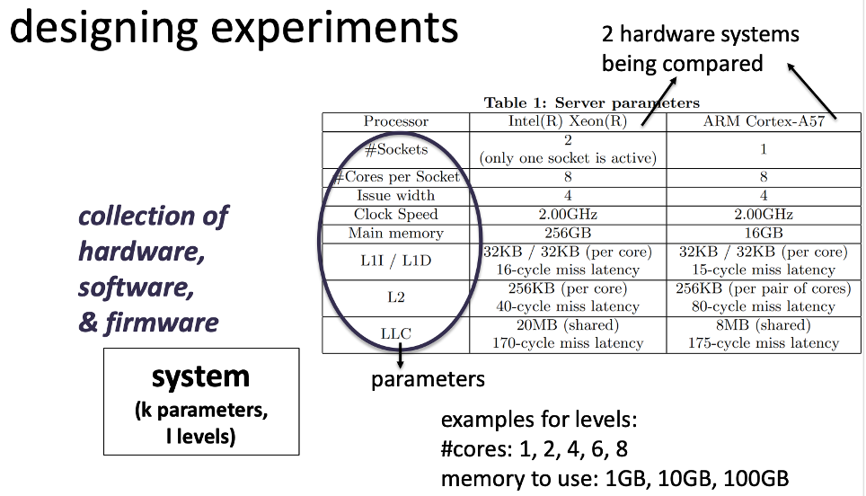
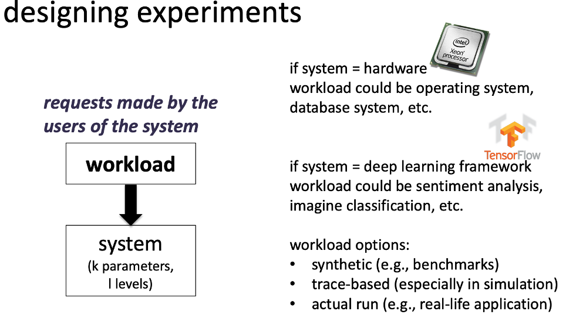
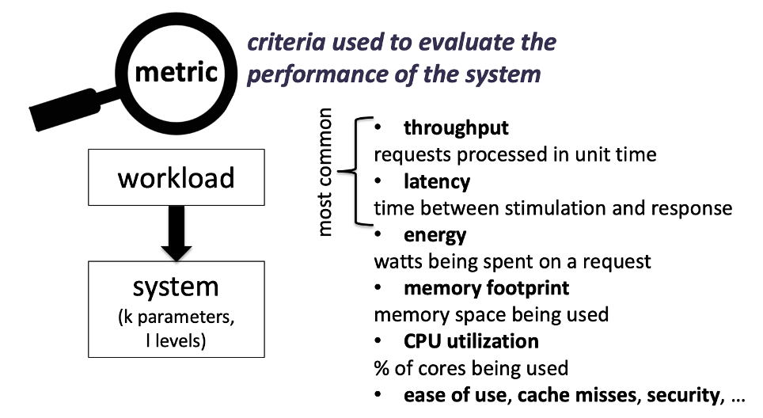
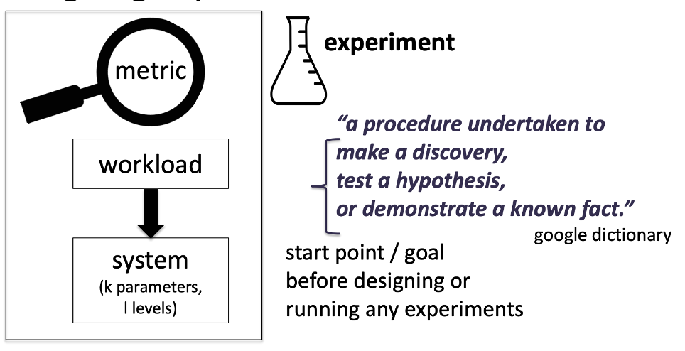
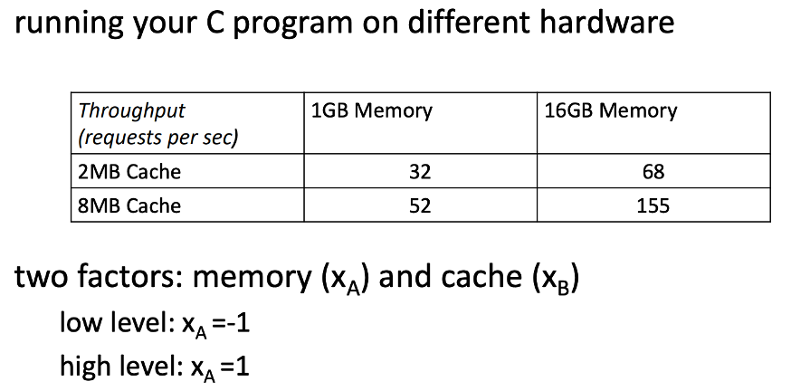
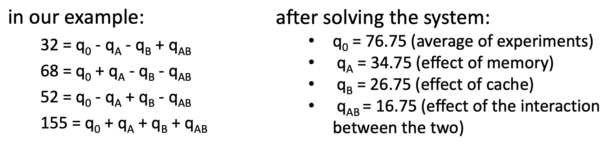

# Lecture 1 - Experimental design

## Summary
>* Performance analysis of computer systems is crucial for many *scientific goals* and requires *understanding several layers* of computer systems well.
>* There are several ways to perform such analysis using
**modeling, simulation, measurements**.
>* Analysis also requires **designing experiments**.
>* Designing experiments require determining **systems, workloads, metrics, experimental** runs to reach the initial scientific goal.

## System stack overview
> **Application**: e.g., online shopping page, database system, code to read/write a file, etc.
> **Operating system**: e.g., linux, windows, etc.
> **Hardware**: e.g., intel server, disks, etc.

## Performance analysis
> What is it in this course?
> - Analysis of computer systems with respect to certain metrics to serve a scientific goal

> Why is it useful?
> * identifying performance requirements
> * comparing different systems / methods / design alternatives
>* system tuning – optimal values for different parameters
>* bottleneck identification
>* characterizing workloads / applications
>* capacity planning
>* forecasting for future workloads

> How is it done?
> 
>**Analytical modeling**
> * analyze things with pen and paper
>* easy and low cost
>* but not very accurate in practice (models require you to simplify stuff)
>
> **Simulation**
>* when measurements with the real thing aren’t possible or very costly (e.g., trying out new hardware idea)
>* higher accuracy than analytical modeling
>* can take long time & not as accurate as a well-done 
>
> **Measurement**
> * experiments with the real thing $\rarr$ the most convincing results
>* but need to be careful to not to end up with misleading results
>
> **Note: in practice, a continuous process with all these steps!**

## Designing experiments / Experimental methodology

1. Design a **goal**. 
   1. What is your scientific goal?
   2. What do you want to get out of your experiment
2. Define your **system** 
   1. Hardware, software, & firmware
3. Define your **metrics**
   1. What is the **throughput**?,
   2. latency
   3. energy, 
   4. CPU utilization, 
   5. cache misses and CPU cycles
4. Define **parameters**
5. Define **levels**
   1. At each $k$ parameters, there are $l$ levels.
6. Decide what are your **experiment technique**? 
   1. Analysis modeling
   2. Simulation
   3. Measurement
7. Define **workload** 
   1. Synthetic (e.g. benchmarks)
   2. Trace-based (especially in simulation)
   3. Actual run (e.g., real-life application)
8. Conduct your **experiment**
9. **Interpret** your results
10. **Present** your results

**Experimental methodology**
* Systems
* Workloads 
* Metrics
* Experiments
  
### Systems
> Collection of hardware, software & firmware
>
> Setup
> * $k$ parameters
> * $l$ levels 

What are the number of cores?
What is the cache sizes?
What are the sizes of memory to use?

> At each $k$ parameters, there are $l$ levels.
>* Parameters could be cores or memory
>* For cores there are 5 levels like, 1, 2, 4, 6, 8
>* For memory there could be 3 levels: 1GB, 10GB, 100GB

### Workloads
> Request made by the users of the system

> Workload options:
>* synthetic (e.g., benchmarks)
>* trace-based (especially in simulation)
>* actual run (e.g., real-life application)

> If system = hardware 
> * Workload could be: **Operating system** or **Database system**

> If system = deep learning framework
> * Workload could be: **sentiment analysis** or **image classification**

### Metric
> Criteria used to evaluate the performance of the system

> What is the **throughput**?
> What are the number of requests we can handle in a unit of time?
> What is the **latency**, the time between stimulation and response?
> What is the **energy** being spent on a request? What is the power consumption?
> What is the **memory footprint**, how is the memory space being used?
> What is the **CPU utilization** in % of the cores being used?
> Ease of use, **cache misses**, **security**, **clock cycles**

### Experiment
> A procedure undertaken to 
> * **Make a discovery**
>     * Would like to observe the throughput of system A?
> * **Test a hypothesis**
>     * Hypothesis to test: System A has higher throughput than system B
> * **Demonstrate a known fact**
>     * It has been shown before that system A has higher throughput than system B, would like to reproduce this result

> Example:
> assume a default level for each parameter. vary a single parameter’s level at a time, keep others at default.
> default #cores = 1, memory = 100GB
> 5 + (3 - 1) = 7 experiments

> How many times to run a particular experiment?
>* statistics would help you here
>* in practice, **do not run it just once** & make sure standard deviation is low across different runs! if not, you have an error to fix or a phenomenon to understand!

## Parameter with the most impact?
> Often more than one factor/parameter has effect e.g., number of CPU cores, network connection speed, etc. how to determine which one has biggest impact?

### $2^k$ factorial experiment
> * for each factor (can be anything that affects our response variable), consider a low and high level.
>* measure the system with all combinations (hence the $2^k$)
>* should be combined with repetitions

> Example:

## Performance modeling
> Non-linear regression for performance (just a model!)
> $throughput = q_0 + q_Ax_A + q_Bx_B + q_{AB}x_Ax_B$

* can use further statistics to understand
* the impact of a parameter on throughput
* **will not get into more formulas in this course**
* **this course will have a more computer systems focus**

## In practice
* you can use $2^k$ experiments as a starting point
* not all $2^k$ experiments may be necessary,
you can do fewer experiments
* for parameters with higher impact, you may want to do >2 experiments for sensitivity analysis
* do not forget to repeat your experiments to account for errors

