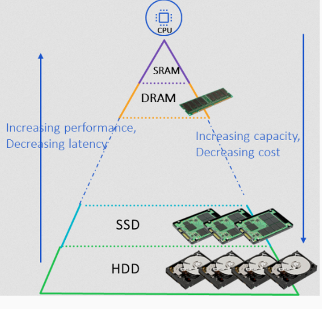

# Lecture 10 - AI Performance Matters

### Needs to utilize resources efficiently

* Training resource consumption is increasingly relevant
* GPUs are only utilized 52% on average for 100,000 jobs

### Machine Learning Pipeline

*Are we doing **Machine Learning** or **Data Science***?

## What is data Loaling for ML?

**Definition**:
> Supplying data to the machine learning loop, usually in batches.

## Reading from Storage

### Data Loading Overview

### Data available on the device

### Far Away Data

ML datasets are too large for expensive storage

### Requirement: Randomised Order

ML models rely on Stochastic Gradiet Descent. What hapens if we do not randomise the order of samples?

* dependencies between mini-batches due to otdering
* "bad" mini-batches persist

### Stalling

Loading from disk is expensive and slower than how fast the model can train

*How can we resolve this bottleneck*?
* Compute Throughput > Data Loading Throughput

We need to flip this by increasing data loading throughput.

Can be done by:

### Multi-worker

**Data loading workers**
> Increasing the amount of data workers increases data loading throughput

## Preprocessing

### Data Loading Overview

### ETL

**Extract, Transform, Load**

*Where do we transform the data*?

* Offine *data preperation* vs. Online *just-in-time*

### Improving our data intake

* A simple pipeline is fast
* Is a simple pipeline effective?

#### Data reduction and expansion

### You control the data, not the patterns

#### Expansion: Data Augmentation

> artificially increasing the size and diversity of a training dataset by creating modified versions of existing data.

Has multiple uses cases:
* Medical Imaging
* Traffic Signs

#### Reduction: Selection 

> choosing a subset of features or data to simplify models, speed up training, and reduce overfitting.

**Watch out**: Traning vs. Inference

* We are augmenting to prevent fitting on unwanted features.
* Most data operations should not be applied on inference

Inference = the phase where a trained model is used to make predictions on new, unseen data.

## Sending to GPU

### Data Loading Overview

### Collate

*Why have the collate step during data loading at all?*

**to collate** to assemble in proper order
* The collate function packs loose data tensors into one big big continious tensor.

tensor = multi-dimensional array

#### Problem 1: GPU Architecture

**GPU Architecture**
> The GPU is a *massively-paralle architecture* that is great at doing many *simple* things in parallel

#### Problem 1: Parallel Data

**Coalesced access**
> GPU memory access is coalesced when a group of GPU threads access consecutive memory addresses at the same time. 

Coalesced memory access means multiple threads access memory in a single, efficient operation.

**The Problem**
Data is scattered, so GPU threads access non-consecutive memory, leading to uncoalesced, inefficient memory access.

#### Problem 2: GPUs are far away

GPUs are very good at computing, but are *far way* and need to be fed data (fetch).

## Optimising data loading

**What are we looking for**?
* Loading data faster is important
* But loading better data is even better

### Accuracy

**Overfitting:** learning features that don’t generalise well

Time to Accuracy combines speed and performance

### How to measure data loading time?

**Async Execution**
> It can be very difficult to find data loading due to overalpping computation

*We can however use trace plots*

**NVIDIA Nsight Systems**

**PyTorch profiler**

### Data loading time

I am assuming that this is why asynch execution is mentioned, that we load concurrently/or in parallel

**Hiding what takes time**:

**GPU Prefetching**
> GPU data pipelining/prefetching can hide data stalls

A **data stall **is simply a pause in GPU execution because the next batch (or needed tensor data) isn’t yet available in device 

By pipelining (a.k.a. prefetching), you decouple your I/O and your compute so that the GPU never sits idle waiting for data.

---

* Data preparation usually takes place on the host (CPU).
* Loaded on the GPU when required

### DALI

DALI = Replace or skip CPU data processing

Use NVIDIA DALI (or similar) to perform decoding, augmentations and format conversions with GPU kernels instead of Python/CPU loops.
* Offloads (or entirely bypasses) your CPU‑based decoding, augmentation and preprocessing—so you feed ready‐to‑use tensors straight into the GPU, eliminating CPU bottlenecks.

### RAPIDS

Left (Without GPUDirect Storage):
* Data must travel NVMe ↔ CPU memory (via PCIe), then CPU stages it through a bounce buffer before a second PCIe transfer to the GPU.
* This incurs extra copy overhead, latency, and CPU load.

Right (With GPUDirect Storage):
* The GPU reads straight from NVMe over PCIe via DMA—no CPU memory or bounce buffer.
* Results in lower latency, higher throughput, and frees the CPU from data‑copy tasks.

### TensorSOcket: Collocated data journey

Collocation introduced data loading redundancies

### TensorSocket: Sharing the data pipeline

You “lift out” the heavy lifting into one shared pipeline: data is read, decoded and transformed once, then multicast into each GPU’s queue