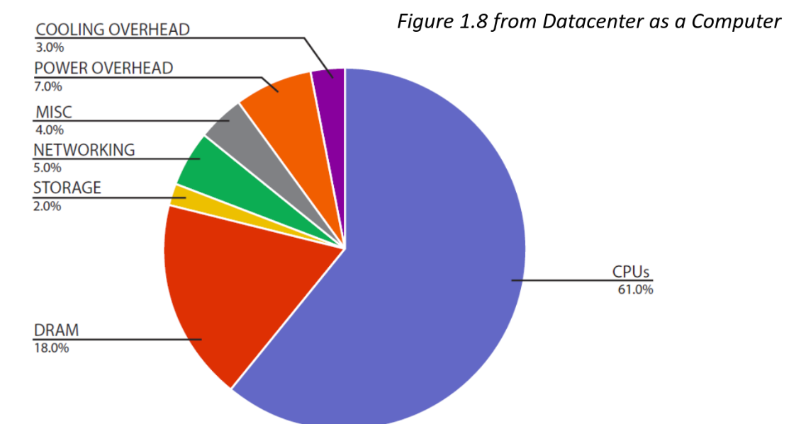
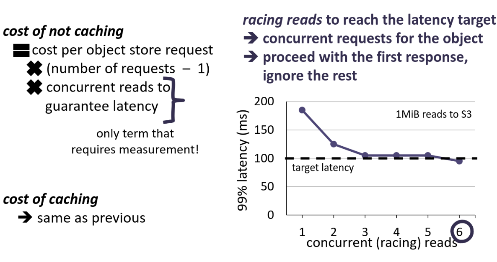

# Lecutre 11 - Datacenters / Cloud

### Summary

* warehouse-scale computer is a type of datacenter that runs various applications, but is managed as a hole.
* disaggregation helps with the hardware resource scaling,but increases data movement & latency unpredictability and complicates the economics caching.
* systems stack is deeper for warehouse-scale computers, but can be specialized for the needs of applications.
* high-performance computing (HPC) centers aren’t so different from the cloud today hardware-wise, but the main goal & software systems differ.

### Cloud Computing 

**Definition**:
> a model that replaces traditional enterprise computing systems with one that is layered on top of warehouse-scale computers

---

**Old-School Datacenter**
* Large number of small/medium size applications each running on dedicated hardware
* Largely third-party hardware that has no interaction with each other and managed seperately

**Warehouse-scale computer**
* a few large-scale applications sharing hardware resources
* hardware largely built in-house and managed as a whole by a single entity/organiation
* today runs many big/small apps as well, still managed as a whole

### Challenges

- Analyzing/testing the larger-scale
- Virtualization while managing resources
- Less homogenous & deeper storage hierarchy
- Higher fault rates – more hardware more failures
- Higher performance variability
- Achieving low latency

### Building Blocks

**Servers**
* Low-end general-purpse units (e.g., 2-socket Intel multicores) connected with network switches
* specialized units / accelerators (GPU, TPU, FPGA)
**Storage**
* hard disks and SSDs
* directly-attached (easier to deploy) vs. network-attached (easier to scale)
**Network**
* two-level hierarchy: intra-rack vs. inter-rack
  * Traffic between servers inside the same physical rack
  * Traffic between different racks
**Buildings & Infrastructure**
* power supplies, cooling solutions, etc.

* Network Switches: Top‑of‑rack routers for server traffic.

* Power Conversion: AC/DC modules supplying correct voltages.

* Configurable Payload Bay: Slots for compute/storage modules.

* Battery Backup: Rack‑mounted UPS for power outages.

### Datacenter power breakdown 

important to utilize CPUs well to avoid power waste

### Monthly costs ($$) of a data center

reducing servers or server costs impact all

## Disaggregation & Caching

Disaggregation is the separation of compute, storage and networking resources

### Disaggregated storage - Hardware

Compute & Storage seperated for better scalability

### Economics of caching (without cloud)

When does it make economic sense to cache disk pages in DRAM?
* If they are resueed at least every 5 mins

### What changes for the cloud?

**Conventional 5-min rule**

**Cloud**

#### Storage hierarchy
* Compute & Storage dissagregation
* Object store has the ground-truth for data
  * No durability for data that isn't in object store

#### Costs
* Storage devices
  * Compute instances
  * Data torage
  * Object store accesses

#### Network

Some compute instances have higher bandwidth than local storage, but this doesn't guarantee stable or low latency!

### Modeling caching - Latency-insensitive case

### Modeling caching - Latency-sensitive case

### Evaluation - When to cache?

* Latency insensitive
  * Even with cheapest option: 7 requests per second for an object
* Latency sensitive
  * 2 requests per hour for an object is enough to justify caching

## Systems stack

### Regular computer

### Warehouse-scale computer

Can be specialized based on specific in-house application & needs for an organization

#### Stack Examples

### Warehouse-scale computer vs. desktop

* **both aim for **general-purpose****
  * doesn’t mean no specialized hardware
* **datacenter workloads are embarrassingly parallel**
  * request-level, data-level, operator/subtask-level parallelism
* **cloud applications have short development cycle**

**fault tolerance & high availability** are bigger concerns

#### Specialization at ware-house-scale

aiming for general-purpose doesn't mean no specialization

**Example (Desktop-scale)**:
e.g., Apple M3
* 4 performance cores
* 4 efficiency cores (lower clock speed, less caches, & power)
* 10-core GPU

Personal computers & phones embraced specialized hardware way ealier

#### Types of parallelism 

* Request-level
* Data-level
* Operator-level

### Hhigh-performance Computing (HPC) vs CLoud

