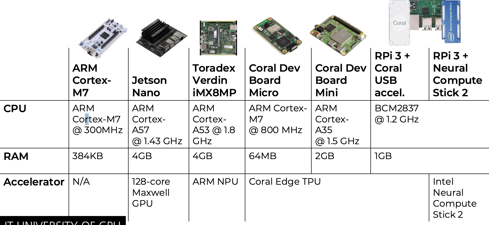
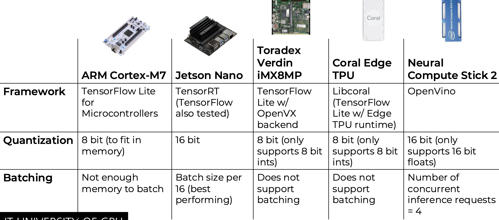
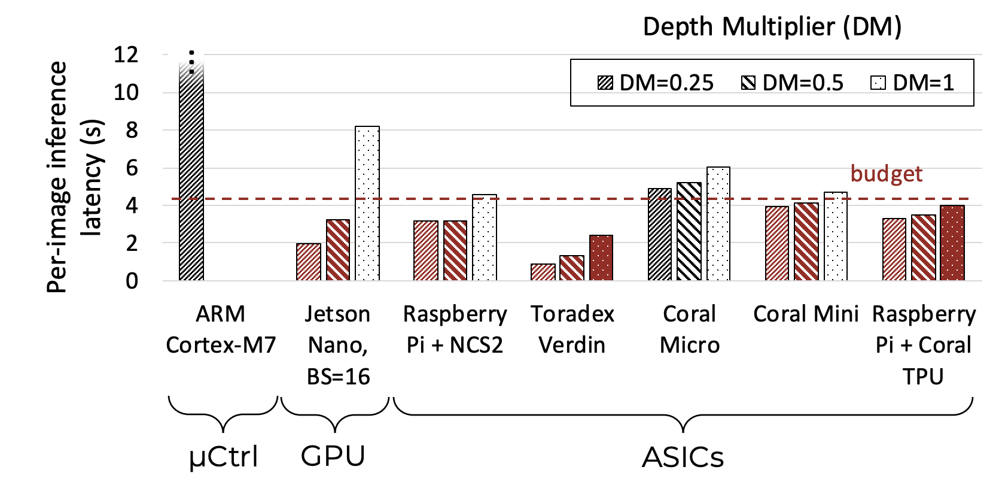
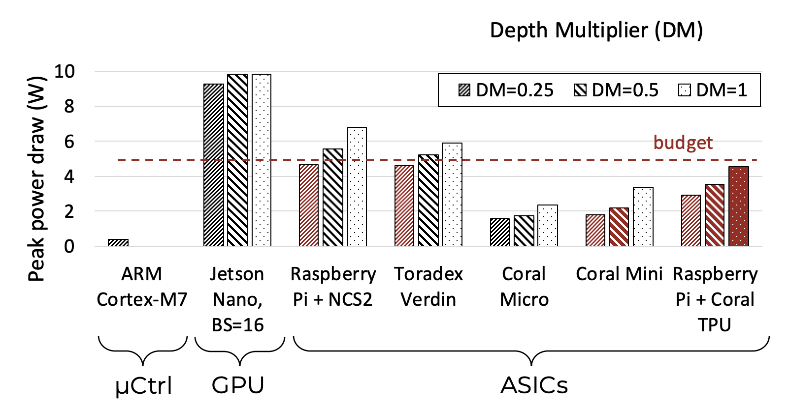
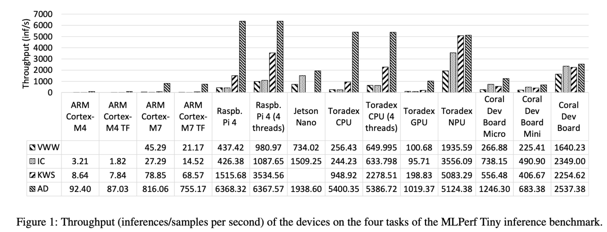
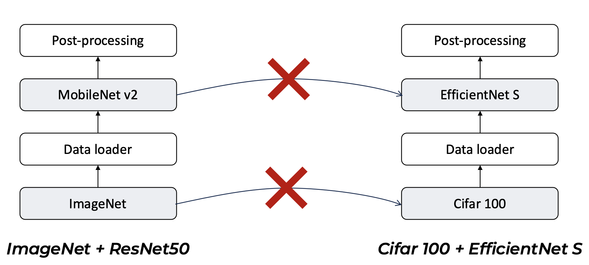
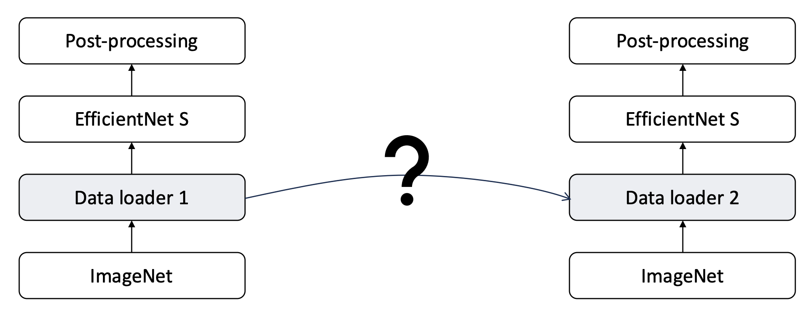
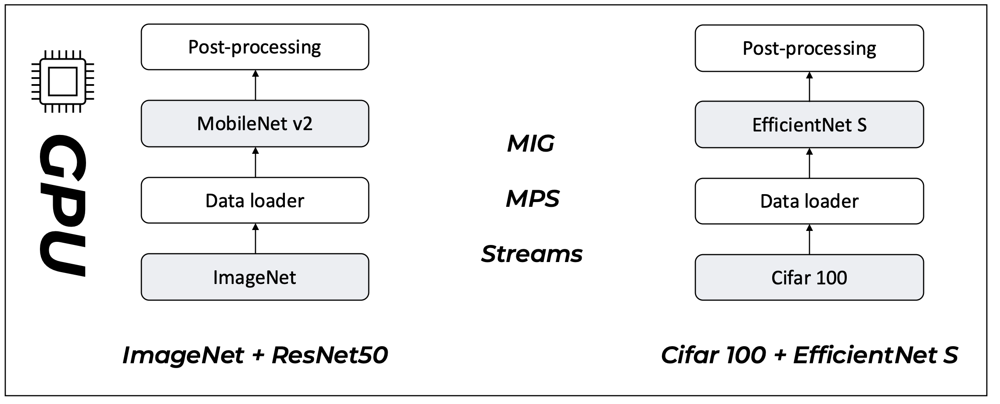
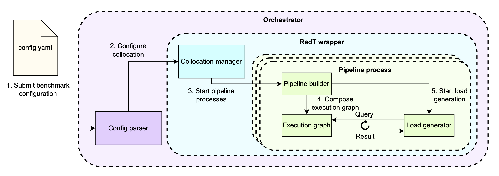
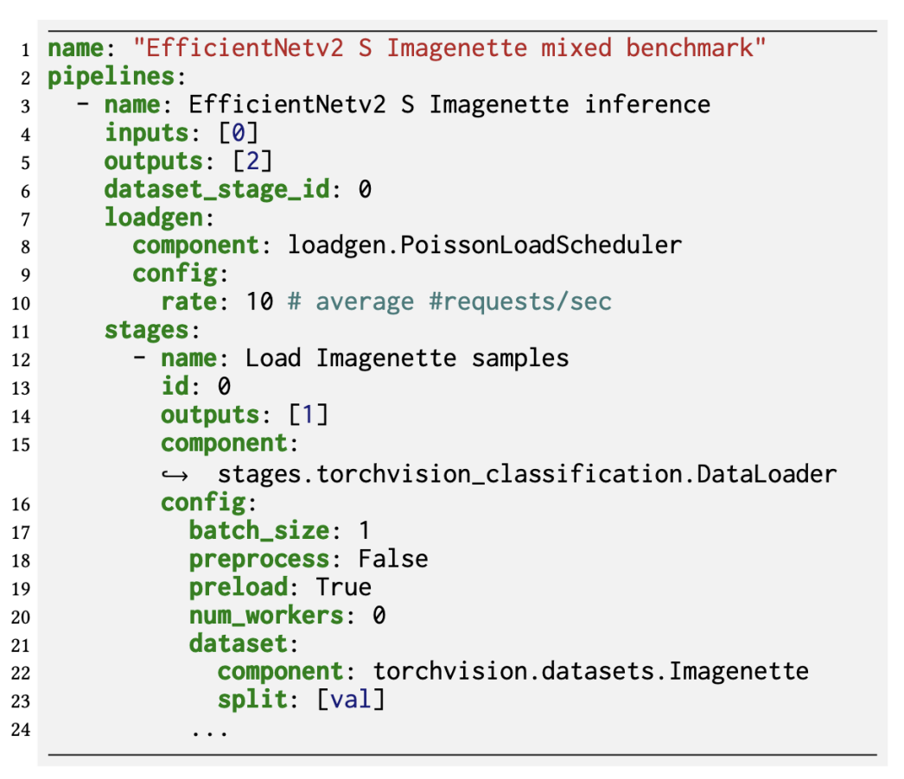

# Lecture 12 - ML at the edge

## Summary
> * Build a script that runs your benchmarks 
> * Think about resource constraints, by building budges for transforing data.

## DISCO2 - Use Cases
> Real time imaging of Greenland with limited time.
> * Goal: Reduce latency to process and transmit data faster.

### Network
Greenland case – 320 images captured / day

Network Satellite -> Earth ~ 10 Mbit/s
4 passes per day
Up to 10 minutes per pass
MAX 49.1 images transferred / day

>We don’t have budget to transfer images even for the least constrained scenario.
>We need to filter these.

### Power
MAX <5W
Average <2W
### Physical constraints
Mass <150g
Dimensions 10x70x80mm
### Thermal
Needs to be efficient (no convection in space)

### Hardware

### Experimental setup

### Results
> High degree of parallelism necessary to reduce latency.

> Only the highest specialization can also fulfill power budget

## How do resource constraints affect benchmarking?
### Standardized benchmarks - Tiny
> No OS, no file system, minimal memory requirements

Use cases:
* Keyword spotting (DS-CNN)
* Visual wake words (MobileNetV1 0.25)
* Image classification (ResNet-8)
* Anomaly detection (Deep AutoEncoder)

>**Target**: Microcontrollers

### Standardized benchmarks - Edge
> Unix-based systems, single-machine use cases

Use cases:
* Image classification (ResNet50)
* Object detection (RetinaNet)
* Medical image segmentation (3D UNET)
* LLM Summarization (GPT-J 6B)
* Question answering (BERT- large)
* Image generation (SDXL 1.0)
* 3D object detection (PointPainting)

> **Target**: Anything that can fit the model, but is a single machine

### Standardized benchmarks - MLPerf
> MLPerf provides detached benchmarks which target different scales.
This can lead to dead spot.

Example: Coral Edge TPU

>What does this mean? All workloads become data-bound

>**Transfer** to/from **accelerator** becomes the **most expensive** part of inference (CPUs can outperform ASIC, differences between interfaces obvious)

### Reflections
> MLPerf focuses only on the latency/throughput of forward pass.

## ML performance analysis
> Standardized benchmarks do not allow for testing systems under various conditions.
>

### Different data loading implementations
> No clear boundaries between stages of pipelines.

### No explicit support for multi-tenancy

### How they do benchmark
> Automate it by running a single yaml config file, which starts it all.

