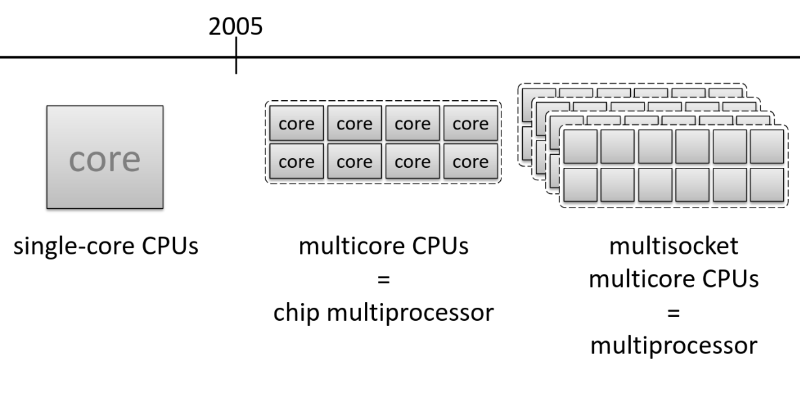
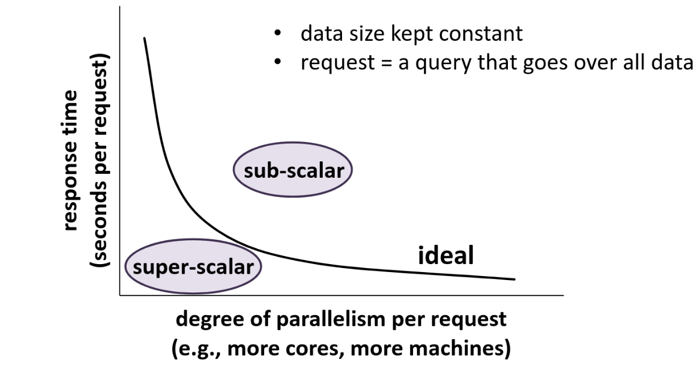
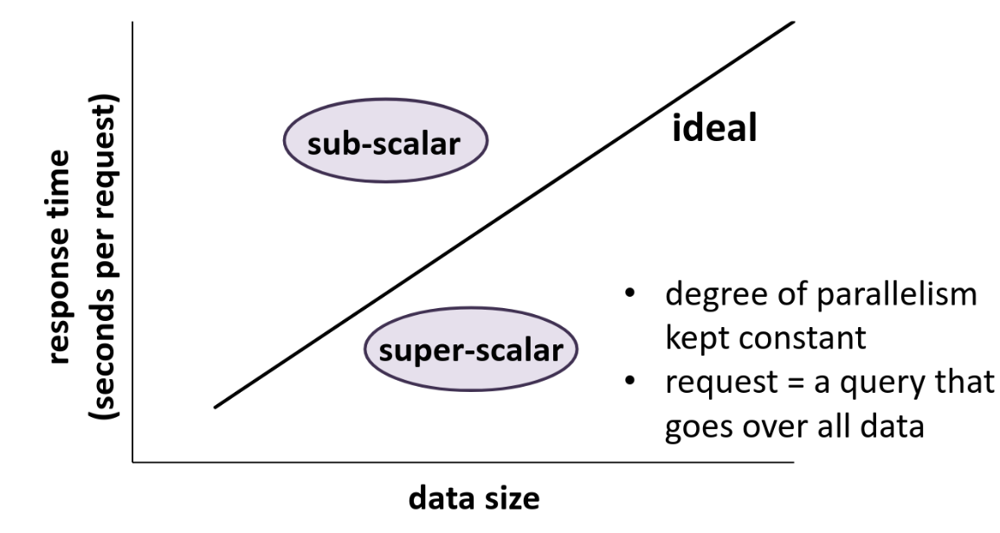
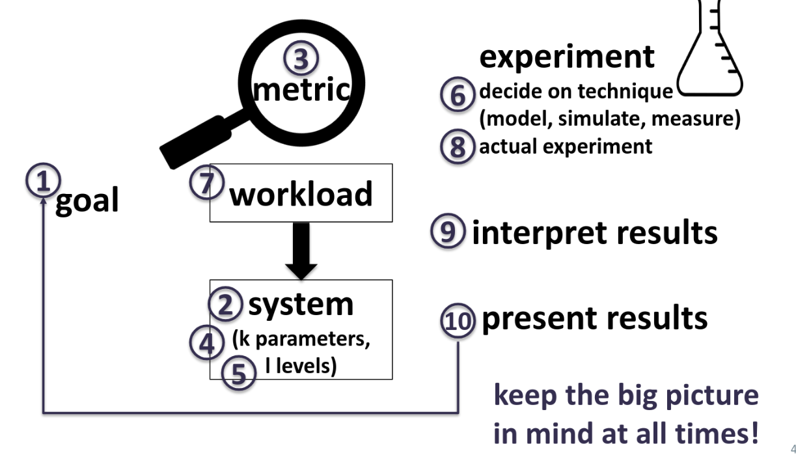
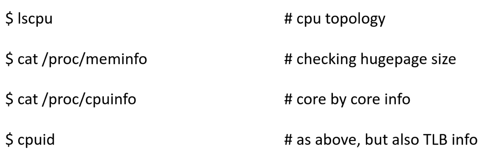

# Lecture 2 - Mistakes, Quering, Scalability

## Common Mistakes in Performance Analysis

### Goals

We want to make sure our problem and goal is very clear.

Take these as an example:

> *We would like to observe how system B behaves*

**Neither the problem nor the goal is clear**

These below are more clear:

> *We would like to observe if system B is a viable alternative to use since our current infrastructure doesn’t scale well with respect to the number of servers or data size*

> *We would like to observe if system B returns correct results even when we have a very high load
*

**Clear problem and goal!**

Take care not to have **biased** goals either.

> We would like to sell system B to our potential new
customers instead of system C since system C already has a large customer base and is cheaper than system B, so we should show that system B is better than system C.

> We developed this cool new index, we should find cases to show it performs better than state-of-the-art.

---

To summarize:

* **No (clear) goals**
  * Choice of systems, workloads, metrics, experiments, etc. all depend on the goal
* **Analysis without understanding the problem**
* **Biased goals**
  * often times we would like to show our technique shines, we devise experiments accordingly, but must state limitations as wel

### Methodology

Take the following example:

**Goal**: Comparison between hash vs range partitioning
**Main metric**: *Intructions per cycle (IPC)* as throughput

**tuples/data-items per second is more appropriate as a throughput metric.**

Another:

**Goal**: Comparison of Intel CPU vs NVIDIA GPU
**Main metric**: *Intructions per cycle (IPC)* as throughput

CPU and GPU have different instruction sets, so not an apples-to-apples comparison

Another:

**Goal**: comparison of different sorting techniques
**Parameters**: data size
**Levels**: 1, 2, 3, 4, ..., 1 million items

Unnecessary amount of levels; use increments that make bigger impact on data size

---

To summarize:

* **Unsystematic approach**
  * arbitrary selections of metrics, parameters, experiments
* **Incorrect metrics**
  * metrics leading to meaningless comparisons
* **Unrepresentative workload**
  * workload that doesn’t mimic the actual usage of a system
* **Wrong evaluation technique**
  * may tend to pick the technique that is more comfortable to you
* **Inappropriate experimental design**
  * not picking the levels for the parameters and their combinations well
    * remember from last week brute force vs default values vs $2^k$ design

### Completeness

**Overlook important parameters**
* not being careful while setting values for paramteters that impact the metrics being evaluated

Example:

**Goal**: Comparison of different sorting techniques
**Metric** **latency it takes to sort**

**Possible mistakes**: usding an already sorted list

---

**Ignore significant factors**
* not experiemnting with the different values of the parameters that impact the metrics being evaluated

Example: 

**Goal**: Comparison of different sorting techniques
**Metric** **latency it takes to sort**

**Possible mistakes** Not testing out different data distirbutions ignoring impact of parallelism, dataset size

---

To summarize:

**overlook important parameters**
* not being careful while setting values for parameters that impact the metrics being evaluated
**ignore significant factors**
* not experimenting with the different values of the parameters that impact the metrics being evaluated
**inappropriate level of detail**
* scope of the analysis should be neither too narrow nor too broad

### Analysis

**No Analysis**

* gathered experiemntal data, creating pretty graphs on excel.
  * You are not done, you need to interpret the data, find trends

**Errouneous analysis**

* looking at the wrong places in experimental data, not reporting right numbers, averaging wrong things, etc.
  * Analyzing data from the first second of a one minute experiment
  * *May not be representative*
(System warmup time, workloads that change behavior over time)

**No Sensitivity Analysis**

* Not experiment enough with parameters that require more detailed experimentation
  * When you see a big jump from one level to next, you want to add more levels in between for a parameter

**Ignoring errors in input**
* Need to be careful when estimating a parameter from another

**Improper treatment of outliers**
* Measurement error vs. natural system phenomenon
  * Something else was running in the server = **error**
  * first time rading from disk as opposed to main memory = **natural**

**Ignoring varaiblity**
* reporitng onlt the mean value while ignoring outliers

### Presentation

**Assuming no change in the future**
* A conclusion may not hold in a year or 10 yeats

**Imrpoper presentation of results**
* Need to incorporate right tools whil eshowing data, conclusions etc.
  * If people cannot understand your results they have no meaning
* Ignoring social aspects
  * Need to be able to communicate the results well
  * Focus on how you say something, not just what you say
**Omitting assumptions and limitations**
* Be clear about them not to mislead people

### Graphs

* Don't forget your axes titles
* Don't forget the units of your axes
* Don't mix apples and oranges on the same graph (different metrics)
* Don't include too many things on the same graph (also better to include marks on actual data points)
* Don't mislead people with the axis range
* While compairsong two graphs side-by-side, keep y-axes the same
* Decide on the graph type well
* Keep your fonts big enough (readable)
* Use your space well
* for graph on paper, pay attention to play and white, use different patterns, shades, markers etc.

## Queues

Let's take the following example:

* 1 minute per request (assume uniform requests)
* max throughput = 60 people / hour
* latency (from the perspective of the system) = 1 min per call
* latency (from the perspective of the end-user) = ??? 

Depends on several factors:

If 70 people call every hour 
* Worst case: System breaks, all requests are dropped
* Okay Case: There is robust queue; first come, first server. End-users may get frustrated, but requests are handlded eventually.

If you mus tprovide strict latency guarantees
* Find a way to reduce latency; faster CPU, better caching
* Find a way to increase througphut; more CPUs

## Central Processing Unit (CPU) evolutions

## Scalability as a metric

Scalability has many different dimensions: should be **defined** *well*.
* May mean different things to different people
  * Just like *throughput* as a metric

Examples:
* scalability with respect to dataset size
* scalability with respect to number of cores being used
* scalability with respect to number of servers being used

---

sub-scalar: improves less than expected (than ideal)
super-scalar: improves more than expecteed ((than ideal))

### Performance Analysis

### Useful Commands

