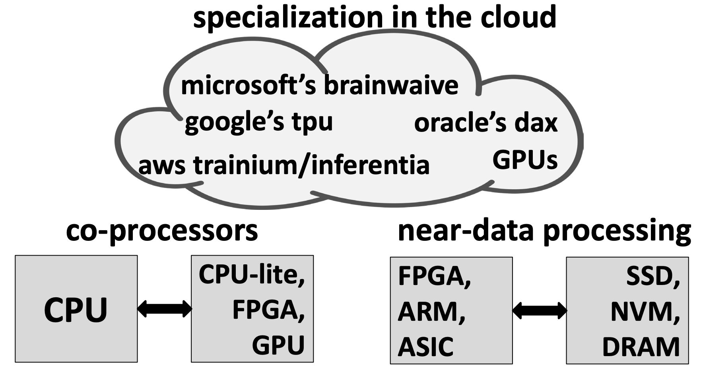

# Lecture 3 - Hardware parallelism

## Summary
>* Hardware gives different parallelism opportunities.
>* Software systems used to be ignorant of this parallelism because it used to be implicit.
>* Today, systems do not have this luxury because we also have explicit parallelism.
>* Furthermore, this parallelism has increasingly become heterogeneous (more hardware specialization).

>* **Goal**: design systems that are aware of the hardware
parallelism (ideally all types of it) & its implications!

## Central processing unit (CPU) evolution
> Over the years CPUs got faster and more complex cores over time.
> * Single-core CPUs
> * Multicore CPUs
> * Multisocket multicore CPUs

## Moore’s law
> “… the observation that the number of transistors in a dense integrated circuit doubles approximately every two years.”
> 
>For Moore’s law to be practical you need Dennard scaling!
>* The point is that is does not hold

## Dennard scaling
>“ … as transistors get smaller their power density stays constant, so that the power use stays in proportion with area: both voltage and current scale (downward) with length.”

> Around 2005, Dennard scaling stopped switching to multicores kept Moore’s Law alive.

## Types of hardware parallelism
>Multithreading threads share execution cycles on the same core

> Why do we need this?
>* We **don’t want cores to stay idle** waiting for instruction/data accesses.

>**Goal**: Minimize stall time due to cache/memory accesses overlapping access latency for one item with other work.

### Single-core – access latency to storage
>* **Core $\rarr$ registers**: ~1 cycle
>* **Core $\rarr$ L1**: ~4 cycles
>* **Core $\rarr$ L2**: ~10 cycles
>* **Core $\rarr$ L3**: ~30-60 cycles
>* **Core $\rarr$ Main memory (DRAM)**: ~100-200 cycles / 60ns
>* **Core $\rarr$ Persistent storage (hard disk, ssd)**: ~5ms
>* **Core $\rarr$ Archival storage (tape)**: ~100 sec

> In practice: Stalls = sleep
> * **Core $\rarr$ L1**: Almost no penalty
> * **Core $\rarr$ L2**: Possible stalls
> * **Core $\rarr$ L3**: Stalls

### Implicit and explict parallelism
>**Implicit parallelism** $\rarr$ (almost) free lunch because hardware does this automatically. But you can eat more if you want, if you take advantage of this. 
> **Explicit parallelism** $\rarr$ must work hard to leverage it.

> **Single-core** (implicit/vertical parallelism)
> * instruction & data parallelism
> * simultaneous multithreading
>
> **Multicores** (explicit/horizontal parallelism)
> * multiple threads run in parallel on different cores
>
> **Multisocket multicores** (explicit/horizontal parallelism)
> * multiple processors/CPUs in one machine
>
> **Distributed systems**
> * running a program over multiple machines

## Implicit parallelism
> Only one instruction can be executed at a time.

### Exmaple of NO implicit parallelism
> Several **clock cycles** to complete two instructions,assuming no long-latency data/memory accesses

### RISC instruction stages
> **fetch**: the instruction from the cache
> **decode**: specifying which operation the instruction performs and inputs it needs
> **execute**: the operation itself
> **memory**: accessing the memory for inputs if needed
> **write**: writing back the results into registers

### Example of implicit parallelism
> **Instruction pipelining** is the fundamental way to parallelize implicitly.
>
> Ones an instruction is done with the fetch stage, a new instruction can begin to fetch in the next cycle.
> 
> Overlapping stages of different instructions.
>
> 

### Superscalar CPU
> issuing multiple instructions in a cycle

### Out-of-order (OoO) execution
> allows a processor to execute instructions based on the availability of input data rather than strictly following the instruction ordering of a program

### Single instruction single data (SISD)

### Single instruction multiple data (SIMD)
> also implicit data parallelism, but this one has to be managed/issued by the software

### Simultaneous multithreading (SMT)
> Today, also known as hyperthreading.
>* Keep state/context of multiple threads via more register space 
>* Each CPU cycle, the threads are swapped 
>* OS don’t have to do a context switch for this

> This is a core that supports two hardware contexts (or logical threads)
> 
> **Trade-off**: How to use the transistors in a core?
> * To create higher per-thread speed by making the instruction pipeline more complex
>* vs more threads

> There is more pressure on shared hardware resources (e.g., caches) if not used right, which may hurt performance.

### Memory stalls in data-intensive apps
> Data-intensive apps are known to suffer due to memory stalls

## Explicit parallelism
### Scaling-up vs Scaling-out
> **Scaling-up**: adding more cores in a single server should give proportional performance increase.
> **Scaling-out**: adding more servers in a data center should give proportional performance increase

### Scaling-up

 
> need better metrics to reason about scalability, throughput measurements are not enough.

### Critical sections / synchronization
> **Unbounded**
> * Threads can enter the critical section **without restriction**.
> * This can lead to **contention**, **race conditions**, or **priority inversion**, as too many threads may try to access shared resources at the same time.

> **Cooperative**
> * Threads **cooperate** to avoid contention, possibly through yielding or structured access.
>* Fewer threads try to enter at once, reducing contention.
>* The red-circled lines indicate **controlled access** to the critical section.
>* Better than unbounded, but still relies on threads behaving cooperatively.

> **Fixed**
>* Access to the critical section is **bounded** or **limited** by a fixed number of allowed threads or operations.
>* Predictable behavior, less contention.
>* This method is more efficient and safe.

> **Key point**: Better synchronization and critical section handling leads to more predictable and stable system performance.

#### Critical sections as a metric? 

> unbounded communication will hit you eventually with NUMA even fixed/cooperative have issues

### NUMA (non-uniform memory access) impact
> **Threads in core**: <10 cycles
> **Threads between cores in one CPU**: ~50 cycles
> **Threads accorss core between two CPUs**: 500 cycles

### Some tips for scaling up 
> * high throughput != scalable
>* lock freedom != scalable
>* eliminate any unbounded communication
>* keep fixed/cooperative communication among cores with similar/predictable access latency
>     * **avoid sharing data among cores** on different processors share within a processor (i.e., avoid NUMA impact).

## Looking ahead: heterogeneous hardware

### Dark silicon & costs
> Even if you can pack more cores in a processor, you cannot fire all of them up simultaneously.

> The smaller a transistor is the harder & more expensive to get it right.

### What this means (for servers)
> more parallelism & heterogeneity most software systems are not ready for either

### Lighter cores (e.g., ARM)
> not feasible for latency critical tasks and can be less energy-efficient in the long run

### Diverse cores (e.g., CPU, GPU, FPGA, ASIC)
> Better long-term solution, but creates mess

### Leveraging diversity/heterogeneity
> Finer-grained scheduling & energy management
>* controlling which cores are active at a time running what types of tasks & what frequency cores run on

> Language support & advanced query compilation
>* high-level languages for programs, then compile that onto different cores where instruction sets may be different

> Right use case for specialization
>* must pick frequent & important tasks to accelerate – otherwise, no economic viability

### Today’s landscape
