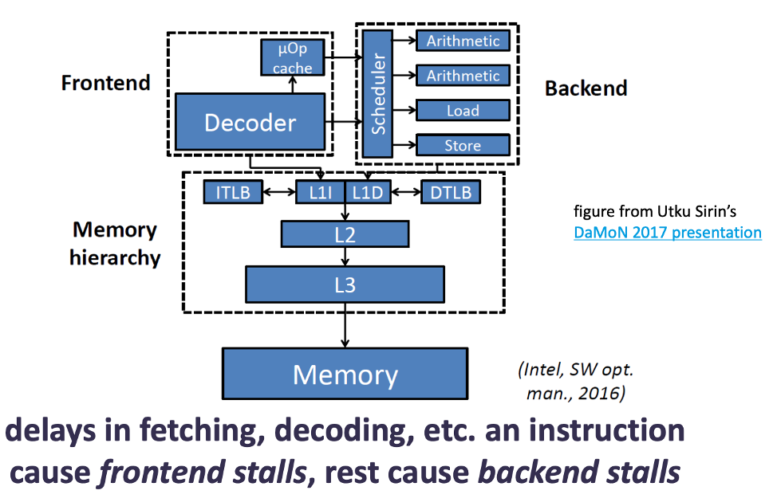

# Lecture 4 - Memory hierarchy

## Summary
> * Principle of **caching** is to improve locality for frequently accessed data
> * Different layers of the hierarchy have different characteristics & require different optimizations from the software side.
> * **Sequential access is faster** even in main-memory, where random and sequential access latency is the same, because of hardware prefetching
> * It is important to be aware of the storage hierarchy to utilize it more effectively & have more efficient software layers.

> **Goal**: minimize data access latency!

## Storage hierarchy overview
### Typical storage hierarchy
> **Core $\rarr$ Caches**: Less data locality
> **Core $\rarr$ Main memory (DRAM)**: more access latency
> **Core $\rarr$ Persistent storage (hard disk, ssd)**: less bandwidth
> **Core $\rarr$ Archival storage (tape)**: More strage capacity per $$$

> **Cache hierarchy**: From core to L3 cache
> **Memory hierarchy**: From core to main memory.

#### Persistent storage can have a hierarchy in itself as well

> **In a data center**, the hierarchy gets more complicated
> 

### Jim Gray’s storage latency analogy
> how far away is the data?
> 

###  Storage hierarchy – access latency
>* **Core $\rarr$ registers**: ~1 cycle
>* **Core $\rarr$ L1**: ~4 cycles
>* **Core $\rarr$ L2**: ~10 cycles
>* **Core $\rarr$ L3**: ~30-60 cycles
>* **Core $\rarr$ Main memory (DRAM)**: ~100-200 cycles / 60ns
>* **Core $\rarr$ Persistent storage (hard disk, ssd)**: ~5ms
>* **Core $\rarr$ Archival storage (tape)**: ~100 sec

#### Access latency to storage for persistent storage
>* **Core $\rarr$ NVMe SSD**: ~10 $\mu sec$
>* **Core $\rarr$ hard disk**: ~5 ms

### Storage hierarchy - capacity
> **Registers**: 16x8 Bytes
> **L1-I and L1-D**: 32 KB each
> **L2**: 256 KB
> **L3**: 8-10 MB
> **Main memory**: 16-64 GB
> **Persistent storage**: 1-2 TB
> **Archival storage**: 8 TB

###  Storage hierarchy - management
> **Hardware**: From core to main memory
> **Software**: From main memory to Persistant storage
>
> * This means that **we do not write code** to explicitly manage data movement to registers, L1, L2, L3 caches.
> * but **we do this** for moving data from/to persistent storage.

### Movement of data in storage hierarchy
> **Registers $\harr $ any cache**: 4-8 bytes words
> **Any cache $\harr$ main memory**: Cache-line (64 bytes)
> **Main memory $\harr$ disk**: 4 KB, pages (one or more disk blocks).

## Principle of locality
> Programs tend to use data & instructions with addresses near or equal to those they have used recently

### Temporal locality
> Recently referenced items are likely to be referenced again in near future.
> * impacts design decisions for both software & hardware

### Spatial locality
> Items with nearby addresses tend to be referenced close together in time

### Example

> **Data**
> * temporal: referencing sum in each iteration
> * spatial: iterating over array element

> **Instructions**
> * temporal: looping over the same code
> * spatial: executing instructions in sequence

## Caching
> **Goal** is to increase locality for cores to reduce access latency for frequently accessed data

> Higher levels cache data from lower levels inclusivity (Inclusivity theorem L1 <= L2 <= L3 <= MM).
> L1 is included in L2, L1 and L2 are included in L3, and L1, L2, L3 are included in main memory.
> * Most hardware vendors build inclusive cache hierarchy
>* Software controlled caching can be more complex e.g., some main-memory optimized database systems don’t persist indexes.

> Data replacement when no space left
>* Replacement policy can be crucial optimization.

> Dealing with modified data (If you cache data from MM to L3, then this cached data need to be updated both places) therefore we have two ways of how to modify the data when it is cached. 
>* Write through - immediately
>* Write back - at replacement time 

## Micro architecture of an OoO processor

> delays in fetching, decoding, etc. an instruction cause frontend stalls, rest cause backend stalls
>
> **Perf** tool can give us an idea of how much fronted is used and how much backend is used.
A delay in decoding can happen if a instruction is very complex, rather than a sequence of simple events.

## Random-access memory (RAM)
> (almost) **constant random-access latency** wherever the data is **volatile** $\rarr$ will lose data once power is lost.

> **Sequential access** is slightly faster because of **prefetching**:
>* if you fetch a block from main-memory to caches, hardware usually prefetches the adjacent block

### D(ynamic)RAM vs S(tatic)RAM
> * **DRAM** is most common for **main memory**
> **SRAM** is used for **caches & registers**
>* **DRAM** requires **refresh**, otherwise looses data even when power is on
>* **SRAM** is more **energy-efficient**, but also more expensive, so DRAM is preferred for main memory.

## Caches
> Consider cache like a 2-dimentional array

> Example:
>* 32KB L1 8-way L1 cache
>* 64bytes cache lines
>* 64bit memory addresses
>
> $32 \times 1024 / 64 = 512$ **cache lines**
> $512 / 8 = 64$ **cache sets**

> 64bit address (a) decomposition for cache $\rarr$ 
> * TAG = 52 bits (to determine if a is cache hit/miss)
> * SET = 6 bits (which set to look at)
> * OFFSET = 6 bits (which byte to read in cache line)

### Cache misses
> **compulsory misses**: misses that occur because cache is empty
> **conflict misses**: misses that occur due to a cache set being full even though cache has space $\rarr$ higher with lower associativity
> **capacity misses**: misses due to cache being full $\rarr$ common when active data/instruction set size bigger than total cache size.

## Hardware prefetching
>  A technique used in CPUs to improve performance by predicting and loading data into the cache before it’s needed.

### Next-line prefetching
> When there is a cache miss at address a, the hardware automatically fetches a+1.

>Simple and useful for **sequential memory access patterns**.

### Stream prefetching
> If misses occur at a and a+1, then the prefetcher fetches a+2, a+3, assuming a sequential stream.

> More aggressive and helpful for **long sequential accesses**.

### Works best with:
* Sequential access patterns
* Spatial locality (accessing nearby memory addresses)

### Challenges with Hardware Prefetching
> Instructions:
> * **Branches and function calls** cause unpredictable code execution paths.
> * **Branch prediction** helps, but prefetching is still hard in these cases.

> Data: 
> * **Pointer chasing** (e.g., following linked list nodes or tree structures) is common in index-based data structures.
> * These patterns are hard to predict with simple prefetchers

> **Stride prefetching helps**:
> If misses occur at a, then a+20, it predicts and fetches a+40, a+60, assuming a fixed stride pattern.

#### Key note
> “Prefetchers on real hardware are kept simple. Better accuracy requires more complexity.”

This means that while more complex prefetching strategies exist, real CPUs often use simpler ones for performance, power, and hardware design reasons.

## Storage hiearchy models

### Single-core storage hierarchy

### Multicore storage hierarchy

### Multi-socket multicore storage hierarchy
> local memory access is faster than remote one (aka. NUMA, non-uniform memory access).

## Persistent memory 
> * non-volatile memory (NVM)
>* storage class memory (SCM)
>* non-volatile RAM (NVRAM)

### Key Characteristics
> **Performance positioning**
> * **Faster than traditional spinning disks** (HDDs or even many SSDs)
> * **Slower than DRAM/SRAM** (your regular, volatile main memory)
>
> **Persistence**
>* Unlike DRAM or SRAM, which **lose their contents on power-down**, persistent memory **retains data** without power.
>
> **Byte-addressability**
>* Unlike block-oriented storage (disks or SSDs), which read/write in multi-kilobyte chunks, persistent memory is accessed **at the granularity of individual bytes**, just like normal RAM.
>
> **Uniform access cost**
> * There’s **no big penalty** for random versus sequential accesses, making it much more flexible than disk-based storage for pointer-heavy data structures or random lookups.

## High-bandwidth memory (HBM)
> DRAM stacked in 3D
> * helps with increasing DRAM capacity
>
> provides higher bandwidth than DRAM (up to an order of magnitude)
>* required for systems with high hardware parallelism

> Used typically in GPUs or CPUs with many cores

