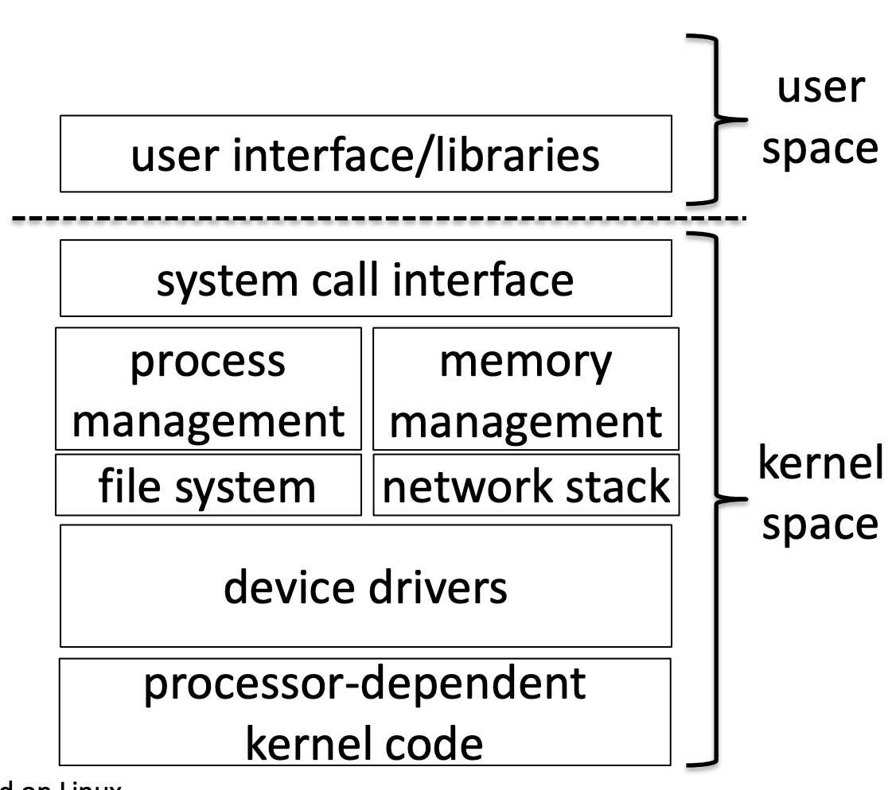
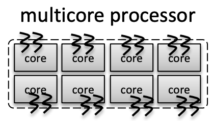
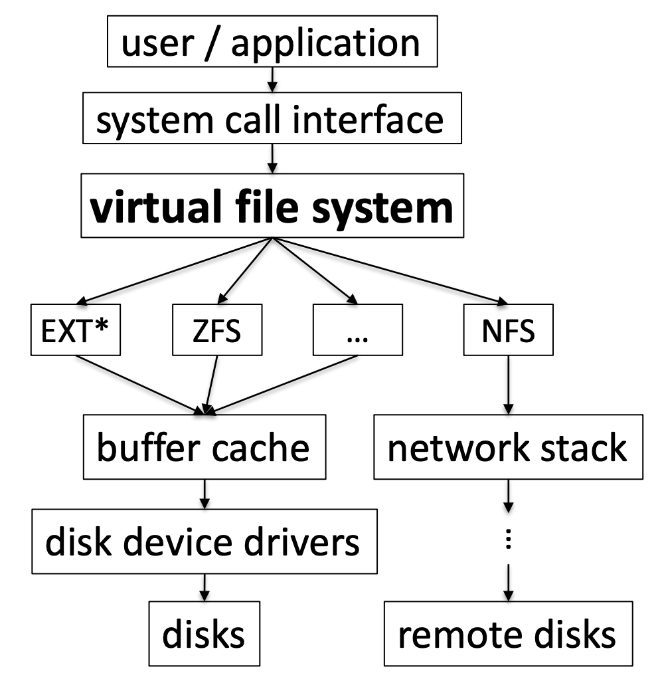
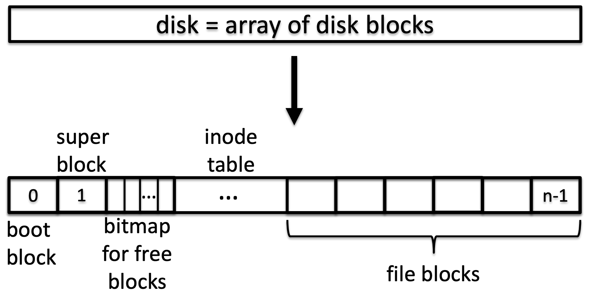
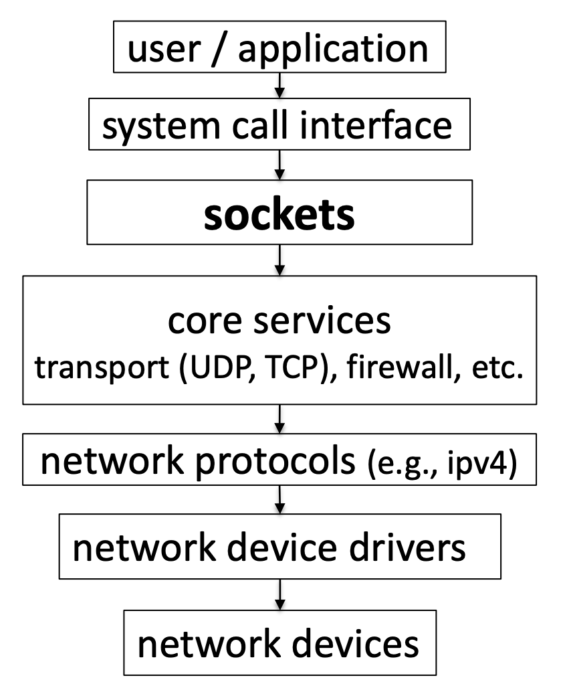
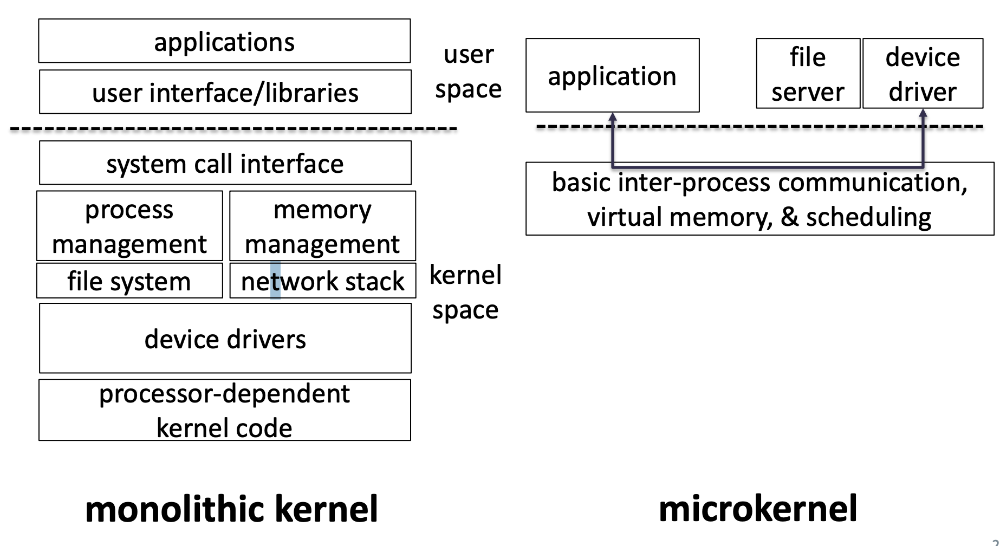
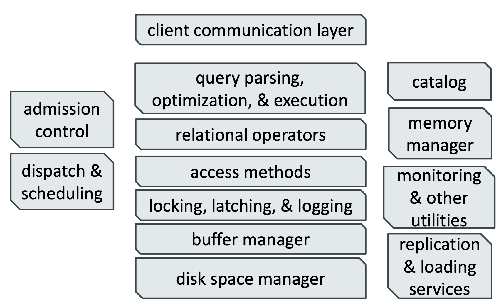
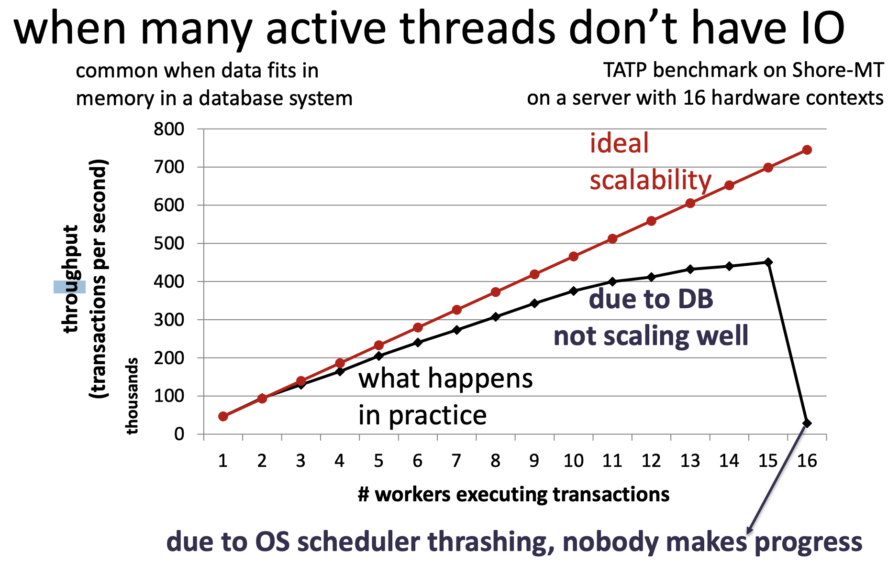
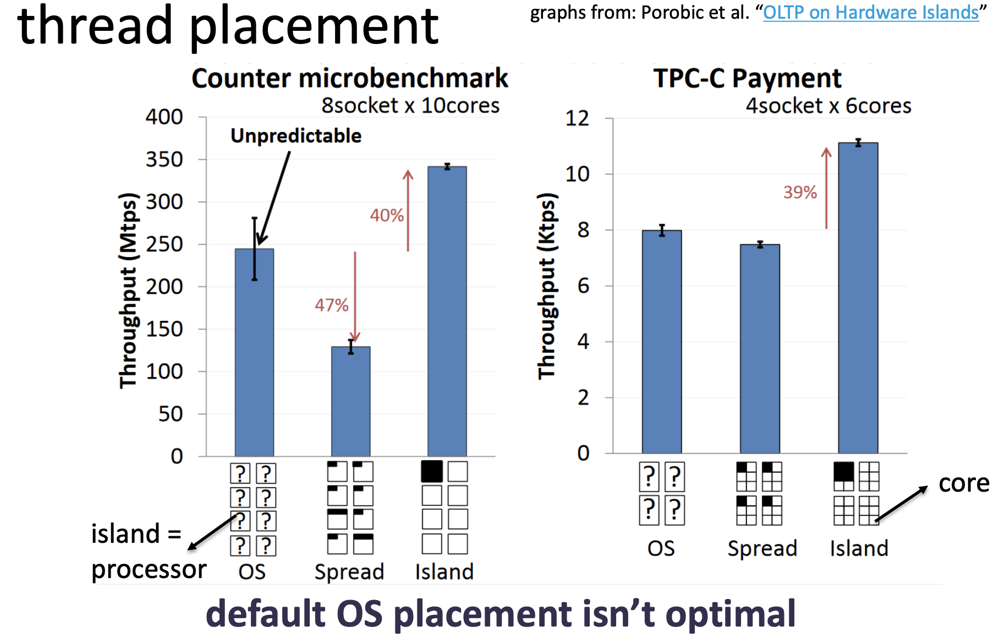

# Lecture 5 - Operating systems

## Summary: operating systems overview
* Operating system is a **resource manager virtualizing** hardware resources for applications/end-users.
* More specifically, its goal is to manage hardware resources reliably & efficiently for many applications/end-users who are using these resources concurrently.
* Operating system also provides an **abstraction** layer for applications to have a common and **easy-to-use interface** while interacting with a variety hardware resources / devices
* Virtualizations & abstractions come at a cost, though!
   * indirect management of hardware resources
   * need to think about trade-offs of the indirection

## Typical operating system components

### User interface/libraries
> Gives applications uniform & easy-to-use primitives to communicate with the kernel.
> Thanks to these we don’t have to express ourselves in assembly
> * compilers (e.g., gcc)
> * shells (e.g., bash)
> * GNU libraries in general

### System call interface
> Helps separating user space from kernel space
> Kernel talks to hardware since it manages hardware resources for many user requests
> 
> Users just make request such as
> * reading/writing a file,
> * allocating more memory,
>* sending packets over network,
>* creating a new process, etc.

### Process management
> Virtualizes a processor giving the illusion of infinite #cores
> User space has application(s) an application has process(es) a process has thread(s) threads are mapped to cores
> 
> By default, operating systems handles this mapping
application can request to run on specific cores

> #threads that can be active at a time $\rarr$ **#hardware contexts = logical cores**
> A processor supports
>* typically, 2 per core on Intel (hyper-threading)
>* Sun Spark T2 had 8 per core
>
> What if we have more threads to run?
>* operating system **context switches** to swap threads’ state/context in & out. If one thread is inactive (due to IO or sleeping), another one runs
>* works well for general-purpose scenarios
you typically have IOs that interrupt a thread

### Memory management
> virtualizes memory giving the illusion of infinite memory
>
> user space has application(s) an application has process(es) a process has its own **memory address space = virtual memory**
>
> by **default**, operating systems maps a process’ address space to the available bytes of physical memory
> * manages free space, segmentation …
> * **physical memory = array of bytes**
>
> aggregate memory used by all processes can be larger than
available physical memory
>* operating system swaps things back & forth as needed $\rarr$ to/from swap space on disk
>* if done too frequently, your program won’t perform well  $\rarr$ **thrashing**
>
>**threads in a process share the same memory space** it is application’s responsibility to manage this shared space reliably
>* use locks/mutexes/atomics
>* partition this space to each thread

### Mappings / indirections
> **memory address mappings**: 
> * application - allocates space in memory (e.g., malloc) for the data
> * OS – memory management. 
>     * virtual page address $\rarr$ physical page address

> **disk I/O related mappings**:
> * application
>     * file id $\rarr$ filename
> * OS – file system. 
>     * filename $\rarr$ logical disk address 
> * SSD – FTL 
>     * logical disk address $\rarr$ physical disk address

> **page table** keeps the virtual to physical mapping in memory – 4KB pages (typical)
> **physical address** can either refer to main memory or disk (swap space)
> **TLB** (translation lookaside buffer) is a cache (usually at L1 & L2-levels today) for page table entries

### File system
> **virtual file system**: enables common interface to define & access file systems
> **file systems**: organize & access data

#### Organizing data

> **file blocks** has actual data stored in files block size is a trade-off
> * too big $\rarr$ small files waste space
>* too small $\rarr$ too many blocks to keep track of
>* 4KB on most modern systems (512bytes is the minimum)

> **inode (index node)** has metadata about files
> **inode table** maps inode# $\rarr$ inode

> **bitmap** keeps track of which bocks are occupied (1) or not (0) some filesystems have a form of B-tree for the same purpose

> **superblock** has metadata about the file system instance
>* size of bitmap, #inodes, #file blocks, offsets for different components, type of the file system, etc.

> **boot block** starts/boots the OS

> Does filesystem access disk every time we read a file?
> - A: no, things get cached in **buffer cache**

### Network stack
>socket model enables a common interface to different protocols

### Device drivers
> Software interface to hardware devices a bloated component of the kernel since it is both hardware dependent & operating system specific.

### Processor-dependent kernel code
> * Different processors support different instructions sets
> * Certain processors support functionalities like transactional memory, SIMD, memory alignment …
> * Desktop vs. server 
>
> **Need to be able to handle these differences without changing majority of the kernel code**

## Alternatives: microkernel

> kernel has only the essentials, rest built on top user space services communicate via message passing.

> It provides:
> * extensibility / modularity
>     * adding new services don’t require OS rewrites
> * portability
>     * only microkernel is processor dependent
> * reliability
>     * e.g., one service going down won’t take down the whole server

> Problems:
> * message passing could be expensive
>* what if you need most of the drivers, or file systems maybe too much to manage at the user space 

## OS vs DB
### Traditional database system components

> **Admission control**
>Ensures that database system is not overloaded prevents receiving too many requests at the same time

>**Dispatch and scheduling**
> Keeps track of the worker threads after receiving a client request which thread(s) to use & where to schedule it(them)

> **Catalog**
> Metadata management keeps track of what/where database files are

> **Memory manager**
> Keeps track of available memory how much memory can we allocate to a task?

> **Buffer manager**
> Manages & keeps track of the data read from persistent storage into main memory

> **Disk space manager**
> Keeps track of the data on persistent storage e.g., allocation and free space management on disk

### OS vs DB:
* Overlap in many areas
  * thread management & scheduling
  * memory allocation & management
  * file & disk management
* OS lacks application knowledge
* For many applications OS handles resource management -> for a good reason -> reduces headaches.
* Database systems people are control freaks & don’t like leaving all resource management to OS! -> also, for a good reason
  * better performance optimizations (e.g., page replacement policy, thread placement in a way to maximize data locality)
  * may have to force-flush some data to disk (e.g., log)
  * may not want to ever flush some data (e.g., aborted requests)
   * specialized file systems for big data (e.g., HDFS - runs in user space)

> **Downsides of database resource management:**
> * duplicating lots of functionality across layers of system stack
>* with increasing heterogeneity in hardware resources, OS has better knowledge of available hardware at runtime than DBs & can help with performance optimizations

