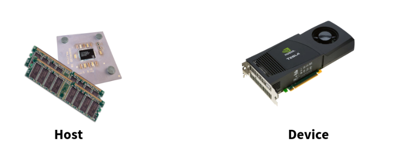
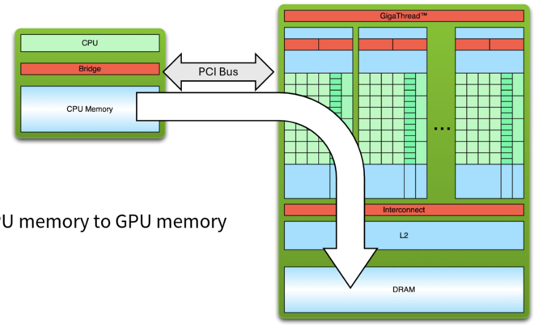
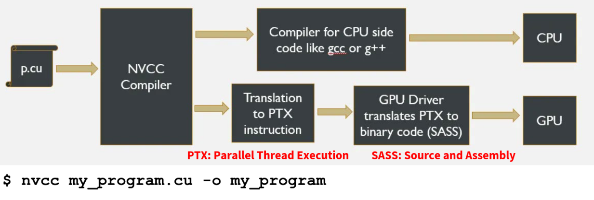
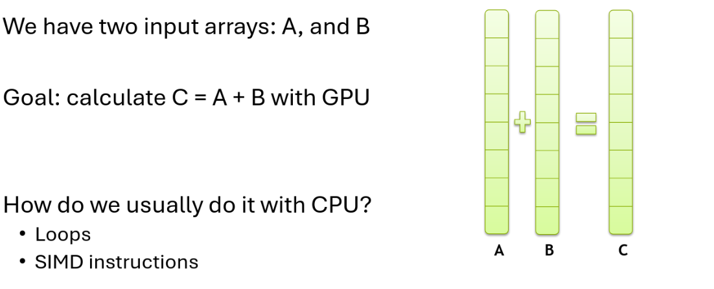
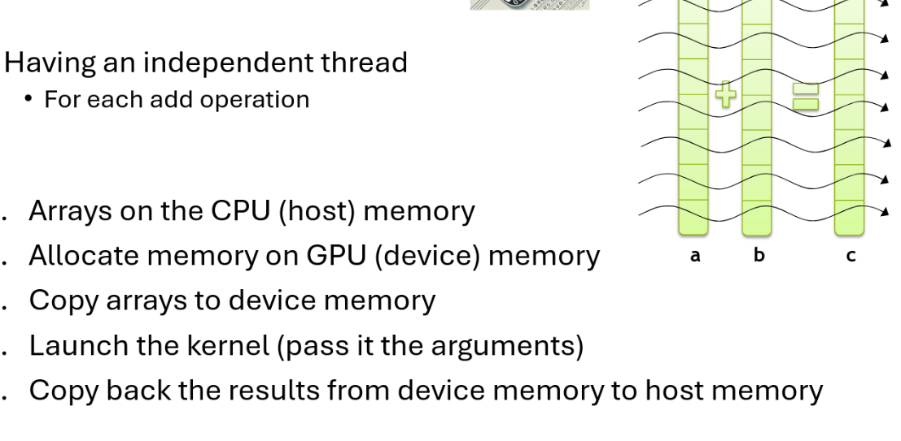
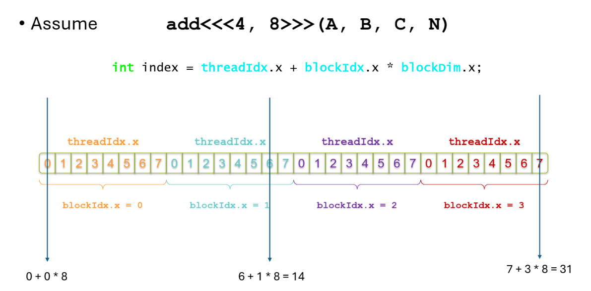
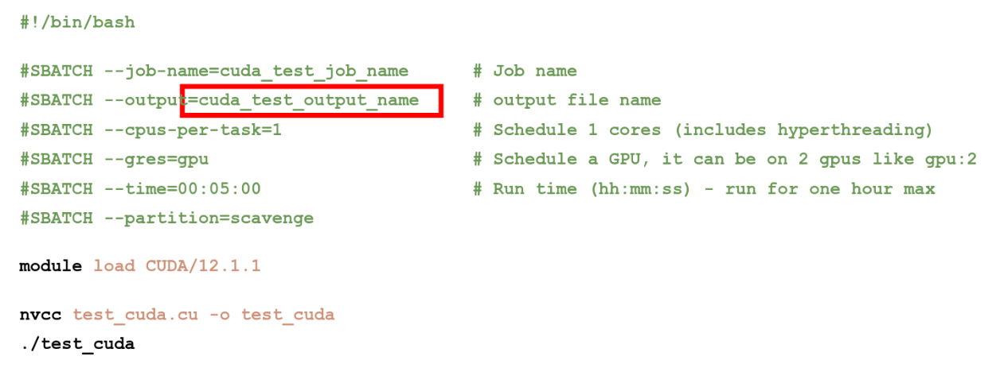
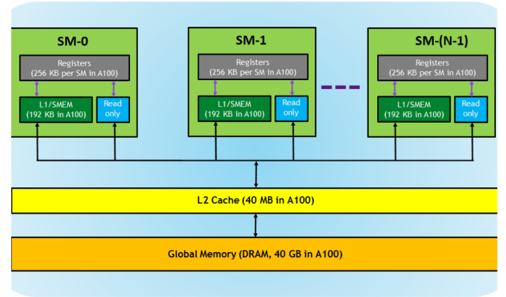
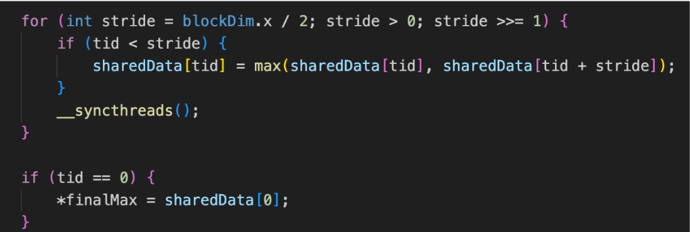

# Notes

GPU are slower at doing a single thing. How do we get the performance from GPU, so we do all of instruction on independent data at once.

Homogeneous = one kind of device

Heterogeneus = devices that are working together are not the same time

Host = CPU, get the data back and fourth (cpy data to gpu)

Device = GPU (doing the parallel procressing)

NVCC = nividida cuda compil codeer

- GPU side (PTX high level GPU langauge → then to SASS (gpu binary))
- CPU side

/_global_ is the function that a GPU will run

thread and threadblocks

- Inside a threadblock there are threads, for each thread and threadblock we have id
- why is it important to know the id of threads and threadblocks that we are launching?
    - when we are doing paralleling processing we need to know which thread does what work, especially when we need to synchronize

<<<10, 100>>> num of thread blocks (10) and how many treads inside of it (100).

If we don’t have large data that isn’t paralellizable its better to use CPU.

- Example: if SIMD can do everything in one “loop” then it is faster than doing it with SIMT
    - Since there is overhead from bringing data to GPU + GPU clockspeed is slower

### Lecture 6 - CUDA Programming

### CUDA

**Compute Unified Device Architecture**

CUDA C/C++
* Based on standard C/C++
* Set of extensions enabling heterogeneous programming


### Heterogenous COmputing

*Terminology*:

* **Host**: The CPU and its memory (host memory)
* **Device**: The GPU and its memory (devicde memory)




### Single Processing Flow

1. Copy input data from CPU memory to CPU memory
2. Load GPU program and execute, caching data on chip for performance
3. Copy results form GPU memory to CPU memory



### Code to Execution (CUFA PROCESS)



### Hello World! Code Example

```c++

__global__ void helloWorld(void) {
    printf("Hello from thread %d from block %d\n",
        threadIdx.x, blockIdx.x);
}

int main(void) {
    helloWorld<<<10,100>>>();

    return 0;
    }

```

### Adding two Arrays





* **Grid**: Contains several Thread Blocks



`threadIdx.x` → position inside the block (0–7)

`blockIdx.x` → which block this is (0–3)

`blockDim.x` → number of threads per block (8 here)

This indexing allows each thread to process a unique element in arrays A, B, and C.

This lets 32 threads compute one value in the array.

### Submiting a task in CUDA 



### Shared Memory



A Streaming Multiprocessor (SM) is a core processing unit on the GPU.

**Shared memory** is a small, fast memory space by all thrads in a block.
* Significantly faster than global memory
SMEM enables threads within a block to share data which can lead to substantial performance improvmeent by:
*  **Reducing Redundant Memory Accesses**
   *  If multiple threads need the same data, they cn share it in shared memory instead of each thread detching it seperately from global memory. 
* **Minizing GLobal Memory Latency**
  * Global memory access is slow compared to shared memory. Using shared memory avoids repeatedly access global memory for frequently used data. 
* **Enabling Thread Collbaoration**
  * THreads can  share intermediate results via shared memory, making it easier to implement cooperative algorithms.

### Example (Maxmimum)



### Example (Computing dot product using CUDA)

```c++

// Kernel to compute dot product using shared memory
__global__ void dotProductSharedMemory(const float *a, const float *b, float *result, int n) {
    __shared__ float partialSum[BLOCK_SIZE];  // Shared memory for block-wise partial sums

    int idx = threadIdx.x + blockIdx.x * blockDim.x;  // Global index
    int tx = threadIdx.x;                            // Local thread index within the block

    // Compute partial dot product
    if (idx < n) {
        partialSum[tx] = a[idx] * b[idx];
    } else {
        partialSum[tx] = 0.0f;  // Handle out-of-bounds threads
    }

    __syncthreads();  // Synchronize threads in the block

    // Perform reduction within shared memory
    for (int stride = blockDim.x / 2; stride > 0; stride /= 2) {
        if (tx < stride) {
            partialSum[tx] += partialSum[tx + stride];
        }
        __syncthreads();  // Synchronize threads after each reduction step
    }

    // Write the block's partial sum to global memory
    if (tx == 0) {
        atomicAdd(result, partialSum[0]);  // Atomic operation to safely accumulate the result
    }

We want to compute: 

```c++

dot = a[0]*b[0] + a[1]*b[1] + ... + a[n-1]*b[n-1]

```

* Each block uses shared memory to accumulate its portion of the dot product. 
* Each Thread Computes One Term of the Dot Product
* It also performs parallel reduction, where we iteratively sum parias of values and reduce all partial results into `partialSum[0]`.
  * Instead of thread summing everything, all thrads sum in parallel, which cuts down the time to `log₂(BLOCK_SIZE)` 
* Only thread `0`writes the block's total to the final `result` array. (atomicAdd ensures thread-safety)
* 

### Example (Dot product without shared memory)

```c++

__global__ void dotProductGlobalMemory(const float *a, const float *b, float *result, int n) {
    int idx = threadIdx.x + blockIdx.x * blockDim.x;

    if (idx < n) {
        float product = a[idx] * b[idx];
        atomicAdd(result, product);  // Directly write to global result
    }
}


```