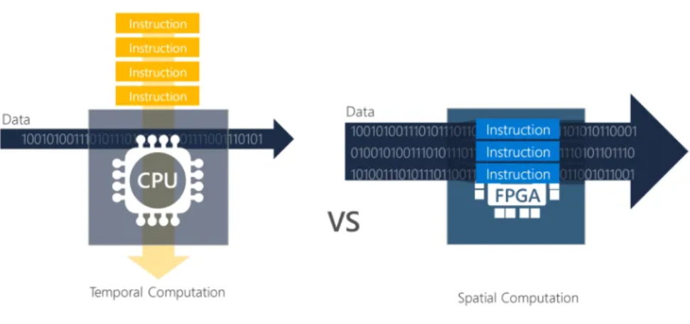

# Lecture 6 - Hardware Acceleration

### Hardware Acceleration

**Definition**

> *hardware acceleration* is the use of **computer hardware** specfically made to perform some **functions** more *efficinetly* than running on a general-purpose CPU.

### System Stack Overview

* Application
* Operating System 
* Hardware

In terms of *hardware acceleration*:
* Application 
  * Need to write code for diverse hardware
  * Need for efficient data movement across hardware devices
* Operating System
  * more to side-step OS when dealing with non-generla-purpose hardware, and directly manage it
* Hardware
  * is part of hardware

---

Butler W. Lampson

> *Do one thing at a time, and do it well. AN interface should capture the minimum essentials of an abstraction. Don't generalize; generalizations are generally wrong*

### General / One-size fits all

### General Purpose - CPU

**CISC (complex Instruction Set Cmoputing) & x86 family** 
* dominates desktops, laptops, servers

**RISC (reduced instruction set computing)**
* lighter core designs
* dominates embedded systems
* today, also competes in the server market
  * AWS gravitons
* SPARC & POWER targets server market mainly,which is dominated by Intel Xeons

### Specialized - GPU

* designed to accelerate operations for computer
graphics (e.g., rendering images)
  * used across embedded systems, mobile phones, personal computers, game consoles
  * based on **SIMT (single instruction multiple thread)**
* general-purpose CPUs (GPCPUs)
  * GPUs that are used to perform operations traditionally performed by CPUs (such as sorting data)
* your personal devices have a form of integrated GPUs
  * (e.g., to accelerate graphics or AI in personal computers)

### Single Instruction Multiple Data (SIMD)

CPUs are like SIMD machines machines they support they support extreme parallelism

### Single Instruction Multiple Threads (SIMT)

### GPU Execution Model

* Threads are executed by scalar processors
* Thread blocks are executed on multiprocessors
* Thread blocks do not migrate
* Several concurrent thread blocks can reside on one multiprocessor (limited by multiprocessor resources)
* A kernel (function to execute) is launched as a grid of thread blocks

* A thread block consists of 32-thread warps ()
  * A warp is exeucted physically in parallel (SIMT) on a multiprocessor
  * Memory acess latency is oerlapped by execution of different warps
  * SIMT doesn't require data to be in contigous memory like SIMD

### GPU Memory Hierachy

L1 (hardware managed) is using for things like register spilling
SMEM (user-maanged) scratch-pad memory

SM = streaming multiprocessor
L2 (hardware managed) coherent data sharing
global memory handles communication with costs (e.g. CPU in CPU-CPU co-processor)

Register spilling = when a thread uses more variables than there are available registers.
Scratch-pad Memory (Shared Memory) = enables fast data exchange between threads in the same block

### GPUs vs CPUs

**CPU**
* Latency-oriented tasks 
  * even though within CPU domain, we have throughput- vs latency-oriented designs
* If you need single-core performance
* General-purpose computing

**GPU**
* Throughput-oriented & embarrassingly parallel tasks
  * Graphics
  * Matrix Multiplications (Deep Learning)
  * Large Sort Operations

### Specialized - FPGA

**Filed-programmable Gate Array**

- not specialized by default, but (re-)programmable
- Cost effective platform to specialize something (since it is programmable)
    - Flexibility and cost effectiveness
- Use them as a platform to test out to test hardware ideas

- FPGA; instructions are embedded to the system themselves.
- They will be implementing one task (or multiple), you would limited to those specific tasks.

### Specialized - ASIC

**Application-specific integrated circuit**

- chip customized for a specific use (e.g., crypto-mining, voice recording)
- programmed by a hardware description language (HDL) such as Verilog / VHDL
- very fast & energy-efficient
- requires a very large volume to be cost-effective otherwise, use an FPGA instead
- FPGAs can also be used as a platform to test hardware like ASICs before production

### Existential QUestions

- GPUs are specialized hardware for computer graphics, but can also be used for other tasks (e.g., machine learning), so more flexible than an ASIC
- SUN SPARC, IBM Power processors are general-purpose, but designed with database applications in mind
- Specialized evolution of the general-purpose CPU
    - Floating-point arithmetic
    - SIMD (single instruction multiple data)
    - Hardware transactional memory
    - Intel Software Guard Extensions (SGX)

*Certain specialized features may find their place in general-purpose hardware eventually*

---

# Lecture 6 - Hard Acceleration

### Hardware Acceleration

> … is the use of computer hardware specially made to perform some functions more efficiently than is possible in software running on a general-purpose CPU.”
> 

### System Stack Overview

hardware acceleration …

- need to write code for diverse hardware (application)
- need for efficient data movement across hardware devices
- more common to side-step OS when dealing with non-general-purpose hardware and directly manage it (OS)
- though, an active research topic
- is part of hardware (hardware)

### Hints for Computer System Design

“Do one thing at a time, and do it well. An interface should capture the minimum essentials of an abstraction. Don’t generalize; generalizations are generally wrong.”

### General-purpose vs Specialized

### General-purpose - CPU

### Specialzied - GPU

- Designed to accelerate operations for computer graphics (e.g., rendering images)
    - Used across embedded systems, mobile phones, personal computers, game consoles
    - Based on SIMT (single instruction multiple thread)
- General-purpose GPUs (GPGPUs)
    - GPUs that are used to perform operations traditionally performed by CPUs (e.g., sorting data)
- NVIDIA dominates server market followed by AMD
- your personal devices have a form of integrated GPUs (e.g., to accelerate graphics or AI in personal computers)

### Single Instruction Multiple Data (SIMD)

- GPUs are like SIMD machines they support extreme parallelism

### Single Instruction Multiple Thread (SIMT)

- GPUs are based on SIMT

---

Implicit parallelism, one thread applying one instruction to many data (SIMD)

Dozens of threads applying the same instruction on multiple data (SIMT)

- So the GPU does an extreme form of SIMD
    - GPU is way simpler design (it is way specialized)

---

### GPU Execution Model

- Do not confuse with Kernel from OS
- memory access latency is overlapped by execution of different warps
- SIMT doesn’t require data to be in contiguous memory like SIMD

### GPU memory hierachy

A more modern example (NVIDIA GPU: A100):

---

### CPU vs CPUs - What are they good for?

CPU is better at latency oriented tasks, GPU clock speed is lower than CPU but GPU offers way more parallelism.

GPU is better for applying a single instruction to a lot of data concurrently.

**CPU**

- latency-oriented tasks
- even though within CPU domain, we have throughput- vs latency- oriented designs
- if you need single-core performance
- general-purpose computing

**GPU**

- throughput-oriented & embarrassingly parallel tasks
- graphics
- matrix multiplications (deep learning)
- large sort operations

### Specialized - FPGA

**Field-Programmable Gate Array**

- not specialized by default, but (re-)programmable
- Cost effective platform to specialize something (since it is programmable)
    - Flexibility and cost effectiveness
- Use them as a platform to test out to test hardware ideas

- FPGA; instructions are embedded to the system themselves.
- They will be implementing one task (or multiple), you would limited to those specific tasks.

### Specialized - ASIC

**Application-specific integrated circuit**

- chip customized for a specific use (e.g., crypto-mining, voice recording)
- programmed by a hardware description language (HDL) such as Verilog / VHDL
- very fast & energy-efficient
- requires a very large volume to be cost-effective otherwise, use an FPGA instead
- FPGAs can also be used as a platform to test hardware like ASICs before production

### Existential Questions

**What is specialized? What is general-purpose?**

- GPUs are specialized hardware for computer graphics, but can also be used for other tasks (e.g., machine learning), so more flexible than an ASIC
- SUN SPARC, IBM Power processors are general-purpose, but designed with database applications in mind
- Specialized evolution of the general-purpose CPU
    - Floating-point arithmetic
    - SIMD (single instruction multiple data)
    - Hardware transactional memory
    - Intel Software Guard Extensions (SGX)

*Certain specialized features may find their place in general-purpose hardware eventually*

---

GPU have almost become a general purpose by starting to do more general purpose tasks (it’s to say that the term it relative; GPU is still specialized hardware)

---

### What changed today? for hardware

- general-purpose multi-cores doesn’t scale anymore
    - heat dissipation concerns – Dennard scaling doesn’t hold
    - too small transistors – expensive to get right
    - if we want forward progress in hardware, need to change the way hardware specialization is viewed
- FPGAs got way better in terms of efficiency, manufacturing ASICs aren’t as necessary for specialization.

### What changed today? for software

### 

- huge demand for AI (machine learning, deep learning, …)
    - which benefit from hardware specialization (GPUs, TPUs)
- scale of data-intensive applications in the cloud / in IoT makes hardware specialization more economically viable
- Rise of python
    - or to be more generic: high-level tools that make running code on specialized hardware like GPUs/FPGAs easier

### Deep Learning Accelerators in the Cloud

Even Google, Amazong or Microsoft make specialized hardware.

