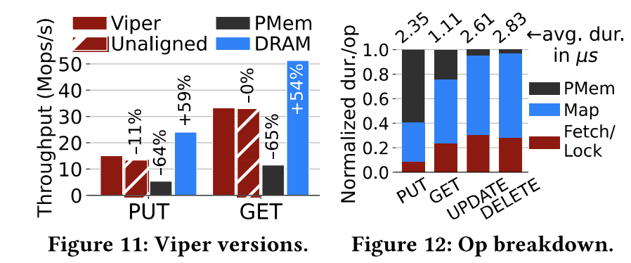
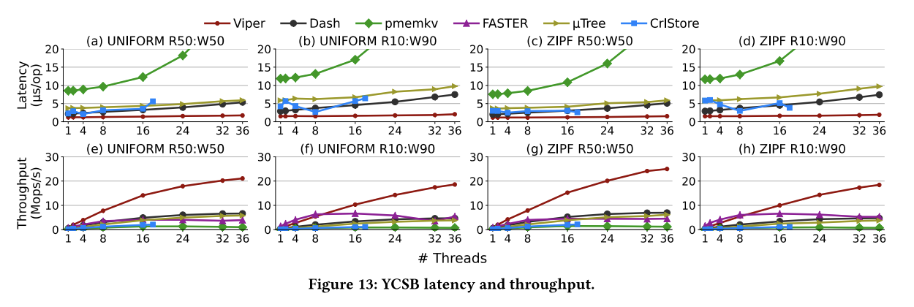
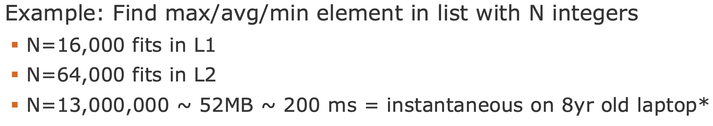
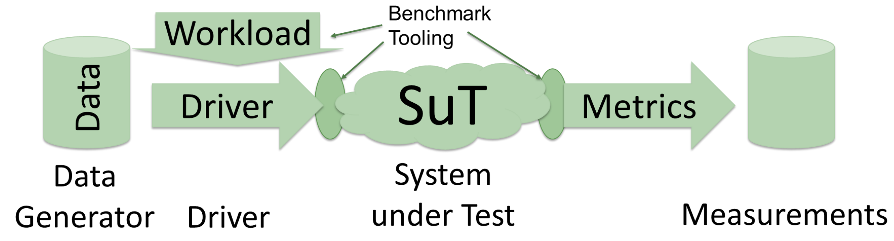
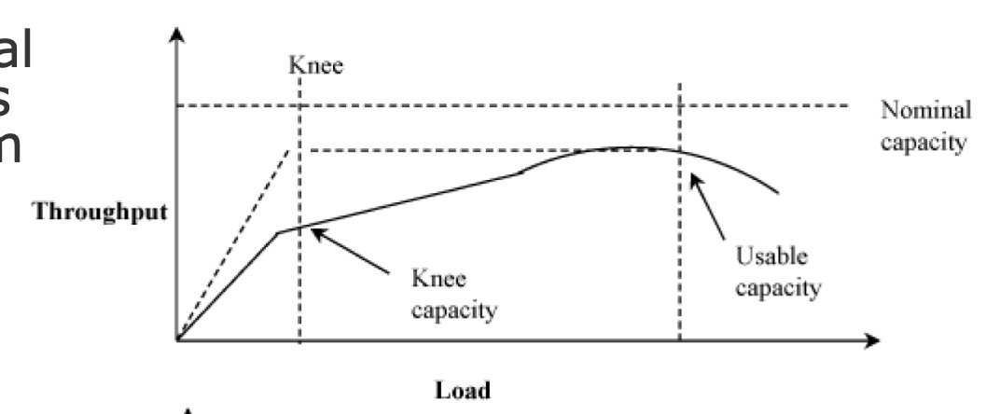

# Lecture 7 - Benchmarking & Measurement

## Summary
* Introduction to performance analysis
* Back of the envelope calculations
* Measurement
* Benchmarks
* Fair benchmarking

## Why Measurement and Benchmarking
* Systems are increasingly complex
* Single transactions can span 1000 components / nodes
* Low performance or outages cost $$

## Prof. Rabl‘s Famous 7 Step Paper/Thesis Recipe
1. Literature search
2. Identify a research problem
3. Describe a novel solution
4. Perform BotEC to show it might work
5. Perform experiments that show it does work
6. Write up the paper
7. Endure revision cycles

## Benchmark vs Analysis
> **Analysis** 
> * Single system/algorithm
> * Individual optimizations
> * Micro benchmarks
> 

> **Benchmark**
> * Compare multiple systems
> * Standard or real workload
> 

> Note: **A good paper has both!**

## Understanding System Performance
> **Modeling**
>* Back of the envelope calculation
>* Analytical model

> **Measurement**
>* Experimental design
>* Benchmarks

> **Rule of Validation**
>* Do not trust result of a single technique but validate with another
>* Often: validate measurements with model

>**Simulation**
>* Emulation
>* Trace-driven

## Back of the Envelope Calculation (BotEC)
>How to get good (enough) performance?
>
> **Understand your application**
>* Back of the envelope calculation
>* Estimate your system performance within an order of magnitude
>
> **Filter out stupid ideas early**

#### Basic Considerations
> Do I have a big data problem?
> My data fits in memory -> probably no

#### Simple BotEC Example
> How long to generate images/image results page (30 thumbnails)?
> 
> Design 1: Read serially, thumbnail 256KB images/images on the fly
>* 30 seeks * 10 ms/seek + 30 * 256KB / 30 MB/s = 560 ms
>
> Design 2: Issue reads in parallel
>* 10 ms/seek + 256KB read / 30 MB/s = 18 ms
>* (Ignores variance, so really more like 30-60 ms, probably)

> Back of the envelope helps identify most promising.
> Often, you need a simple prototype to get useful numbers

## Measurement & Metrics
> Basic Terminology:
> * **System under Test**: Deployment comprised of hardware, software, data
> * **Workload**: Requests by users
>*  **Metrics**: Criteria used for evaluation

### Questions to be Answered Beforehand
Which scenario do I want to evaluate?
* Which data / data-sets should be used?
* Which workload / queries should be run?

Which hardware & software should be used?

Metrics:
* What to measure?
* How to measure?
* How to compare?

Crime Scene Investigation: How to find out what is going on?

### Things to Consider when Evaluating Fast Systems
> Bottlenecks
>* Driver (probably multiple machines needed for data generation)
>* Network (GigE is saturated quickly ~ 110MB/s)

> Semantics (event time vs processing time)

### Common Metrics
Performance
* Throughput
* Latency
* Accuracy
* Capacity

Fault-tolerance
* Time to failure
* Availability 

Efficiency
 * Energy
 * Cost 
 * Fairness

Scalability

Selection criteria
* Low variability
* Non-redundancy
* Completeness

### Throughput / Latency
Throughput
* Requests per second
* Concurrent users
* GB/sec processed

Latency
* Execution time
* Per request latency

### Capacity

> **Nominal Capacity**
> Maximum achievable throughput under ideal workload conditions. E.g., bandwidth in bits per second. The response time at maximum throughput is often too high.

> **Usable capacity**
> Maximum throughput achievable without exceeding a pre-specified response-time limit 
> Also: sustainable throughput

> **Knee Capacity**
> Knee = Low response time and High throughput

## Benchmarks
> Desire for a Benchmark:
> * With creating a system comes the need to evaluate it.
> * Because we are system programmers, we always think of performance, when we think "benchmarking", rather than for example usability
>     * Other metrics are important as well, like energy efficiency or price-perperformance

## Fair Benchmarking
> Comparing to Other Systems/Work
> Ensure
> * All systems have equal functionality
>* You are able to reproduce original numbers

### Incorrect Results
* Bugs sometimes make code very fast
  *  But incorrect, may be invisible in benchmark
* Always check results
* Run with different benchmark and dataset, too 
* E.g. run with PostgreSQL and compare results