# Lecture 8 - Systems Design & Performance

## Summary part 1
>Physics matter
>* Nothing is unlimited, networks, CPU, memory, ...
> 
> Understand the whole stack
> * The higher up the stack, the more important
> * Use each part appropriately
> 
> There will be queues
> * You should actively decide where to put them
>
> Prepare with resiliency taken into account

## Summary part 2
* Systems design is much more than computer science 
* Necessary science includes
  * Queuing theory
  * Physics (computer hardware, networking)
  * Mathematics
* Even if your interest or expertise is in one part, you must understand the others
* Performance consideration is **never** an afterthought 
* Instrumentation is also never an afterthought

* There will be queuing and waiting – make sure you decide where
* Always consider which component to use
  * The salary raise and postal code cases are just examples
* Break your system (anywhere!) before your customer does 
* Understand the limits – and show you understand them
* Programming is just a small part of it

## An example of a system shutdown
> It is December 23rd
> Supermarkets are packed with customers with full shopping carts
> All cash register lanes are open 
> Queues just get longer
> Credit card system breaks down
> 
> Why did it happen?
> Where did it happen?
> What was the root cause?
> How do we prevent it from happening next year?

### How do we analyse these problems?
1. Get at **full view** of the **system design**
   1. We always want to understand the whole system.
   2. Understand the whole stack.
2. Use your **knowledge**.
3. Understand the problem with **science and physics**(MATH).
   1. Make calculations.
   2. What are the limitations.
   3. **Physics**!
4. Analyse the **CPU usage**.
   1. With N cores, it can run N processes concurrently
   2. If there are 1000*N processes, each can only be active 1ms/s
   3. If the CPU is 80% busy, the chance of getting scheduled is only 20%
5. Understand **Network**.
   1. Networks add latency
   2. Copenhagen<->Frankfurt: ~2ms, 
   Reality: 10ms at the very best
   3. Local network: < 0.5ms
6. Understand traffic engineering and **queueing** theory
   1. Were should queue of request be put?

### System desing
> All of the above are part of the whole system
> Information is only stored or processed in the building blocks
> Time “on the wire” is useless
> **The further down in the stack, the more important the component is**

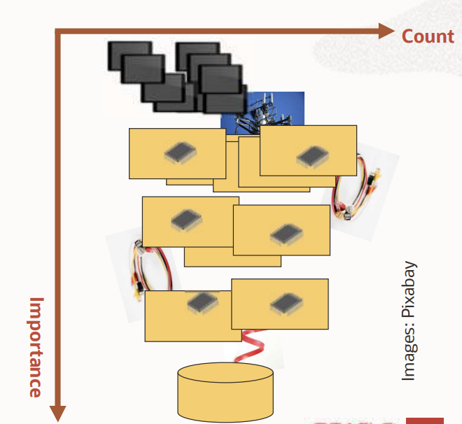

#### A complex stack
> You must understand *how device and network works* and their *limits*.

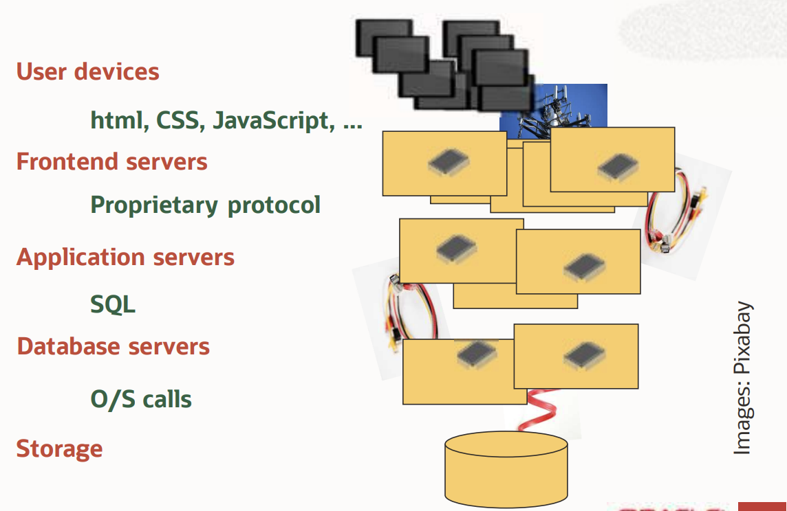

### System stack level - Database / Storage 

#### Applying physics and queueing theory
> M servers times N cores can process at most M*N requests
> If a request takes 30ms, M*N/30ms requests per second
> If M=4 and N=100, this is ~13e3/s or ~48e6/hour
> 
> Reality:
> * 10e6/hour – everybody are happy
> * 20e6/hour – things are very likely fine
> * 30e6/hour – things are probably fine most of the time
> * 50e6/hour – impossible – severe queuing
>
> As **reqeust per hour increase** the harder it gets to process reqeusts, in which **queues are forming**.
>
> Where do we put a queue  ?

### System stack level - Business logic 
> Similar rules apply, but quite different values
> Time spent at this level and any level below:
> * Network
> * Database
> * You need to understand both

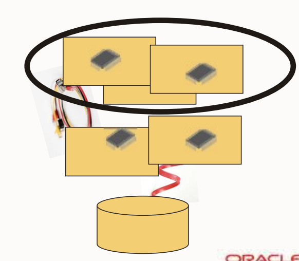

### System stack level - User interface
> Similar rules apply again
> Time spent at this level and any level below:
> * Networks
> * Application Server
> * Database
> * You need to understand all

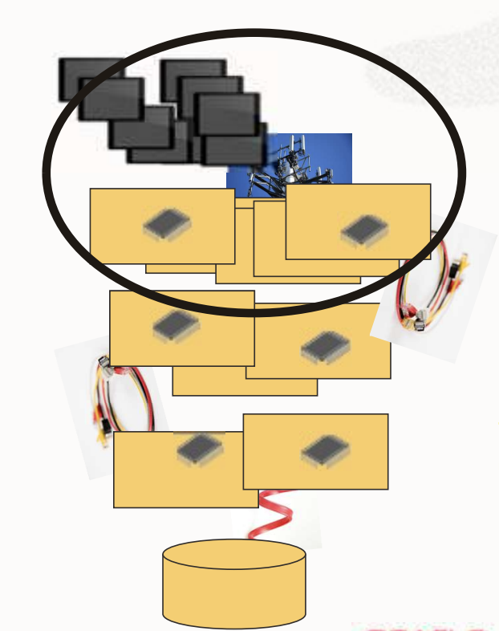

#### Sample application requirement
> Create a web page in a Human Resources system that does this:
> * Have the end user enter a department name (D)
> * ... A number of years of employment (Y)
> * ... A percentage (P)
> 
> Give everybody in D who have been employed Y years or more a pay rise of P percent.
> **Which code do you put where?**

#### Code in User Interface
> Asking for D, Y, P surely goes here

You **should not do anything else** here

#### Code in the actual business logic - option 1 (bad)
> This approach creates **lots of traffic**

>1. Fetch all employees from the database
>2. For each, if the criteria (D, Y) are met: 
>     1. Send the changed salary (P) to the database 
>     2. Commit the change

Maybe not the smartest thing to do
* Why fetch all the employees?
* The network latency easily comes a bottleneck
* This is surely done in practice!

But what if somebody already wrote a method “for all employees”?
  * Using it might save you programming time.

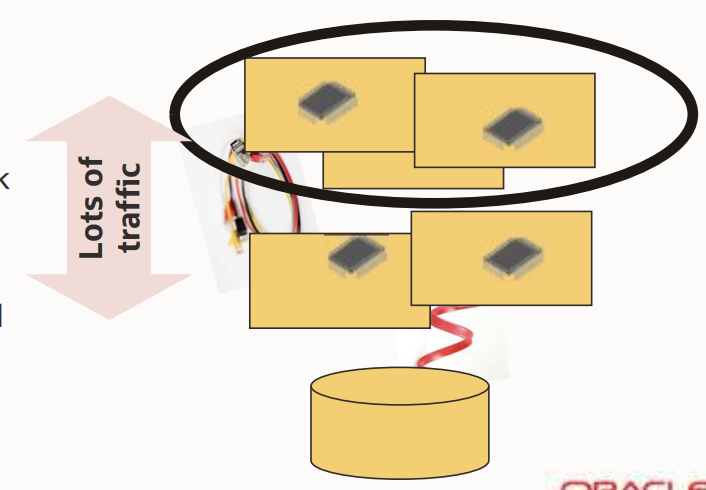

#### Code in the actual business logic - option 2 (better)
> This approach creates **less traffic**

>1. Ask the database to send all employees matching the criteria (D, Y)
>2. For each of these:
>     1. Send the changed salary (P) to the database
>     2. Commit the change

But it cannot use the “for all employees” method, hence ...
* More programming needed
* This is often done in practice!

**Network latency can still be problematic**

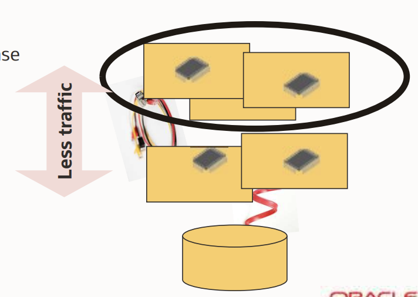

#### Code in the actual business logic - option 3 (best)
> This approach creates **very little traffic**

> Let the database do the work
> 1. Ask the database to update the salary (P) of all employees matching the criteria (D, Y)
> 2. Commit the change

**Network latency has very little impact**
* Different programming paradigm – you are an application programmer, not a database developer, right?
* But this is **almost always the right thing to do**

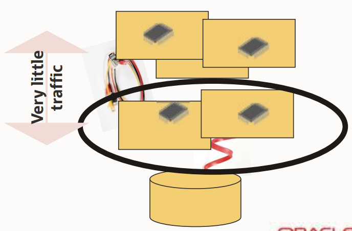

### When things break
> What happens when (NOT if!) things break?
> * System failures (software, hardware)
> * Environmental failures
> * Power failures
> 
> Where are your components?
> What and how can you protect?

> Random failure examples:
> * Computer room in the basement of a building in a valley....
> * Not installing security patches
> * Digging holes in the ground where cables are
> * Underestimating cooling requirements

### Where to be resilient?
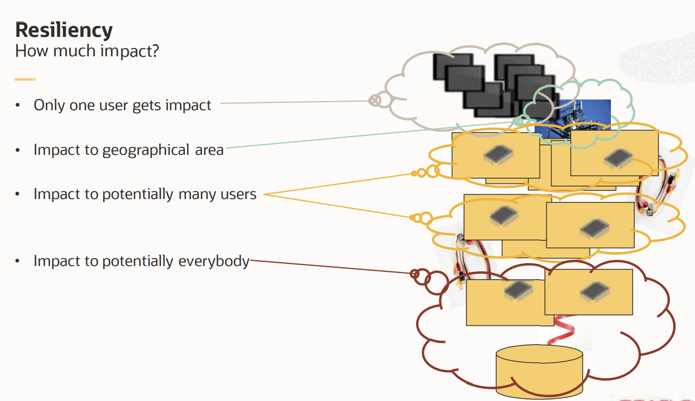

### Back to the supermarket anecdote
> Why did it happen?
> * A likely cause is too many requests per time period 
> 
> Where did it happen?
> * Without understanding the whole stack, it is purely guesswork
> * Instrumentation (i.e. measurement of time and counts of what happens) needed at every layer
> The layer with best instrumentation is likely to get the blame! 
> 
> What was the root cause?
> * Very often not the layer, where instrumentation tells there is a problem

## Where to put queues

### Put queue at user interface level?
> * Protect the entire stack or application servers
> * **Don’t let people in unless it is known there are resources available**
> * Once you are “in”, your performance is (almost) guaranteed 
> *   An example of this is what the Danish Tax authorities do
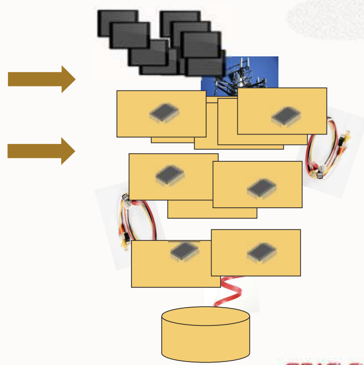

### Put queue at business logic level?
> * Protect the database
> * Allows high end-user concurrency
> * Assumes “infinite” application server resources
> * Accept that some transactions queue and therefore take longer than normal
> * This is what websites always should do
> 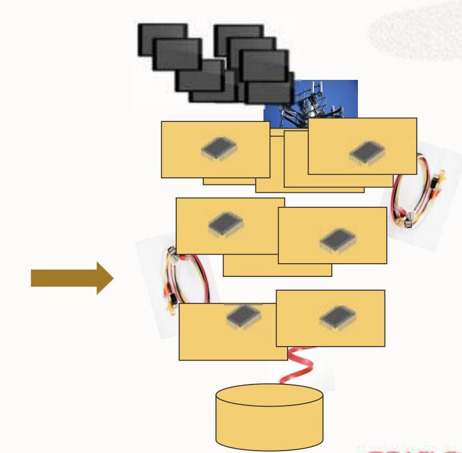

### Put queue at database/storage level?
> This may be the implicit place!
> **It is never the right thing to do**
> The whole system may become **inaccessible**
> 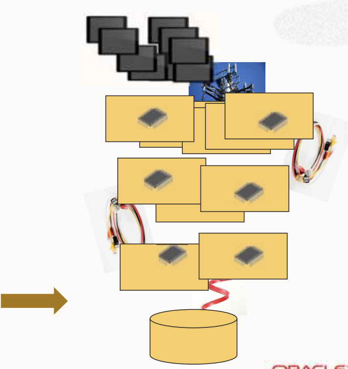

### Using a funnel 
> **The “Hagen-Poiseuille equation”**:
> Out-flow gets independent from in-flow and amount (with some conditions about viscosity, shape and dimensions)
> 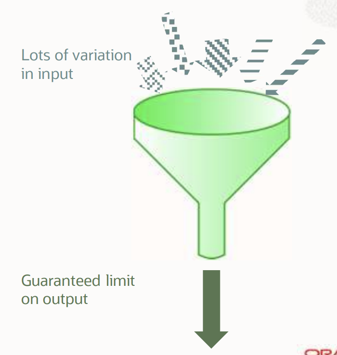

### Applying the funnel on the sytem stack
> * **Protecting the database** is the most important thing!
> * Use the funnel to **ensure a maximum input** transaction rate 
> * **Prevents** the database from **overloading**
> * Remember the importance of the database.
> * Add more to protect other layers
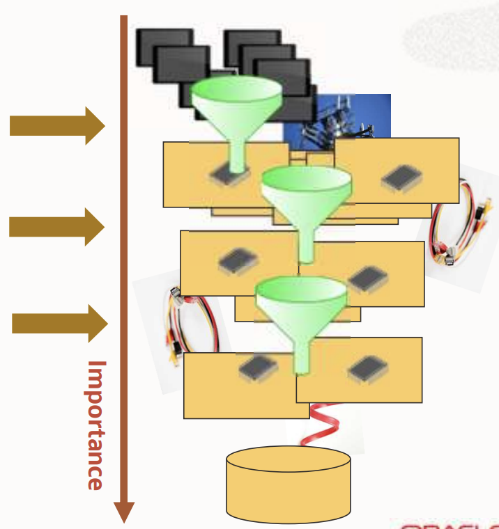

### Without a queue in front of the database
> * Throughput cannot scale in the high range
> * The service time per transaction is as expected
> * However => The **database now becomes the “queue”**
> * Database side wait time increases dramatically => **The database has issues**
> * Behaviour is erratic
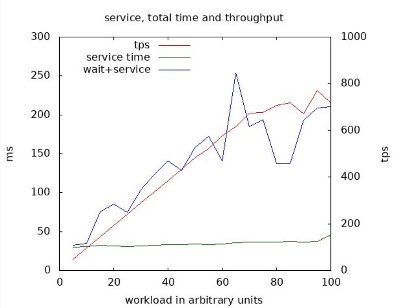

### With a queue in front of the database
> * Throughput scales almost completely
> * Total time spent is almost not impacted by workload 
> * Behaviour is completely acceptable
> 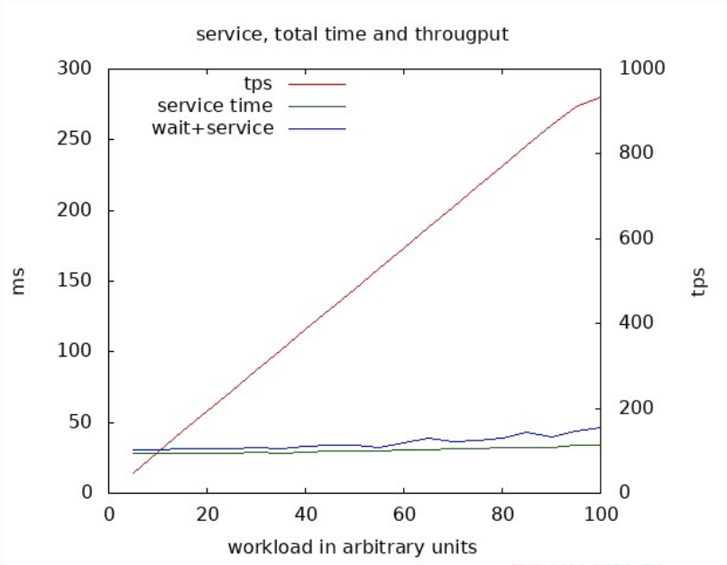

### Throughput or response time?
> **You cannot guarantee both throughput and response time!**

> Recall this:
> * 30ms service time, 4 servers * 100 cores
> * 20e6/h – things are very likely fine
> * 30e6/h – things are probably fine most of the time
> * ...
> 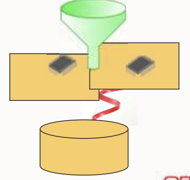

> To get the **maximum throughput**, 48e6/h, there must **continuously be transactions** in the queue 
> => **Some transactions will wait in the queue**

> To guarantee **lowest response time**, 30ms, there must continuously be **free space** in the queue
> => Throughput is lower than maximum

## Impact of network latency
> Network is mostly located at user interface level, mening network latency is likely here impact. 
> **Further down we go => less network latency**

> Where is the hardware located?
> * End user device surely away from everything else
> * Servers are possibly scattered
>     * Same computer room?
>     * Same city?
>     * Same country?
> * Latency impacts design decisions
> * Protocol impacts design decisions
> * Recall the salary increase example
> 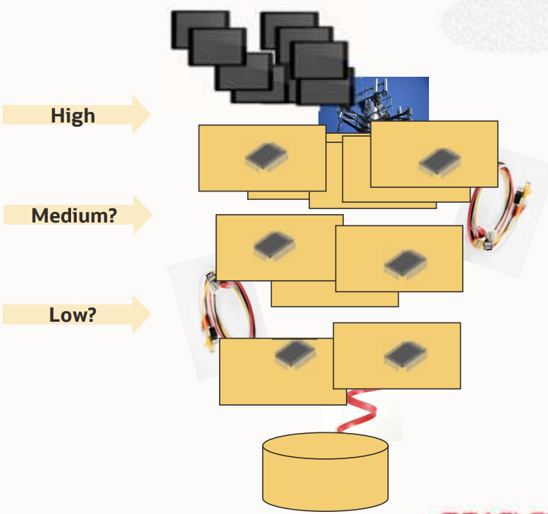

## Reponse time
> Each component in the stack adds to response time 
> * Processing time
> * Networking time
> 
> => Only involve a component when necessary

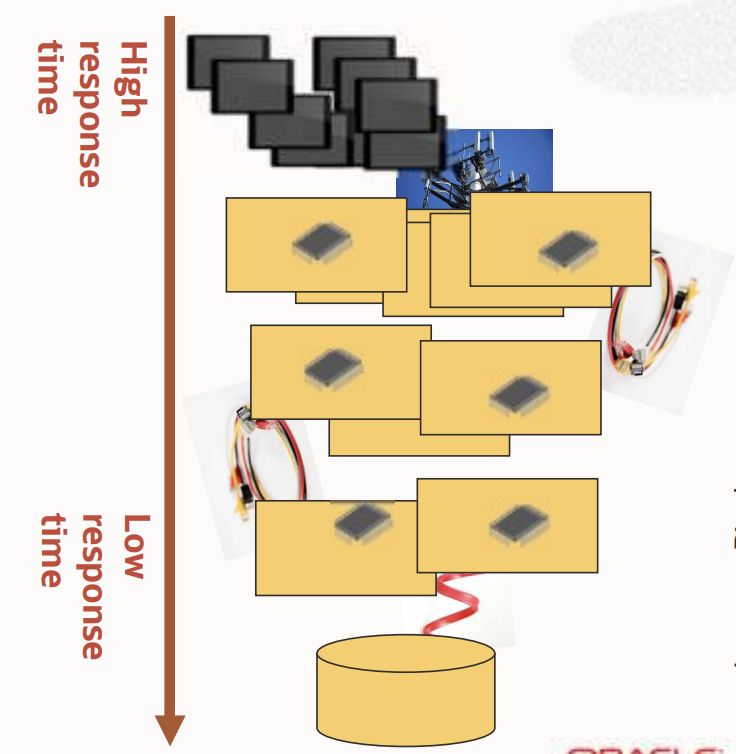

## Cache information when possible
> Where do you get the city name?
> * From the database
> * Cached in the application server
> * In the graphical front end
> * In the end-users device

Postal codes in Denmark: < 1500
Postal codes in UK: > 1,700,000

No single correct answer:
* Depends on network topology
* Depends on type of data
* Depends on update frequency
* Depends on cache reload cost 

Postal codes was just one example

### Consequences of caching
> **Always get from the database**
> * Cons: 
>     * Poor response time
>     * Waste of database resources
> * Pros
>     * No memory needed in upper layers
>     * Guaranteed to be most recent data

> **Cached in application server/frontend**
> * Cons:
>     * Memory needed to save data
>     * Data may be out of synch
>     * Cache reload processing needed
> * Pros:
>     * Better response time
>     * No unnecessary database calls

## Is my system (too) busy?
What does busy mean?
How do you measure it?
Are all components equally busy?

> Each components has its limits
> * Often CPU
> * May surely also be network, disk, memory

> In general, at most one component can be 100% busy
> But in oltp, you never want any component to be 100% busy

## Resiliency revisited
> Avoid single points of failure
> * Have multiple copies of all vital parts: Servers, Buildings, Networks, Cooling, Power supplies, ...
> 
> What are the implications?
> What is easy and hard to do?

### At user interface layer
> Make distributed copies of the user interface processing
> Easy to do – no dependency between each
> 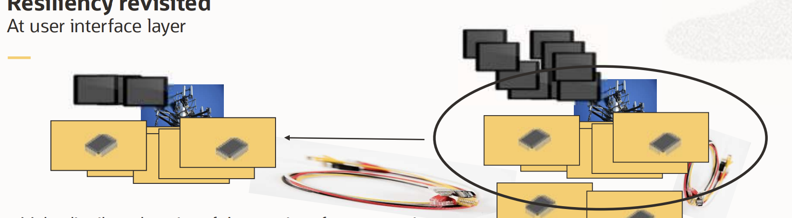
> 
> But it has consequences for **networking**
> LAN (<0.5ms) may become WAN (10+ ms)

### At application layer
> Can we do the same to the application tier?
> If its components depend on each other?
> Coordination may be needed
> May be harder
> 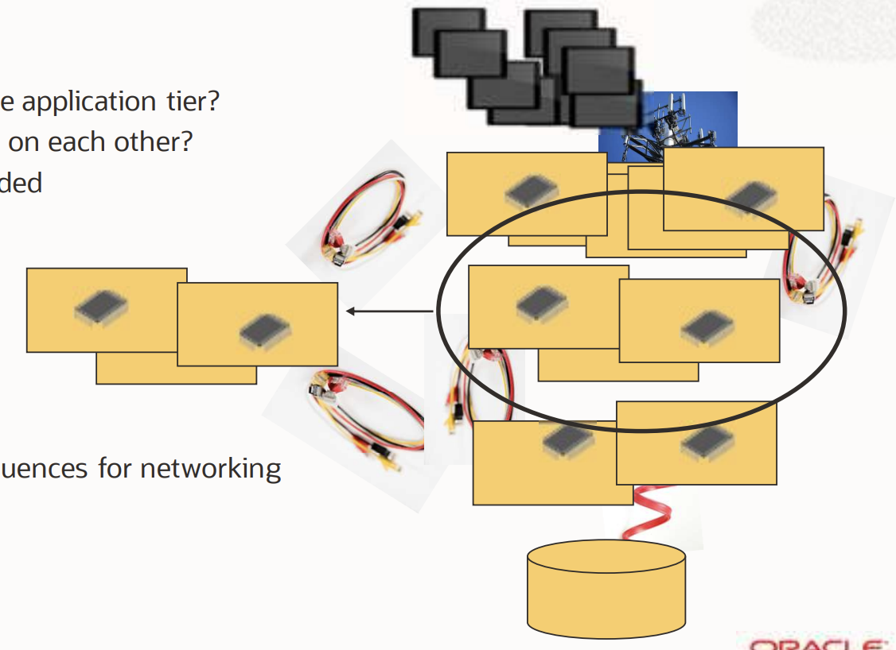
>
> And again – it has consequences for **networking**

### At database layer
> Distributed databases
> Has consequences for everything above
> Notoriously hard
> All the physics still apply

> True distributed database (2 phase commit)
> Disaster recovery
> Sharding (horizontal data separation)
> Data extract/transform/load for decision support

## Modern reality
> **Devices & computers**
> * Virtualized
> * Microservices
> * Docker, Kubernetes – pick today’s buzzword

> **Networks**
> * Virtualized
> * Tunnels & VPNs
> * Encapsulation
