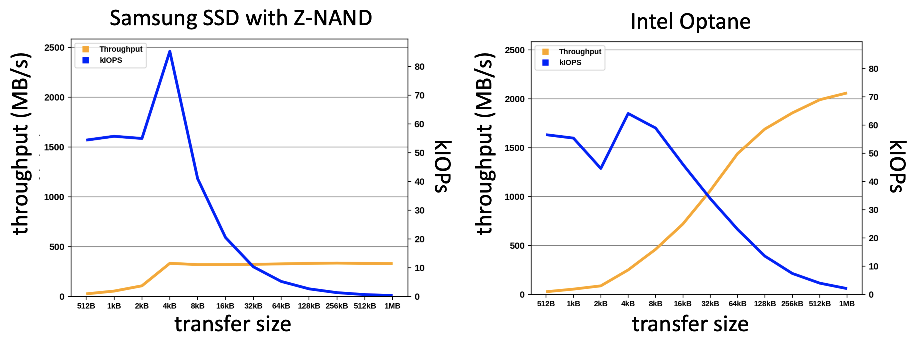

# Lecture 9 - Persistent storage

## Summary 1
* Sequential access is faster than random access for all layers, but especially for hard disks.
* Hard disks (HDDs) and SSDs are internally very different.
* Having an HDD-compatible interface for SSDs
  * \+ leads to ease-of-use
  * \- but prevents us from fully exploiting SSDs
* It is important to be aware of the storage hierarchy to utilize it more effectively & have more efficient software layers.

* **Goal**: minimize data access latency!

## Summary 2
* SSD landscape & ecosystem evolved drastically the last decade
  * data management community has shifted to SSD-optimized systems (instead of HDD- or main-memory-optimized ones)
* NVMe SSDs aren’t a uniform class of devices
* expanding range of standardized storage interfaces (block, FDP, ZNS, KV, OCSSD) => the storage interface is a design choice
* Computational storage
   * enables the definition of even more specialized storage interfaces
   * has potential to minimize data movement overheads
   * is not unique to SSDs, but most commonly targets SSDs today 

need for co-design of application – FTL – SSD

## Reminder of storage hierarchy
> The further down we go:
> * Less data locality
> * More access latency
> * More storage capacity per $$$

> **Movement of data in storage hierarchy**
> 

## Traditional persistent layers

### Tape
>* cheap way of storing voluminous data
>* only allows **sequential access**
>* does not allow **random access**
>* only used for archival storage today

### Hard disk
>* tracks with the same diameter make a **cylinder**
>* tracks are composed of **blocks**, which is the unit of read/write
>* blocks are composed of **sectors**, which are of fixed-size
>* **placement of data on disk is a crucial concern for access latency!**

#### Access latency on hard disk
> **= seek time + rotational delay + transfer time**
> also called I/O (input/output) latency
>
> **seek time**: moving disk ***arm*** to the right *track* – (~1-20 ms)
> **rotational delay**: reaching the desired block on the ***track*** – (~0-10 ms)
> **transfer time**: reading/writing the desired data on the ***block*** – (~<1ms for 4KB)
> 

> **for faster access** => **minimize seek time & rotational delay!**

#### Random vs. sequential access on hard disk
> * **access latency** for reaching a disk block = 
>     * $a$ = seek time + rotational delay
> * **reading a block** = 
>     * $a$ + transfer time
>

> Access latency for 100 **random** blocks =
> * 100 x (a + transfer time)
> 
> Access latency for 100 **sequential** blocks =
> * a + 100 x (transfer time)
>
> Hence: **sequential access is much faster** than random access!

#### What does sequential mean on hard disk?
>1. reach the first desired block
>2. read adjacent blocks on the same track
>3. read blocks on the same cylinder (switch to different disk head, then short rotational delay)
>4. read blocks on the adjacent cylinder (short-distance seek time, then short rotational delay)

### RAID
> **Redundant Array of Independent Disks (RAID):**
> Several disks that gives the illusion of a single large disk
>

> It depends on data striping & redundancy
> * Data striping => increase performance
> * Redundancy => reliability
>
> **Data striping**
> * data is partitioned
> * partitions are distributed over several disks
>* allows parallel access to data
> 
> **Redundancy**
> * redundant information allows reconstruction of data if a disk fails

> different RAID methods exist based on how striping & redundancy are handled

### Solid-state disk (SSD)
> * Interconnected flash chips
>* Efficient random access
>* Internal parallelism
>* hard disk compatible API

> why not have as drop-in replacement for hard disks?

#### SSD device geometry
>Isolation across **groups** for parallel requests each group has their own submission/completion queue

> **Parallel units** (PU) within a group share that group’s queues.
> Parallel units has **chunks**, which are composed of **sectors** (= unit of read).
>
> **Logical blocks** => multiples of sectors & unit of write

>**Very different & complex internally compared to hard-disks**

#### Unit of write and erase
> Unit of write = one block
> Unot of erase = a unit of multiple blocks

> **You cannot override a unit before erasing it first**!
> **Garbage collection** – for not used blocks so we can rewrite them
> **Write amplification** = data physically written / data logically written >= 1 writing data might cause rewrites & garbage collection
>**Wear leveling** – some cells/blocks die over time 
>**Unpredictable read/write latencies** - if a request gets stuck after a write triggering garbage collection

> Can use it as drop-in replacement for hard disks, but need to be smarter to more effectively exploit SSDs & not to burn money!

#### Disk controllers
> * disks have computation units inside them as well
> * enables communication with processors/cores
> * maps logical data addresses to physical addresses physical address might change due to errors in blocks
> * remaps blocks with errors
> * performs caching within disk
>     * faster read/write via internal memory in disks
>     * forced-write option exists to ensure persistence
>* in SSDs more complex
>      * due to flash translation layer that handles garbage collection, wear-leveling, etc.
>

## Why SSDs are on the hype today?
> => except for SSDs, each storage hierarchy layer stayed almost **stable** the last decade in terms of **latency**
> * improvements on SSD internals
> * from SAS/SATA to PCIe
> * linux block IO improvements
> 
> 
> => **improved price/capacity**
> => **led to several SSD-optimized data systems**
>
> **Data management increasingly shifts from pure in-memory optimized to SSD-optimized!**

### SSDs – read path
> 1. **non-negligible difference between average & worst-case**
> 2. **moving data out of SSD adds a lot to the latency**

### FTL (flash translation layer)
>  FTL has drastic impact on performance!
> 

### Linux IOs in the µsec era
> How operating system uses SSD is also important.

> The benefits of fast storage wasted by
> * data movement overheads (from device to host & across network)
>* black-box generic flash-translation layers
>* multitude of software layer

How do we prevent these?

#### SSD landscape – local 
> Data system needs to change when you start app-specific
storage management & pushing functionality down!

#### SSD landscape – disaggregated
> * Specialized computational storage interface & FTL over network
> 

#### Computational storage
>* enables the definition of even more specialized storage interfaces
>* has potential to minimize data movement overheads
>* is not unique to SSDs, but most commonly targets SSDs today