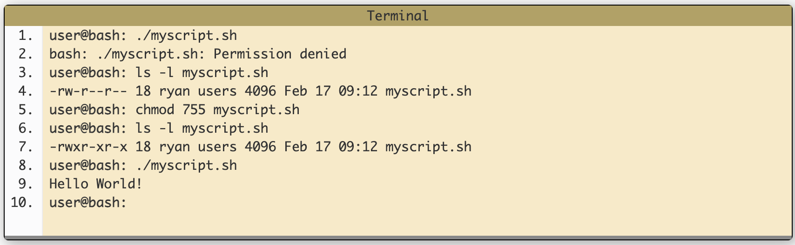

# Bash
> The Bourne-Again SHell (Bash). Today, Bash is the **default** user shell on most **Linux** installations. Although Bash is just one of several well known **UNIX shells**, its wide distribution with Linux makes it an important tool to know.

> **The main purpose of a UNIX shell is to allow users to interact effectively with the system through the command line**. A common shell action is to invoke an executable, which in turn causes the kernel to create a new running process. Shells have mechanisms to send the output of one program as input into another and facilities to interact with the filesystem. For example, a user can traverse the filesystem or direct the output of a program to a file.

> Bash supports:
> * **variables**, 
> * **functions**,
> * and has **control flow** constructs, such as conditional statements and loops.

> Bash attempts to fulfill two roles at the same time: to be a **command interpreter** and a **programming language**.

## Commands
The original Thompson shell was a simple command interpreter whose mode of operation was as follows:
```bash
$ command [ arg1 ... [ argN ]
```
where `command` is the name of the executable file (that is, a command to be executed), and the `optional arguments arg1 ... argN` are passed to the command.

**Bash operates as follows:**

1. Takes the input and splits it into words on white spaces (space or tab).
2. Assumes that the first word is a command. If anything follows the first word, it assumes they are arguments to be passed to the command.
3. Attempts to execute the command (and pass the arguments to it, if any).

### Bash Built-ins vs. External Commands
>On a typical Linux/UNIX system, a number of common commands are **both built-in** in Bash and **also exist** as independent executables with the same name.
>
>Examples of this include:
*  `echo` (built-in) and `/bin/echo`, 
*  `kill` (built-in) and `/bin/kill`,
*  `test` (built-in) and `/usr/bin/test` (and there are more). 

Consider how the Bash built-in `echo` and `/bin/echo` behave very similarly:
```bash
$ echo 'Echoed with a built-in!'
Echoed with a built-in!
$ /bin/echo 'Echoed with external program!'
Echoed with external program!
$
```
> **The built-in version typically exists for performance reasons**: Bash built-ins execute within the shell process that's already running. In contrast, executing an external utility involves loading and executing the external binary by the kernel, which is a much slower process.

### Variable Assignment
> When a command is entered in Bash, Bash expects *that the first word it encounters is a command*. 
> However, there's **one exception**: if the first word contains `=`, Bash will attempt to execute a variable assignment.

For example:
```bash
$ VAR=7
$
```
This has assigned the value `7` to the variable named `VAR`.

To **retrieve the value of a variable**, you need to prefix the variable name with the **dollar sign**.
```bash
$ echo $VAR
7
$
```

Remember that bash is white space sensitive:

```bash
$ VAR = 1
bash: VAR: command not found
$
```

Bash splits the input VAR = 1 into three "words" (VAR, = and 1) and then attempts to execute the first word as a command.

### The Conditional if Statement
> In Bash

```bash
if true
then
  echo 'Yay true!'
fi
```

You can reformat this by using ; to provide a handy one-liner to type in:
```bash
$ if true; then echo 'Yay true!'; fi
Yay true!
$
```

### More Bash Ingenuity
Consider the following task: test if the file exists, and if it does, delete it. For this you can use the Bash built-in `test` command with the `-e` flag:

```bash
$ rm dum.txt        # make sure file 'dum.txt' doesn't exist
$ test -e dum.txt   # test if file 'dum.txt' exists
$ echo $?           # confirm that the command test failed
1
$ touch dum.txt     # now create file 'dum.txt'
$ test -e dum.txt   # test if file 'dum.txt' exists
$ echo $?           # confirm the command test was successful
0
$
```

# Bash scripts
> **Anything you can run normally on the command line can be put into a script and it will do exactly the same thing.**
> Similarly, anything you can put into a script can also be run normally on the command line and it will do exactly the same thing.

> Bash scripts an extension of **.sh** (myscript.sh for example).

## How do they work?
> A **program** is a blob of binary data consisting of a series of instructions for the CPU and possibly other resources (images, sound files and such) organised into a package and typically stored on your hard disk. 
> 
> When we say we are **running a program** we are not really running the program but a copy of it which is called a **process**.

> **Essentially a process is a running instance of a program**.

## How do we run them?
> Before we can **execute** a script it must have the **execute permission** set (for safety reasons this permission is generally not set by default). 
> If you forget to grant this permission before running the script you'll just get an error message telling you as such and no harm will be done.



**Content of myscrupt.sh**
```bash
#!/bin/bash
# A sample Bash script, by Ryan
echo Hello World!
```
* **Line 1** - Is what's referred to as the **shebang**. See below for what this is.
* **Line 2** - This is a comment. Anything after **#** is not executed. It is for our reference only.
* **Line 4** - Is the command echo which will print a message to the screen. You can type this command yourself on the command line and it will behave exactly the same.
* The syntax highlighting is there only to make it easier to read and is not something you need to do in your own files (remember they are just plain text files).

### Why the ./
> To run scripts we put `./` in front of it. 
> When you just type a name on the command line Bash tries to find it in a series of directories stored in a variable called $PATH.
```bash
bash: ./myscript.sh
```

## The Shebang (#!)
```bash
#!/bin/bash
```
> This is the first line of the script above. The hash exclamation mark ( #! ) character sequence is referred to as the Shebang. Following it is the path to the interpreter (or program) that should be used to run (or interpret) the rest of the lines in the text file. (For Bash scripts it will be the path to Bash, but there are many other types of scripts and they each have their own interpreter.)

> Formatting is important here. **The shebang must be on the very first line of the file** (line 2 won't do, even if the first line is blank). **There must also be no spaces** before the # or between the ! and the path to the interpreter.

## Command line arguments
In short:
* `$1, $2, ...`
  * The first, second, etc command line arguments to the script.
* `variable=value`
  * To set a value for a variable. Remember, no spaces on either side of =
* Quotes `"` `'`
  * **Double will do variable substitution**, single will not.
* `variable=$( command )`
  * Save the output of a command into a variable
* `export var1`
  * Make the variable `var1` available to child processes.

## If statements
In short:
* `if`
  * Perform a set of commands if a test is true.
* `else`
  * If the test is not true then perform a different set of commands.
* `elif`
  * If the previous test returned false then try this one.
* `&&`
  * Perform the and operation.
* `||`
  * Perform the or operation.
* `case`
  * Choose a set of commands to execute depending on a string matching a particular pattern.

## Loops
```bash
#!/bin/bash
# Basic while loop
counter=1
while [ $counter -le 10 ]
do
echo $counter
((counter++))
done
echo All done
```
* **Line 4** - We'll initialise the variable **counter** with it's starting value.
* **Line 5** - While the test is true (counter is less than or equal to 10) let's do the following commands.
* **Line 7** - We can place any commands here we like. Here echo is being used as it's an easy way to illustrate what is going on.
* **Line 8** - Using the double brackets we can increase the value of counter by 1.
* **Line 9** - We're at the bottom of the loop so go back to line 5 and perform the test again. If the test is true then execute the commands. If the test is false then continue executing any commands following done.

In short:
* `while do done`
  * Perform a set of commands while a test is true.
* `until do done`
  *  Perform a set of commands until a test is true.
* `for do done`
  * Perform a set of commands for each item in a list.
* `break`
    * Exit the currently running loop.
* `continue`
    * Stop this iteration of the loop and begin the next iteration.
* `select do done`
* Display a simple menu system for selecting items from a list.

## Functions
> Creating a function is fairly easy. They may be written in two different formats:

```bash
function_name () {
   <commands>
}

or

function function_name {
   <commands>
}
```

Example:
```bash
#!/bin/bash
# Basic function
print_something () {
echo Hello I am a function
}
print_something
print_something
```
Output:
```bash
./function_example.sh
Hello I am a function
Hello I am a function
```

* **Line 4** - We start defining the function by giving it a name.
* **Line 5** - Within the curly brackets we may have as many commands as we like.
* **Lines 8 and 9** - Once the function has been defined, we may call it as many times as we like and it will execute those commands.

### Passing Arguments
> It is often the case that we would like the function to process some data for us. We may send data to the function in a similar way to passing command line arguments to a script. We supply the arguments directly after the function name. Within the function they are accessible as $1, $2, etc.

Example:
```bash
#!/bin/bash
# Passing arguments to a function
print_something () {
echo Hello $1
}
print_something Mars
print_something Jupiter
```
Output:
```bash
./arguments_example.sh
Hello Mars
Hello Jupiter
```
### Return Values
> Most other programming languages have the concept of a return value for functions, a means for the function to send data back to the original calling location. Bash functions don't allow us to do this. They do however allow us to set a return status. Similar to how a program or command exits with an exit status which indicates whether it succeeded or not. We use the keyword return to indicate a return status.

Example:
```bash
#!/bin/bash
# Setting a return status for a function
print_something () {
echo Hello $1
return 5
}
print_something Mars
print_something Jupiter
echo The previous function has a return value of $?
```
* **Line 6** - The return status doesn't have to be hardcoded. It may be a variable
* **Line 11** - Remember that the variable $? contains the return status of the previously run command or function.

Output:
```bash
./return_status_example.sh
Hello Mars
Hello Jupiter
The previous function has a return value of 5
```

In short:
* `function <name> or <name> ()`
  * Create a function called name.
* `return <value>`
  * Exit the function with a return status of value.
* `local <name>=<value>`
  * Create a local variable within a function.
* `command <command>`
  * Run the command with that name as opposed to the function with * the same name.