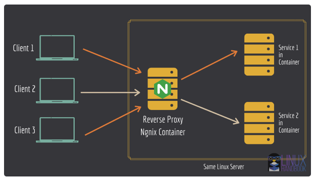
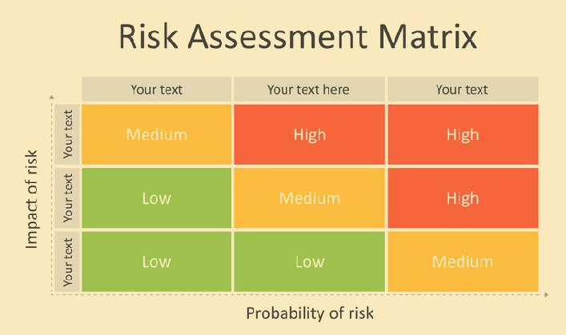

# Lecture 11 - Security in DevOps

### Motivation 

#### Building a Dependable System

Dictionary defines dependable as trusthworthy and reliable. You can trust that millions of people have access to the real FB (example he used) at any time and it's services will always be there.

Sommerville decomposes dependability into multiple components:
* Availability -- probability that a system is operational at a given time -- Uptime / (Uptime + Downtime), e.g. "5 nines"
* Reliability -- probability of correct functioning for some given time -- MTBF = mean time between failures
* Safety -- ability to operate w/o catastrophic failure
* Security <-- fighting against the fact that "information wants to be free"

#### "Information wnants to be free"

The information in your systems wants to be free and many people are after it. Your goal is to protect it. This is security:
>  the protection of computer systems and networks from the theft of or damage to their hardware, software, or data, as well as from the disruption or misdirection of the services they provide. 

### Reverse Proxy

A Reverse Proxy is a server that:
* Acts on behalf of one or more other servers
* Forwards the client requests to the appropriate servers
* Forwards responses back on behalf of the servers



*Why?*:
* Security
  * Protecting ports done in a centralized manner
  * TLS deployed only once
  * How: The reverse proxy is the only server exposed to the internet (e.g., ports 80/443).
* Load Balancing
* Caching

### Firewall

A firewall is a system that limits access to servers and processes based on the source and destination of the accesses, where these are defined in terms of IP_ADDRESS:PORT pairs.

Firewalls can be either hardware or software.

### General Things from Mircea Story Time

* Docker circumvents the UFW firewall and alters iptables directly when you instruct it about ports

* Mapping the ports with -p 9200:9200 (or in docker-compose) maps the port to the host but also opens it to the world! 
    * What does it mean: Anyone on the internet can reach the service via `http://your-ip:9200`

* ElasticSearch server was not password protected - because I was sure that it's behind the firewall

### State of the Security

1. The most common wy to discover security failures is when a security incident happens.
2. Average time until people found out they were hacked is quite long:
   1. half a year
   2. By this time, it is often too late, and damage has been done. 

### A Systematic Approach to Security

If one is to follow a systematic approach to security, this would mean a four-pronged approach consisting of:
1. Understanding threats
2. Assessing risks & hardening security
3. Testing security
4. Detecting breaches

#### Understanding Threats

A threat is defined by a triplet:
1. Intent (we can guess)
2. Capability (we can't change)
3. Opportunity <-- (we can influence)

**Threat Component**: Intent and Capability
  * **Black Hat** - bad intent, high capabilities (inspired from western movies)
  * **Script Kiddies** - they have time on their hands and not good intentions
  * **White hat** - ethical hackers, working with orgs to strengthen security
  * **Grey Hat** - not malicious, usually notify you that they hacked you

In our case, most of the times it will be one of the first two.

**Threat Component**: Opportunity
Opportunities; this is where we can have an impact. By reducing the opportuniyu for threats. 
* This is done by analyizing our system and think.

### Assessing Risk

Any risk assessment has to priotize addressing the risk based on their impact and probability. Usually for this one uses risk matrices.

**Risk Matrices**: A way of visualizing the possible risks in terms of impact and probability. 



Once you define the matrix, you place the risks that you identified in it. Then address the ones for which both impact and probability are highest first.

You can define the levels yourself:
* Probability (Likelihood) e.g.: {Certain, Likely, Possible, Unlikely, Rare}
* Impact (Severity). e.g.: {Insignificant, Negligible, Marginal, Critical, Catastrophic}

### Testing 
Penetration Testing:
* Simulate attacks on your system
* Helps you understand what an attacker can do. 

#### Automating Pen Testing
* Tools exist that can automate the process
* You can provide a target IP and they scan it for vulnerability

Tools:
* Metasploit
  * WMAP PLugin for Metasploit
* Skipfish
* Nmap
* etc.
* Detectify (Online Service)

### Detecting Intrusions

It is hard to do, an usually too late. So we should focus on preventing.

Warning signs that you might have an intruder:
* You can't access your server
* Your Server IP has been blacklisted
* ABnormal network traffic
* Unusual resource usage

**Detection - Approach**:
* Develop baseline for normal
* Monitor
* Stop intruders from taking information out:
  * Firewall
  * Traffic filtering 
  * White/black listing
* Auiting, compliance testing.


### 10 Practical Advices to Improve Security in DevOPS

#### Evaluate, Scan & Update Dependencies

One of the most important attack vectors on your system are all the giants your application is "standing on the shoulders of".

Best approach here it to:
* Always keep dependencies up to date

One way to do that is to:
* Scan dependencies for security breaches
  * add security shcecks as part of your CI

#### Always provide the least prvileges possibles

Run your containers with least possible privileges (i.e. not as root):
* switching to a new user after installing the required dependencies in the system.

```bash

# Base image
FROM ubuntu:latest

# Install packages (**as root**)
RUN apt-get update && apt-get install -y curl

# Create a non-root user
RUN useradd -m myuser

# Switch to the non-root user
USER myuser

# Set the working directory
WORKDIR /home/myuser

# ... continue with other instructions ...

```


#### Never trust User Input

Another attack vector is the inputs in your application. 

The solution to this is:
* Validate web input before using it
  * In the webpages
  * in the API
* Use parameterized DB queries

#### Protect Servers
* Keep server software up to date
* System hardening
  * Analyze the system from within
  * Treats the system as white box as opposed to blackbot: e.g. `sudo lynis audit system`

#### Protect Secrets
* Don't commit credentials and other secrets into a VCS repository
* Use 2FA for secret repositories
* Concider using dedicated tools and vaults for secrets (e.g. docker secret)

#### Project your CI/CD tools
* CI pipelne is part of your infrastructure
* Make sure that it's secure

#### Automatic Backups 
* Data os probably your most precious asset; don't lose it
* Test your full recovery process.
  * A backup is not useful unless you can use it actually perform the backup

#### Hack Your Own System
* Create a red team to pen test
* Stress the app infrastructure

#### Use more than one Security Mechanism
* The example I gave you in the introduction: both firewall and application passwords
* Cloud based firewall but firewall also on every machine
* 2FA

#### Log Your Application & Monitor Your Server

Monitor
* traffic
* accesses

Log everything. This is the key to being able to detect attacks