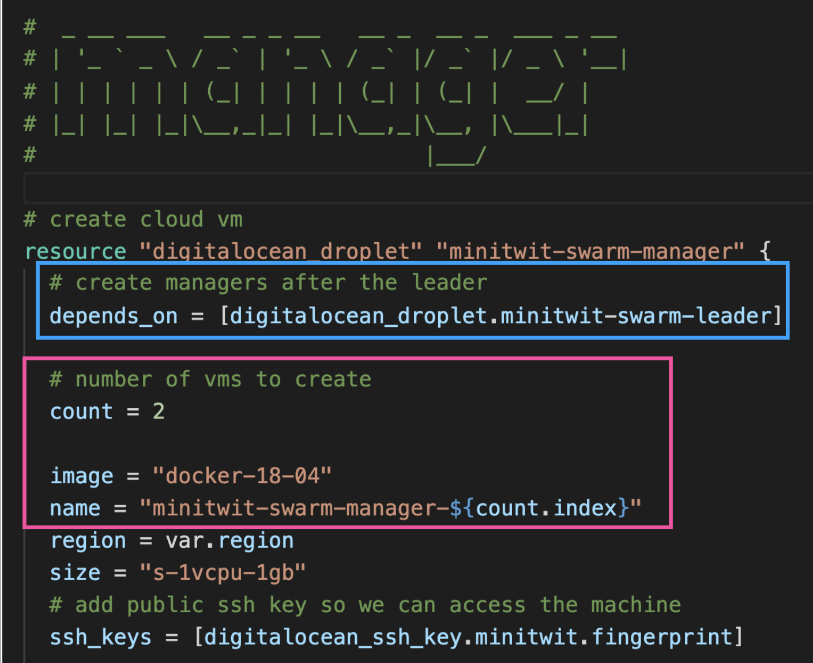

# Infrastructure as Code

## What is Infrastructure?
> “Dependencies” that need to be in place for your code to run
> * Machines
> * Networks
> * IP addresses
> * Operating systems
> * Libraries

> **Infrastructure as Code**
> Automating the creation of all dependencies with ‘code’
> * Repeatable & reliable builds
> * A way of documenting architecture

**Alternatives**: 
* **Computers** in your server room + manual installation
* **Clicking around** in the web UI of your cloud provider
  
### Infrastructure as Imperative Code
Imperative (e.g. Bash)
* step by step instructions of what to do
* if script fails in the middle have to restart everything from scratch…

### Infrastructure as Declarative Code
Declarative (e.g. Puppet)
* specify: desired state of the infra
* should continue where it’s left off if failure in the middle of the process.

### Comparing the Two Approaches
* Imperative Bash script
   * Create machine in GCP, and
   * Provision with docker-compose
* Declarative using Terraform 
   * Create multiple machines, and
   * Deploy MiniTwit swarm
  
## Terraform
> A **“Proxy”** for interacting with cloud providers

### Terraform: Creating the machine
DSL: HCL (Hashicorp Config Lang)
* declarative
* “stringly” typed
* greatly improved with IDE tools

### Variables 
#### Variables in Bash
> It is a pain to always remember to type the CLI arguments; might be nicer if we could just load these variables from a file

#### Variables in Terraform
* Envvars prefixed with TF_VAR_
* Automatically loads a number of variable definitions files if they are present:
  * Files named exactly terraform.tfvars
  * Any files with names ending in .auto.tfvars

### Waiting for the other machine to come up
#### Bash

#### Terraform
> Dependencies between resources result in a partial order of creation
> Using `depends_on`

### Little adjustments to the newly created machine
#### Bash
> this is cool! otherwise, six months later when we have to do this, we’ll have to google again how to do it

How come the script can ssh to the machine?
* I’ve already uploaded the public key in the GCP UI
* by clicking and typing…

#### Terraform
1. Create a `ssh_key.tf` and add the public keys from DigitalOcean.
   - We define `resource "type" "name/label"`

2. Call the resource by its `type`, `name`, and `variable`

> Note: the ssh keys must be already created

## Provisioners
> actions on the local machine or on a remote machine in order to prepare servers or other infrastructure objects for service

**file**: copying things from local to remote

**remote-exec**: running things remotely
* in this case, setting up the firewall
* and initializing the swarm

**local-exec**: run things locally
* we can use it to get data from the remote to a local folder
* also you can use heredoc in it!

### The `self` variable
> **Expressions in provisioner** blocks cannot **refer to their parent** resource by name.
>
> Instead, they can use the special `self` object.

### Example creating a manager
* Blue box - dependencies between resources
* Pink box - creating multiple resources

### Joining the swarm as a manager
> Referring to resources by `${TYPE.NAME.PROPERTY}`

### Terraform: Planning
> Terraform:
> * Tracks current state of the infra
> * **Plans** to bring the actual state of the infra in sync with the desired state
> * If you remove a device from the template, terraform will remove it

> **Planning**: So what if we want to manage the infra with the team?
> * Everybody needs to know the state of the plan and infra
> 
> You can save the state … 
> * in the cloud!
>* Backend configuration
>* By default state is saved locally

### Principles for IaC
* **Version** your infra code
* **Test** your infra code
* Write beautiful infra code
* No write huge plan files
* Comments explaining the “why”
