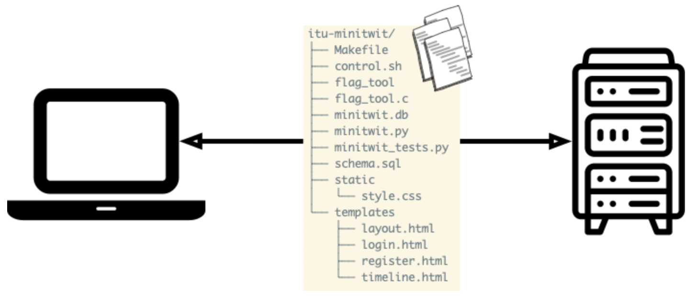
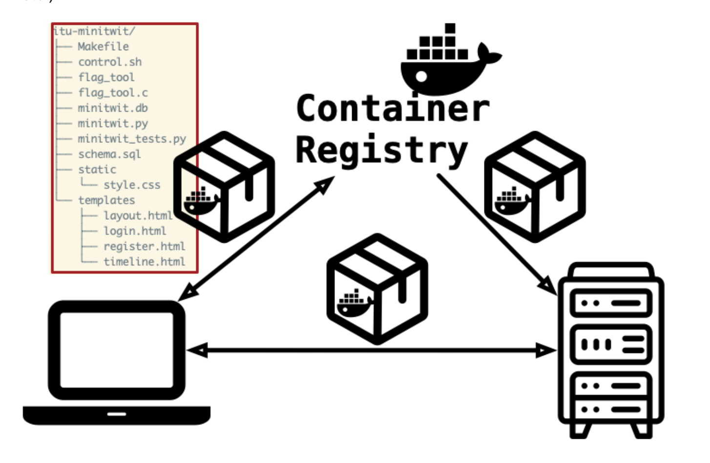
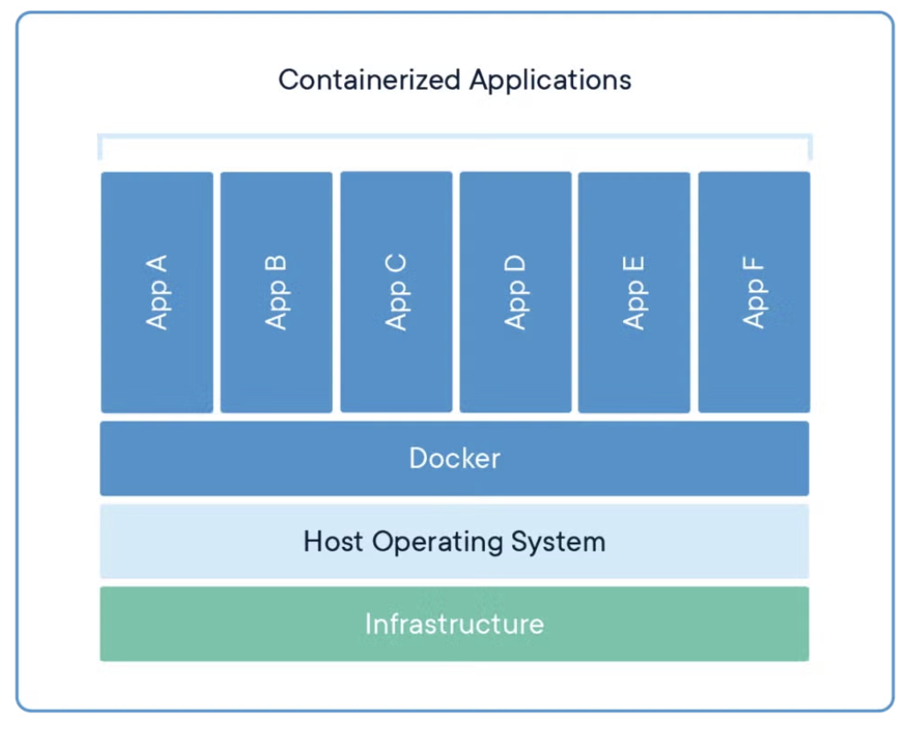
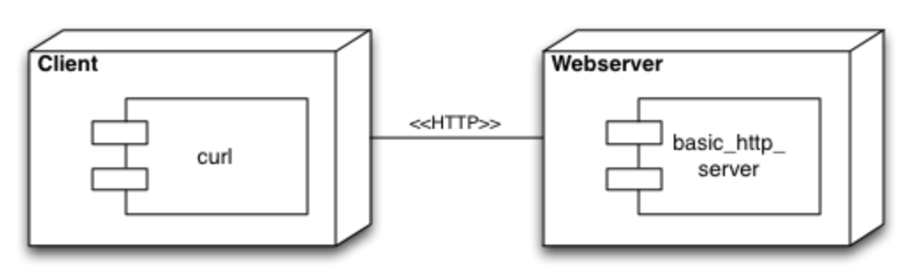

# How to distrubute software?

> Problems of this session:
>* How to move artifacts around?
>* How to package and distribute software?
>* How to refactor our projects?

## Software Artifacts
> **Software artifact**: A software artifact is a tangible machine-readable document created during software development. 
> Examples are:
> * requirement specification documents, 
> * design documents, 
> * source code,
> * and executables.

## `scp` files across machines
> We transfered the ITU-MiniTwit application from the server to your computers via scp.
> 

## Distribution via ZIP archives
Tag a version of your work in Git in two ways either with `tag` or using `zip`:

### A (tag):
```
cd itu-minitwit
git init
git add .
git commit -m"Code as resurected from server"
git remote add origin git@github.com:<your_gh_id>/itu-minitwit.git
git push -u origin master

git tag v0.1.0
git push origin v0.1.0
```
### B (zip):
```
wget https://github.com/<your_gh_id>/itu-minitwit/archive/refs/tags/v0.1.0.zip
unzip v0.1.0.zip
```

## Drawbacks of scp and distribution via ZIP archives?
>When doing that, do we transfer **our entire application**?
What were the steps that you executed during your refactoring homework?

**→ Missing Dependencies!**
We are missing quite some dependencies of our application when distributing it via scp directly or as a zipped archive.

### Problem of packaging and delivering contemporary software
> We are standing on the shoulders of giants. Seemingly simple applications are facilitated by a plethora of software that is needed to **build/compile** our application, to **run** it, to **test** it, etc.

Where do all these artifacts come from?
Who knows about all of them?


When developing how do you get the required dependencies?
In production, i.e., after deployment on a (potentially other) machine how do you get the required dependencies?


Who is responsible for setting up/configuring all the dependencies?
How often do you have to do this?

## Building Application Containers and share their images via a registry
> We could build application containers for the respective container engine. 
> **Docker containers can be instantiated from container images**, which are distributed via a central registry (DockerHub, GitHub Container Registry, etc.).




### A Containerized ITU-MiniTwit
> When containerizing an application, we **package all runtime dependencies** and we provide a setup that allows to **run an application** **without interfering** with its environment.

## Why use docker?
> It is the most porpular at the moment.

## What are these containers actually?

A **container image** is a *lightweight*, stand-alone, *executable package* of a piece of software that includes everything needed to run it: **code**, **runtime**, **system tools, system libraries, settings**.

> **Docker images**: They are like zip files, were you can zip a file, and share that zip file.

### Fixes the problem "it works on my machine"
> Containers isolate software from its surroundings, for example differences between development and staging environments and help **reduce conflicts** between teams **running different software** on the **same infrastructure**.


# Hands-on, Containers with Docker

## Running my first container!
```
$ docker run --rm hello-world

Unable to find image 'hello-world:latest' locally
latest: Pulling from library/hello-world
2db29710123e: Pull complete
Digest: sha256:aa0cc8055b82dc2509bed2e19b275c8f463506616377219d9642221ab53cf9fe
Status: Downloaded newer image for hello-world:latest

Hello from Docker!
This message shows that your installation appears to be working correctly.

To generate this message, Docker took the following steps:
 1. The Docker client contacted the Docker daemon.
 2. The Docker daemon pulled the "hello-world" image from the Docker Hub.
    (amd64)
 3. The Docker daemon created a new container from that image which runs the
    executable that produces the output you are currently reading.
 4. The Docker daemon streamed that output to the Docker client, which sent it
    to your terminal.

To try something more ambitious, you can run an Ubuntu container with:
 $ docker run -it ubuntu bash

Share images, automate workflows, and more with a free Docker ID:
 https://hub.docker.com/

For more examples and ideas, visit:
 https://docs.docker.com/get-started/
```
> The command above downloaded the image `hello-world` from the Docker Hub, instantiated a container from that image, ran the application within this container, and finally deleted the container (`--rm`).

## I need a Linux Shell quickly!
Check on Docker Hub, there are images for many different flavors of Linux and for many packaged applications.
```
$ docker run -it --rm alpine:latest sh
```
> What does that do? It tells Docker to run a container with the latest version of Alpine Linux (a small Linux Distribution), connect to the shell process `sh`, run it interactively (`-it`) so that you can type in commands and see the results, and finally, to remove the container (`--rm`) after the sh process finishes.

## Volumes
You can mount directories (volumes) from your host to a container using the `-v` flag.
```
$ docker run -it -v $(pwd):/host alpine:latest /bin/sh
```

### Breakdown:
* `docker run`: Start a new container.
* `-it`: Interactive terminal (so you can interact with the shell).
* `-v $(pwd):/host`: Mounts a volume.
  * `$(pwd)` is a shell command that outputs the current directory on your host machine.
  * `/host` is the mount point inside the container, i.e., where the host directory will appear.
* `alpine:latest`: The image to use — in this case, a small Linux distribution.
* `/bin/sh`: The shell that will run inside the container.

### What It Does:
* It runs an **Alpine Linux container**.

* It mounts your **current working directory** on your host machine into the container at the path `/host`.

* **Inside the container, you can access your host files under `/host`**.

### Usecase 
If your current directory contains a script or files:
```bash
$ ls
my_script.sh
```
Inside the container, if you go to /host, you'll see:
```sh
/ # cd /host
/host # ls
my_script.sh
```
You can now run or edit those files inside the container.

## Development with Containers
> Let's build a simple webserver in Go. To not mess with our development machine we could use a **Docker container, which has the Go compiler readily installed**.

Find the following `basic_http_server.go` file in the directory `./webserver`.

```go
package main

import (
	"fmt"
	"log"
	"net/http"
)

func helloWorldHandler(w http.ResponseWriter, r *http.Request) {
	fmt.Fprint(w, "Hej verden!\n")
}

func main() {
	port := 8080

	http.HandleFunc("/", helloWorldHandler)

	log.Printf("Server starting on port %v\n", port)
	log.Fatal(http.ListenAndServe(fmt.Sprintf(":%v", port), nil))
}
```
To containerize that program, or better to **run that program** in a container **without installing the compiler** to our machines directly, you could run:

```
$ docker run -it --rm \
    --name myserver \
    -v $(pwd)/webserver:/src \
    -p 8080:8080 \
    -w /src \
    golang:jessie go run basic_http_server.go
```

That command:
* **instantiates a container** of the image `golang:jessie` (an Ubuntu Linux with Go and some other necessary tools readily installed)
* **shares our local code** in `./webserver` with the container, where it is mounted to the `/src directory`
changes the current working directory in that container to `/src (-w)`
* **binds the port** `8080` from the container to the same port number on our host `(-p 8080:8080)`
  * The port number in front of `:` specifies the port on the host, which gets bound to the port of the container (number after `:`).
* **builds and runs** the program within the container go run `basic_http_server.go`

Now, you can access the webserver on your host machine on http://127.0.0.1:8080. 

# Dockerfiles
>**Dockerfiles** describe a precise *configuration* of a container. These configurations are stored as slices on top of each other.

Let's have a look on an example application. It will consist of a webserver and of a simple client. The webserver serves a static HTTP message on port 8080 and the client is just an HTTP GET query receiving this message via curl. The following UML deployment diagram illustrates this setup:


Let's have a look at the Dockerfile that specifies our webserver.
```Dockerfile
FROM golang:jessie

# Install any needed dependencies...
# RUN go get ...

# Set the working directory
WORKDIR /src

# Copy the server code into the container
COPY basic_http_server.go /src/basic_http_server.go

# Make port 8080 available to the host
EXPOSE 8080

# Build and run the server when the container is started
RUN go build /src/basic_http_server.go
ENTRYPOINT ./basic_http_server
```

As you can see from the above configuration, the Dockerfile is similar to everything described in our earlier CLI command:
```
$ docker run -it --rm \
    -v $(pwd)/webserver:/src \
    -p 8080:8080 \
    -w /src \
    golang:jessie bash -c "go build basic_http_server.go; ./basic_http_server"
```

## Keywords in Dockerfiles are
| Keyword      | Purpose                                                                 |
| ------------ | ----------------------------------------------------------------------- |
| `FROM`       | Sets the base image for the Docker image.                               |
| `MAINTAINER` | (Deprecated) Specifies the image author. Use `LABEL` instead.           |
| `LABEL`      | Adds metadata (e.g., version, maintainer info) to the image.            |
| `RUN`        | Executes a command during image build (e.g., installing packages).      |
| `CMD`        | Provides default command/arguments when the container starts.           |
| `EXPOSE`     | Documents which ports the container will listen on at runtime.          |
| `ENV`        | Sets environment variables in the image.                                |
| `ADD`        | Copies files into the image (supports remote URLs & auto-unpacking).    |
| `COPY`       | Copies files/directories into the image (simpler and preferred to ADD). |
| `ENTRYPOINT` | Configures a container to run as an executable.                         |
| `VOLUME`     | Declares mount points for external volumes.                             |
| `USER`       | Sets the user to run subsequent commands.                               |
| `WORKDIR`    | Sets the working directory for `RUN`, `CMD`, `ENTRYPOINT`, etc.         |
| `ONBUILD`    | Sets instructions to run when the image is used as a base for others.   |

## Building the Webserver Image
>To use containers with our webserver, we first have to build a corresponding image. If you have the above `Dockerfile` stored in a directory `webserver` you can do so as in the following:
```
$ cd webserver
$ docker build -t <your_id>/myserver .
```
The `-t` flag tells Docker to build an image with the given name `<your_id>/myserver`. The `.` says: *build the image with the `Dockerfile` in this directory*.

After building your image, you can verify that it is now accessible on your machine.
```
$ docker images
REPOSITORY           TAG                 IMAGE ID            CREATED             SIZE
your_id/myserver     latest              a5fe35de13d2        8 seconds ago       704MB
appropriate/curl     latest              f73fee23ac74        3 weeks ago         5.35MB
golang               jessie              6ce094895555        4 weeks ago         699MB
```
### Running the Webserver as Container
```
$ docker run --name webserver -p 8080:8080 <your_id>/myserver
```
### Stopping and Restarting the Webserver
```
$ docker stop webserver
```
```
$ docker start webserver
```
### Building the Client Image
```Dockerfile
FROM appropriate/curl:latest

ENTRYPOINT curl -s http://webserver:8080
```
and run
```
$ cd client
$ docker build -t <your_id>/myclient .
```

```
$ docker images
REPOSITORY              TAG                 IMAGE ID            CREATED             SIZE
<your_id>/myclient      latest              3714e67fa75a        4 seconds ago       5.35MB
<your_id>/webserver     latest              a5fe35de13d2        About an hour ago   704MB
appropriate/curl        latest              f73fee23ac74        3 weeks ago         5.35MB
golang                  jessie              6ce094895555        4 weeks ago         699MB
```

### Running the Webserver as Container
```
$ docker run --name client --link webserver <your_id>/myclient
Hej verden!
```
> We just built a small application consisting of a webserver and a client, both deployed in their own containers, and we did not have to install any dependencies on our host machine manually.

However, starting the server and the client by hand with the `docker run ...` command is quite **tedious**. Furthermore, it is not really in line with the **infrastructure as code** paradigm. Therefore, we can automate even further using `docker compose`.

## `docker compose` - Starting Applications Automatically
> To describe an application of interconnected services, we can use a `docker-compose.yml` file. **It specifies the components of an application, how they shall be started, and how they interact**.
```yml
version: '3'
services:
  webserver:
    image: your_id/myserver
    ports:
      - "8080:8080"
    healthcheck:
      test: ["CMD", "curl", "-f", "http://localhost:8080"]
      interval: 30s
      timeout: 10s
      retries: 3

  clidownload:
    image: appropriate/curl
    depends_on:
      webserver:
        condition: service_healthy
    entrypoint: sh -c "curl -s http://webserver:8080"
```
(Note, replace `your_id` with your name ID before running docker compose.)

### Docker compose up
```
$ docker compose up
[+] Running 3/0
 ✔ Network session_02_default          Created                                                                                                                                           0.0s
 ✔ Container session_02-webserver-1    Created                                                                                                                                           0.0s
 ✔ Container session_02-clidownload-1  Created                                                                                                                                           0.0s
Attaching to session_02-clidownload-1, session_02-webserver-1
session_02-webserver-1    | 2025/02/10 09:16:56 Server starting on port 8080
session_02-clidownload-1  | Hej verden!
session_02-clidownload-1 exited with code 0

^CGracefully stopping... (press Ctrl+C again to force)
Aborting on container exit...
[+] Stopping 2/2
 ✔ Container session_02-clidownload-1  Stopped                                                                                                                                           0.0s
 ✔ Container session_02-webserver-1    Stopped                                                                                                                                          10.2s
canceled
```

Finally, to clean up:
```
$ docker compose rm -v
```

