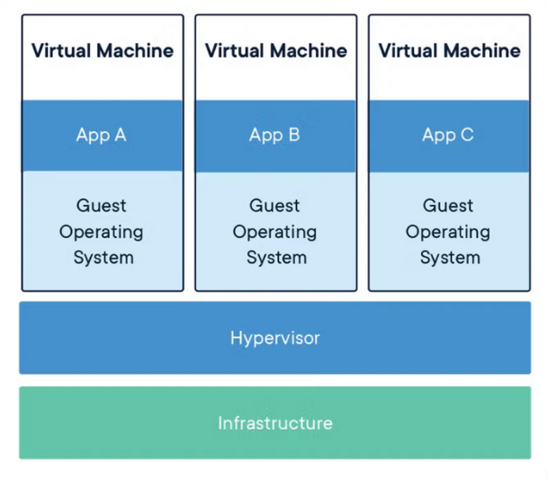
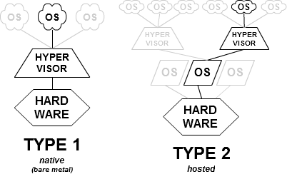
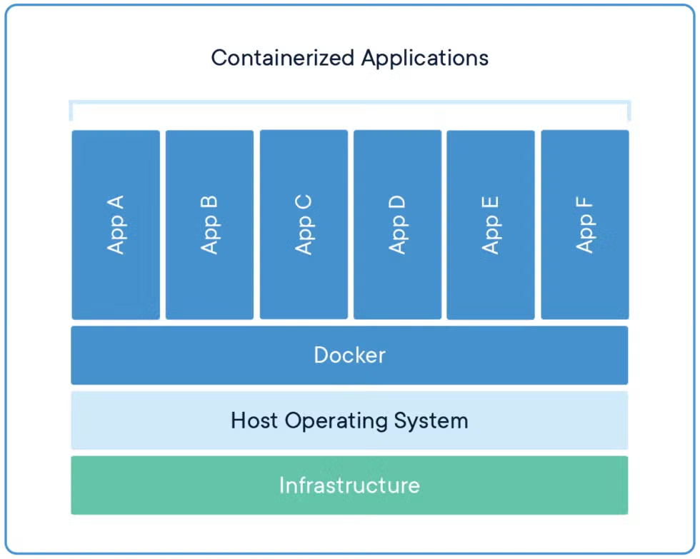

# Lecture 3

### Where do servers come from?

We will look into varios ways to provision machines locally and remotelly (cloud):
1. Provision of **physical servers**
2. **Manual** provision of **local virtual machines** with **VirtualBox**
2. **Automatic** provision of **local virtual machines** with **VirtualBox and Vagrant**
3. **Automatic** provision of **local clusters** of virtual machines with **VirtualBox and Vagrant**
4. **Manual** provision of **remote virtual machines** at **DigitalOcean**
5. **Automatic** provision of **remote virtual machines** at **DigitalOcean** via a **web-API**
6. **Automatic** provision of **remote clusters** of virtual machines at **DigitalOcean via Vagrant**

### Provision of physical servers

We can provision physical machines and put them in a suitable place.

**Advantages**:
* Configure the hardware yourself
**Disadvantages**:
* Harder to scale, have to handle it yourself, expensive

We have to setup, configure, and maintain these machines then. Both **hardware** and **software**.
* THis activity takes some time + hard to *script*.

### Virtual Machines and Hypervisors

**Virtual Machine**:
> A virtual machine (VM) runs a full-blown “guest” operating system with virtual access to host resources through a hypervisor.



**Hyporvisor**:
> A hypervisor or virtual machine monitor (VMM) is computer software, firmware or hardware that creates and runs virtual machines. A **computer** on which a **hypervisor** runs one or more virtual machines is called a **host machine**, and each **virtual machine** is called a **guest machine**


There two different types of hypervisors: *native* (bare metal) and *hosted*.



Virtual Machine ≠ VirtualBox

- There exist many different hypervisors, i.e., tools for running VMs

### Manual provision of local virtual machines with VIrtual Box

Many of you that did not install a Linux directly on your computer but in a virtual machine (VM) struggled through this, either with VirtualBox, VMWare, Parallels, UTM, etc.

Depending on how you did there are lot of **manual steps**.
* Configure RAM, harddisk, start VM, configure the OS image.

### Automatic provision of local virtual machines with VirtualBox and Vagrant

DevOps relies heavily on automatization, we want to script the creation of virtual machines. 

VirtualBox comes with a CLI command *VBoxManage*, which ca be used to create/interact with virtual machines.

This can done through the following bash script:

```bash

#!/usr/bin/env bash

MACHINENAME=$1

# Download debian.iso
if [ ! -f ./debian.iso ]; then
    wget https://cdimage.debian.org/debian-cd/current/amd64/iso-cd/debian-11.2.0-amd64-netinst.iso -O debian.iso
fi

#Create VM
VBoxManage createvm --name "$MACHINENAME" --ostype "Debian_64" --register --basefolder "$(pwd)"
#Set memory and network
VBoxManage modifyvm "$MACHINENAME" --ioapic on
VBoxManage modifyvm "$MACHINENAME" --memory 1024 --vram 128
VBoxManage modifyvm "$MACHINENAME" --nic1 nat
#Create Disk and connect Debian Iso
VBoxManage createhd --filename "$(pwd)"/"$MACHINENAME"/"$MACHINENAME_DISK".vdi --size 80000 --format VDI
VBoxManage storagectl "$MACHINENAME" --name "SATA Controller" --add sata --controller IntelAhci
VBoxManage storageattach "$MACHINENAME" --storagectl "SATA Controller" --port 0 --device 0 --type hdd --medium  "$(pwd)"/"$MACHINENAME"/"$MACHINENAME_DISK".vdi
VBoxManage storagectl "$MACHINENAME" --name "IDE Controller" --add ide --controller PIIX4
VBoxManage storageattach "$MACHINENAME" --storagectl "IDE Controller" --port 1 --device 0 --type dvddrive --medium "$(pwd)"/debian.iso
VBoxManage modifyvm "$MACHINENAME" --boot1 dvd --boot2 disk --boot3 none --boot4 none

#Enable RDP
VBoxManage modifyvm "$MACHINENAME" --vrde on
VBoxManage modifyvm "$MACHINENAME" --vrdemulticon on --vrdeport 10001

#Start the VM
VBoxHeadless --startvm "$MACHINENAME"

```

---

### Creating a Ubuntu VM locally with Viagrant and VirtualBox

```bash

vagrant init bento/ubuntu-22.04
vagrant up

```

This creates the following configuration file

```ruby

# -*- mode: ruby -*-
# vi: set ft=ruby :
Vagrant.configure("2") do |config|
  config.vm.box = "bento/ubuntu-22.04"
end

```

You can also have multiple VMs with a single Vagrantfile, called a *multi-machine* setup. 


**What kind of code do we see here?** A small Ruby-based DSL used by Vagrant
**What does it describe?** Which *box* (base image) to use
**What happens when you run it?** Vagrant reads this file to know exactly how to create and configure the VM

---

The following `Vagrantfile` illustration a description of a single virtual machine that:
* has an Ubuntu OS of the specified version
* maps a port to the host machine similar to the examples seen with Docker last week
* mounts a directory into the VM (one-directional sync)
* runs in VIrtualBox
* displays its GUI
* proseess one GB or RAM
* and whose OS package database gets updates on VM creation.

```ruby

# -*- mode: ruby -*-
# vi: set ft=ruby :

Vagrant.configure("2") do |config|
  config.vm.box = "bento/ubuntu-22.04"
  config.vm.network "forwarded_port", guest: 80, host: 8080
  config.vm.synced_folder "./", "/vagrant_data"

  config.vm.provider "virtualbox" do |vb|
    vb.gui = true
    vb.memory = "1024"
  end

  config.vm.provision "shell", inline: <<-SHELL
    apt-get update
  SHELL
end

```

### Automatic provision of local clusters of virtual machines with VirtualBox and Vagrant

You can manage multiple VMs with single Vagrantfile, a so-called multi-machine setup.

```ruby

# -*- mode: ruby -*-
# vi: set ft=ruby :

unless File.exist? "/etc/vbox/networks.conf"
   # See https://www.virtualbox.org/manual/ch06.html#network_hostonly
  puts "Adding network configuration for VirtualBox."
  puts "You will need to enter your root password..."
  system("sudo bash vbox-network.sh")
end

Vagrant.configure("2") do |config|
  config.vm.box = "generic/ubuntu1804"

  config.vm.network "private_network", type: "dhcp"

  # For two way synchronization you might want to try `type: "virtualbox"`
  config.vm.synced_folder ".", "/vagrant", type: "rsync"

  config.vm.define "dbserver", primary: true do |server|
    server.vm.network "private_network", ip: "192.168.20.2"
    server.vm.provider "virtualbox" do |vb|
      vb.memory = "1024"
    end
    server.vm.hostname = "dbserver"
    server.vm.provision "shell", privileged: false, inline: <<-SHELL
        echo "Installing MongoDB"
        wget -qO - https://www.mongodb.org/static/pgp/server-4.2.asc | sudo apt-key add -
        echo "deb [ arch=amd64 ] https://repo.mongodb.org/apt/ubuntu bionic/mongodb-org/4.2 multiverse" | sudo tee /etc/apt/sources.list.d/mongodb-org-4.2.list
        sudo apt-get update
        sudo apt-get install -y mongodb-org
        sudo mkdir -p /data/db
        sudo sed -i '/  bindIp:/ s/127.0.0.1/0.0.0.0/' /etc/mongod.conf
        sudo systemctl start mongod
        mongorestore --gzip /vagrant/dump
    SHELL
  end

  config.vm.define "webserver", primary: true do |server|
    server.vm.network "private_network", ip: "192.168.20.3"
    # server.vm.network "forwarded_port", guest: 5000, host: 5000
    server.vm.provider "virtualbox" do |vb|
      vb.memory = "1024"
    end
    server.vm.hostname = "webserver"
    server.vm.provision "shell", privileged: false, inline: <<-SHELL
        export DB_IP="192.168.20.2"
        cp -r /vagrant/* $HOME
        sudo apt-get install -y python3 python3-pip
        python3 -m pip install -r requirements.txt
        python3 -m pip install Flask-PyMongo
        nohup python3 minitwit.py > out.log 2>&1 &
        IP=$(ifconfig eth2 | awk -F ' *|:' '/inet /{print $3}')
        echo "================================================================="
        echo "=                            DONE                               ="
        echo "================================================================="
        echo "Navigate in your browser to: http://$IP:5000"
    SHELL
  end

  config.vm.provision "shell", privileged: false, inline: <<-SHELL
    sudo apt-get update
  SHELL
end

```


This is done through:
```ruby

  config.vm.define "dbserver", primary: true do |server|
    …
  end

  config.vm.define "webserver", primary: true do |server|
    …
  end


```

### Manual provision of remote virtual machines at DIgitalOcean

They call these remote virtual machines 'droplets'. Normally, they are called virtual private servers (VPS).

### Automatic provision of remote virtual machines at DIgitalOcrean via a web-AÅI

Since we are programmers and since DevOps relies heavily on automation, we want to script the creation of virtual machines.

DigitalOcrean provides a web-API, which can be used to create and interact with virtua machines.

Example shows how to query your remote VMs:
```bash
curl -X GET "https://api.digitalocean.com/v2/droplets" -H "Authorization: Bearer $DIGITAL_OCEAN_TOKEN"
```

You need to have an *enviromental variable* configured that holds your API token. 

For a single session, simply run `export DIGITAL_OCEAN_TOKEN="<your_token>"`. If you want to make it permanent add them to your `$HOME/.bashrc`.

Creating one or more remote virtual machines:
```bash 

curl -X POST "https://api.digitalocean.com/v2/droplets" \
	-d'{"names":["myFstVm"],"region":"fra1","size":"s-1vcpu-1gb","image":"ubuntu-22-04-x64"}' \
	-H "Authorization: Bearer $DIGITAL_OCEAN_TOKEN" \
	-H "Content-Type: application/json"

```

There is also an official Ruby and Python API wrapper:
```python 
import digitalocean
from os import getenv


manager = digitalocean.Manager(token=getenv("DIGITAL_OCEAN_TOKEN"))
my_droplets = manager.get_all_droplets()
droplet = [d for d in my_droplets if d.name == "myFstVm"][0]
droplet.destroy()
```

### Automatic provision of remeote clusters of virtual machines at DigitalOcean via Vagrant

...

---

```ruby

# -*- mode: ruby -*-
# vi: set ft=ruby :

$ip_file = "db_ip.txt"

Vagrant.configure("2") do |config|
  config.vm.box = 'digital_ocean'
  config.vm.box_url = "https://github.com/devopsgroup-io/vagrant-digitalocean/raw/master/box/digital_ocean.box"
  config.ssh.private_key_path = '~/.ssh/id_rsa'
  config.vm.synced_folder ".", "/vagrant", type: "rsync"

  config.vm.define "dbserver", primary: true do |server|
    server.vm.provider :digital_ocean do |provider|
      provider.ssh_key_name = ENV["SSH_KEY_NAME"]
      provider.token = ENV["DIGITAL_OCEAN_TOKEN"]
      provider.image = 'ubuntu-22-04-x64'
      provider.region = 'fra1'
      provider.size = 's-1vcpu-1gb'
      provider.privatenetworking = true
    end

    server.vm.hostname = "dbserver"

    server.trigger.after :up do |trigger|
      trigger.info =  "Writing dbserver's IP to file..."
      trigger.ruby do |env,machine|
        remote_ip = machine.instance_variable_get(:@communicator).instance_variable_get(:@connection_ssh_info)[:host]
        File.write($ip_file, remote_ip)
      end
    end

    server.vm.provision "shell", inline: <<-SHELL
      echo "Installing MongoDB"


      sudo apt-get install gnupg curl

      curl -fsSL https://www.mongodb.org/static/pgp/server-7.0.asc | \
          sudo gpg -o /usr/share/keyrings/mongodb-server-7.0.gpg \
          --dearmor
      echo "deb [ arch=amd64,arm64 signed-by=/usr/share/keyrings/mongodb-server-7.0.gpg ] https://repo.mongodb.org/apt/ubuntu jammy/mongodb-org/7.0 multiverse" | \
          sudo tee /etc/apt/sources.list.d/mongodb-org-7.0.list

      sudo apt-get update
      sudo apt-get install -y mongodb-org

      sudo mkdir -p /data/db
      sudo sed -i '/  bindIp:/ s/127.0.0.1/0.0.0.0/' /etc/mongod.conf

      sudo systemctl start mongod
      mongorestore --gzip /vagrant/dump
    SHELL
  end

  config.vm.define "webserver", primary: false do |server|

    server.vm.provider :digital_ocean do |provider|
      provider.ssh_key_name = ENV["SSH_KEY_NAME"]
      provider.token = ENV["DIGITAL_OCEAN_TOKEN"]
      provider.image = 'ubuntu-22-04-x64'
      provider.region = 'fra1'
      provider.size = 's-1vcpu-1gb'
      provider.privatenetworking = true
    end

    server.vm.hostname = "webserver"

    server.trigger.before :up do |trigger|
      trigger.info =  "Waiting to create server until dbserver's IP is available."
      trigger.ruby do |env,machine|
        ip_file = "db_ip.txt"
        while !File.file?($ip_file) do
          sleep(1)
        end
        db_ip = File.read($ip_file).strip()
        puts "Now, I have it..."
        puts db_ip
      end
    end

    server.trigger.after :provision do |trigger|
      trigger.ruby do |env,machine|
        File.delete($ip_file) if File.exists? $ip_file
      end
    end

    server.vm.provision "shell", inline: <<-SHELL
      export DB_IP=`cat /vagrant/db_ip.txt`
      echo $DB_IP

      echo "Installing Anaconda..."
      sudo wget https://repo.anaconda.com/archive/Anaconda3-2019.07-Linux-x86_64.sh -O $HOME/Anaconda3-2019.07-Linux-x86_64.sh

      bash ~/Anaconda3-2019.07-Linux-x86_64.sh -b

      echo ". $HOME/.bashrc" >> $HOME/.bash_profile
      echo "export PATH=$HOME/anaconda3/bin:$PATH" >> $HOME/.bash_profile
      export PATH="$HOME/anaconda3/bin:$PATH"
      rm Anaconda3-2019.07-Linux-x86_64.sh
      source $HOME/.bash_profile

      echo $DB_IP

      pip install Flask-PyMongo

      cp -r /vagrant/* $HOME
      nohup python minitwit.py > out.log &
      echo "================================================================="
      echo "=                            DONE                               ="
      echo "================================================================="
      echo "Navigate in your browser to:"
      THIS_IP=`hostname -I | cut -d" " -f1`
      echo "http://${THIS_IP}:5000"
    SHELL
  end

  config.vm.provision "shell", privileged: false, inline: <<-SHELL
    sudo apt-get update
  SHELL
end

```

Can you spot an aspect of the remote setup creation that poses a risk on maintainability/reproducibility?
* non-idempotency


### Virtual machines compared to containers
A container image is a lightweight, stand-alone, executable package of a piece of software that includes everything needed to run it: code, runtime, system tools, system libraries, settings.

**COntainers isolate software from its surroundings**



#### Why should we consider VMs?
1. Handling VMs is a skill.
2. Practice it now while you are in a safe environment. Especially, when working as consultants you have to constantly adapt to new environments.
3. Very quickly you can run whichever operating system (Windows, MacOS, Unixes, etc.) that allow you to get your job done.

#### Vagrant? WHat is it?
Vagrant is a tool for building and managing virtual machine environments [...] Vagrant lowers development environment setup time, increases production parity, and makes the "works on my machine" excuse a relic of the past.

