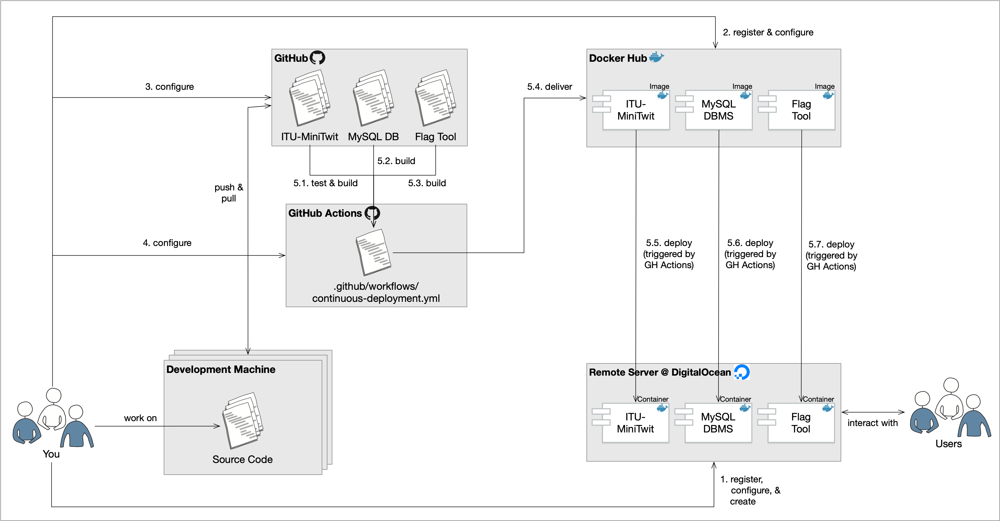

# Continuous Integration (CI), Continuous Delivery (CD), and Continuous Deployment

## How do big companies build and deploy?
### GitHub
> Any employee can deploy to production from Campfire with a single message. When someone pushes to master, after watching the tests pass, they're encouraged to immediately deploy to production. This way, everyone is responsible for their own code being production-ready, and people don't have to worry about pushing someone else's code and breaking production.
> 
> Recently, this process got even better. Now, after someone pushes to master and the tests pass, master is deployed to production automatically. We have ways of preventing this from happening (an employee can temporarily lock deployment while they're collecting data, for example), but by default, production is always up-to-date with master.
> 
> This is a fantastic way of doing things. Deploying constantly means we completely **avoid giant scary "deployment days"**, and our fast and painless deployment process means we can quickly fix problems as they're discovered.

## Okay, but how can we do this?
There are many CI/CD solutions. In our following example we will have a closer look to GitHub Actions.

However, you might consider an alternative technology.
The following list should link you to some commonly used solutions.

Self-hosted most often in **bigger organizations** and **companies**:
* Jenkins
* Bamboo
* TeamCity
* Concourse
* Azure DevOps Server
* Drone


CI/CD as a service:
* Travis CI
* CircleCI
* Github Actions
* GitLab CI

## CI/CD System
> A **CI (continuous integration)** system clones the codebase for the software under consideration from a source control system such as GitHub, builds the software into an artifact that can be a binary, a tar archive, or a Docker image, and, very importantly, also runs unit and/or integration tests for the software.

> A **CD (continuous deployment)** system deploys the artifacts built by the CI system to a target environment. This deployment can be automated for non-production environments, but usually includes a manual approval step for production.

> A more advanced type of such systems is a **continuous delivery**, platform which automates the deployment step to production and is capable of rolling back the deployment based on metrics obtained from monitoring and logging platforms.

## A CI/CD Example Setup
This is a guide on how to setup an example continuous integration (CI) chain using the following technologies and tools:

* the distributed version control system (VCS) Git (https://git-scm.com) and GitHub (https://github.com) as host,
* the build server service Github Actions (https://github.com/features/actions),
* Docker containers (https://www.docker.com) and DockerHub (https://hub.docker.com) as a public artifact registry,
* Vagrant (https://www.vagrantup.com) to setup and manage virtual remote machines,
* and the cloud server provider Digital Ocean (https://www.digitalocean.com).

## Scenario


* Step 1 - Setup Remote VM and Keys
  * Digital Ocean
* Step 2 - Setup Artifacts Store
  * Docker Hub
* Step 3 - Configuring Secrets on GitHub Repository
* Step 4 - Creating and Configuring a Workflow on GitHub Actions
* Step 5.1-5.3 - Building & Testing the Software
* Step 5.4 - Delivering the Software
* Step 5.5-5.7 - Deploying the Software

### Example of Github action workflow:
```yml
---
name: Continuous Deployment

on:
  push:
    # Run workflow every time something is pushed to the main branch
    branches:
      - main
      - master
  # allow manual triggers for now too
  workflow_dispatch:
    manual: true

jobs:
  build:
    runs-on: ubuntu-latest

    steps:
      - name: Checkout
        uses: actions/checkout@v2

      - name: Login to Docker Hub
        uses: docker/login-action@v1
        with:
          username: ${{ secrets.DOCKER_USERNAME }}
          password: ${{ secrets.DOCKER_PASSWORD }}

      - name: Set up Docker Buildx
        uses: docker/setup-buildx-action@v1

      - name: Build and push minitwitimage
        uses: docker/build-push-action@v2
        with:
          context: .
          file: ./Dockerfile-minitwit
          push: true
          tags: ${{ secrets.DOCKER_USERNAME }}/minitwitimage:latest
          cache-from: type=registry,ref=${{ secrets.DOCKER_USERNAME }}/minitwitimage:webbuildcache
          cache-to: type=registry,ref=${{ secrets.DOCKER_USERNAME }}/minitwitimage:webbuildcache,mode=max

      - name: Build and push mysqlimage
        uses: docker/build-push-action@v2
        with:
          context: .
          file: ./Dockerfile-mysql
          push: true
          tags: ${{ secrets.DOCKER_USERNAME }}/mysqlimage:latest
          cache-from: type=registry,ref=${{ secrets.DOCKER_USERNAME }}/mysqlimage:mysqlbuildcache
          cache-to: type=registry,ref=${{ secrets.DOCKER_USERNAME }}/mysqlimage:mysqlbuildcache,mode=max

      - name: Build and push flagtoolimage
        uses: docker/build-push-action@v2
        with:
          context: .
          file: ./Dockerfile-flagtool
          push: true
          tags: ${{ secrets.DOCKER_USERNAME }}/flagtoolimage:latest
          cache-from: type=registry,ref=${{ secrets.DOCKER_USERNAME }}/flagtoolimage:flagtoolbuildcache
          cache-to: type=registry,ref=${{ secrets.DOCKER_USERNAME }}/flagtoolimage:flagtoolbuildcache,mode=max

      - name: Test minitwit
        run: |
          docker build -t $DOCKER_USERNAME/minitwittestimage -f Dockerfile-minitwit-tests .
          yes 2>/dev/null | docker-compose up -d
          docker run --rm --network=itu-minitwit-network $DOCKER_USERNAME/minitwittestimage
        env:
          DOCKER_USERNAME: ${{ secrets.DOCKER_USERNAME }}

      - name: Configure SSH
        run: |
          mkdir -p ~/.ssh/
          echo "$SSH_KEY" > ~/.ssh/minitwit.key
          chmod 600 ~/.ssh/minitwit.key
        env:
          SSH_KEY: ${{ secrets.SSH_KEY }}

      - name: Deploy to server
        # Configure the ~./bash_profile and deploy.sh file on the Vagrantfile
        run: >
          ssh $SSH_USER@$SSH_HOST
          -i ~/.ssh/minitwit.key -o StrictHostKeyChecking=no
          '/minitwit/deploy.sh'
        env:
          SSH_USER: ${{ secrets.SSH_USER }}
          SSH_HOST: ${{ secrets.SSH_HOST }}
```