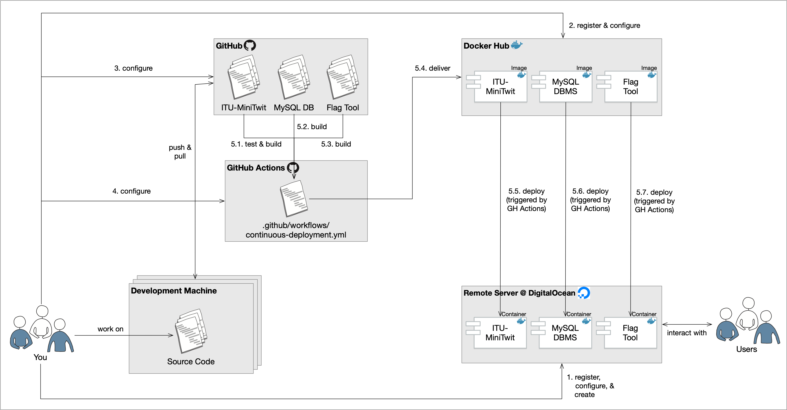

# Week 5

### Congiration Management

We looked into various ways of creating virtual machines (remote servers).
* However, we did not explicitly look at what happens after a VM is created and before it can be used by our application.


* How did we get software on our servers?

---

Remember our use of **Vagrantfiles**. THese describe characteristics of provisioned virtual machines.

```ruby

Vagrant.configure("2") do |config|
  config.vm.box = 'digital_ocean'
  config.vm.box_url = "https://github.com/devopsgroup-io/vagrant-digitalocean/raw/master/box/digital_ocean.box"
  config.ssh.private_key_path = '~/.ssh/id_rsa'
  config.vm.synced_folder ".", "/vagrant", type: "rsync"

  config.vm.define "dbserver", primary: true do |server|
    server.vm.provider :digital_ocean do |provider|
      provider.ssh_key_name = ENV["SSH_KEY_NAME"]
      provider.token = ENV["DIGITAL_OCEAN_TOKEN"]
      provider.image = 'ubuntu-22-04-x64'
      provider.region = 'fra1'
      provider.size = 's-1vcpu-1gb'
      provider.privatenetworking = true
    end
...
    server.vm.provision "shell", inline: <<-SHELL
      echo "Installing MongoDB"
      wget -qO - https://www.mongodb.org/static/pgp/server-4.2.asc | sudo apt-key add -
      echo "deb [ arch=amd64 ] https://repo.mongodb.org/apt/ubuntu bionic/mongodb-org/4.2 multiverse" | sudo tee /etc/apt/sources.list.d/mongodb-org-4.2.list
      sudo apt-get update
      sudo apt-get install -y mongodb-org
      sudo mkdir -p /data/db
      sudo sed -i '/  bindIp:/ s/127.0.0.1/0.0.0.0/' /etc/mongod.conf
      sudo systemctl start mongod
      mongorestore --gzip /vagrant/dump
    SHELL
  end

  config.vm.define "webserver", primary: false do |server|

    server.vm.provider :digital_ocean do |provider|
      provider.ssh_key_name = ENV["SSH_KEY_NAME"]
      provider.token = ENV["DIGITAL_OCEAN_TOKEN"]
      provider.image = 'ubuntu-18-04-x64'
      provider.region = 'fra1'
      provider.size = 's-1vcpu-1gb'
      provider.privatenetworking = true
    end
...
    server.vm.provision "shell", inline: <<-SHELL
        export DB_IP="192.168.20.2"
        cp -r /vagrant/* $HOME
        sudo apt-get install -y python3 python3-pip
        python3 -m pip install -r requirements.txt
        python3 -m pip install Flask-PyMongo
        nohup python3 minitwit.py > out.log 2>&1 &
        IP=$(ifconfig eth2 | awk -F ' *|:' '/inet /{print $3}')
        echo "================================================================="
        echo "=                            DONE                               ="
        echo "================================================================="
        echo "Navigate in your browser to: http://$IP:5000"
    SHELL
  end
  config.vm.provision "shell", privileged: false, inline: <<-SHELL
    sudo apt-get update
  SHELL
end

```

Provisioners in Vagrant allow you to automatically install software, alter configurations, and more on the machine as part of the vagrant up process.
* This is useful as *boxes* are not typically built for our specific use case. 
* We want to automate the process such that it is *repeatable*. More importantly that it *requires no human interaction*.

*What is the issue when this script is executed multiple times*
* The script isn't idempotent, i.e. repeated executions will error out or produce redundant data.
```bash

echo "Installing MongoDB"
wget -qO - https://www.mongodb.org/static/pgp/server-4.2.asc | sudo apt-key add -
echo "deb [ arch=amd64 ] https://repo.mongodb.org/apt/ubuntu bionic/mongodb-org/4.2 multiverse" | sudo tee /etc/apt/sources.list.d/mongodb-org-4.2.list
sudo apt-get update
# sudo apt-get install -y mongodb-org
sudo mkdir -p /data/db
sudo sed -i '/  bindIp:/ s/127.0.0.1/0.0.0.0/' /etc/mongod.conf
sudo systemctl start mongod
mongorestore --gzip /vagrant/dump

```

The key features is idempotency, i.e., the state of the provisioned machine is always the same after running the respective provisioner script. No matter if it was executed one or multiple times (ansible).

#### Examples of Idempotent Shell SCripts

**Non-Idenpotent**:
```bash

$ mkdir ./config_dir
$ mkdir ./config_dir
mkdir: ./config_dir: File exists

==============


sqlite3 /tmp/minitwit.db < schema.sql
sqlite3 /tmp/minitwit.db < dump.sql


==============


```

**Idempotent**:
```bash

$ mkdir -p ./config_dir
$ echo $?
0

==============


if [ -f "/tmp/minitwit.db" ]; then
    echo "Database already exists."
    exit 1
fi

sqlite3 /tmp/minitwit.db < schema.sql
sqlite3 /tmp/minitwit.db < dump.sql


===============

```


### Note on emphemeral containers

Ephemeral means that the container can be stopped and destroyed, then rebuilt and replaced with an absolute minimum set up and configuration.

That is, make sure that the data you store is not stored within the container! Instead write it to an outside volume that is mounted by each application container. Otherwise you loose your data!


### What did we do so far?



**Why did we do it**?

* Save time setting up "stuff" the same way → save money.
* Reduce downtime & increase stability, reduced human errors
* Deploy fast deploy often → easy to revert back
* Improved productivity and efficiency
* More reliable releases

### WHat is DevOps?

Think of developers being able to do some of the tasks that are normally assigned to system administrators, such as creating new servers, making updates to production sites, deploying apps. Also think of sysadmins sharing some duties with developers, and being able to manage multiple servers at once.

**Problem**:
No standard definition exists for DevOps

According to some literature.

*What is DevOps? A Systematic Mapping Study on Definitions and Practices*:
> DevOps is a development methodology aimed at bridging the gap between Development (Dev) and Operations, emphasizing communication and collaboration, continuous integration, quality assurance and delivery with automated deployment utilizing a set of development practices.

*The DevOps Handbook: How to Create World-Class Agility, Reliability, and Security in Technology Organizations*:
> They characterize DevOps by "Three Ways": FLow, Feedback, COntinual Learning and Experimentation


---

DevOps focuses on shortening deployment lead time to a period of minutes.


**The principles of Flow**
* Make Work VIsible

* Limit Work in Progress
* Reduce Batch Sizes

* Reduce the Number of Handoffs
* Continually identify and Evaluate COnstraints
* Eliminate Hardships and Waste in the Value Stream

**The Principles of Feedback**
* See Problems as They Occur
* Swarm and Solve Problmes to Build New KNowledge
* Keep pushing QUality Closer to the Source
* Enable Optimizing for Downstream Work Centers

**THe Principles of Continual Learning and Experimentation**
* Institutionalize the Improvement of Daily Work
* Transform Local Discoveries into Global Improvements
* Inject Resilience Patterns into Our Daily Work
* Leaders Reinforce a Learning Culture

