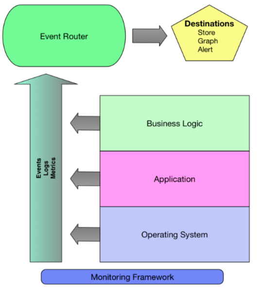

# Monitoring and Logging

## What is Monitoring?
>From a technology perspective, monitoring is the tools and processes by which you **measure** and **manage** your IT systems. But monitoring is much more than that. 

>**Monitoring provides the translation between business value and the metrics generated by your systems and applications**. Your monitoring system translates those metrics into a measurable user experience. That measurable user experience provides feedback to the business to help ensure it’s delivering what customers want. The user experience also provides feedback to IT to indicate what isn’t working and what’s delivering insufficient quality of service.

Your monitoring system has two customers:

* The business

* Information Technology

## "Monitoring Maturity Model"
* Manual, user-initiated, or no monitoring
* Reactive
* Proactive

### Manual, user-initiated, or no monitoring
> * Monitoring is **largely manual, user initiated, or not done at all**.
> * If monitoring is performed, it’s commonly managed via checklists, simple scripts, and other non-automated processes.
> * The focus here is entirely on minimizing downtime and managing assets.
> * **Monitoring in this way provides little or no value in measuring quality of service**.
> * *Typical in small organizations with limited IT staffing*, no dedicated IT staff.

### Reactive Monitoring
> * Monitoring is **mostly automatic** with some remnants of manual or unmonitored components.
> * Broad focus on measuring **availability** and **managing IT assets**.
> * There may be some movement towards using monitoring data to measure customer experience.
>* Monitoring provides some data that **measures quality or service**
>* Most of this data needs to be manipulated or transformed before it can be used
>* **A small number of operationally-focused dashboards exist**
>* Typical in small to medium enterprises and common in divisional IT organizations inside larger enterprises

### Proactive Monitoring
>* Monitoring is considered **core to managing infrastructure and the business**.
>* Monitoring is **automatic** and often **driven by configuration management tooling**.
>* Metrics will focus on measuring application **performance** and **business outcomes** rather than stock concerns like disk and CPU.
>* Performance data will be collected and frequently used for analysis and fault resolution. --
>* **Focus on measuring quality of service and customer experience**.
>* Monitoring provides data that measures quality or service
>* Much of this data is provided directly to business units, application teams and other interested parties via dashboards and reports. --
>* Typical in web-centric organizations and many mature startups.
>* Products will not be considered feature complete or ready for deployment without monitoring and instrumentation.

## Monitoring Framework


## Pull versus Push Monitoring
> Most monitoring systems are pull/polling-based:
> * E.g., Nagios usually queries monitored sub-systems
> * I.e., the more hosts and services in production the more checks Nagios executes

> In a push-based architecture, hosts, services, and applications send data to a central collector.
> * The collection is fully distributed on the hosts, services, and applications that emit data.

Note, **Prometheus** can be considered a **push-based monitoring** system or a hybrid as each monitored application pushes its metrics which are then pulled by the central Prometheus system.

## Blackbox vs. Whitebox Monitoring
> **Blackbox Monitoring**
Blackbox monitoring probes the outside of a service or application [...] You query the external characteristics of a service: does it respond to a poll on an open port, return the correct data or response code. An example of blackbox monitoring is performing an HTTP check and confirming you have received a 200 OK response code.

> **Whitebox Monitoring**
Whitebox monitoring instead focuses on what’s inside the service or application. The application is instrumented and returns its state, the state of internal components, or the performance of transactions or events. Most whitebox monitoring is done either via emitting events, logs and metrics to a monitoring tool, the approach we’ve detailed about in our push-based model, or exposes this information on a status page of some kind, which a pull-based system would query.

## Passive vs. Active Monitoring
>**Passive Monitoring**
> Synthetic, script-based
> * to determine if application is up or down
> * to verify availability even without current end-users
> * essential to establish a performance baseline before a new release

> **Active Monitoring**
> Passive "sniffing" to observe what real users observe
> * based on real users interaction data
> * measures users' experience under their conditions, such as location etc.


# Our setup
**Serilog** writes directly to **Seq** — it does not write to a log file that Seq reads from.

* Push-based
* White box monitoring

> When using **Serilog** together with **Seq**, the logging mechanism is **push-based**.
> * Serilog is a logging library in .NET that emits log events
> * Seq is a log server that collects, indexes, and allows querying of logs.

> Serilog uses a **sink**, such as Serilog.Sinks.Seq, which **pushes log events** from our application to our Seq server over HTTP.
> Seq does **not** reach out to pull the data.

By using the Serilog.Sinks.Seq sink, the process looks like this:
1. Our application **generates logs** using **Serilog**.
2. The Serilog.Sinks.Seq sink **formats** the logs into compact JSON.
3. **Logs are pushed over HTTP** (via POST) to the Seq server.

> We use **white box monitoring**, because we control the source code and can instrument it as needed. And log events **includes request/response bodies, methods, and status codes**.


## Setting Serilog in appsetting.json
> In MiniTwit.API/appsetting.json
Our appsetting sets Serilog to use sink.
```json
{
   ...
   "Logging": {
    "LogLevel": {
      "Default": "Information",
      "Microsoft.AspNetCore": "Warning"
    }
  },
  "Serilog": {
    "Using": [ "Serilog.Sinks.Console", "Serilog.Sinks.Seq" ],
    "MinimumLevel": "Information",
    "WriteTo": [
      {
        "Name": "Console"
      },
      {
        "Name": "Seq",
        "Args": {
          "serverUrl": "http://134.199.188.179:5341"
        }
      }
    ],
    "Enrich": [ "FromLogContext" ]
  },
  "Seq": {
    "ServerUrl": "http://134.199.188.179:5341"
  }
}
```