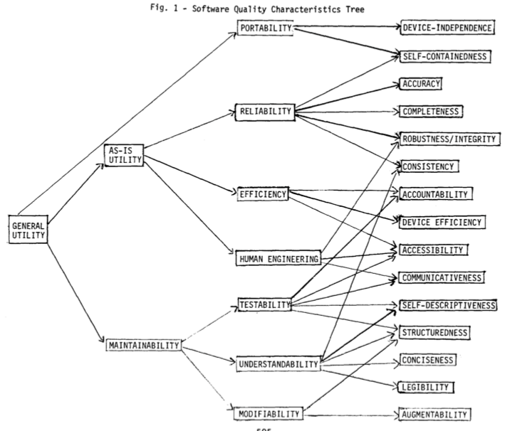
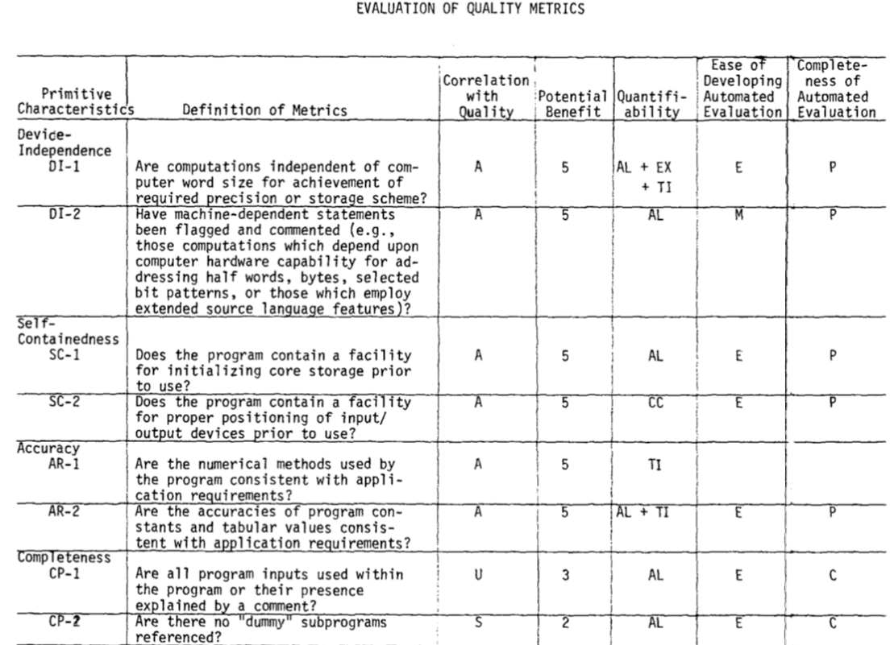
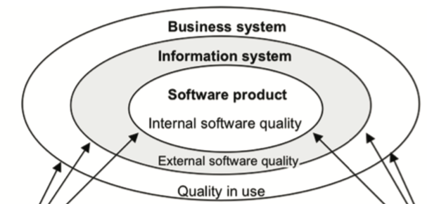
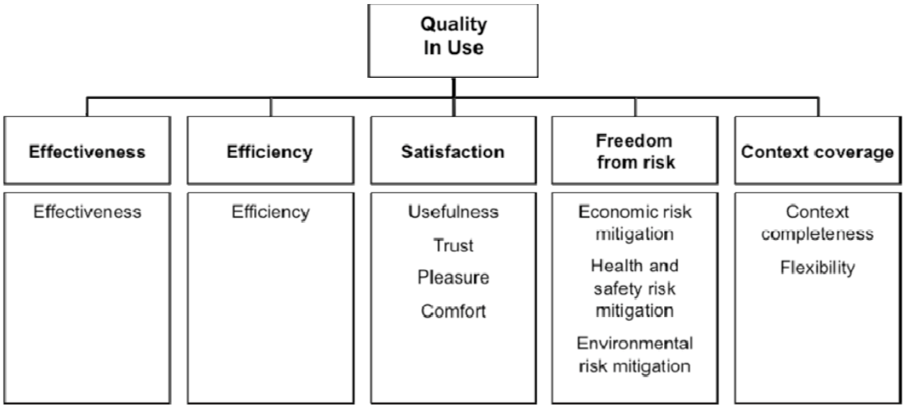
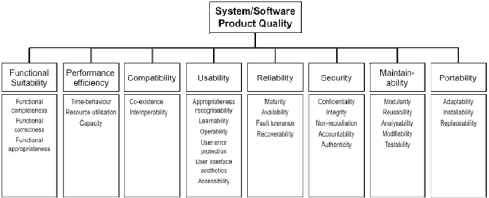
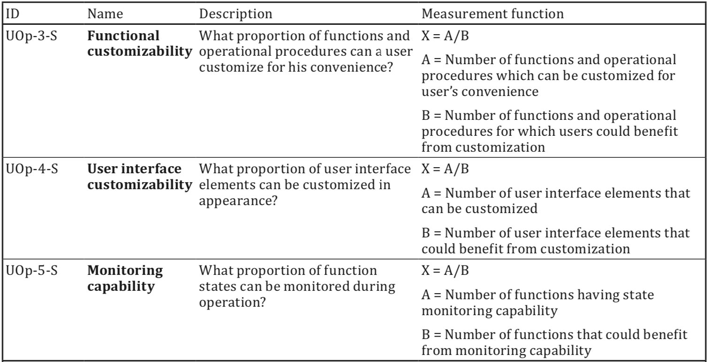

# Lecture 7 

> Without monitoring you are not doing your job

### Software Quality

Some questions arise:

1. Are your ITU-MiniTwit systems any good?
2. How good/bad are your ITU-MiniTwit systems?
3. Is there anything one can do to improve quality of your ITU-MiniTwit systems?

### What is Software Quality?

Generally, *quality* is defined as:
> the totality of characteristics of an entity that bear on its ability to satisfy stated and implied needs

The term *software quality*:
> (1)  capability of a software product to satisfy stated and implied needs when used under specified conditions
>
> (2) degree to which a software product satisfies stated and implied needs when used under specified conditions
>
> ...

Various stakeholders have particular and varying quality requirements:
> (1) Good software should deliver the required functionality and performance to the user and should be maintainable, dependable, and usable.

He concluded that "quality is a complex and multifaceted concept" that can be described from five different perspectives.
1. The transcendental view sees quality as something that can be recognized but not defined.
2. The user view sees quality as fitness for purpose.
3. The manufacturing view sees quality as conformance to specification.
4. The product view sees quality as tied to inherent characteristics of the product.
5. The value-based view sees quality as dependent on the amount a customer is willing to pay for it.

One perspective is missing, which Sommerville describes, which assumes the better the process leading to a software product the better the product itself. 

### Software Quality Models

#### Boehm 1976 - Quality Model

#### ISO 250x0 - Quality Models

#### ISO 25010 - Quality in Use

#### ISO 25010 - Product Model

#### ISO  25023 - Metrics (QMEs)

### How to measure software quality and quality attributes?

Sommerville states, it is neither easy nor straight forward:
> Unfortunately, it is difficult to make direct measurements of many of the software quality attributes [...]. Quality attributes such as maintainability, understandability, and usability are external attributes that relate to how developers and users experience the software. They are affected by subjective factors, such as user experience and education, and they cannot therefore be measured objectively. To make a judgment about these attributes, you have to measure some internal attributes of the software (such as its size, complexity, etc.) and assume that these are related to the quality characteristics that you are concerned with.

Usually how you do it:
> The project or organization must start by making a list of nonfunctional requirements that define the "right code." We call this the quality model.

Then one has to define and specify metrics, associate them to the quality attributes of interest, translate these metrics into precise programs/measures on given artifacts, and define how measured values are aggregated in the end for assessment

### Problematic about Software Quality: "What is Software?"

Remember that software is way more than code
* Not just the programs themselves, but also all the documentation and configuration data (required to make these programs operate correctly)

It is not properly defined what software actually is.

Therefore we have Helge's definition of software:
> Software is the collection of all artifacts, which allow (a) suitably educated person(s) with access to specified and suitable hardware to instantiate a running system.
>
> Additionally, the collection of such artifacts allow such (a) person(s) to understand and reason about a systems' working and properties and let them understand why the system is as it is and why it behaves the way it does."

That is, when you want to measure software quality, you have to necessarily look at more than just source code.

### Maintainability
*maintainability* seems to be an important software quality:
1. Maintenance typically consumes about 40 to 80 percent (60 percent average) of software costs. Therefore, it is probably the most important life cycle phase.
2. Software maintenance is largely about adding new capability to old software, not about fixing it.
3. Consuming roughly 30 procent of maintennance time is "Understanding the existing product".

#### What comprises Maintenance?
* fixing bugs
* keeping its systems operational
* investigating failures
* adapting it to new platforms
* modifying it for new use cases
* repaying technical debt
* adding new features
etc.

#### Maintainability according to ISO 25010 (Product Modul)
* **Modularity**: Divide into independent, encapsulated components.
* **Reusability**: Use the same component in multiple contexts without change.
* **Analysability**: Easily inspect and understand internal behavior.
* **Modifyability**: Quickly adapt or extend with minimal side-effects.
* **Testability**: Support straightforward, automated verification of behavior.

#### Maintainability according to Kleppmann
 
.. minimize pain during maintenance, and thus avoid creating legacy software ourselves.

* (a) **Operability**: Make it easy for operations teams to keep the system running smoothly.
* (b) **Simplicity**:  Make it easy for new engineers to understand the system, by removing as much complexity as possible from the system. (Note this is not the same as simplicity of the user interface.)
* (c) **Evolvability**: Make it easy for engineers to make changes to the system in the future, adapting it for unanticipated use cases as requirements change. Also known as extensibility, modifiability, or plasticity.

### Technical Debt?

Second Law of Software Evolution: “As a large program is continuously changed, its complexity,
which reflects deteriorating structure, increases unless work is done to maintain or reduce it.”

* Technical Debt is neither a well-defined term nor a well-
understood concept. Therefore, use precise software qualities for
assessment and communication.

* Be aware: incremental software development creates always
technical debt.

* Plan, budget, and schedule refactoring work

### What can we do about SW Quality, Maintainability, and Technical Dept?

We can do two things:
* Introduce certain practices in our development process
* Introduce quality gates via tests and tools into our build processes

#### Practices for Software Quality: Testing

*Why test at all?*
* Testing is intended to show that a program does what it is intended to do and to ­discover program defects before it is put into use.

*What are tests*?
* A single behavior you are testing, usually a method or API that you are calling
* A specific input, some value that you pass to the API
* An observable output or behavior
* A controlled environment such as a single isolated process

---

* Unit Testing: verify individual components in isolation
* Integration testing: Validate interactions between combined components or systems
  * Integration tests check whether different chunks of code are interacting successfully in a local environment

He also introduced UI tests.

#### Practices for Software Quality: Pair Programming

By working in tandem, the pairs completed their assignment 40% to 50% faster.
* The top benefit was fewer bugs in the source code
* Pair programming improves design quality, reduces defects, reduces stadding risk, ehances technical skills, improves team communication etc.

#### Practices for Software Quality: Code Reviews

At a cost of 1-2% of the project, a 40% decrease in the number of issues was found.

Findings show that unreviewed commits (i.e., commits that did not undergo a review process) have over two times more chances of introducing bugs than reviewed commits (i.e., commits that underwent a review process).

#### Practices for Software Quality: Static Analysis
* Pylint
  * Checkes coding standards
  * detects errors
  * detects duplicates
  * detects unused code
* Pyflakes
* Prospector
etc.

#### How to measure maintainability and TD?

It is neither easy or straight forward. However, there exists a number of tools that promise to automatically assess various quality attributes of software.

* Sonarqube
* Code Climate
* Better COde HUb

But be aware of what tools actually measure and be aware of:
* The project or organization must start by making a list of nonfunctional requirements that define the "right code." We call this the quality model.
