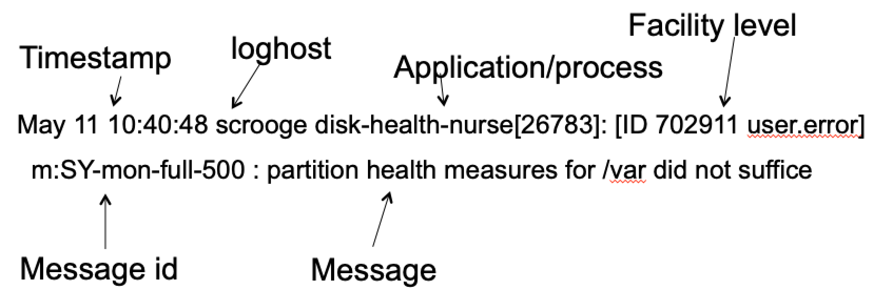
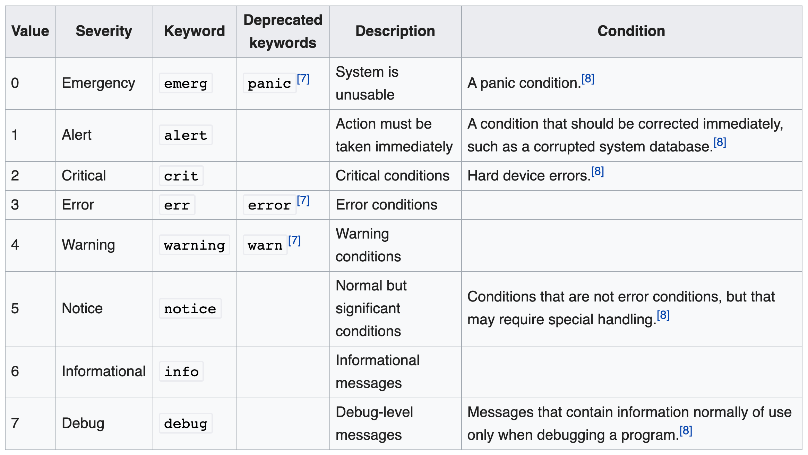
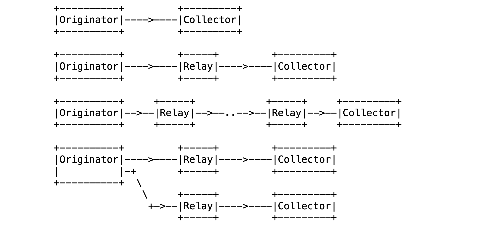
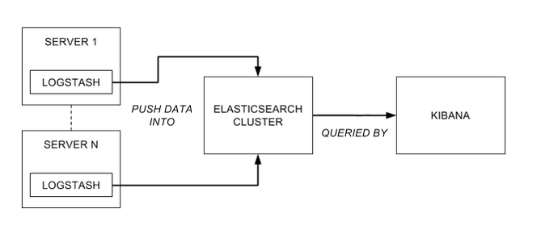
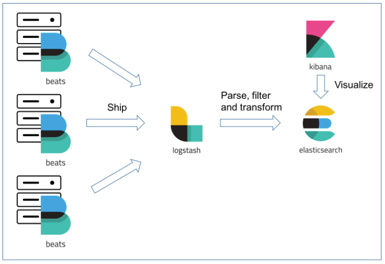
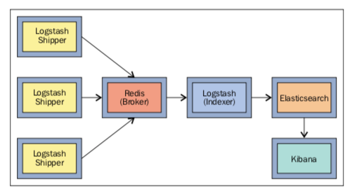
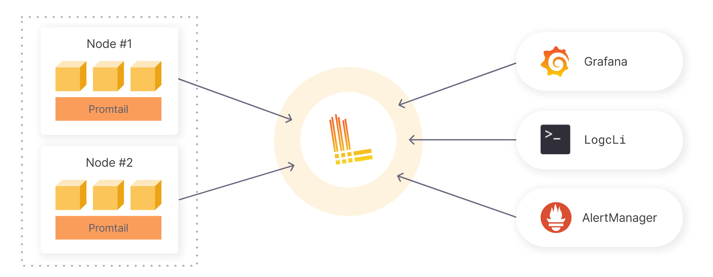

# Lecture 8 - Logging

**Monitoring**: a tool that allows us to detect problems

What are the types of problems detectable by monitoring?
* Performance issues, resource exaustion etc.
Does monitoring help you understand why these problems occur?
* Monitoring primarily surfaces symptoms—what’s breaking, when, and where. 

### From Monitoring to Logging
Monitoring does not explain *WHY* there was a problem

### What is Logging?

**Definition**:
> The **activity** of collecting and analyzing data generated by applications, infrastructure, and other components of a system.

Logs = streams of aggregated time-ordered events collected from all running processes and backing services.

These logs are commonly written to a **logfile** on disk.

### WHy do it?

There are thee main reasons for logging:
1. **Diagnosis**
   1. Why could the user not login yesterday
   2. Why is the service slow?
2. **Understanding**
   1. How is our system being used?
   2. Was our server under attack last night?
3. **Audit trails**
   1. Sometimes logs are leggally required
   2. Sometimes they save your business, you can still recover info from the logs

### Challenges with logging
1. **Scalability of Analysis
   1. Logs can quickly become very larger and searching information in them can become tedious
2. Compatibility of Formats
   1. Complex systems can generate logs in different formats
3. Storage Management
   1. Logging can result in very large data that needs to be managed


### Practical Principles

There are four main principles that you should apply when adding logging to your system

#### A process should not worry about storage

Don't hardcode the path to the logfile to which your process writes

Instead each process should write to its unbuffered stdout stream

#### A process should log only what is necessary

Because you avoid:
* duplicated information
  * information overloead on the reader of the logs
  * wasted disk space

#### Logging should be done at the proper level
 
* Allows the user to control the amount of logging 
* Intention revealing enables the reader to make sense of the messages

Possible intention revealing classification of log levels in Python with the `logging` package:

```python 

import sys
import logging

logging.basicConfig(
        format="%(asctime)-15sZ %(levelname)s [%(module)s] %(message)s",
        datefmt="%Y-%m-%d %H:%M:%S.%f",
        level=logging.INFO,
        stream=sys.stdout
)

logging.debug("Got here!")
logging.info("User updated preferences.")
logging.warning("Could not retrieve any items from feed.")
logging.error("Google Translate API not answering")
logging.critical("Out of memory")

```

#### Logs should be centralized

Having all the information one place 
* is more efficient than having to search through different files on different machines
* enables correlation analysis

Correlation analysis links related events across systems to spot patterns or causes.

### Architectures

#### Syslog

**Formatting**: A syslog message is structured in a pre-defined format. Most essential elements are timestamp, application, level, and message.



**Facility Codes**: THe protocol defines many facility codes:
0. kern = Kernel messages
1. User = User-level messages
2. Mail = mail system
Most of your applications will use the user facility


**Log Levels**: Predifines 8 levels of severity for logs, presented in the table below.



**Architectures for Log Transimission**: Syslog proposes a seperation between the following roles
* Orginator = sender
* Collector = responsible for gathering, recieving, and storing log messages
* Relay = responsible with receiving syslog messages from multiple sources, possible aggregating them or filtering them, them forwarding them to one or more destinations.



#### ELK

Acronym for:
* ElasticSearch = Scalable full text search DB
* Logstash = Java-based log parser
* Kibana = VIsualization tools tailored for Elastic Search



#### Variations and Alternatives to ELK

**EFLK**: Filebeat for shipping logs



**FRELK**: With the Redis message broker

Purpose: prevention of data loss. Can you explain how?
* Redis buffers the data in memory (or disk if configured), ensuring it's not lost and can be processed later.



**Promtail + Loki + Grafana**:
* Promtail = agent that ships the contents of local logs
* Loki = log aggregation tool developed by Grafana labs



#### Architectural Tactics

**Log Rotation**: 
* Set a threshold of time / size
* After which the data in the file is truncated / stored elsewhere

**Logging for Analytics**
* You can use your own logging infra for analytics instead of relying on Google Analytics

**Logging every event**
* With sufficiently high-resolution logging you can have a practical backup of the state of the database


#### Ethical and Security Conciderations
* Logs could be an attack vector
  * Control access to logs
  * Do not log secrets in plaintext
* Do not log user private data (GDPR)

