# Availability

## What is availability?
> **Availability** is
> * a quality attribute...
> * that is expressed as the **proportion of time that a system or service is operational** and accessible for use.

e.g. 99.999% uptime, we call it "number of nines"

> High availability means that users can access the system without significant interruptions or downtime.

## How do systems fail to achieve availability?
### Individual Components Fail
This is probably the architecture that many of your systems have at the moment.
> We say that such an architecture has a **single point of failure** = a part of the system failing will stop the entire system from working
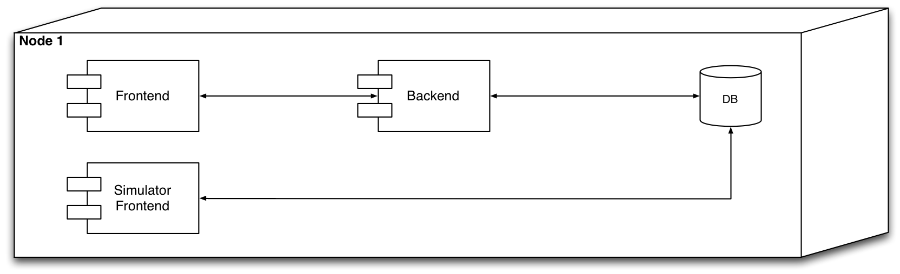

#### What if we use multiple machines in the above scenario?
This scenario has different containers run on different machines.
> The scenario is not better from an availability POV. In fact, **it might even be worse**: we have even **more** single points of failure because each hardware node is one such possible point of failure.

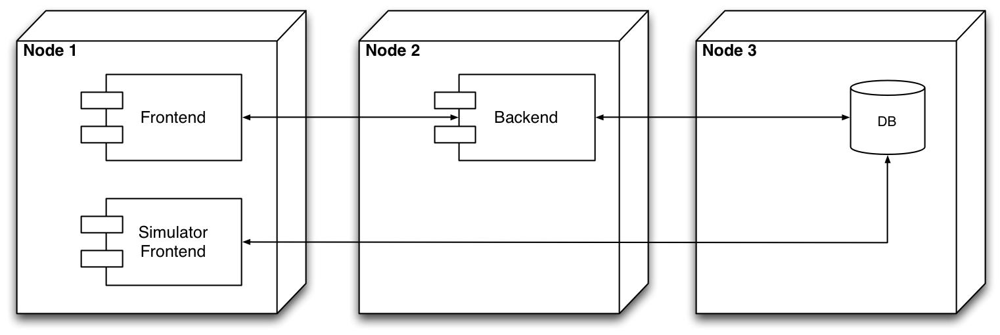

### Individual Components Are Overwhelmed
> Your user authentication system is slow, and your application becomes really popular with many users trying to create accounts at the same time. **The server’s CPU becomes a bottleneck** hashing algorithms used by the application is computationally intensive, causing login delays, and users going away from the system.

What's the problem in this situation?

> **Congestion**: reduced quality of service that occurs when a network node or link is attempting to handle more data than it can.

Possible Reasons for congestion
* Seasonal spikes in demand
* Highly anticipated launches (healthcare.gov)
* Traffic surges
* Lack of monitoring

## How to achieve availability
Addressing single point of failures. 

### Important systems are replicated.
We can learn from one of the most marvelous systems that we are aware of: **the human body**.

It is resilient at multiple levels of abstraction. We have **two lungs, two kidneys, two eyes**, etc. But much more than that: every cell has the whole DNA of the whole thing inside it!

The solution nature found with respect to availability and removing single points of failure is: **redundancy**.

### Redundancy in System Design
Redundancy in system design is the solution to SPF.

In system design **redundancy** means *adding extra components to the system in such a way that **if one component fails**, **another can take over**.

#### Tradeoffs of redundancy
* **Cost** -- it is more expensive
* **Synchronization** -- keeping redundant components in sync can be challenging -- see your distributed systems course (CAP theorem)

## Addressing congestion

1.  **Performance optimization**: Ensuring that the system is designed and tuned to handle the expected load efficiently, reducing the risk of bottlenecks and failures.
2. When everything else fails, then we solve congestion with **Scaling**.
   - There are two main approaches to scaling:
     - Vertical
     - Horizontal

## Vertical scaling
> **Replacing resources with larger or more powerful ones**

* In a **physical server**: open the hood, and add: more memory, disk, etc.
* In a **VM**: reconfigure the machine programmatically

### Vertical Scaling with DigitalOcean
Similar to VirtualBox, only that on the Web

**You can only resize VMs that are not running.**
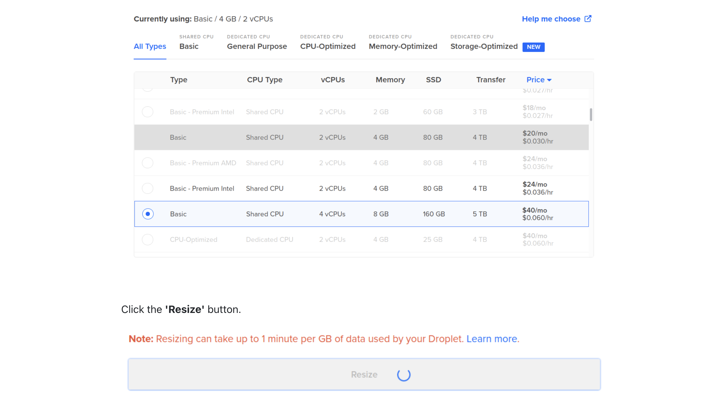

### When is vertical scaling appropriate?
* Legacy systems (e.g. bank mainframes)

* Some types of software that does not scale well horizontally. e.g. databases that don't cluster well

* Predictable growth -- when you can anticipate the growth of demand on your system, and that growth can be serviced by the vertically scaled infra

### When is vertical scaling not appropriate?
* You have to adapt fast to varying workload (e.g. Amazon's Black Friday)

* Complicated to scale down (often)

* Slow: it implies switching machines off and on (both VM and physical)
Some workloads are simply too big for vertical scaling

## Horizontal Scaling
> = Addressing congestion by **increasing the number of computing nodes**.

Two components:

* **adding more machines to a setup** and
* **making all the machines share the responsibilities**

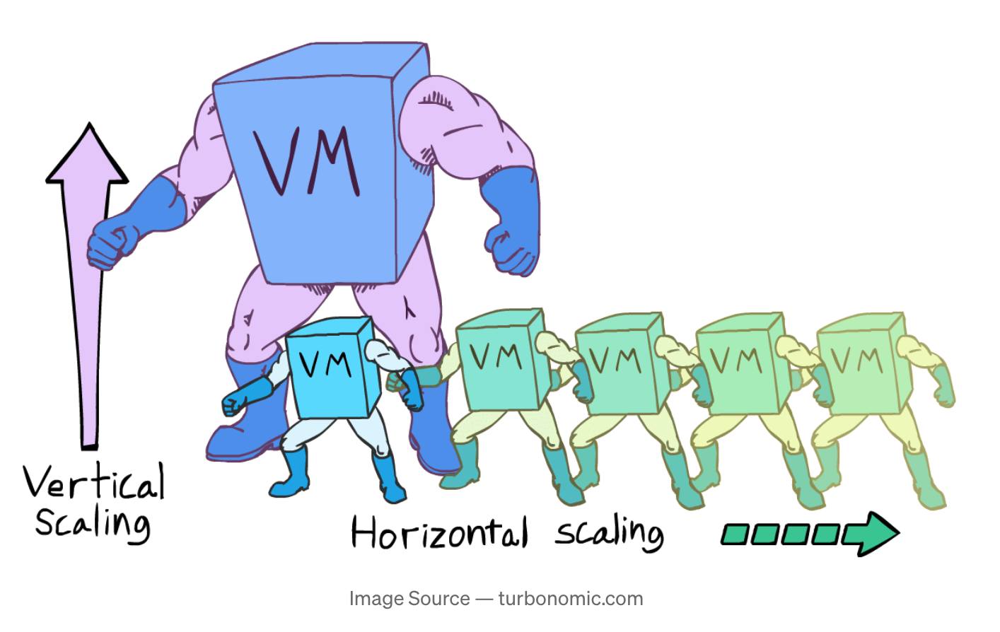

### Load-Balancing
Horizontal Scaling 101: The original.

> = **Distributing traffic to - and computation across multiple servers**
> * Ensures no single server bears too much demand
> * Improves responsiveness

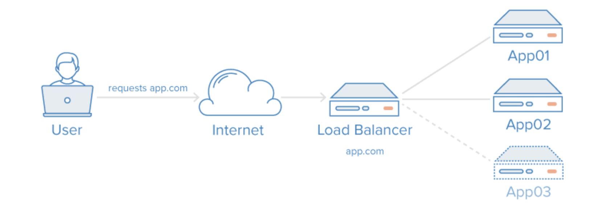

> **Solves scaling** and SPF at the application **server level** but...
... **load balancer is still SPF** ^^!

#### Redundant Load Balancer Setup
How to make the balancer not anymore a single point of failure:
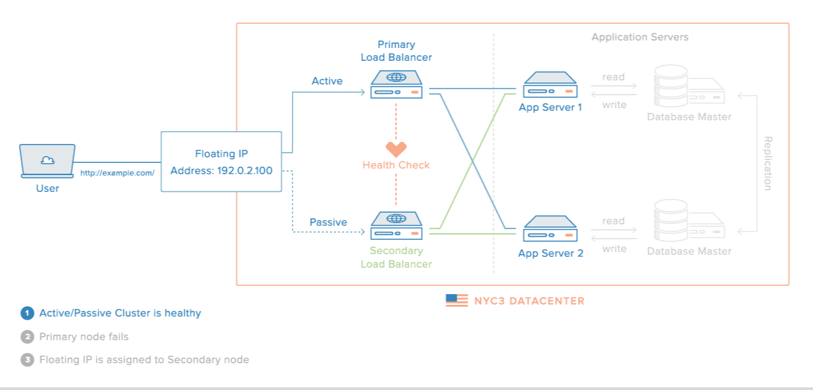

## Container Orchestration Platforms
Container orchestration tools...
* ... **manage computing nodes and services**
* ... **schedule tasks** in a resource aware manner

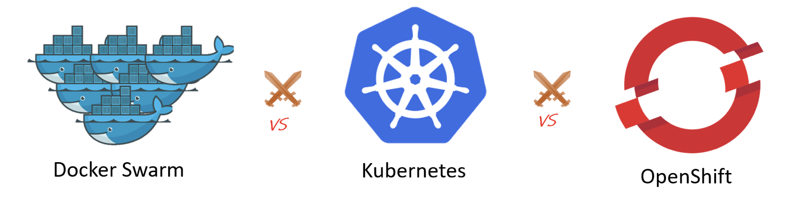

**Docker Swarm Mode**
* Comes with Docker by default
* The easiest to use from all the alternatives

**Kubernetes**
* Originally developed at Google
* We don't ask you to use it because we're nice :)
  
**OpenShift**
* Developed by Red Hat as an enterprise Kubernetes distribution
* Provides advanced networking features and built-in monitoring tools

## Docker Swarm Mode
Main Concepts
The following concepts are essential for understanding Docker Swarm mode

* **Swarm / Cluster** = a group of nodes that work together to create a distributed system
* **Node** = A (virtual) machine participating in a swarm
   * Managers
   * Workers
* **Service** = a replicated process
* **Task** = an instance of a process
* **Routing Mesh** = network overlay mechanism


### **Manager Node**
>* Maintain swarm (cluster) state
>* **Schedule services on the nodes**
>* Designed for redundancy: n manager swarm tolerates loss of (n-1)/2 managers
>
> Notes:
> Docker recommends a maximum of seven manager nodes for a swarm (!?!)
> More managers does NOT mean increased scalability or higher performance. In general, the opposite is true


### **Worker Node**
> A machine which from the POV of the swarm
> 
> * **executes Docker containers**
> * has at least one manager node
> 
> Notes:
> By default, **all managers are also workers**

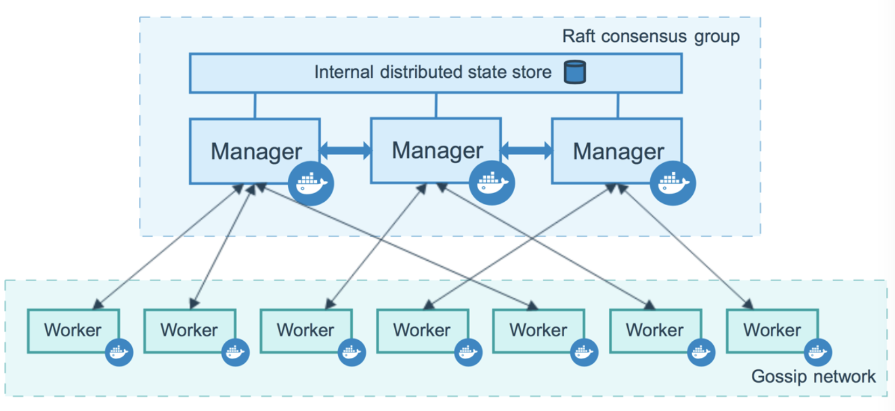

### Service
> The primary abstraction of user interaction with the swarm
>Defined by:
> * docker image
> * the **port** where the service is available outside of the swarm
> * number of replicas to run in the swarm

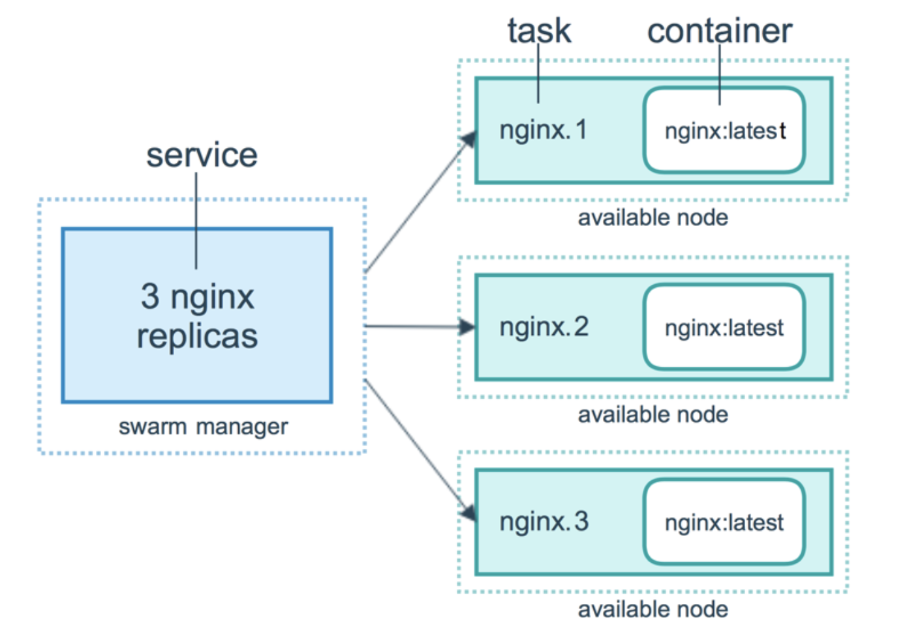

#### Types of Services
Can be
* **replicated** - allows you to select the level of replication
* **global** - exactly one replica running on each node

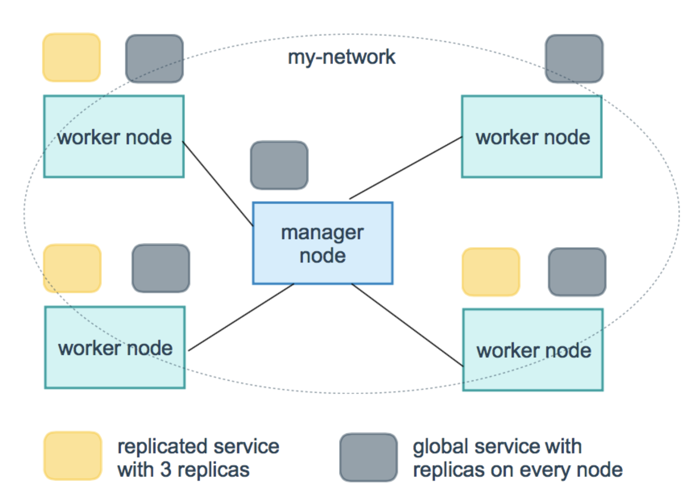

> Good examples of global service? A **log shipper** or a **monitoring container**. It is important to ensure that the service is running on every node. By deploying the service as a global service, you can ensure that every node in the cluster has a copy of the service running, which can collect data from that node and forward it to a centralized location.

### Task
> *"A service is a description of a desired state, and **a task does the work**"*
> 
> * The atomic scheduling unit of swarm
> * Carries **a container and the commands to run inside it**
> * Manager nodes assign tasks to worker nodes according to the number of replicas set in the service scale


### The Routing Mesh
> * Routes all incoming requests to published ports on available nodes to an active container
> * Enables each node in the swarm to accept connections
>     * on published ports
>     * for any service running in the swarm
>     * even if there’s no task (container) running on the node
> * Can support load balancing in Docker Swarm

## Stateless vs. Stateful Services
> **Stateless**
> * Does not maintain any internal state or data between requests.
> * Each request is handled independently
>* Ideal for horizontal scaling and load balancing.

> **Stateful**
> * Maintains internal state or data that persists across requests or instances
>* Examples include databases and file storage services
>* Replicating stateful services introduces challenges related to data consistency, synchronization, and failover

## Upgrading replicated services
Two possible upgrade strategies:
* **Blue-Green**
* **Rolling Updates**

### Blue-green
> Conceptually:
> * **Two identical environments, where only one (green) is hot at any time**
> * Use the blue environment as your staging environment for the final testing step for your next deployment

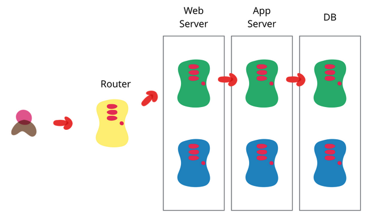

Step by step:

1. Currently deployed application (Green) is serving incoming traffic
2. New version (Blue) is deployed and tested, but not yet receiving traffic
3. When Blue is ready, orchestration / load balancer starts sending incoming traffic to it too
4. For a while: two versions of the application run in parallel
5. orchestration / load balancer stops sending incoming traffic to the "Green"; "Blue" is handling all the incoming traffic
6. Green can now be safely removed
7. Blue is marked as Green...

### Rolling Updates
> Deploy the upgrade in rolling iterations

Rolling Updates in Docker Swarm:
1. Stop the first *task*
2. Schedule update for the stopped task
3. Start the container for the updated task
4. If the update to a task returns RUNNING, wait for the specified delay period (`--update-delay` flag) then start the next task
5. If, at any me during the update, a task returns FAILED, pause the update

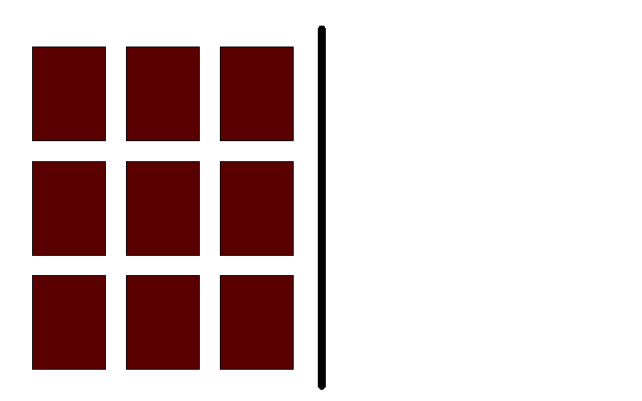

**You need at least two replicas otherwise there will be downtime**

## How to migrate from docker-compose to docker swarm?
>Simplest way is to add the extra information needed in the `docker-compose.yml` under the deploy key:

* replicas
* placement constriants: labels, roles, other props of nodes
* update strategies, restart strategies
* etc.

```yml
  api:
    image: itudevops/go-minitwit-api:TAG
    deploy:
      replicas: 2
      update_config:
        delay: 10s
        order: start-first
      placement:
        constraints:
          - "node.role==manager"
          - "node.hostname!=dbvm"
          - "node.label==frankfurt"
```

### Docker compose vs Docker stack
TL;DR:
* Use **Docker Compose** for local development.
* Use **Docker Stack** for deploying to Docker Swarm clusters in production.

| Feature               | **Docker Compose**            | **Docker Stack**                                |
| --------------------- | ----------------------------- | ----------------------------------------------- |
| **Purpose**           | Local development and testing | Production-grade orchestration                  |
| **Command**           | `docker-compose`              | `docker stack deploy`                           |
| **Swarm required?**   | ❌ No                          | ✅ Yes (requires Docker Swarm mode)              |
| **Scalability**       | Limited (single-host)         | Scalable across multiple nodes (Swarm cluster)  |
| **Networking**        | Simpler, local network        | Built-in overlay networks for multi-host setups |
| **Deployment target** | Dev/local environments        | Multi-host, distributed environments            |
