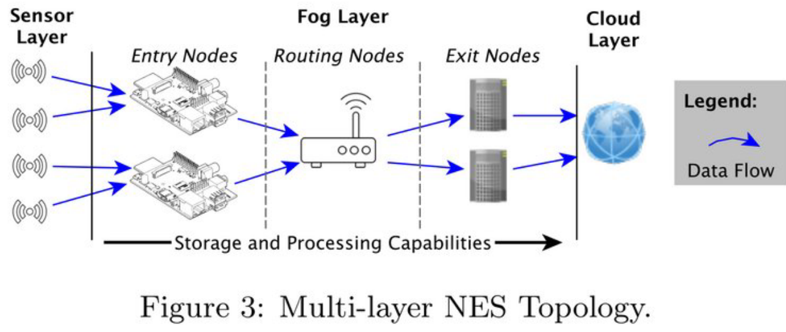

# Lecture 1 - Introduction, System Design, and Architecture

## Internet of Things
What is it? Internet of Things has had a history and pre-history. Many different disputed definitions. 

*ITU-T Y.2060's definition*:
> A **global infrastructure** for the information society, enabling advanced **services** by interconnecting **(physical and virtual) things** based on existing and evolving interoperable information and **communication technologies**.

Two truths about IoT:
* Most *Things* in IoT are not on the Internet.
* We do not know what we mean by *Thing* nor what *on the Internet* means.

*ITU-T Y.2060's definition*:
> **Thing**: An object of the physical world (physical things) or the information world (virtual things), which is capable of being identified and integrated into communication networks.

A very broad definition...

> **Device**: With regard to the Internet of things, this is a piece of equipment with the mandatory capabilities of communication and the optional capabilities of sensing, actuation, datacapture, data storage and data processing.

Reminder we have a bias in "Things" depending on our affiliations, interests, or dislikes.

The entire point is that IoT is too broad to classify. “Things” is too vague

--- 

## IoT Architecture

* "Things", Networks/Gateways, Servers/Cloud
  
### IoT Reference Architectures

### Importance of knowing where you are

* It is crucial in the design process, to know where you are operating!
* What are your conditions, constraints, modes?

### Architecture

An ambigious team, could mean:
* Overall IoT architecture (framework)
* Software architecture (stacks)
* Hardware architecture

* "Things" is generally autonomous, therefore: power = costly
* Gateways, Infrasturcture, Datbackends is reliant on stable infrastructure, therefore: power is not a big issue

### Advanced Architectures
* Terminology: fog, queries, engines...

## Take Aways

* Ambiguity of terms – IoT, “Architecture” System, Software, Hardware, ...
* 4-tier architectures (but it might be 3 or 5)
* Identify main elements and be aware of their constraints
* Discuss terms like thing, node, fog, edge cloud, backend, application ..

