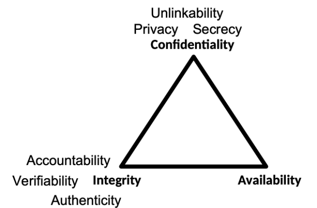
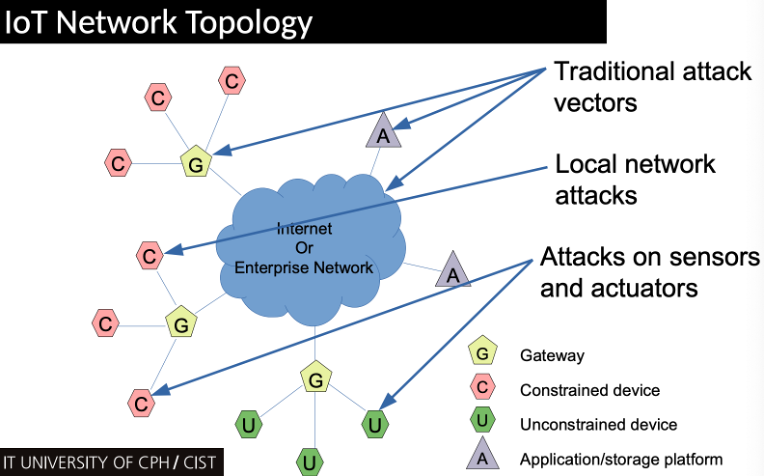
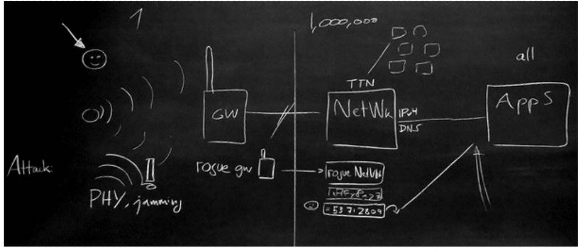
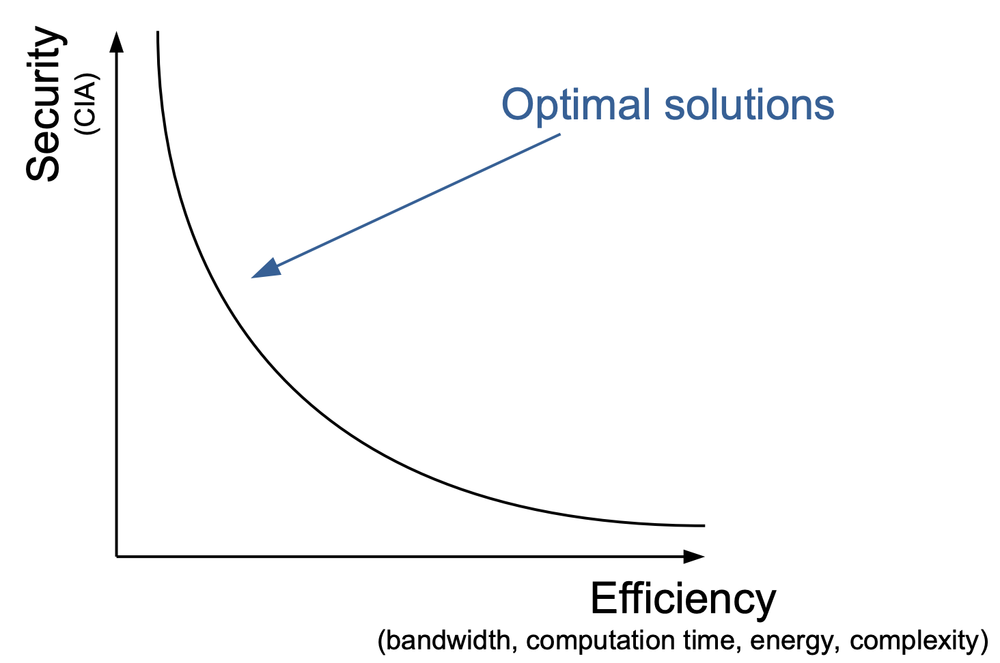
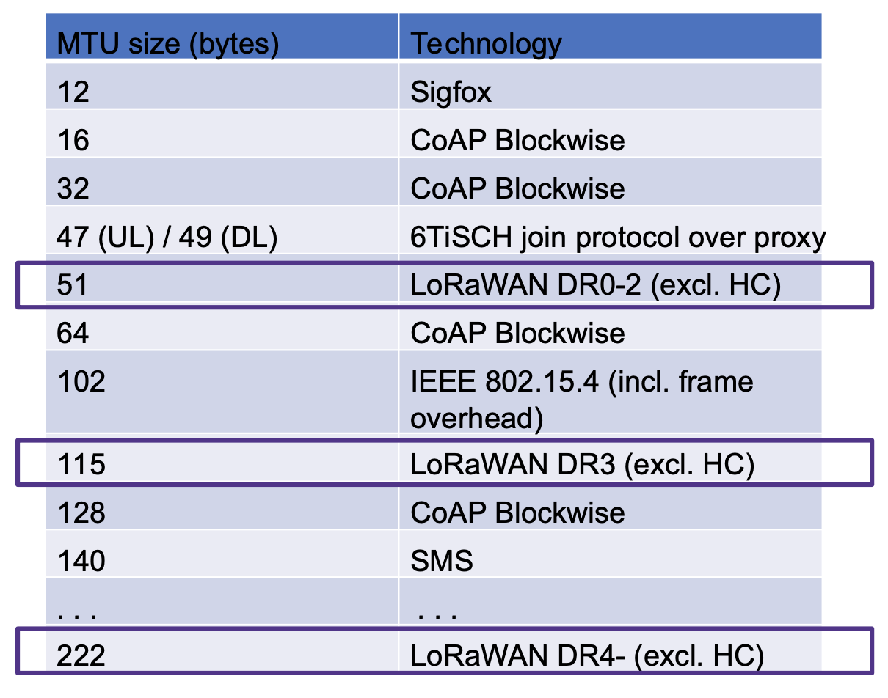
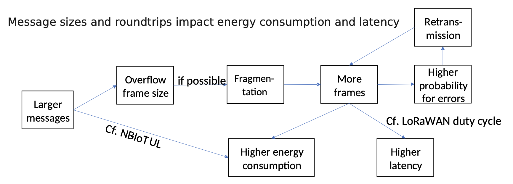
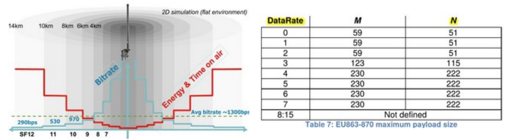
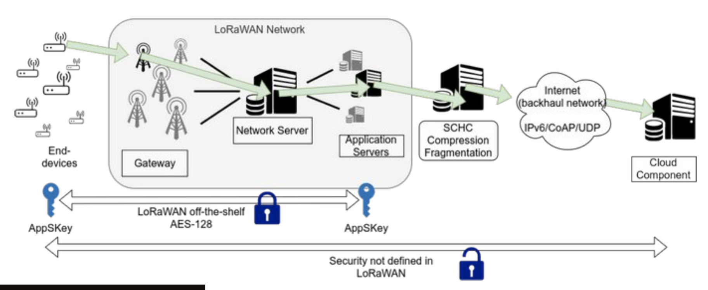

# Lecture 10 - Security
## IoT Security
>Full of misunderstandings. Perceived risks vs real risks ”all those webcams, but by far this is not the  biggest risk and attach surface”.
>The biggest attack surface is probably a Windows laptop and a human being, receiving emails, clicking emails and clicking links.
>Differentiate between Attacks on the IoT & Attacks with the >IoT as a tool to attack other IT (e.g. botnets) 
>The gadget quality seen in IoT contributes to the problem – we tend to underestimate small things.

## Risk analysis
### CIA triad

>**Confidentiality**: Attacks: eavesdropping, man-in-the middle.
> **Integrity**: Attacks: masquerading, message tampering, replaying
> **Availability**: Attacks: Denial of Service, distributed denial of service

### Security is impossibly hard
> * You must defend against all possible attacks
>* Adversary needs to find just one attack that works
>* No perfect security (…all possible attacks)
>* Security is measured in the resources required of the adversary

## Security Prinicples
>“Keep it simple.” aka. “simplicity”
> General engineering principle: Complex designs yields complex failure analysis.

## Open design
* “The security of a system should not depend on the secrecy of its protection mechanisms.”
* aka “Kerckhoff’s principle”
* The adversary knows the system (Claude Shannon).
* Systems are hard to build—more scrutiny, less defects.
* Hard case: DRM. The user has the device. Sony compromises(!) consumers machines in 2005.

## Minimum exposure
* “Minimise the attack surface a system presents to the adversary.”
* Reduce external interfaces (If you don’t need it, turn it off.)
* Limit information
* Limit window of opportunity.

## Least privilege
* “Any component should operate using the least set of privileges necessary.”
* I don't have access to ITU mail servers.
* Keynote does not run as root.

## Fail-safe defaults
* “The system should start in and return to a secure state in the event of a failure.” 
* Whitelist, blacklist.
* If you lost connectivity to the authentication server, don’t let anyone in while it’s down. 
* E.g., whitelist ports for firewalls

## Complete mediation
* “Access to any object must be monitored and controlled.”
* The Maginot-line: strong fortifications not extending all the way did not help. 
* e.g., OS access control to files can be circumvented if you have access to the physical disk. (Use crypto, then.).

## No single point of failure
* “Build redundant security mechanisms whenever feasible.”
* aka “defence in depth.”
* Key technique: separation of duty

## Psychological acceptability
* “Design usable security mechanisms”
* …let users circumvent them
* Help the user to make the right choice

## IoT Thread Modeling

### Hypothetical-scenario
>**Attack on physical layer** (aka. edge device): Jamming
> **Gateway attack**: Rogue gateway forwards data to a rouge network server.
> **Network server attack**: DDoS, overload the server traffic. 
> **Cloud or app service attack**: SQL injection.

## Conflicts and trade-offs
> An optimal solution should balance between **security** and **efficiency**.

### Does your message fit the frame?
>MTU sizes, your frame must fit the size contraints!
> Also sizes impact energy consumption and latency.

### LoRaWAN security
> LoRaWAN employs unlicensed radio frequency bands
> * Uses the 868 MHz ISM band in Europe regulated by ETSI EN 300 220
>* **Time-on-Air**: The amount of time that the antenna is radiating power to transmit a packet
>* After every transmission, there is a Back-off time period called Duty Cycle
>* Typical Duty Cycle in Europe is 1%
>* Also, due to the regulations, the maximum payload size is limited for each LoRaWAN DataRate configuration

>* LoRaWAN (v1.0) security employs a preprovided root key: AppKey. After deployment, a pair of session symmetric keys are derived: AppSKey and NwkSKey. These keys employ AES-128.
>* Security outside of the LoRaWAN network is not defined in LoRaWAN specification.

## Advanced security principles 

### Dissecting Confidentiality
> **Secrecy** – the information is only known by a restricted set of authorized principals (examples: keys, medical records, readings of a gas or heat meter)
>**Privacy** – it is impossible to distinguish whether one or another piece of information was exchanged.
> **Unlinkability** – it is impossible for an observer to link multiple sessions executed by the same entity [Note: there’s conflict here again! ed.]

### Perfect Forward Secrecy
> After a compromise, all previous sessions are maintained secure. I.e. revealing of long-term keys will not give any information about the session keys to the attacker.

### Post-compromise Security
>What to do after a compromise?
>* Throw away the device?
>* Reset new keys?
>* Keep it and hope for the best?

>**Post-compromise Security**: ”Assume the attacker has access to your device and can sign, encrypt and decrypt all your data for a period of time, the device should be secure again after that period.”

## IoT security protocol problems
### The Key Distribution Problem
> In general, connecting $n$ nodes in a network requires
O($n^2$) keys. With public key crypto solves the problem with only $n$ keys.
>
> * Current IoT practice defies this approach because it’s
too expensive. So all symmetric keys are registered at the service provider.
>* Limitation: won’t allow easy communication between devices.

## Key takeaways
* C-I-A view
* Conflicts and trade-offs
* LoRaWAN specifics
   * keys and where they reach
   * physical layer attacks
