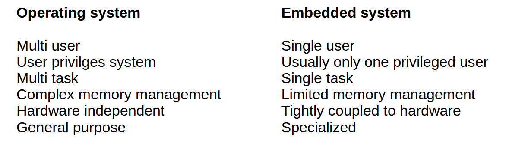
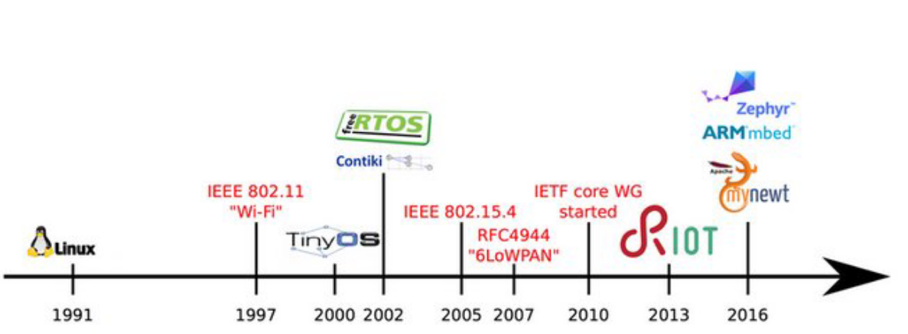
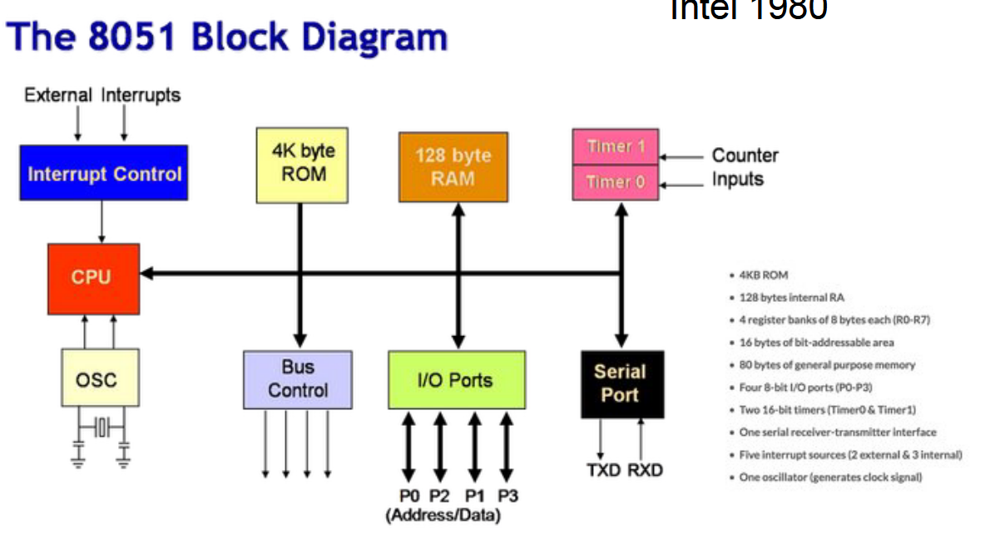
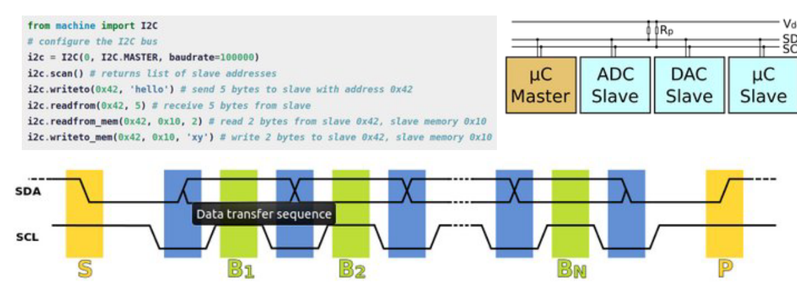
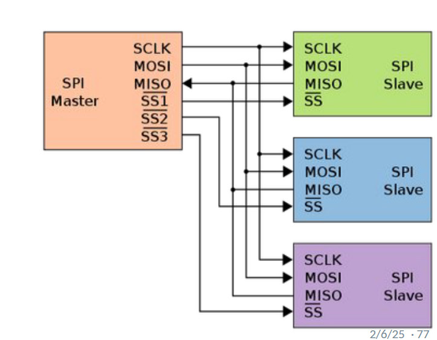
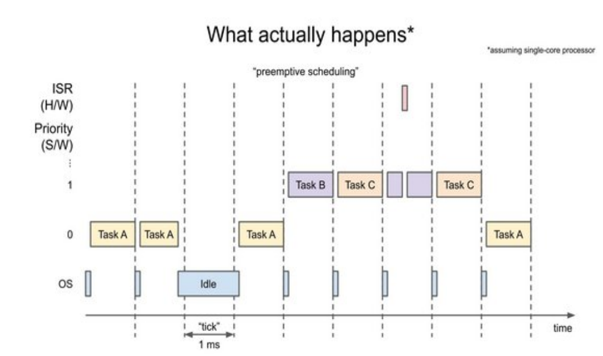
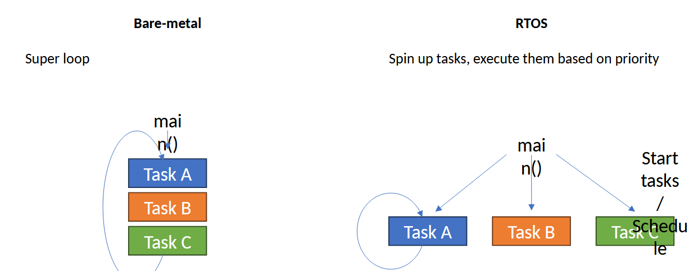

# Lecture 2 - Embedded Systems and Programming

## Embedded Systems

*Definition 1*:
> An embedded system is a combination of computer hardware and software, and perhaps additional mechanical or other parts, designed to perform a specific function. (Barr, M., & Massa, A)

*Definition 2*:
> An embedded system is a computer system. A combination of a **computer processor**, **computer memory**, and **input/output peripheral devices** that has a **dedicated function within a larger mechanical or electrical system**.
Heath, S. (2002).

*Definition 3 (Network)*:
> An embedded system is a special-purpose system in which the computer is completely encapsulated by the device it controls. An embedded system performs pre-defined tasks, usually with very specific requirements. Since the system is dedicated to a specific task, design engineers can optimize it, reducing the size and cost of the product.

### Main Distinctions
* A specialized & hardware-specific function
* Not a general purpose computer

### Terms are not absolutes

* The Things of the Internet are often not on the Internet.
* the Embedded Things are often not embedded, but isolated
  * Paradoxally, the embedded system in IoT tends to be stand-alone / autonomous

### IoT and embedded systems

Share general concerns & interests:
* Size: minimize
* Power: optimize
* Networking: very specialized
* Cost
* Enviromental robustness
* Computing power

These are what we call *constraints*.
   
### Constraints analysis

Precise description of constraints is essential for the deaign of good embdded system, and lack thereof is a key mistake one can make
* We often optimize things we do not need to optimize, and forget those we should optimize

### Operating System

*Definition*:
> An operating system (OS) is a program that manages computer hardware, software resources, and provides common services for computer programs.

An embedded system typically **does NOT** provide what a full operating system provides.

### Firmware

*Definition*:
> Firmware is a specific class of computer software that provides the low-level control for a device's specific hardware.

In everyday use, the word firmware is often used to denote any code that runs on an embedded node, including the program/sketch running on the device.
* This seems inconsistent

### Embedded operating systems

### Hardware Components of an embedded board
* Power
* Processor
* RAM
* Storage, volatile and non-volatile
* Timer/clock
* On-board comms, buses
* Network
* I/O of various types
* (led/sound)

### Micro-controller Example

### Sensors / Communication in embedded devices 

* Short distance (intra board)
* Moderate data rates (kBps)

Three/Four most popular standards:
* I²C (Inter-Integrated Circuit)
  * Sychronous, multi-master, multi-slave, packet switches, single-ended, serial computer bus. 
  
* SPI (Serial Peripheral Interface)
  * Syhcronous, short distance communication ()primarily in embedded systems
  
* UART - RS232
  * asynchronous serial computation, sends darta bits one by one (from least to most significant).
  
* 1-Wire
  * low-speed (16.3kbps) data, and power over a single conductor (similar to I2C but with lower data rages and longer ranges)

### Acessing EMbedded Systems
* Serial connections / USB, Bluetooth, NFC through an IDE with hardware specific libraries.

### Real-time Operating Systems (RTOS)

* Used to fullfil critical time constraints
* Tasks are assigned priorities
* Event-driven scheduler, tasks switched only when the task with higher priority needs to be executed
  

*Bare-metal vs RTOS*

Bare-metal
* The only way to jump between tasks-out-of-order are interrupts

RTOS 
* Loop until interupted

## Takeaways
* Embedded system: term, definition, history
  * Firmware vs OS
*  Constraints
*  Elements of embdedded systems
*  Examples of embedded systems
*  How to work with embedded systems
   *  Interfacing, Programming, Sleeping
