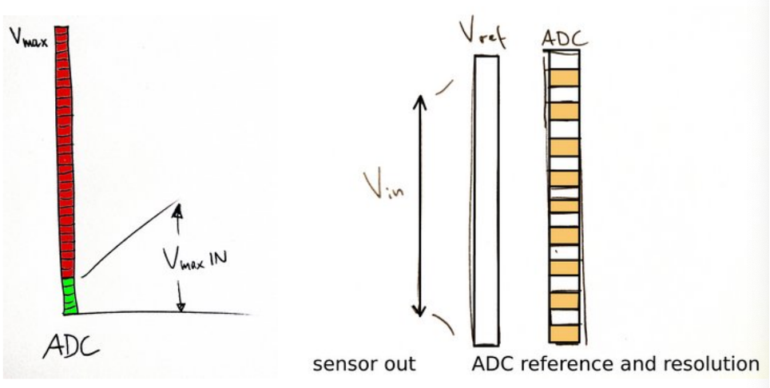
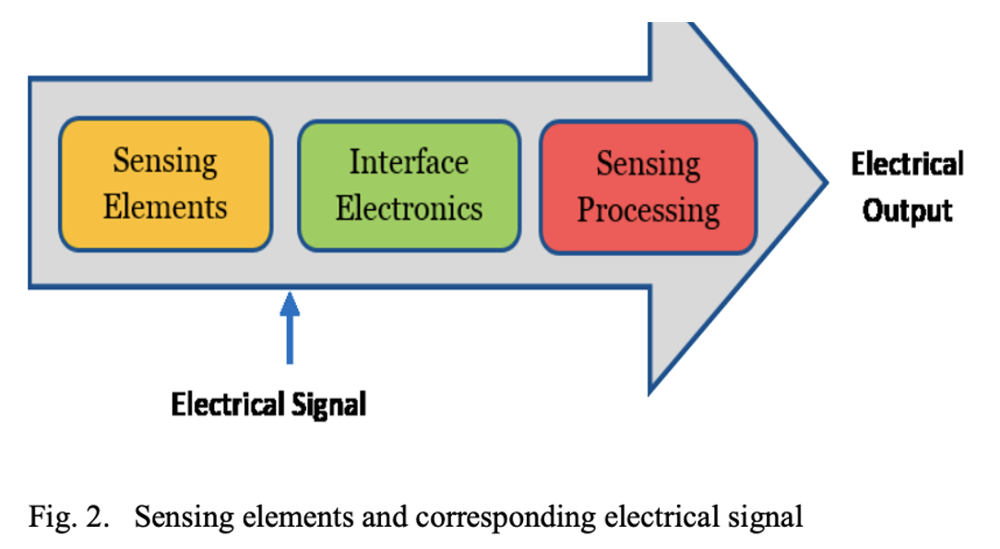

# Lecture 3 - Smart sensors: Analysis of different types of IoT sensors

## What is data
Data – that which is given (from latin: dare, datum).

Data is created, data is never raw or natrual.

## Sensors definition 
> A device, module, or subsystem that transforms a property of the physical world to a signal that can be read by electronic/digital systems.

## Sensors principles
> Typically, the sensor transforms a physical property into a voltage (or current, which then gets converted to a voltage ) which then may be digitized. Some physical effect is needed to make that transformation.

## Sensor calibration
Sensors always require calibration, and in many cases frequent re-calibration.

Might be factory-based and/or performed by user

## Sensors erros
Sensors always require discussion of errors

In the physical world, a measurement without discussion of error is useless

## Sensors ADC
Analog signals require: Analog-to-Digital Conversion (ADC)

ADC and reference voltage need to match signal range, e.g. 
- A 10-bit ADC with $U_R$ = 5V converting a 20 mV signal range will give you no more than 5 discrete values.

ADC resolution (e.g., 8-bit, 12-bit, 16-bit) determines how finely the analog signal can be represented digitally.

- A higher resolution ADC allows finer granularity, reducing quantization error.

### Example:
Suppose a temperature sensor outputs 0–3.3V to represent 0–100°C:

- With an 8-bit ADC (256 steps or $2^8$), each digital step ≈ 0.39°C.

- With a 12-bit ADC (4096 steps or $2^12$), each digital step ≈ 0.024°C.

With a 12-bit ADC, the system can detect smaller changes in temperature — better resolution, contributing to better effective accuracy.

**Important**:
An accurate ADC won’t help if the sensor's output is inherently noisy or inaccurate.
The ADC contributes to the *resolution* and *effective accuracy* of a sensor system, but it does not define the sensor’s fundamental physical accuracy.

## Sensors power consumption
Battery Life Impact:

- Sensors with **high power** draw will drain batteries quickly — critical for IoT and remote deployments.

- **Low-power** sensors are preferred for long-term unattended operation.

### Power vs. Performance Trade-off:

Higher sampling rates, on-board processing, or continuous operation typically require more power.

In low-power modes, sensors may:

- Reduce sampling frequency

- Sleep between measurements

- Sacrifice accuracy or responsiveness

### Analog Sensors vs. Digital Sensors:

- Analog sensors + ADC typically consume less power.

- Digital sensors with integrated microcontrollers (e.g., BME280, MPU6050) consume more power but offer easier integration and digital output.

## Smart sensors
Smart sensors detect any physical/chemical change and after processing the collected data sensors automate the application/devices to make it smart.

IoT integrates various types of sensors, devices and nodes having the capability to communicate with each other without intervention of human.

In any IoT application, sensors bring the physical world very close to the digital world that can be implemented by leveraging fog computing.

## Types of sensors
Important for automation of any application by measuring and processing the collected data for detecting changes in physical things. 
- Whenever there is a change in any physical condition for which a sensor is made, it produces a measurable response.

### Proximity Sensor
The position of any nearby object can easily be detected with proximity sensor without any physical contact.
- Emits electromagnetic radiation (IR) to find the presence of obejcts by looking for varaitions in return signals.
- Types of proximity sensors like Inductive, Capacitive, Ultrasonic, Photoelectric, Magnetic and etc. targeting different applications. 

This particular type of sensor is mostly used in applications demanding security and efficiency.

### Position sensors
Detects the presence of human or objects in a particular area by sensing their motion.

- Used in home security to enable the owner to track the doors and windows of rooms and appliances from anywhere

### Occupancy sensors
Sometimes called presence sensor, detects the presence of human or objects in a particular area.
- Used for remote monitoring through various parameters like temperature, humidity light, and air. 

### Motion sensors
A device used to sense all the kinetic and physical movement in the environment.

### Velocity sensors
Calculates the rate of change in constant position measurement and position values at known intervals.

Velocity sensor may be linear or angular. 
- A linear velocity sensor detects the speed of an object along a straight line.
- An angular velocity sensor detects how fast a device rotates.

### Temperature sensors
Helpful in detecting the physical changes in one’s body by measuring heat energy.

### Pressure sensors
Pressure sensors sense the amount of force and convert it in signals.

### Chemical sensors
An analytical device used to measure the chemical composition of the environment.

Sensors which response by sensing any chemical reaction, chemical substance or a set of chemicals is known as chemical sensors. 

- Used for detecting environmental events, building health, agriculture conditions, and etc.

### Humidity sensors
A humidity sensor measures air temperature as well as moisture and signals the humidity in the environment.

### Gyroscope sensors
Detects any tilt or angular movement in the object by measuring angular velocity.

