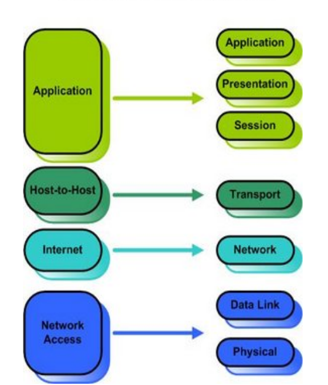
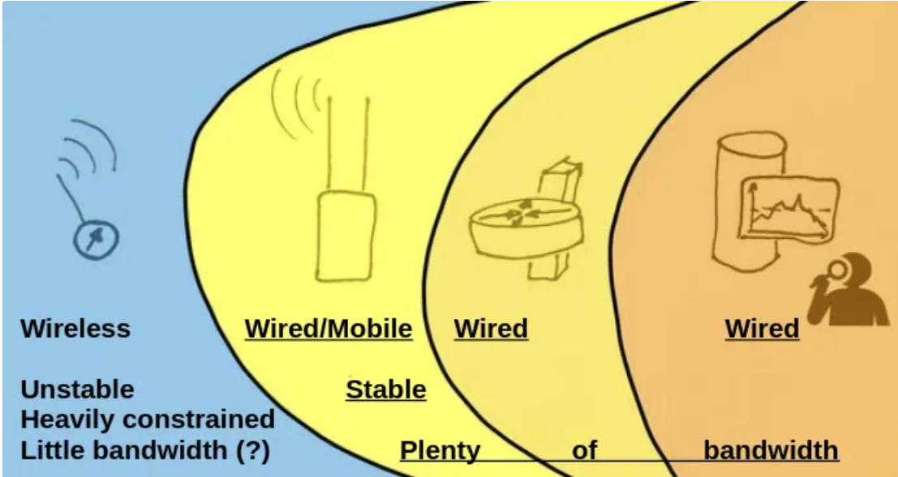
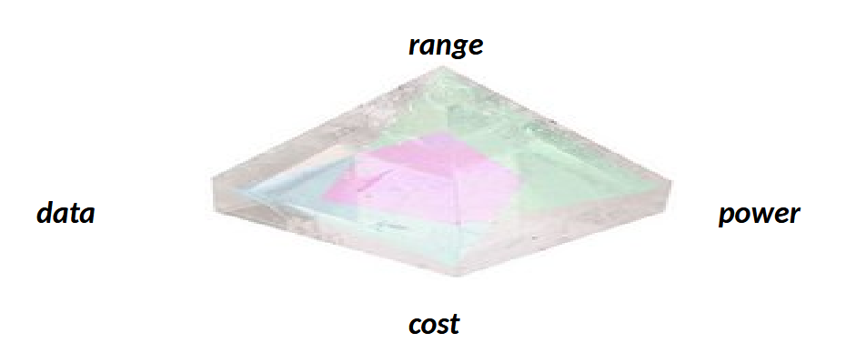
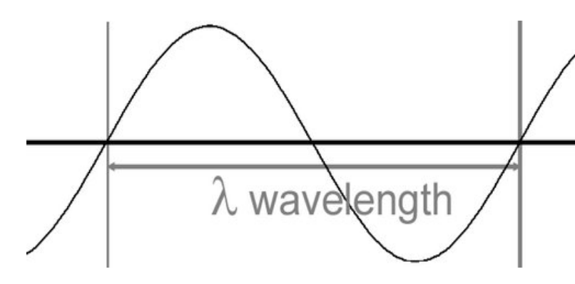
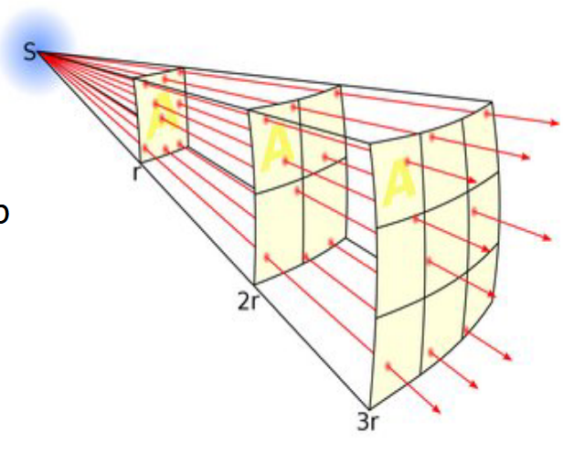
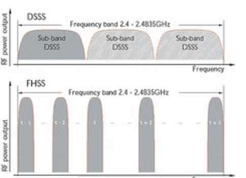
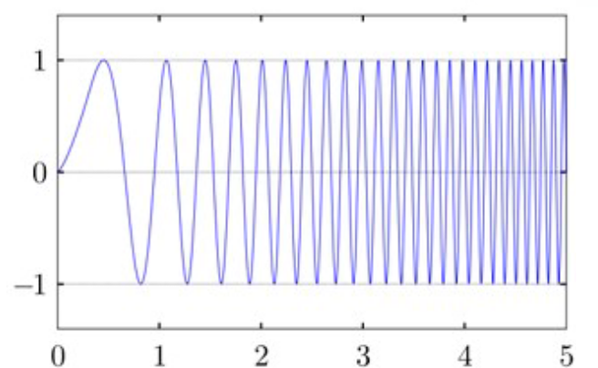
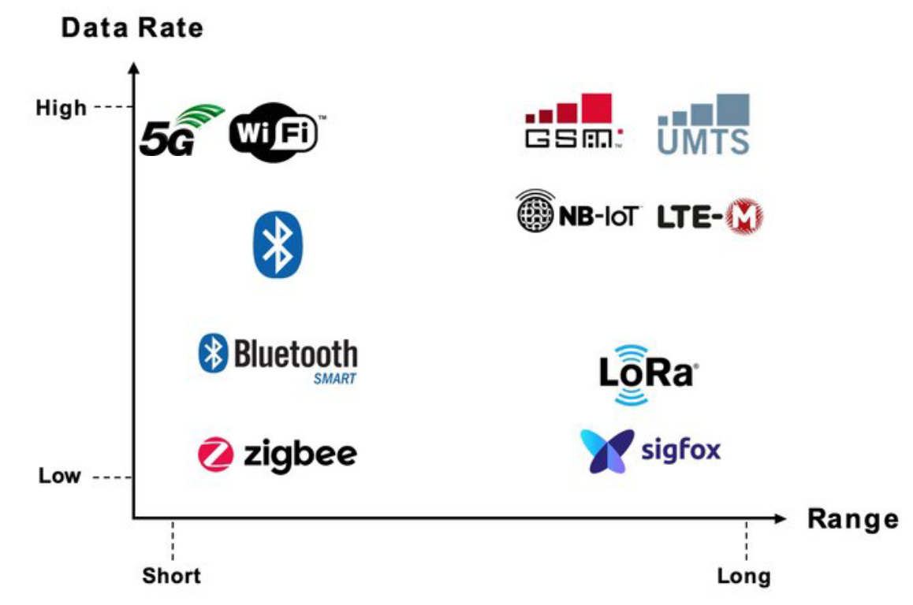
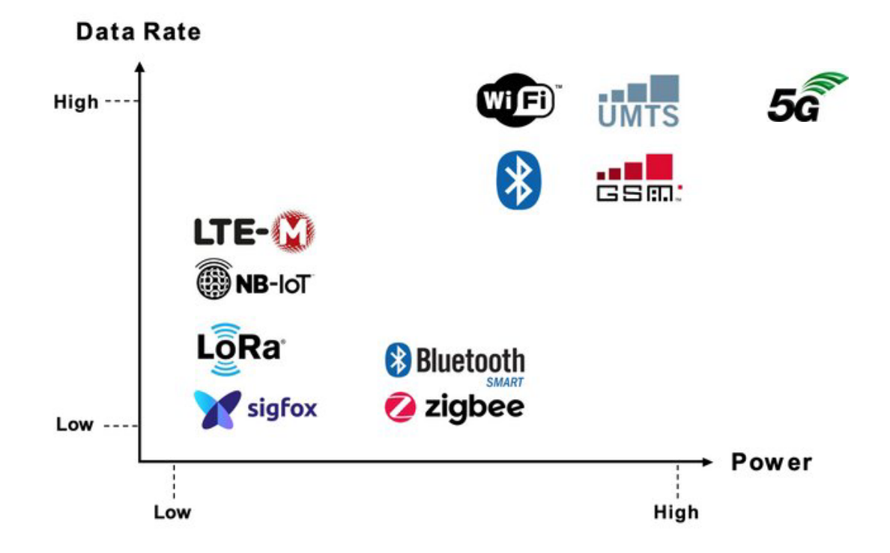
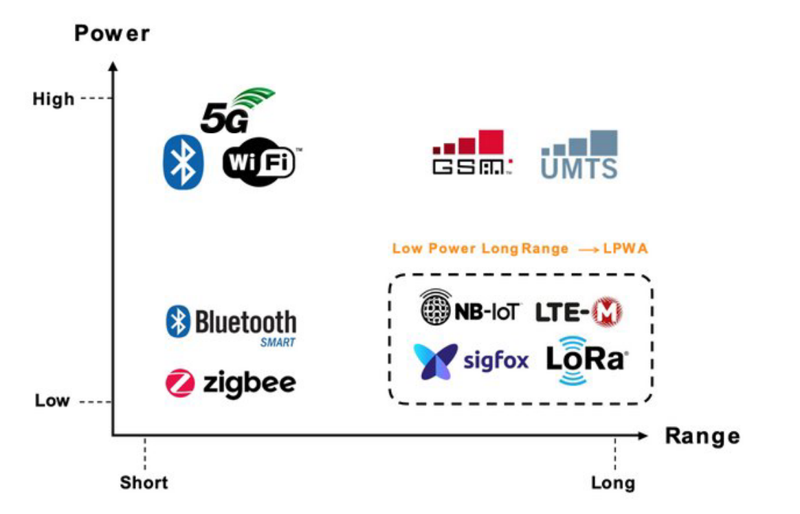

# Lecture 4 - Networking Part I

## Layer Models

### TCP/IP and OSI models

**OSI/ISO**:
* 7 Layer Models

**TCP/IP**:
* 4 Later model

Each layer has a specific function. This makes it easier to pinpoint where issues are occuring in the event of a failure. 

---

Where do the following belong?
… a web browser? Application
… 923 MHz? Physical
… a copper cable? Physical
… Wi-Fi? Physical and Data Link
Can we have MQTT without IP? MQTT by deisgn assumes an IP-based transport (TCP)
Can you do LoRa on 2.4 GHz? Yes, but it is mostly found on larger frequencies

---

### Network Centric View

*Things* are unstable, heavily constrained and have little banwidth.

While the others are *stable*, and have plently of bandwidth.

### Networking options for *Things*

* **Wireless**
  * Human connectivity networks (WiFi, Bluetooth)
  * Low-rate wireless personal area networks (LR-WPANs) (zigbee, 802.15.4)
  * Cellular (GSM, LTE 4G, 5G)
  * Low Power Wide Area Networks (LPWAN, cellular and non-cellular)
* **Wires, cables or fiber**
* ***Exotic* accoustic modems for underwater**

These can be distinguished in several ways:
* Terrestrial (above) vs. Satellites, Aerostats, HAPs
* EM vs. non-EM options

### Criteria
*How do we choose the right option for a given case*

**Central criteria**:
* *Range*
  * Line of Sight (LOS) / Non-line of sight (NLOS)
  * Coverage (local, regional, global, one/many locations)
* *Data rates*
  * Packet sizes (how much do I need to send?)
  * Flexibility of packets (does size vary?)
  * Latency (real time?)
  * Capacity/scale(how many nodes?, up/downlink)
* *Power*
  * Main power cost: transmission/networking
  * Sending the sample requires 100x more power than sampling it!
* *Cost*
  * Cost of hardware, networks, infrastructure
* Business model
  * provider, public, self-driven?
* Regulations
  * laws/legalities/regulations
  

IoT Networks are characterized (but not always) by:
* Very low bandwidth (often few bytes)
* Lower power (long autonomous lifetime)
* Low cost per node (essential)
* Range/reach (can vary from meters to 1000's of kms)

*Have we not forgotten something?*

Yes! The *S* in IoT stands for Security
* It is very dangerous to assume that security can be achieved on network level, i.e. choose a networking option based on security, and then assume that the system is “secure”.

### Physical Layer

The raw physical layer (PHY) consists of:
* Copper, glass, electromagnetics, optics, waves, beams etc.

### Electromagnetic waves
* “Wireless” = Electromagnetic waves
* Oscilate and travel in space.
* They have a speed, a frequency, and a wavelength

\[c = \lambda \times v\]  
\(c\): Speed of light (≈ 3×10⁸ m/s)  
\(\lambda\): Wavelength (m)  
\(v\): Frequency (1/s = Hz) also called \(f\).

Electromagnetic waves do not require a physical medium to transporthem 
* They can travel through vacuum and through physical mediums (depending on what that medium is).

They do not move in a straight line, it is wave front. 

We call them radio waves: 30 Hz to 300 GHz

### Properties of the physical layer

| **Low Frequency**       | **High Frequency**      |
|-------------------------|-------------------------|
| Long wavelength         | Short wavelength        |
| Better penetration      | Easily blocked          |
| Longer range            | Shorter range           |
| Better NLOS capability  | Strictly needs LOS      |
| Less data *             | More data               |

### LOS vs NLOS
 
- LOS: Straight‐line path (“Fresnel zones”) → minimal obstruction.  
- NLOS: Diffraction around obstacles; higher attenuation.

### Link budget and dB 

- **Definition**:  
  Link budget is the **calculation of losses and gains** along a full signal path.

- **Margin**:  
  The **remaining signal left** along the whole link after accounting for all gains and losses

    \[
  \text{dB} = 10 \times \log_{10}(P_1 / P_0)
  \]

  - **+3 dB** = double the power  
  - **–3 dB** = half the power  
  - **+10 dB** = one order of magnitude up (×10)  
  - **–10 dB** = one order of magnitude down (÷10)
  
- **Why dBs?**  
  - Nature tends to behave logarithmically (e.g., rabbit population growth, attenuation in materials).  
  - Calculating in dB is easier for adding/subtracting gains and losses
  
Two kinds of contributions to Link budget:
– what we can not change: path loss
– what we can change: antennas, cables, RX, TX.

### Path loss / Free space Loss

- **Free Space Path Loss** is the **signal loss due to distance** in free space, caused purely by **geometry** — **not** by obstacles, fog, trees, rain, etc.
- Represents the ideal loss from a transmitter to receiver in a straight line (Line-of-Sight, LOS).
- Real-world losses (obstacles, weather) are **added on top** of FSPL.
\[
\text{FSPL} = \left(\frac{4\pi d f}{c}\right)^2
\]
- \(d\): distance between transmitter and receiver  
- \(f\): frequency of the signal  
- \(c\): speed of light (~3×10⁸ m/s)

### Relevant Frequencies

**ISM** (Industrial Scientific Medical):

* 433 MHz – 70 cm
* 868 (EUR, Africa) / 915 (US) MHz – 35 cm
* 2.4 GHz – 802.11b/g – 12 cm
* 5.x GHz – 802.11a – 5...6 cm

### Modulation & Encoding

> modulation is the process of varying one or more properties of a periodic waveform (carrier signal), with a modulation signal that contains information to be transmitted. 

Modulation techniques include:
* Spread Spectrum (e.g. FHSS Frequency Hopping) used in Bluetooth
* Direct-sequence spread spectrum (DSSS) used in 802.11b
* Orthogonal frequency-division multiplexing (OFDM) used in 802.11a/g/n/c
* Chirp spread spectrum (CSS) as used in LoRa

*These techniques are crucial for robustness against noise and utilization of spectrum*

**Spread Spectrum (FHSS Frequency Hopping)**:

**Chirp SPread SPectrum (CSS)**:

### OFDM

 **OFDM** = **Orthogonal Frequency Division Multiplexing**
- It is a **modulation technique** that splits a signal into **many smaller sub-signals** (subcarriers) that are transmitted **simultaneously** at **different frequencies**.
- **Subcarriers are closely spaced and overlapping**, but designed to be **orthogonal**.
- This means their **sidebands cancel out** at the center frequency of adjacent carriers, so **no interference** occurs between them.

### IoT Options (Networking Technologies)

| **Category** | **Full Name**                | **Examples**                    |
|--------------|------------------------------|----------------------------------|
| **WPAN**     | Wireless Personal Area       | Bluetooth, Zigbee               |
| **WLAN**     | Wireless Local Area          | Wi-Fi, Bluetooth                |
| **LPWAN**    | Low Power Wide Area          | LoRa, NB-IoT, Sigfox            |
| **Cellular** | Cellular Network             | 3G, 4G, 5G                      |
| **Wired**    | —                            | Ethernet, RS-485                |
| **Other**    | —                            | Acoustic, Optical, Power-line   |

*Another one*:

| **Technology** | **Frequency**              | **Modulation**    | **Reach**        | **Bandwidth**           | **Data Rates**     | **Power** | **Cost**     |
|----------------|----------------------------|-------------------|------------------|--------------------------|---------------------|----------|--------------|
| **LoRa**       | 433, 868/915, 2400 MHz     | Chirp SpreadS     | 10s of kms       | 125 kHz                  | Some 100 Bytes      | low      | Low (..)     |
| **Sigfox**     | 868/915 MHz                | UNB               | 10s of kms       | 100 Hz                   | Some Bytes          | low      | Low          |
| **LTE-_**      | 1.8–2.7 GHz                | OFDM              | (km)             | 200 kHz                  | high                | Mid      | Mid          |
| **Wi-Fi**      | 2.4/5 GHz                  | OFDM              | 100 m .. 100 km  | 20/40 MHz per channel    | high                | high     | Mid          |
| **Bluetooth**  | 2.4 GHz                    | FHSS              | 10 m             | 1 MHz per channel        | mid                 | mid      | Low          |
| **RPMA**       | 2.4 GHz                    | DSSS              | 10s of kms       | 80 MHz                   | (flexible)          | low      | Low (...)    |
| **Zigbee**     | 433, 868/915 MHz           | DSSS              | 100 m            | MHz                      | bytes               | Low      | Low          |

### Range vs. Data Rate

