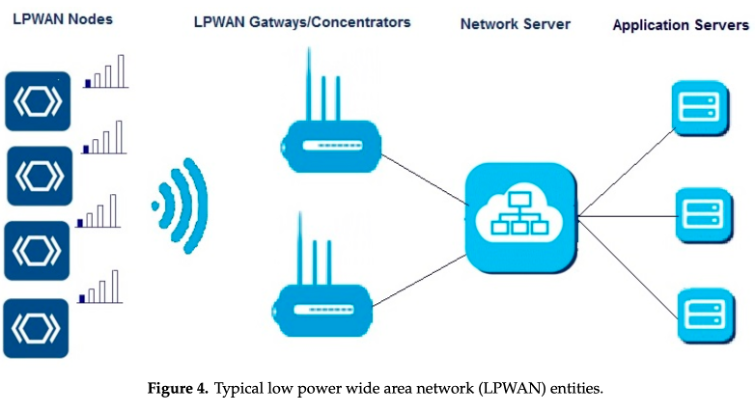
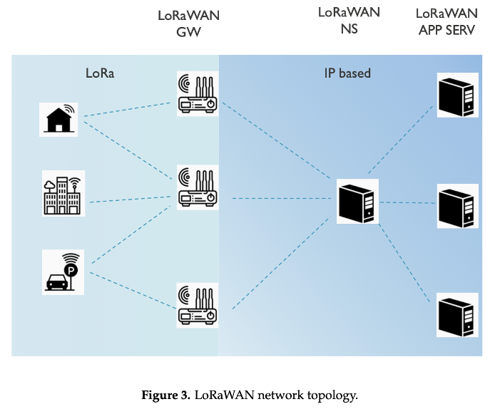
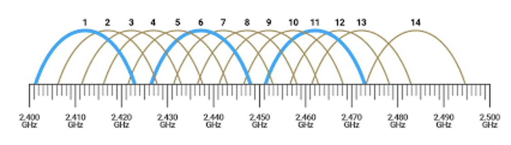
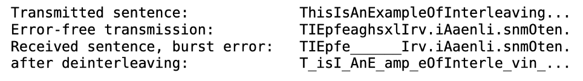
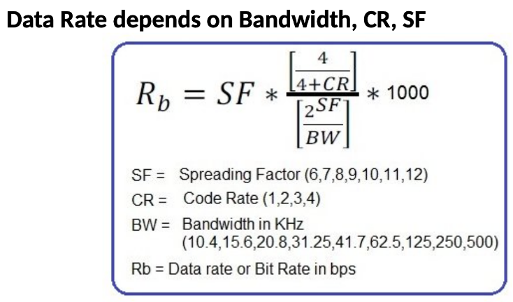
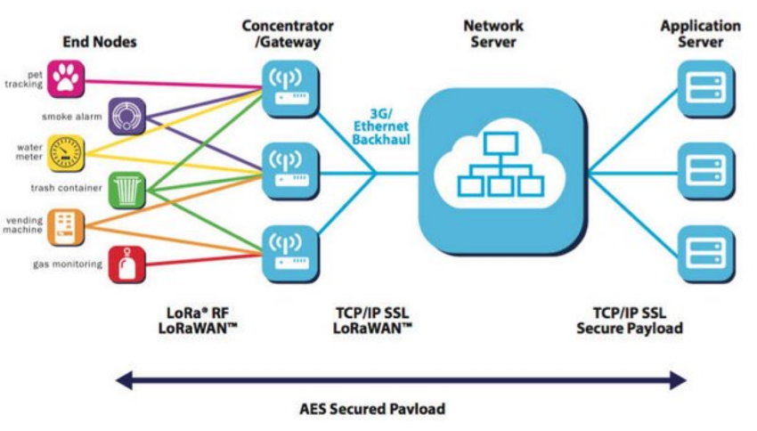
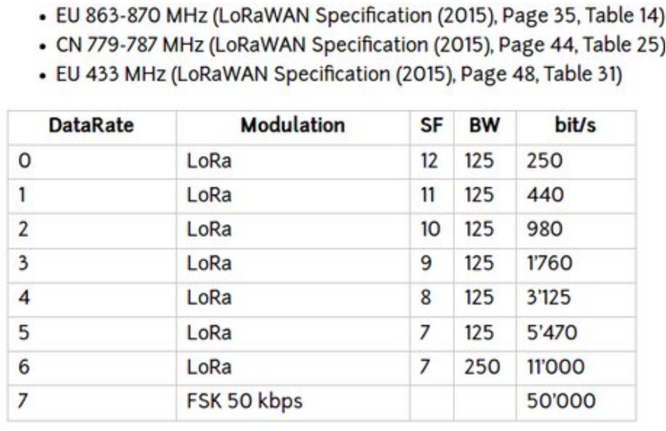
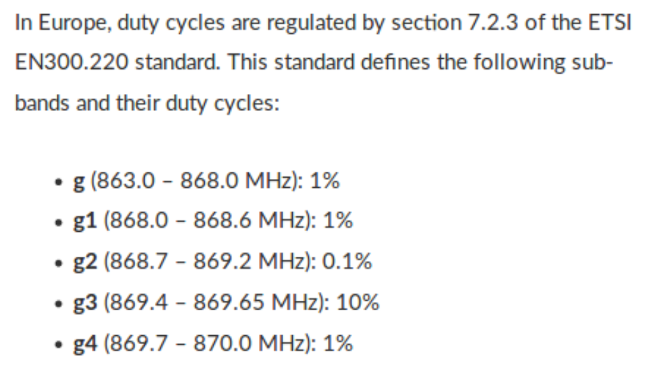

# Lecture 5 - Networking 2 - LPWAN, LoRa & LoRaWAN

## Low power wide area networks: An overview
>Low Power Wide Area (LPWA) networks are attracting a lot of attention primarily because of their ability to offer affordable connectivity to the low-power devices distributed over very large geographical areas.

>The legacy non-cellular wireless technologies are not ideal to connect low power devices distributed over large geographical areas. The range of these technologies is limited to a few hundred meters at best. The devices, therefore, cannot be arbitrarily deployed or moved anywhere, a requirement for many applications for smart city, logistics and personal health.
> With a phenomenal range of a few to tens of kilometers and battery life of ten years and beyond, LPWA technologies are promising for the Internet of low-power, low-cost, and lowthroughput things. A very long range of LPWA technologies enables devices to spread and move over large geographical areas.

### Design goals and techniques
#### Long range
>LPWA technologies are designed for a wide area coverage and an excellent signal propagation to hard-to-reach indoor places such as basements.

Quantitatively, a +20 dB gain over legacy cellular systems is targeted. This allows the end-devices to connect to the base stations at a distance ranging from a few to tens of kilometers depending on their deployment environment (rural, urban, etc.).

#### Ultra low power operation
>Ultra-low power operation is a key requirement to tap into the huge business opportunity provided by battery-powered IoT/M2M devices. 

A battery lifetime of 10 years or more with AA or coin cell batteries is desirable to bring the maintenance cost down.

#### Low cost
>The commercial success of LPWA networks is tied to connecting a large number of end devices, while keeping the cost of hardware below \$5 and the connectivity subscription per unit as low as \$1.

#### Scalability
>The support for massive number of devices sending low traffic volumes is one of the key requirements for LPWA technologies. These technologies should work well with increasing number and densities of connected devices.

### LPWAN Technologies
* **Sigfox**: Ultra-narrowband, long range, low data rate.
* **LoRaWAN**: License-free, supports public and private deployments.
* **NB-IoT** (Narrowband IoT): Operates in licensed spectrum, high reliability.
* **LTE-M**: Cellular-based, higher data rates than NB-IoT.

### Applications of LPWAN
Used in various smart and industrial sectors, including:
* **Smart Cities**: Parking, lighting, environmental monitoring.
* **Agriculture**: Soil and crop monitoring, livestock tracking.
* **Healthcare**: Wearable medical devices, remote patient monitoring.
* **Logistics**: Asset tracking, fleet management.
* **Utilities**: Smart metering, energy management.

### Characteristics and Requirements
LPWAN networks must support:
* **Massive scalability**: 100K+ devices.
* **Low power consumption**: Battery life of 10+ years.
* **Wide coverage**: Up to 40 km in rural areas, 1-5 km in urban settings.
* **Security**: Protection against cyber threats and eavesdropping.
* **Low cost**: Affordable deployment and maintenance.
* **Interoperability**: Compatibility with IoT/cloud platforms.

### Design Considerations
* **Traffic & Capacity**: Managing congestion, priority-based traffic.
* **Energy Efficiency**: Sleep modes, low-duty cycles, optimized MAC protocols.
* **Coverage Optimization**: Power boosting, repeated transmissions.
* **Security & Privacy**: Authentication, encryption, device protection.

### A survey of LoRaWAN for IoT: From technology to application
> LoRaWAN is a Low Power Wide Area Network (LPWAN) technology designed for IoT applications requiring long-range, low power, and low data rate communication. It enables wireless connectivity for battery-operated devices across several kilometers.
LoRaWAN provides public and private network deployment options.

#### Technical Aspects
> **LoRa Physical Layer**
>* Uses Chirp Spread Spectrum (CSS) modulation, providing robustness against noise and interference.
>* Operates in unlicensed sub-GHz frequency bands (433 MHz, 868 MHz, 915 MHz).
>* Data rate varies based on Spreading Factor (SF) and bandwidth.
>* Adaptive Data Rate (ADR) mechanism optimizes data rate and power usage.

> **LoRaWAN MAC Layer**
> LoRaWAN follows a star topology, where end devices communicate with gateways that forward data to a central network server.
> Defines three device classes:
> * Class A: Lowest power consumption, two downlink slots after each uplink.
> * Class B: Periodic receive slots, allowing more downlink opportunities.
> * Class C: Continuous listening mode for low-latency applications.

#### Security & Challenges
> Uses AES encryption for message integrity and confidentiality.
> Vulnerabilities include:
> * Attacks: Malicious nodes can resend old messages.
> * Eavesdropping: Lack of integrity checks between network and application servers.
> * ACK spoofing: Attackers can disrupt device communication.

***Security measures:***

- Three distinct 128-bit AES keys:
    - The application key AppKey is only known by the device and by the application. When a device joins the network (this is called a join or activation)
    - an application session key AppSKey and;
    - a network session key NwkSKey are generated.
    
    The NwkSKey is shared with the network, while the AppSKey is kept private.
    

This is how we protect the data in transit.

#### LoRaWAN Performance & Limitations
* Coverage: Up to 15 km in rural areas, 2–5 km in urban environments.
* Interference: Affected by other LPWAN technologies like Sigfox, NB-IoT.
* Energy Efficiency: Battery life of 1–10 years depending on transmission frequency and data rate.
* **Scalability**: High device density can cause collisions and affect performance.

## Modulation and encoding
> In electronics and telecommunications, modulation is the process of varying one or more properties of a periodic waveform, called the carrier signal, with a modulating signal that typically contains information to be transmitted. 
> Most radio systems in the 20th century used frequency modulation (FM) or amplitude modulation (AM) to make the carrier carry the radio broadcast.

## Frequency Band and Channel
A frequency channel refers to a specific range of frequencies that are used for communication purposes. They are used to distinguish between different supported physical layers (PHYs).

>2.4 GHz is 12 cm wavelength
>2.4 GHz is where Wi-Fi and Bluetooth coexist without interfering with each other. This is because they use two different modulation schemes.
>At 2.4 Ghz we have 13 channels for Wi-Fi.

A Wi-Fi channel is a frequency range within which wireless devices can communicate. The frequencies used by Wi-Fi networks are typically split into 14 channels in the 2.4 GHz band, 34 channels in the 5 GHz band, and up to 59 channels in the 6 GHz band.

## Spreading factor (SF)
* Think of it as “one bit is spread out over so and so many pulses”: 
  * $One \; symbol = 2^{SF chirps}$ 
  >A chirp is a sound that goes up and down. It is a series of signals that goes up and down, in a precise sequence. 
  > This works because nothing in nature does this, therefore this signal is unique and will stand out.

## Control rate (CR)
* Determines depth of forward error coding
* Think of it as saying CCCAAAFFFEEE or CAFECAFECAFE instead of CAFE
* Often expressed as $\frac{number \; of \; signal \; bits}{number \; of \; total \; bits}$
  
**Interleaving**
* Mixing up the letters to gain robustness against burst errors
* We can reconstruct signals even though they are in pieces

## Data rate
> In LoRa (Long Range) technology, the data rate is influenced by the spreading factor (SF) and bandwidth (BW).
> 
>* **Higher bandwidth** (BW) allows for a **higher data rate**, meaning more data can be transmitted per unit of time.
>* **Lower spreading factor** (SF) results in a **higher data rate** because the symbol duration is shorter. Conversely, a **higher SF** increases the range and reliability but **reduces the data rate**.
>* The coding rate (CR) also affects the data rate. A higher coding rate improves error correction but lowers the effective data rate.

## LoraWAN
**Architecture**
* Gateways are transparent bridges relaying messages between end-devices and a central network server in the backend.
* Gateways are connected to the network server via standard IP connections while end-devices use single-hop wireless communication to one or many gateways.
* All end-point communication generally bidirectional, supports multicast enabling software upgrade over the air or other mass distribution messages

### Device classes
* Class A: Battery powered, small loads, long breaks, long latency, unicast
* Class B: low latency, scheduled receive slots, periodic beacon from gateway, uni/multicast, higher power, 14-30 mA
* Class C: no latency, uni/multi, constantly receiving, power hungry

Classes can be dynamically assigned / changed.

### Addressing
> Devices and applications have a 64 bit / 8 byte unique identifier (DevEUI and AppEUI).
> When a device joins the network, it receives a dynamic (non-unique) 32-bit / 4 byte address (DevAddr).

>Why are MAC addresses only unique in principle?
>A: You can spoof them.

### Data rates
LoRaWAN abstracts the PHY data rates of LoRa - for EU / CN:

### Duty cycles
> Duty cycle is the percentage of time a device is actively transmitting versus its total cycle time.
>LoRaWAN implements duty cycle rules made by regulators.
On top of that, specific networks might have fairplay rules.

## The Things Network
>Anyone shall be free to set up "Things" and connect to "Things Gateways" that may or may not be their own.
>Anyone shall be free to set up "Things Gateways" and connect to "Things Access" that may or may not be their own. Their "Things Gateways" will give [free] access to all "Things" in a net neutral manner, limited by the maximum available capacity alone.
