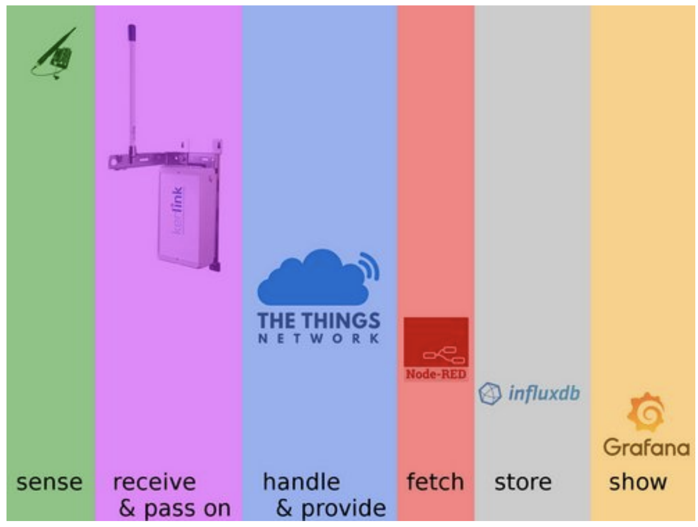
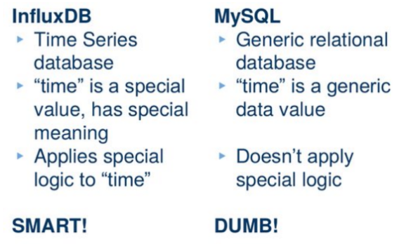
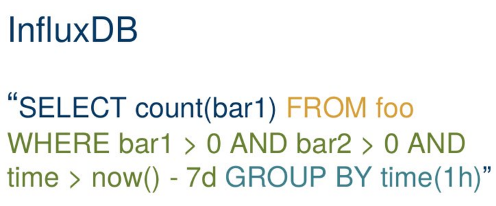
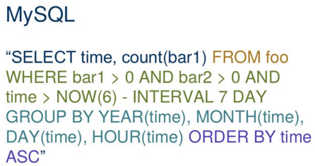
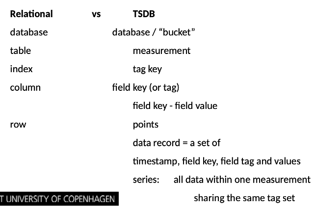

# Lecture 6 - Data stacks, management and visualization
1. Edge device capture sensor data
2. Gateway receives data, and forwards it to TTN.
3. TTN handle data in the cloud, and provides a MQTT server to transmit messages.
4. A Python script or Node-RED is used to fetch messages from MQTT and store data in a Timeseries DB.
5. Influx DB stores the data.
6. Grafana reads data from Influx DB to visualize the data.


## Time series database (TSDB)
>Time Series Databases are a form of NoSQL databases, non-relational databases though in fact many are very near-SQL.

> **Time series databases are different from relational** **databases** - Note the benefits, but also fundamental trade-offs!
>* Schema-less: no definition of "table" schemes - just write! Any write creates a “table”
>* Like an SQL database table where the primary key is pre-set by the system and is always time.
>* Time stores timestamps, in RFC3339 UTC, precision might vary
>* Time is assumed to be ascending – and only ascending!
>* Time series data is predominantly new data that is never updated. UPDATE and DELETE are very limited / impossible.

>How time series databases are different from relational databases:
>* To simplify conflict resolution and increase write performance, data sent multiple times is seen as duplicate data. Identical points aren’t stored twice.
>* If temperature at 15:00 is 21 degrees, it s not 23 degrees!
>* Provide time specific functions, such as now()
>* ```SELECT * FROM "meters" WHERE time > now() - 1h```

## NoSQL - InfluxDB vs. Relational DB - MySQL


### InfluxDB query
InfluxQL is SQL-like, but different enough that it cannot be passed through MySQL



### MySQL query


## InfluxDB
>InfluxDB is an open-source time series database developed by InfluxData. It is written in Go and optimized for fast, high-availability storage and retrieval of time series data in fields such as operations monitoring, application metrics, Internet of Things sensor data, and real-time analytics.

>SQL-like language with built-in time-centric functions for querying a data structure composed of measurements, series, and points. 

>Main differences to a classical SQL database or NoSQL database: 
>* It s for time series - nothing else! 
>* A "table" (called measurement here) has 2 “columns”, not more: a timestamp and the value for that point in time. (You can add optional “tags” to create some structure)
>* You would not keep an address database or such in InfluxDB.



### Tags
> Tags are optional. You don’t need to have tags in your data structure, but it’s generally a good idea to make use of them because, unlike fields, tags are indexed. This means that queries on tags are faster and that tags are ideal for storing commonly-queried metadata. Properties that you often query for should best be tags: e.g. all values for meter with ID=3, all sensors from room=3A52.

### Shard
>A shard contains the actual encoded and compressed data, and is represented by a TSM file on disk. 
Every shard belongs to one and only one shard group. Multiple shards may exist in a single shard group. Each shard contains a specific set of series. The default shard is one week of data.

## Grafana
Visualizing, Monitoring, Analyzing, Querying, Alerting.


