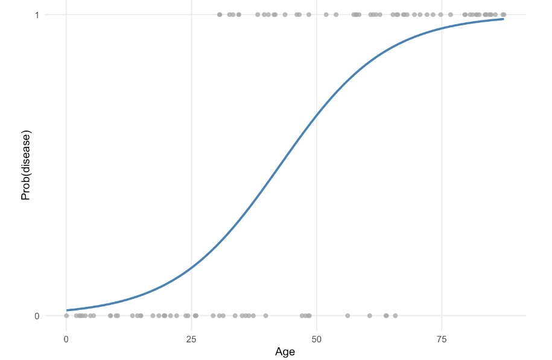

# Lecture 7 - Data Analytics (ML basics)

## Data at the Edge

*What types of data do we collect at the edge and what are their modalities?*

> *Modalities*: a particular mode in which something exists or is experience or expressed
* Sensor Data
* Timeseries data (temperature, CO2 etc.)
* Images
* Sounds

*But what do we do with data collected?*

### Placement of Data Analytics

- **Cloud / server processing**
    - Possible data dependencies
    - Online / stream processing
    - Offline
- **Fog processing**
    - Online
    - Also data dependencies, aggregation
    - Sensor → Intermediate (collects from multiple sensor devices) → cloud server (where you get the aggregate)
- **Edge/tiny processing**
    - Online
    - Can only process data it collected
    - Most of processing/pre-processing happens on the device itself

*Why do it in cloud vs edge? What are the limitations of one or the other?

- **Cloud Computing**: Centralized, scalable, and powerful. Ideal for data-heavy processing, AI training, and storage.
    - **Limitations**: High latency, bandwidth costs, privacy concerns, reliance on internet connectivity.
- **Edge Computing**: Processes data closer to the source (IoT devices). Reduces latency, improves real-time decision-making, and lowers bandwidth usage.
    - **Limitations**: Limited processing power, storage, and scalability compared to the cloud.

### Types of data 

- **escriptive statistics – very simple, but very fast**
    - Mean, median, variance, correlation, etc.
- **Traditional machine learning methods**
    - Logistic regression, least squares, support vector machines, etc.
    - More explainable, but might not provide best results especially on high-dimensional data
- **Deep learning**
    - Anything from MLP, up to LLMs

## Machine Learning 101

### Terminology

* Sample – one measurement, row of data
* Feature – column, temperature can be one, CO2 another feature
* Label – ground truth – what you would like your model to predict
* Fitting / training
* Predicting / inference

*Based on output*

* Classification
* Regression
* Clustering 
* Some derivative of these

*Supervised vs. Unsupervised*

### Classification 
* Logistic regression
  
* Decision trees
  
* Random forrest
  * Ensemble of decision trees with 2 sources of randomness
    * Trees are trained on random subsets of the training set
    * Nodes are split using only a subset of features
* Support vector machines

### Regression
* Least squares
    * Finding the line that minizes the sum of squared residuals
    
* Least squares on polynomial features (not linear anymore)
* Decision trees (not great due to overfitting)
* Support vector machines

### Clustering 
* K-means
  * Clustering data into N clusters by their distance to N points
  
* DBSCAN
  
### Data Quality
* Garbage in, garbage out
