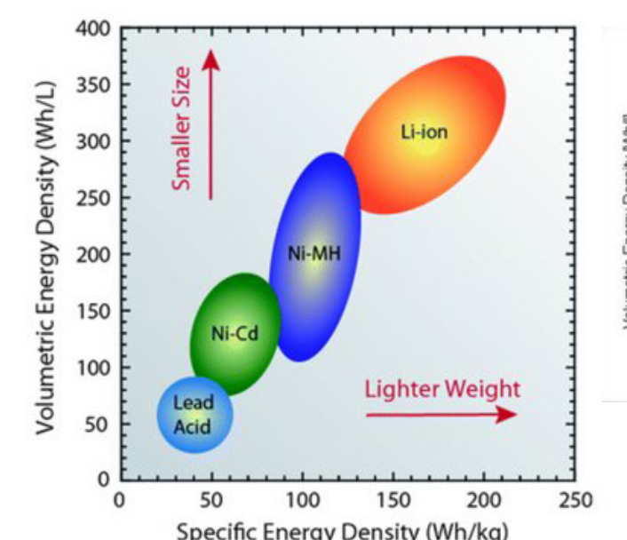
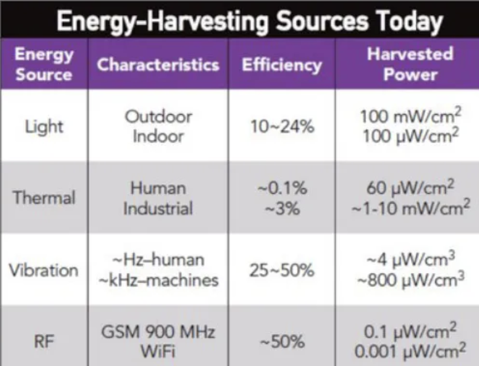

# Lecture 8 - Energy 

We can look at two different angels:
* *Large scale IoT systems and their energy implications*
* *Small scale, device level and their energy consumption and optimization*

---

### Large Scale

It is said that *IoT, sensors, data and some form of "smartness" are a part of the "green
transition*, however this is neither supported by data or evidence.

As there is a massive rollout of IoT devices (small individually), that are dependent on a supportive infrastructure of networks and data centers, **IoT creates a significant environmental footprint itself**.

### Small scale

On small scalae, there is work to do:
* Understand, plan, monitor and optimize a device's power usage.

### Jevon's paradox

> Efficiency gains on smale scale typically do not lead to overall decrease in
consumption – quite the opposit

### IoT and Energy

There is two angles:

1. *IoT (and digitalization in general) is seen as an integral part of
the green transition and of reaching CO2 neutrality*
2. IoT relies heavily on
infrastructure, data centers, networks
as well as batteries, circuits, MCUs -
and thus itself is a significant consumer.

### Energy and Cloud

*Exact description or estimation of the IT environmental footprint is hard*

- Someone asked me about energy footprint of keeping their pictures and videos in the cloud -
    - Is it like a light bulb? A fridge? A car?
    - I couldn’t answer initially and neither could my colleagues.

***What resource does it consume?***

- Electricity (or energy in form of electricity), minerals & metals (sill-econ), water (cooling or use for materials).

### Footprint and handprint

**Footprint**:
> A measure of the **negative environmental impact** of an action, product, or organization (e.g., carbon footprint, water footprint).

**Handprint**:
> A measure of the **positive environmental contributions** or **beneficial actions** taken to reduce others' footprints or improve sustainability.

### IoT Life Cycle Assessment or Analysis (LCA)

**Definition**:
> a methodology for assessing environmental impacts associated with
all the stages of the life cycle of a commercial product, process, or
service

1. Identify possitive handprint
2. Identify negative footprint
   
## Energy 

### Powering devices
*Devices need power*

We need to dicuss the *fundamentals*:
* Current I, measured in Ampere \(A\)
* Power P, measured in Watt \(W\)
* Voltage U, measured in Volt  \(V\)

*Converting between them*:
Power (P) = Voltage (U) * Current (A)
Current (I) = Power (P) / Voltage (U)
Voltage (U) = Power (P) / Current (I)

*Ohm's Law*:
Resistance (R) = Voltage (U) / Current (I)

*Units*:
| **Quantity**     | **Symbol** | **Unit**           | **Formula / Notes**                       |
|------------------|------------|--------------------|-------------------------------------------|
| **Charge**       | Q          | Coulomb [C]        | 1 electron = 1 elementary charge          |
| **Current**      | I          | Ampere [A]         | I = Q / t                                 |
| **Resistance**   | R          | Ohm [Ω]            | **Ohm’s Law**: R = U / I                  |
| **Energy / Work**| E          | Joule [J], Watt-hour [Wh] | E = P × t                         |
| **Battery Capacity** | C     | Ampere-hour [Ah]   | C = I × t

### Class of Operations

**Grid-Powered**: 
* Device is **dependent** on continuous external power from the electrical grid.
* - **Best for**: Applications in or near **buildings or infrastructure**.

**Battery / storage**: 
* Device is **temporarily autonomous**, operating on stored energy.

  | Property             | Unit     | Description                                  |
  |----------------------|----------|----------------------------------------------|
  | **Capacity**         | [Ah], [mAh] | Total charge it can store                 |
  | **Energy Density**   | Wh/L      | Energy per volume                            |
  | **Specific Energy**  | Wh/kg     | Energy per mass                              |
  | **Max Current**      | A         | Peak current device can supply safely        |
  | **Discharge Profile**| —         | Trickle, peaks, self-discharge, etc.         |

  
- **Types**:
  - **Battery (electrochemical)**  
    - Common types: Li-ion, Alkaline, NiMH, etc.
  - **Supercapacitor (electrostatic)**  
    - Suited for short bursts, fast charge/discharge

**Autonomous**:
* Device operates **independently of any fixed power source**.

* Subtypes:
   - **Semi-Autonomous**:  
  - **"Parasiting"**: Taps power from nearby systems (e.g., USB, power lines, vibrations).

- **Fully Autonomous**:  
  - **"Harvesting"**: Collects energy from the environment.
  - Sources include: Light, Motion, Heat, RF etc.
    

**Criteria for Harvesting**:
* Power needed
* Space / weight available
* Availability of source (location)
* Durability
* Maintenance
* Moving parts

**Sources**:
* Solar
* Kinetic
    - Piezzo crystals (same principle to harvest energy from vibrations)
- Thermal
    - Thermolectric (Peltier / Seebeck / Thomson) effec
- RF, wireless
    - Any wireless receiver is de-facto harvesting energy
- Hydro & Wind

### Minizing Power
*Minimizing energy consumption, by implementing effective **duty cycles***

**Duty cycles**:
(Deep) Sleep cycles

- mA for normal sleep (modem sleep, light sleep)
- ~uA for deep sleep
    
    Wake-up on
    
- Timer/clock (on-board)
- External interrupt, event, network, ..

### Power & Networking - WiFi

The main power cost is transmission/networking
*  Sending the sample requires 100x more power than sampling it!

### LoRA case study
- Spreading Factor directly impacts battery life
- sensor nodes are single-use devices with regards to battery –
when battery empty, you throw them out
(reason: warranty for IP6x waterproofness – whole device is sealed)
- huge implications both economically and environmentally!

## Take Aways

• IoT and Energy relation – multiple dimensions
• Large scale: IoT and general ICT power consumption
• Handprints – Footprints – LCA
• Practical on device level
● How to power devices – options:
● Classes of operation
● Energy Harvesting, sources
(solar, thermal, kinetic, RF, ..)
● Energy optimization: sleep, network