# Lecture 9 - Edge computing & TinyML

In industiral and manufacturing we see a huge increase of use of TinyML, such as:
* **Vision**: Crop monitoring
* **Sound**: Keyword spotting
* **Combination**: Poaching detection, sound + motion/position

## Where is edge computing and TinyML
>* Edge AI is from device to network server
>* TinyML is only used on the edge devices.
>* Cloud AI is only in the cloud
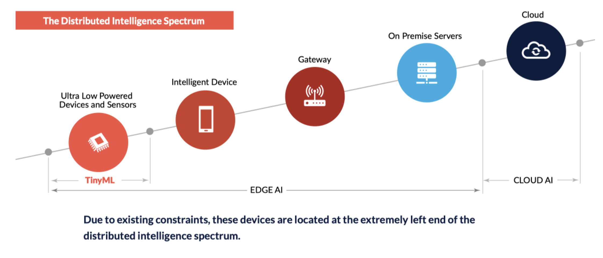

## Why use TinyML
>5000 petabytes of data comes from IoT daily <1\% is processed after collection.

>**TinyML can serve as a data reduction/filtering method**

## Challenges
### Hardware
* Heterogeneity – varying architectures
* Resource-constraints
### Software
* No OS and memory management (mostly)
* Heterogeneous tooling

## Microcontrollers
### Low end
* 4-16-bit architecture
* 10s of KBs of Flash
* Bytes-KBs of RAM
### High end
* 32-bit arch
* MBs of Flash
* 100s KBs-MB of RAM
* Floating-point unit
* SIMD

### Microprocessor vs Microcontroller
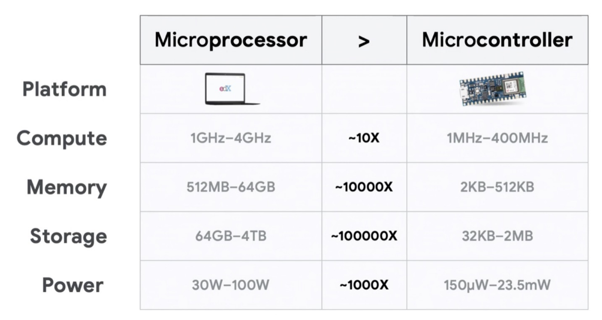

### Digital signal processros (DSP)
> Microcontrollers optimized for single function, e.g. keyword spotting, fast fourier transform.
>
> They look at changes in signals.

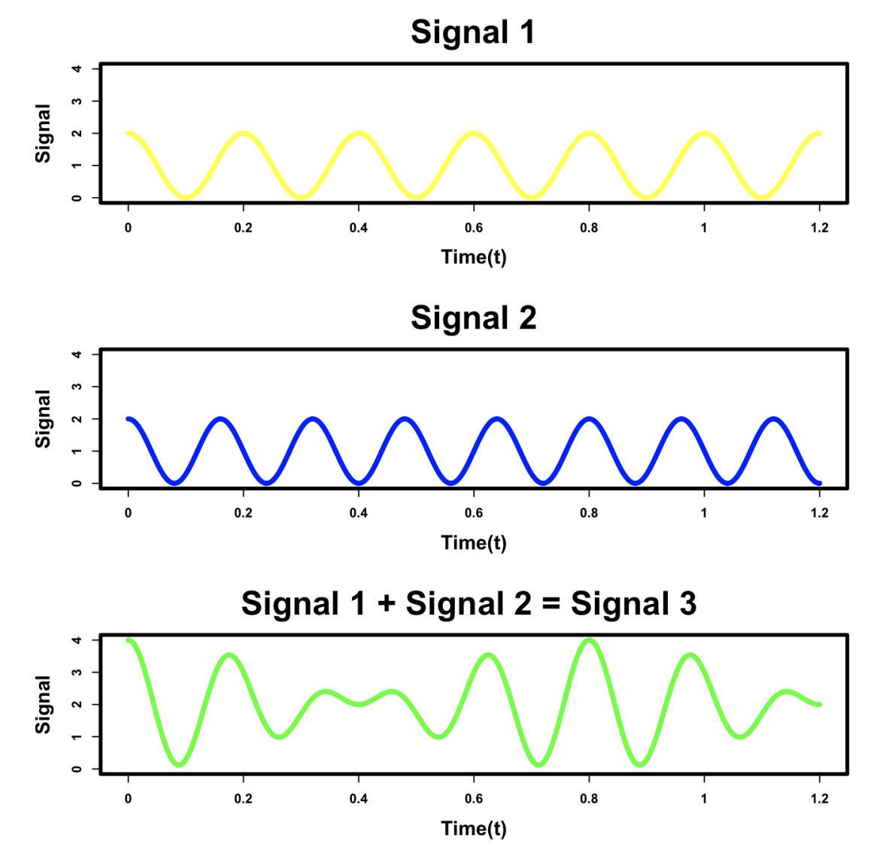

### Systems on Chip (SoCs)
>Packs functionality of larger systems into single chip.
* CPU+(Memory)+(GPU/FPGA)
* 64-bit arch.
* Multi-core
* 100s mA
* Operating system and memory management
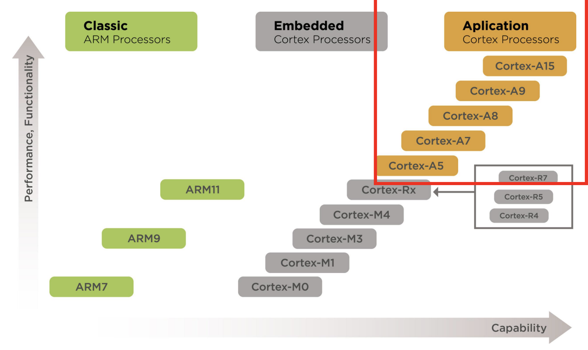

### Accelerators
> Chips designed specifically for deep learning
> They are:
> * Faster
> * More efficient
> * But, draw more power
> 
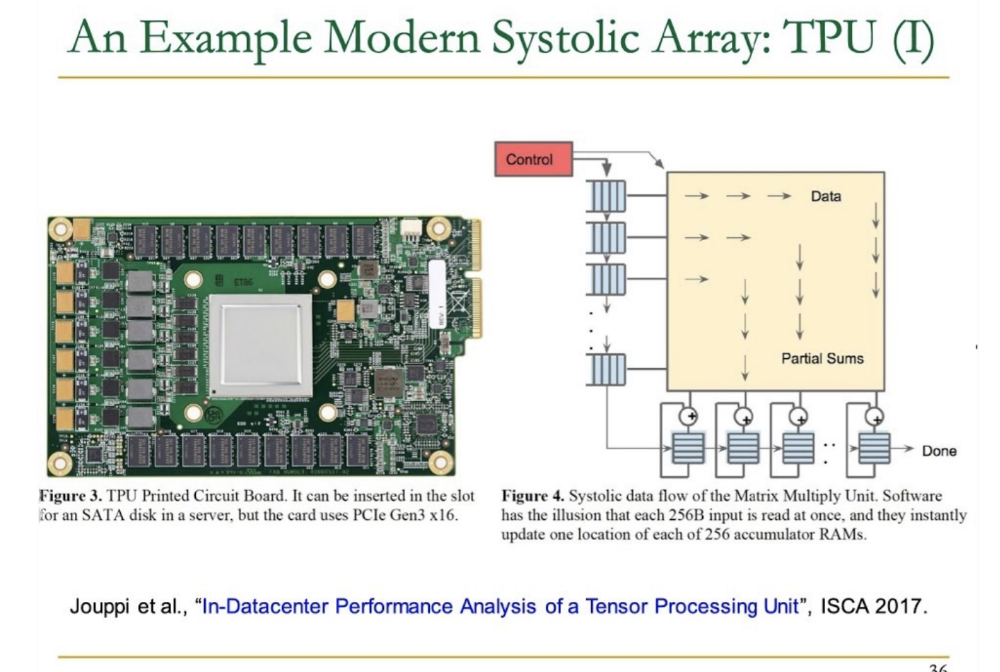

### DSP vs Accelerators
> **DSP** is a processor that is integrated. **Accelerators** are a separate chip, that has small processors nearby which supports the accelerator.
> 
> The **accelerator** chip gets data horizontally and vertically and does matrix multiplication before accessing memory. This reduces the memory access by 50%.  

## TensorFlow
>ML tool
> Size: ~400 MB
> Depends on:
> * Virtual memory / dynamic allocation
> * Multi-threading

### TensorFlow Lite
> Size: ~1 MB  (400 times smaller than TensorFlow)
> Still depneds on virtual memory

> It is built to run at the edge using smaller interpreter, e.g. mpbilæe phones
> Custom size-optimized file formate
> Used mainly for inference

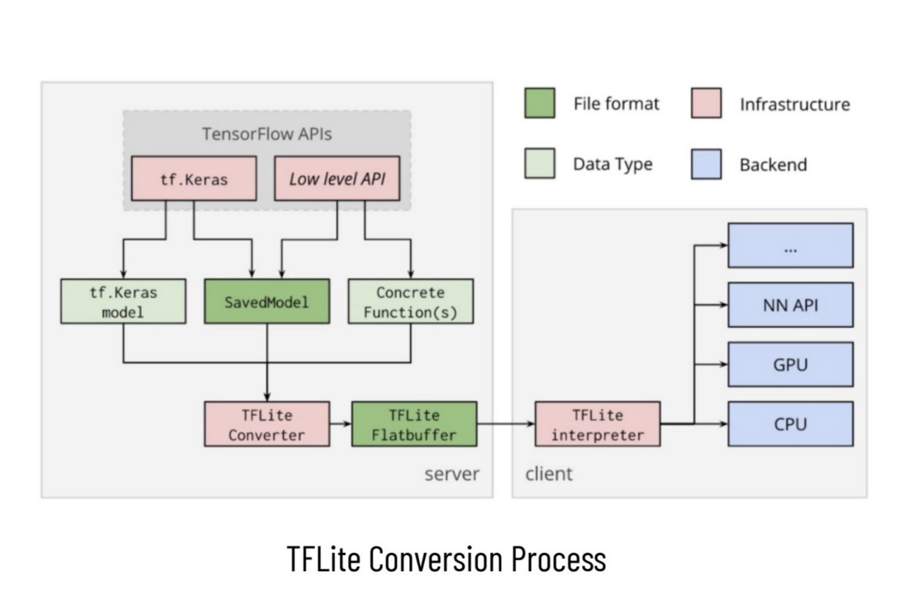

### TensorFlow Lite for Microcontrolers
> Size: ~16 KB
> Uses tensor arena - user provided static buffer
> Does not alocate memory after initiallization - no fragmentation
> But is still interpreter-based

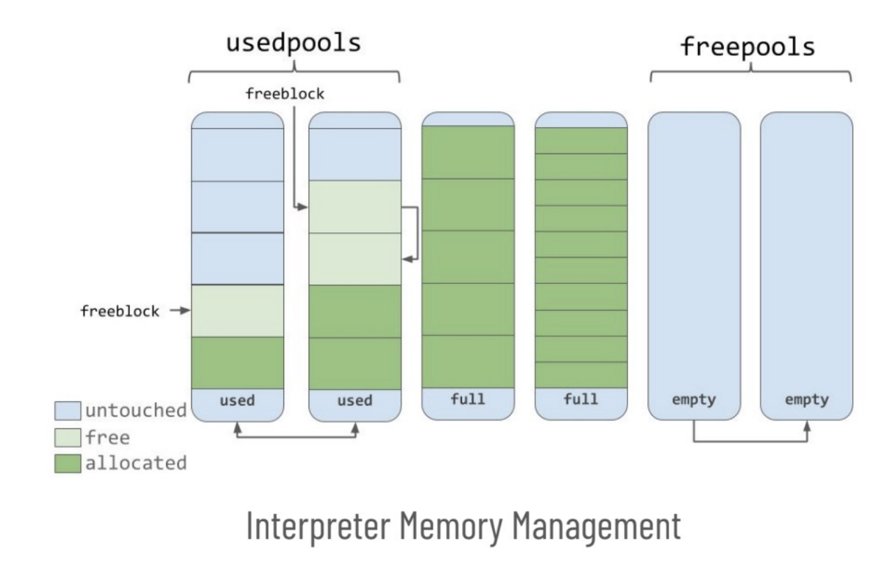

## Optimizations
> Optimizations of models often needed to:
>* Fit the model in memory
>* Decrease the latency
>* Decrease the storage and network requirements

### Quantization
> Convverting floating point weights to lower precision (INT8 or lower)
> * Reduces amount of data in RAM, storage and network
> * Reduces latency (integers are easier to compute with)

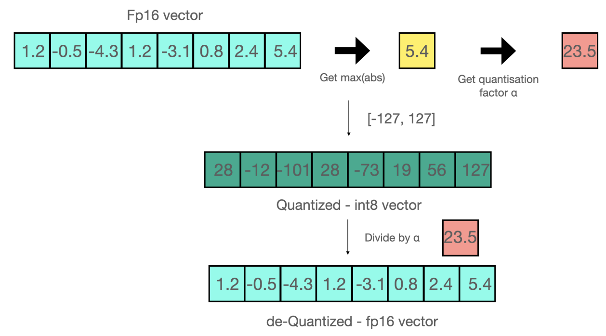

#### Quantization aware training
> Training the NN with quantization in mind
>
> Forward pass using quantized weights - incorporates the quantization noise in the loss
>
> Becomes more robust to the noise with training
>
> higher achivable accurarcy

### Pruning
> Removing parts of the network (weights, neurons or layers)
>Reduces size and potentially latency
> Structured and unstructured approaches

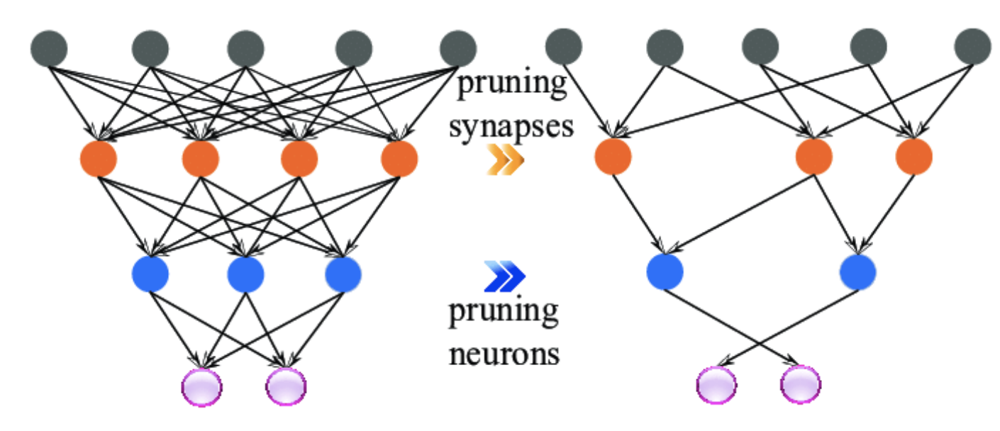

#### Unstructure pruning
> Removing weights without taking the structure of removal into account
> Reduces size on disk and network, but not RAM (usually)
> Does not reduce latency (maybe with specialized hardware)

#### Structured pruning
> Removes blocks of weights or entire neurons or layers
> Reduces storage, RAM and network requirements
> Reduces latency on commodity hardware
> Harder to train, lower accuracy

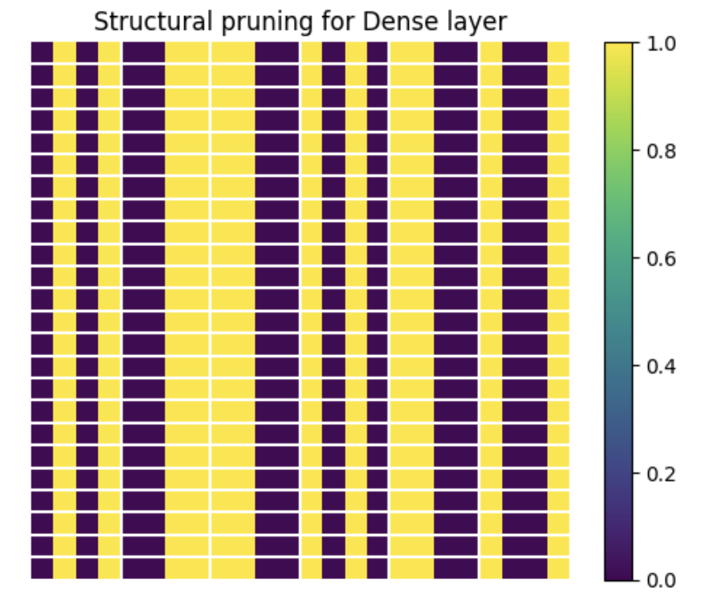

### Weight clustering
> Cluster weights and use cluster centers as the common value
> Reduces the size in storage and RAM through codebook
> Does not have affect on latency

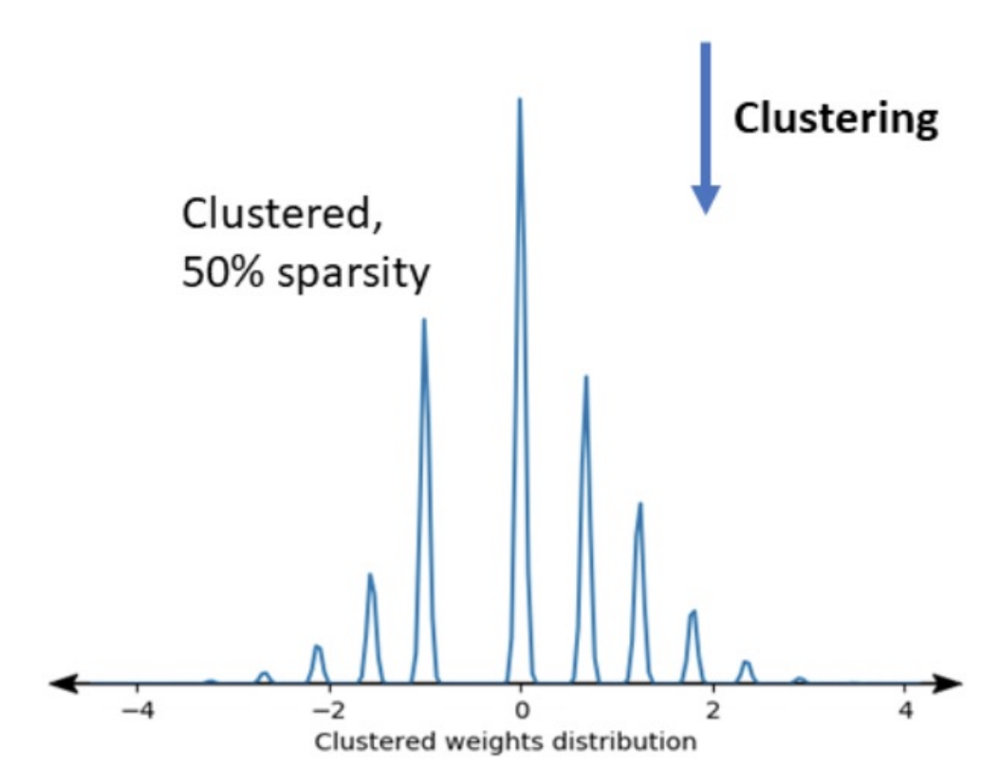

### Combining optimizatioons
>You can combine multiple optimization techniques

>The most common one: Sparsity preserving quantization
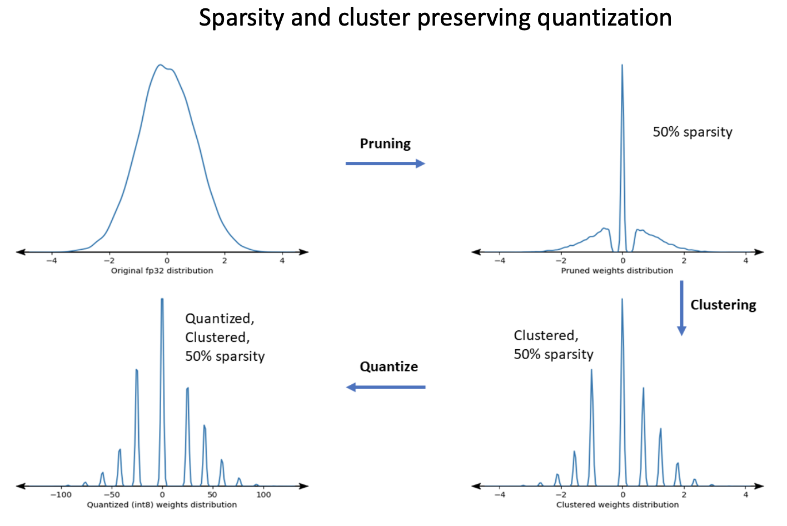

### MobileNets
> The most common convolutional neural network architecture found at the edge 
> Relies on depthwise-separable convolutional layers => leads to memory and compute savings
> Very small footprint
> Scalable in size of the input and depth of the network

## Edge impulse
> Ecosystem, which provides a low barrier of entry for entering the TinyML space
> You can collect and process data, and train and deploy models trained on them
> They support many boards and you can get a pretty good starting point without writing a line of code
> Hides away complexity – good for beginner, not useful for advanced users