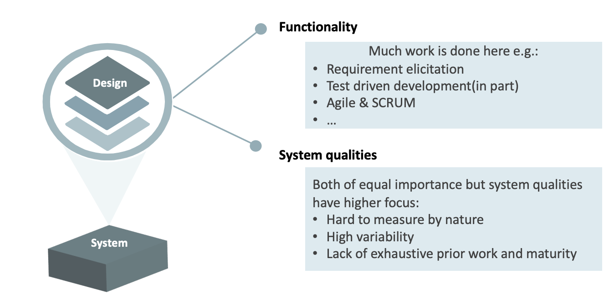
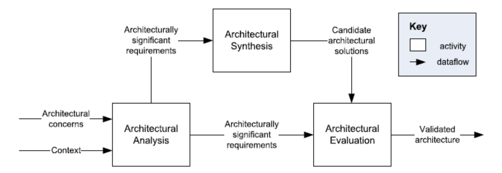
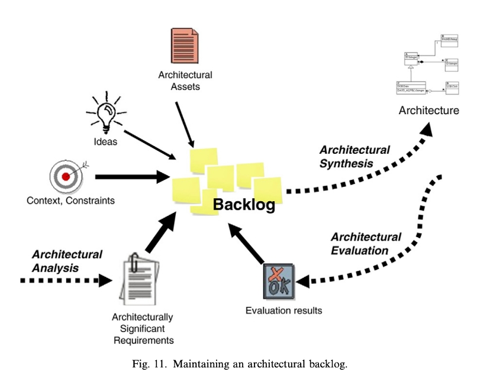
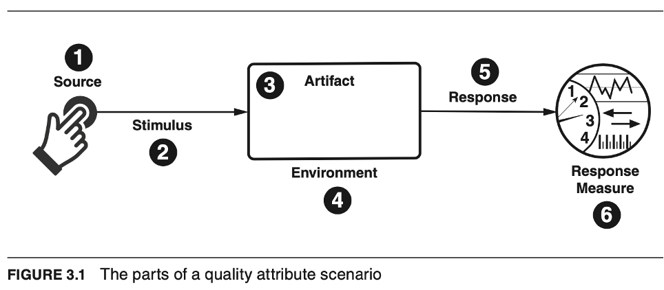

# Lecture 1 - Architectural Analysis
## Architectural Design
>* Define the structure of the system
>* Maintain intellectual control over the design of large software systems

It involves:
* Stakeholders
* Developement by large tams
* Multiples goals
* Over long period of time

### Discussion about the system functionality
> Functionality: 
> * Functional aspect.
> * Decribes *What*
> 
> System qualities (Non functional aspect, this is not a good term)
> * Describes *How*

### Design approaches

> **Architectural concerns**
> System requirements and mandated design decisions. 
> Those interests which pertain to the system’s development, its operation or any other aspects that are critical or otherwise important to one or more stakeholders. Concerns include system considerations such as performance, reliability, security, distribution, and evolvability.

> **Context** 
> System domain.
> A system’s environment or context, determines the setting and circumstances of developmental, operational, political, and
other influences upon that system.

> **Architectural Analysis**
> Defines: What are the problems to address with an architecture

> **Architecturally significant requirements (ASR)**
> Context diagram and Quality attribute Scenarios (QAS) conforms to ASR. 
> A requirement upon a software system which influences its architecture”, significantly.

> **Architectural Synthesis**
> Core of architecture work: Move from problem to solution.
> Uses ASR to find a solution.

> **Candidate architectural solutions**
> System designs that are whole, partial, or alternative solutions to the problem. Reflects design decisions about the structure of software.

> **Architectural Evaluation**
> Verify right design decisions according to ASR.
> If not done, iterate through the process again to improve granularity.

> **Validated Architecture**
> Candidate solutuion(s) consistent with ASR.

### Other design approaches
More known:
* Attribute-Driven Design (ADD)
* Siemens’ 4 View method (S4V)
* Rational Unified Process 4+1 (RUP 4+1)

Not so well known:
* Business Architecture Process and Organization
* Architectural Separation of Concerns

### Architectural Backlog and Workflow
> Architectural work is non-linear—analysis, synthesis, and evaluation happen iteratively, not sequentially. Architects shift between them as understanding evolves and decisions accumulate.

#### Why a Backlog?
* Inputs (e.g., goals, constraints) are often unclear initially and emerge over time.
* **It's impossible to resolve all concerns at once**, so architects maintain a backlog—a dynamic list of:
  * Issues, risks, and problems
  * ASRs and architectural concerns
  * Ideas and insights
This backlog **drives the workflow**, guiding what to tackle next.

#### Backlog Characteristics
May be informal (e.g., notebook) or shared (e.g., spreadsheet)

Not externally visible, not part of the architectural description

Essential, evolving, and not a Scrum backlog

#### How It's Used
Backlog items include:
* “We need to decide on X.”
* “We should explore Y to solve Z.”

Items come from:
* ASRs/concerns (from analysis)
* Problems/issues (from evaluation)
* Ideas and experience
* Items are prioritized, and architects:
* Pick one/some
* Perform synthesis (make design decisions)
* Re-integrate or re-analyze if needed
* Remove resolved items
* Re-add unresolved ones
* The backlog is in constant flux—updated hourly, daily, or as needed.

#### Key Takeaway
The architectural backlog steers iterative progress, balancing exploration, decision-making, and problem-solving in real time

## Architectural Analysis
> **Goals of architectural analysis**: 
> * To distill architectural concerns and context into architecturally significant
requirements (ASRs)
> Takes into consideration the context and architectural concerns.

> **Architectural concerns**: “those interests which pertain to the system’s development, its operation or any other aspects that are critical or otherwise important to one or more stakeholders” 

> **Context**: ‘‘a system’s […] context, determines the setting and circumstances of developmental, operational, political, and other influences upon that system’’
>* Characteristics or goals of the organization (e.g., always use C#)

In this course ASR consist of:
> **Context diagrams**: Describe the setting of the system in terms of subsystems, integrated systems, and actors.
>
> Informal context diagram: For non-technical audience.
> Formal context diagram: For technical audience.

> **Quality Attribute Scenarios (QAS)**: Describe quality requirements that are significant when making architectural decisions in a scenario form

### Quality attributes
> “The totality of characteristics of an entity that bears on its ability to satisfy stated and implied needs” 

We usually disregard functionality when discussing quality
* “The capability of the software to provide functions which meet stated and implied needs when the software is used under specified conditions”
* Functionality is concerned with what the software does, not when or how.

**Quality attributes are often called “non-functional” properties**.

### Common Issues with QA Discussions
> 1. **Vague Definitions**: Saying a system is "modifiable" is meaningless without specifying the type of changes it's modifiable for.
> 2. **Overlapping Concerns**: A denial-of-service attack could be viewed as an issue of performance, security, availability, or usability—debating categories doesn’t help design solutions.
> 3. **Inconsistent Terminology**: Different QA communities use different terms for similar concepts (e.g., “event,” “attack,” “fault,” or “input”).Common Issues with QA Discussions
Vague Definitions: Saying a system is "modifiable" is meaningless without specifying the type of changes it's modifiable for.

### Solutions
> * Use **quality attribute scenarios** to define QAs in a clear, testable, and consistent way.
> * Use a **common structure** across different QA domains to unify terminology.

### Quality attribute scenarios
We use a common form to specify all QA requirements as scenarios. This addresses the vocabulary problems we identified previously. The common form is testable and unambiguous; it is not sensitive to whims of categorization
>
>Each QA scenario has six parts:
>1. **Stimulus**: An event that triggers a response (e.g., user action, system fault, change request).
>2. **Stimulus Source**: The origin of the stimulus (e.g., user, system component).
>3. **Environment**: Conditions under which the stimulus occurs (e.g., normal load, after code freeze).
>4. **Artifact**: The part of the system affected (e.g., UI, data store).
>5. **Response**: The expected system or developer behavior.
>6. **Response Measure**: How the response is evaluated (e.g., latency, time to modify and deploy).

