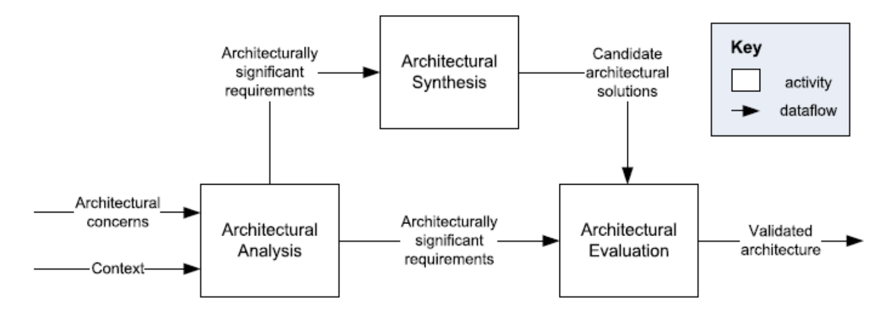
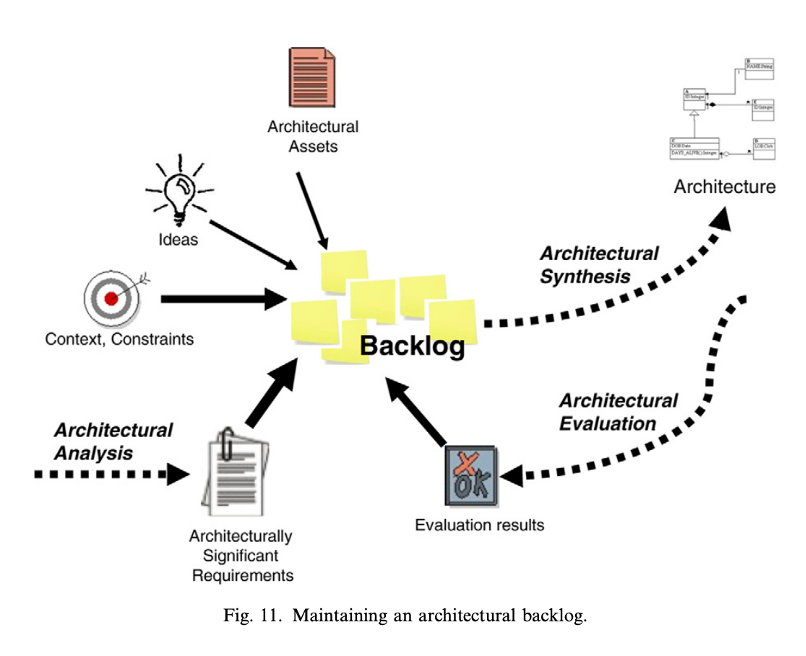

# Reading for week 1
## What is sofware architecture?
> **Definition**: The basic principle of software architecture is every software system is constructed to satisfy an organization’s business goals, and that the architecture of a system is a bridge between those (often abstract) business goals and the final (concrete) resulting system. 
>Software architectures can be designed, analyzed, and documented using known techniques that will support the achievement of these business goals. 

>Architecture is a set of software structures
>* A structure is simply a set of elements held together by a relation. 
>  * Software systems are composed of many structures, and no single structure can lay claim to being the architecture

### Architectural Structure 
Architectural structures can be grouped into three categories

* Component-and-connector structures 
   >This structure focus on the way the elements interact with each other at runtime to carry out the system’s functions. They describe how the system is structured as a set of elements that have runtime behavior (components) and interactions (connectors). 
* Module structures 
  > It partition systems into implementation units, which we call modules.
  > Modules are assigned areas of functional responsibility; there is less emphasis in these structures on how the resulting software manifests itself at runtime. Module implementations include packages, classes, and layers. Relations among modules in a module structure include uses, generalization (or “is-a”), and “is part of.”  
* Allocation structures 
  > They establish the mapping from software structures to the system’s nonsoftware structures, such as its organization, or its development, test, and execution environments. 

They play an important role in the design, documentation, and analysis of architectures 
* A structure is architectural if it supports reasoning about the system and the system’s properties. 
* The reasoning should be about an attribute of the system that is important to some stakeholder(s) 

### Architecture is an Abstraction
Architecture consists of structures, and structures consist of elements and relations, it follows that an architecture comprises software elements and how those elements relate to each other. 
> An architecture is foremost an abstraction of a system that selects certain details and suppresses others. 
> * We simply cannot, and do not want to, deal with all of the complexity all of the time. 
>* We want—and need—the understanding of a system’s architecture to be many orders of magnitude easier than understanding every detail about that system. 

### System vs Enterprise Architectures
>System architectures
>* A system’s architecture is a representation of a system in which there is a mapping of functionality onto hardware and software components, a mapping of the software architecture onto the hardware architecture, and a concern for the human interaction with these components. 

> Enterprise architecture
> * Enterprise architecture is a description of the structure and behavior of an organization’s processes, information flow, personnel, and organizational subunits. 

## What makes a god architecture?
Architecture isn't inherently good or bad—it’s about how well it serves its intended purpose. However, there are common guidelines that, if ignored, can signal potential issues.

>We divide our observations into two clusters: *process* recommendations and *product* (or structural) recommendations. 

### Process Recommendations
>1. **Unified Vision**: A single architect or small team with a clear technical lead should design the architecture to ensure conceptual integrity. Close collaboration with developers prevents impractical "ivory tower" designs.
>2. **Quality-Driven**: Base the architecture on a prioritized list of quality attribute requirements, not just functionality.
>3. **Documented Views**: Use architectural views to address stakeholder concerns. Start small and expand documentation as needed.
> 4. **Early Evaluation**: Assess the architecture early for key quality attributes, and reevaluate after significant changes.
> 5. **Incremental Implementation**: Build the system in stages using a minimal, working “skeletal” version to identify issues early and allow gradual growth.

### Product (Structural) Recommendations
> 1. **Modular Design**: Use well-defined, loosely coupled modules with clear interfaces based on information hiding and separation of concerns.
> 2. **Established Patterns**: Apply known architectural patterns and tactics to meet quality requirements.
> 3. **Tool Independence**: Avoid locking into specific product versions; ensure easy upgrades.
> 4. **Data Separation**: Separate data producers and consumers to improve modifiability.
> 5. **Flexible Mapping**: Don't expect a 1:1 match between modules and runtime components—support concurrency and reuse.
> 6. **Deployment Flexibility**: Design processes to be easily reassigned to different processors, supporting virtualization and cloud deployment.
>7. **Consistent Interaction**: Use a small set of simple, repeated component interaction patterns for clarity and maintainability.
>8. **Resource Contention Management**: Identify and manage contention points (e.g., performance, network use) with clear guidelines.

## Quality Attributes
> **Quality attribute defintion**
> A quality attribute (QA) is a measurable or testable property of a system that is used to indicate how well the system satisfies the needs of its stakeholders beyond the basic function of the system. 

> **Functionality**
> Functionality is the ability of the system to do the work for which it was intended. 
> **Functionality does not determine architecture**. That is, given a set of required functionality, there is no end to the architectures you could create to satisfy that functionality.

### Common Issues with QA Discussions
> 1. **Vague Definitions**: Saying a system is "modifiable" is meaningless without specifying the type of changes it's modifiable for.
> 2. **Overlapping Concerns**: A denial-of-service attack could be viewed as an issue of performance, security, availability, or usability—debating categories doesn’t help design solutions.
> 3. **Inconsistent Terminology**: Different QA communities use different terms for similar concepts (e.g., “event,” “attack,” “fault,” or “input”).Common Issues with QA Discussions
Vague Definitions: Saying a system is "modifiable" is meaningless without specifying the type of changes it's modifiable for.

### Solutions
> * Use **quality attribute scenarios** to define QAs in a clear, testable, and consistent way.
> * Use a **common structure** across different QA domains to unify terminology.

### Quality attribute scenarios
We use a common form to specify all QA requirements as scenarios. This addresses the vocabulary problems we identified previously. The common form is testable and unambiguous; it is not sensitive to whims of categorization
>
>Each QA scenario has six parts:
>1. **Stimulus**: An event that triggers a response (e.g., user action, system fault, change request).
>2. **Stimulus Source**: The origin of the stimulus (e.g., user, system component).
>3. **Environment**: Conditions under which the stimulus occurs (e.g., normal load, after code freeze).
>4. **Artifact**: The part of the system affected (e.g., UI, data store).
>5. **Response**: The expected system or developer behavior.
>6. **Response Measure**: How the response is evaluated (e.g., latency, time to modify and deploy).

## Achieving quality attributes through architectural patterns and tactics

### Tactics
>A tactic is a design decision that directly influences a system's response to a quality attribute stimulus—e.g., improving performance, portability, or modifiability.

### Architectural Patterns
> An architectural pattern solves recurring design problems in specific contexts through a proven structure, defining roles, responsibilities, and collaborations. Patterns often bundle multiple tactics, enabling tradeoffs across quality attributes.

### Why Focus on Tactics?
>1. **Patterns may not fully meet specific needs**—tactics help customize or extend them.
>2. **When no pattern fits**, tactics provide a foundation to build from first principles.
>3. **Tactics support systematic design and analysis**, even when patterns fall short.

Tactics are **design primitives** that appear across multiple quality attributes and contexts. For example, a performance tactic like schedule resources must be refined into strategies (e.g., round-robin). A modifiability tactic like use an intermediary can take many forms (e.g., broker, proxy, layer).

### Analyzing Design with Tactics-Based Questionnaires
To evaluate how well quality attributes are supported, use a tactics-based questionnaire during architecture design:

1. Mark if a tactic is supported (Y/N).
2. Describe related design decisions and where they are realized (e.g., code modules, frameworks).
3. Assess risk (High, Medium, Low).
4. Record rationale, assumptions, and implications (e.g., on cost, schedule, maintainability).

This process encourages holistic thinking and typically takes 30–90 minutes per quality attribute.

## Software architecture design methods
### Attribute driven design (ADD)
A recursive, quality-attribute-focused approach:

* **Goal**: Satisfy quality scenarios through patterns and tactics.

* **Process**:
   1. Select a module to decompose (start with whole system).
   2. For each module:
    * Identify key drivers (quality + functional).
    * Choose patterns/tactics to address them.
    * Instantiate modules, assign responsibilities.
    * Define interfaces and constraints.
    * Refine use cases/scenarios for child modules.
   3. Repeat for submodules.

**Result**: High-level architecture structured by quality concerns.

### Siemens Four Views (S4V)
A view-based method for managing complexity:
* **Views**:
   * **Conceptual**: Maps functions to components/connectors.
   * **Module**: Structures modules by decomposition and layers.
   * **Execution**: Assigns runtime entities (threads, tasks) and resources.
   * **Code**: Organizes source and deployment artifacts.
 * **Factors**: Organizational, technological, and product contexts guide design.
 * **Design Strategy**: Identify issues, apply strategies via design decisions in views.

### RUP’s 4 + 1 Views
Part of the Rational Unified Process (RUP):

* **Views**: Logical, Process, Implementation, Deployment + Use Case (context).
* **Activities**:
  1. Define Candidate Architecture – based on key use cases and reference architectures.
  2. Architectural Synthesis – prototype and test architecture viability.
  3. Refine Architecture – identify components, patterns, and integrate them.
* **Iterative**: Each iteration delivers an executable architecture prototype.

### Business architecture process and organization
Architecture aligned with Business, Process, and Organization:
* **Views**:
  * CAFCR: Customer, Application, Functional, Conceptual, Realization.

* **Approach**:
  * Iteratively fill in views using artifacts.
  * Analyze quality attributes across views to link system needs with technology.

* **Completion**: When all views are coherent and traceable to quality attributes.

### Architectural Separation of Concerns (ASC/ARES)
A conceptual framework emphasizing **iterative design with traceability**:
* **Core Activities**:
  * **Architectural Analysis**: Identify architecturally significant requirements (ASRs).
  * **Architectural Synthesis**: Develop candidate solutions.
  * **Architectural Evaluation**: Validate consistency and fit with ASRs.
* **Backlog-driven workflow**:
  * Maintain a dynamic backlog of decisions/issues/ideas.
  * Continuously update priorities and address items via design iterations.

## Architectural design activities and artifacts

> **Architectural concerns**
> System requirements and mandated design decisions. 
> Those interests which pertain to the system’s development, its operation or any other aspects that are critical or otherwise important to one or more stakeholders. Concerns include system considerations such as performance, reliability, security, distribution, and evolvability.

> **Context** 
> System domain.
> A system’s environment or context, determines the setting and circumstances of developmental, operational, political, and
other influences upon that system.

> **Architectural Analysis**
> Defines: What are the problems to address with an architecture

> **Architecturally significant requirements (ASR)**
> Context diagram and Quality attribute Scenarios (QAS) conforms to ASR. 
> A requirement upon a software system which influences its architecture”, significantly.

> **Architectural Synthesis**
> Core of architecture work: Move from problem to solution.
> Uses ASR to find a solution.

> **Candidate architectural solutions**
> System designs that are whole, partial, or alternative solutions to the problem. Reflects design decisions about the structure of software.

> **Architectural Evaluation**
> Verify right design decisions according to ASR.
> If not done, iterate through the process again to improve granularity.

> **Validated Architecture**
> Candidate solutuion(s) consistent with ASR.

## Architectural Backlog and Workflow
> Architectural work is non-linear—analysis, synthesis, and evaluation happen iteratively, not sequentially. Architects shift between them as understanding evolves and decisions accumulate.

### Why a Backlog?
* Inputs (e.g., goals, constraints) are often unclear initially and emerge over time.
* **It's impossible to resolve all concerns at once**, so architects maintain a backlog—a dynamic list of:
  * Issues, risks, and problems
  * ASRs and architectural concerns
  * Ideas and insights
This backlog **drives the workflow**, guiding what to tackle next.

### Backlog Characteristics
May be informal (e.g., notebook) or shared (e.g., spreadsheet)

Not externally visible, not part of the architectural description

Essential, evolving, and not a Scrum backlog

### How It's Used
Backlog items include:
* “We need to decide on X.”
* “We should explore Y to solve Z.”

Items come from:
* ASRs/concerns (from analysis)
* Problems/issues (from evaluation)
* Ideas and experience
* Items are prioritized, and architects:
* Pick one/some
* Perform synthesis (make design decisions)
* Re-integrate or re-analyze if needed
* Remove resolved items
* Re-add unresolved ones
* The backlog is in constant flux—updated hourly, daily, or as needed.

### Key Takeaway
The architectural backlog steers iterative progress, balancing exploration, decision-making, and problem-solving in real time