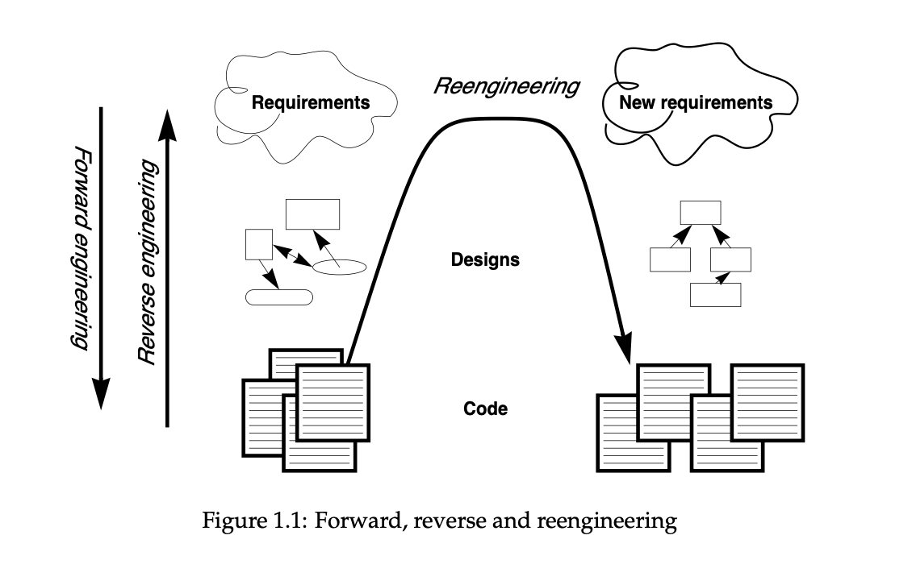
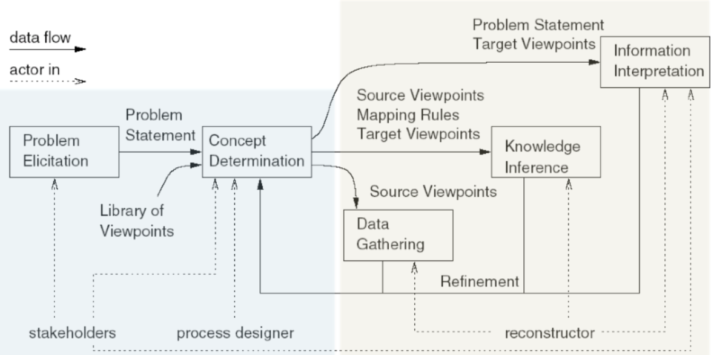

# Lecture 10 - Architectural Reconstruction

### Why does architectural documentation not always exist and is not up to date?

**Difficulty of creration and update (keeping up to date)**

- hard to maintain - especially when they are in .ppt or .png
- Tracebaility (link) between architecture and code is not easy to establish
- It requires a better and more understanding of the system than just coding → not everybody can do it
- Because developers make decisions and chargens
    - ***Architectural drift*** - that are not aligned with the original vision
    - ***Architectural erosion*** - that go against prescriptive architrue (going against the description)

*Incentives*

- Sometimes that’s not a priority at all
- You’re a startup that needs to show that the idea is viable, and then you never find the time
- Maybe you’re designing your own product and nobody asked you to do it
- Often there is no perceived value for the costumer

### Arhictectural Erosion Example

**What could be the cause of architectural erosion here?**

- Decoupling - but now they are tightly couples

**Why could it be a problem?**

- Everything should be handled by bus (and is also what we expect by the system, based on the description) but it does not. So the system does not follow the description of architecture i.e. does not what it is supposed.

### How to Keep Architectural Documentation up to Date?

1. Enforcing architectural constraints
    1. Type systems — to low-level
    2. Special tools for architecture constraints definition 
        1. DSL - domain specific language
        2. Architectural constraints that take inspiration from unit testing
        3. How to integrate these tools?
            1. Pre-commit hooks? (before a developer is committing/commited to main, some checks are run)
            2. CI/CD
            3. IDE
    3. Declarative architecture (docker compose, swarm, infrastructure-as-code specifications, etc.)
        1. Your concern with creating these files — is saying i’ve got these components, and they use this network and this port.
        2. You are specifying components and connections between (Architectural Descriptions that is up to date — although not all systems that we build have this documentation/or is part of this)
2. Generating architectural diagrams from code
    1. Instead of enforcing certain architecture - try to always have diagrams that are always up to date
    2. As apposed to drawing them in Powerpoint
    3. No great tools for this - often too much low-level noise
3. Reconstructing the Architecture
    1. The focus of this course

### Reverse Engineering

> (def.) the process of analyzing a subject system to identify the system’s components and their interrelationships and create representations of the system [...] at a higher level of abstraction.

Focus on:
* components
* relationships
* higher level of abstraction

Relation with architecture recovery? They are overlapping activities and use overlapping methods

### Reverse Engineering vs. Reengineering?

> Reengineering is the examination and alteration of a subject system to reconstitute it in a new form

Relation with AR? AR could be a possible first step in reengineering

## How to do Architecture Reconstruction

**Symphony**
- Classical, principled way
- View-driven approach
- Distinguishes between three kinds of view
    1. Source
        1. View extracted directly from artifacts of a system
        2. not necessarily architectural (e.g. see later example)
    2. Target (goal, the view we want to generate)
        1. describes architecture-as-implemented
        2. Any of the 3+1 views
    3. Hypothetical
        1. Architecture-as-designed
        2. existing documentation
        3. presentations

### Symphony Stages: Design (blue) & Execution (yellow)

#### Design: Problem elicitation

* “Business case
 for reconstruction
* What is the problem?

#### Design: Concept determination

* What architectural information is needed to solve the problem?
* Which viewpoints are relevant?

#### Execution: Data gathering

* Collecting and extracting low-level source views
* Can involve a multitude of sources even besides source code (e.g., git repo, runtime information)

#### Execution: Knowledge inference

* Going from source to target views
* Abstracting low-level information

#### Execution: Information interpretation

* Visual representation
* Analysis, creating new documentation

