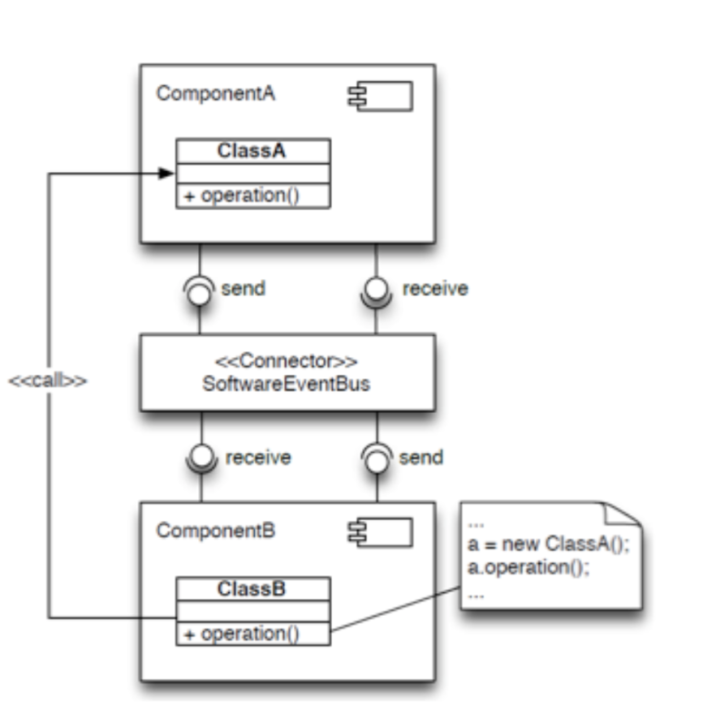

# Lecture 10 - Architectural Reconstruction

### Why does architectural documentation not always exist and is not up to date?

**Difficulty of creration and update (keeping up to date)**

- hard to maintain - especially when they are in .ppt or .png
- Tracebaility (link) between architecture and code is not easy to establish
- It requires a better and more understanding of the system than just coding → not everybody can do it
- Because developers make decisions and chargens
    - ***Architectural drift*** - that are not aligned with the original vision
    - ***Architectural erosion*** - that go against prescriptive architrue (going against the description)

*Incentives*

- Sometimes that’s not a priority at all
- You’re a startup that needs to show that the idea is viable, and then you never find the time
- Maybe you’re designing your own product and nobody asked you to do it
- Often there is no perceived value for the costumer

### Arhictectural Erosion Example

