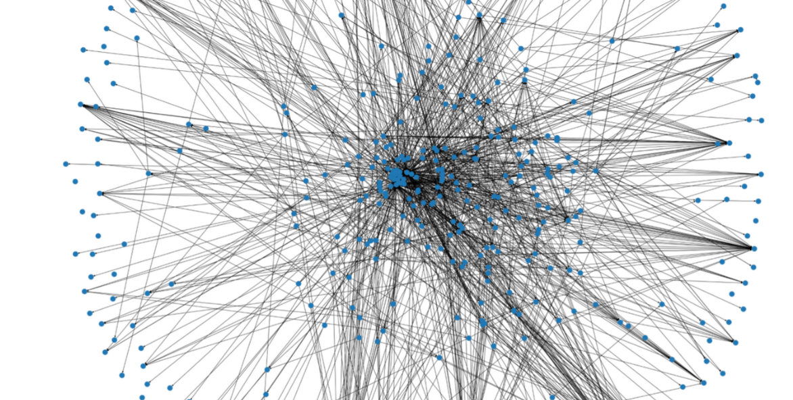
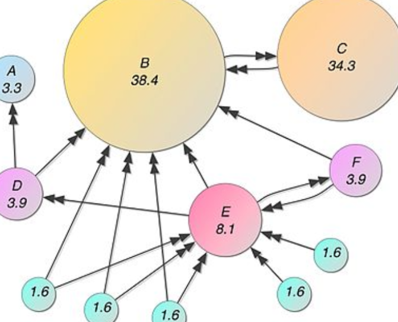
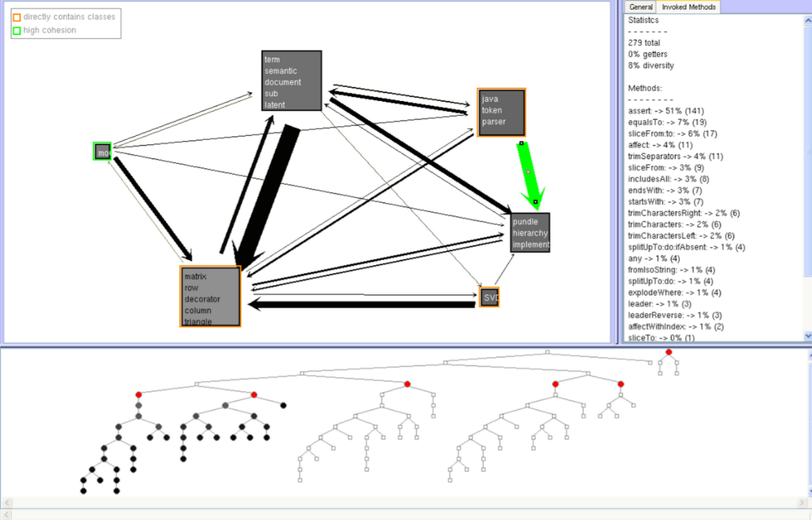

# Lecture 11 - Abstraction

The view we obtained at the end of the last lecture reflects reality.
* Software is complex
* The obtained view is not architectural

### We can try to simplify it

There are several ways in which we can simplify the complex graph above:

1. Filtering nodes that are irrelevant
   * The viee shows dependencies to external modules. If the goal is understand this system's structure, are they then needed?
   * filtering is an extremely useful tool in architecture recovery.
2.  Using more advanced graph layouts
   *  Advanced graph layouts can be useful when looking at graphs but their benefits are limited; a layout can do much with a graph that is too dense and too large.

#### Limitations of simplication

* THe two methods above can help but will help even less so in complex systems.

## Abstraction in Architectural Reconstruction

From *Symphony*:
>"The reconstructor creates the target view by .
* condensing the low-level details of the source view, and
* abstracting them into architectural information"

*But how can we abstract this low-level source view that we have obtained*?

### Approach #1 Aggregating Entities and Relationships

#### Reflexion Models

This approach uses "[...] domain knowledge is used to define a map between the source and target view."

> This activity may require either interviewing the system experts in order to formalize architecturally-relevant aspects not available in the implementation or to iteratively augment the source view by adding new concepts to the source viewpoint

This is where he gave the linux example, where they compared the as-implemented and as-expected architecture.

> **Definition:**
> *Reflection model* = (an architectural viewpoint that) indicates where the source model and high-level model differ
* Convergences: Elements that are present and consistent in both source and high-level models.
* Divergences:  Elements that exist in both but conflict or differ in definition or structure.
* Absences:  Elements present in one model but missing in the other.

#### Aggregating Along Folder Hierachy

Based on folder containment relationships we can:
* Aggregate nodes
* Aggregate dependencies

### Approach #2: Abstracting Module Properties Using Metrics

Types of metrics:
* Product - measure the resulting product, e.g source code: LOC, NOM, CYCLO of a method
* Process - measure the process, e.g. frequency of change

*So how is this a complementary tool?*

Remember the def of architecture: "[...] modules, their properties, and the relationships between them".
* Metrics can express these *properties*.

#### Metrics can also be aggregated from lower-level components to modules

For **Files/Methods**:
* Cyclomatic Complexity
  * Number of linearly independent code paths through source code (functions of the number of branches)
* For **Modules**:
  * Size
    * LOC - lines of code
    * NOM - number of methods
* For **Dependencies**:
  * Total count of explicit low-levle dependencies
  * Number of distinct explicit low-level dependencies

### Approach #3: Network Analysis

This approach aims to abstract the system by extracting the most important elements in it. And the importance of the elements is given yn their graph-theoretical properties.

The `PageRank` algorithm that made Google famous tries to gauge the importance of a page in a network of pages based on the references pages make to each other.

### Approach #4: Automatic Clustering

What if we did unsupervised learning? We could do hierarchical clustering of the system for example. Then, we could hope that the clusters are mapped on architectural components.

In all of the cases we still need human intervention to explore the result of the automatically detected clusters.

