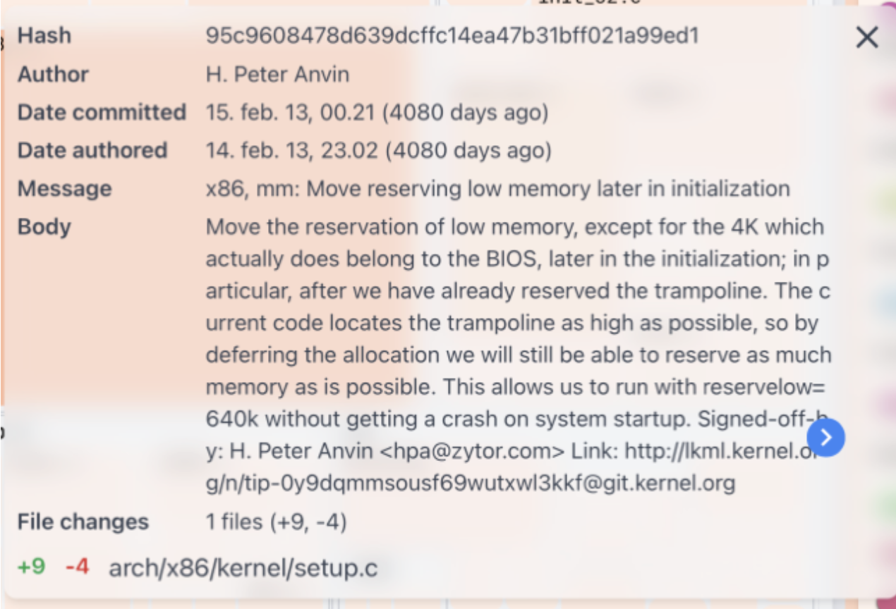

# Lecture 12 - Evolutionary Analysis for Architecture Recovery
> No man ever steps in the same river twice, for it is not the same river and he is not the same man.

## Why Must Software Systems Evolve?
>An e-type program that is used in a real-world environment must change, or become progressively less useful in that environment.
>
>-- M. Lehman, The Law of Continuing Change

## Short - E-type vs Non-e-type 
> **E-type**: System must change and evolve.
> **Non-e-type**: System does not need to evolve.

## E-type systems
>In the terminology of Lehman, the "**e**" in e-type stands for **embedded** in the real world. Since the world changes, the system must change too.

There are actually two parts of the "world" where changes can impact a given software system. The **human context** of use and the **technical context**.

### The Human Context
>To think about: Do you have good examples of systems that had to change because the real world changed around them?

Example:
* the software that computes taxes in Denmark
* all the websites in Europe once GDPR came into being
* etc.

### The Technical Context
> Think about the npm ecosystem. Every day you can execute ```npm``` audit in your React-based web application to find out that a dozen of the packages you depend on have new versions. **Do you upgrade?** Do you stay like this for a while? What's the best strategy for managing this portfolio of dependencies?

>The same situations emerges when a developer builds a system on top of other libraries, and even programming languages change. **If one is not keeping up with the evolution of their programming language, their code will sooner or later stop working**. 
How could this be? Some of the libraries their code depends on, might have dropped support for that version of the language. So they either upgrade, or they are left behind. If a developer des not want to be left behind, they have to keep up with all their upstream dependencies.

## Non-e-type systems
>To think about: What other kinds of systems are there then? Can you think about another type? Are there programs that are **not impacted by the change in the world around them**?

Examples:
* a chess engine
* a red-black tree balancing algorithm

> **The difference between algorithms and software systems: algorithms don't have to change with the world, while software systems have to**.

## Software Evolution
>**Software evolution** is the continual development of a piece of software after its initial release to address changing stakeholder requirements.

* It used to be called *software maintenance*
* Nowadays **evolution is the preferred** term because it highlights the fact that a **software system is never finished**

### Version Repositories Can Help Re-trace Evolution
>One of the benefits of the widespread adoption of tools like `git` is the fact that the meta-data captured in the version control system captures relevant information about the evolution of the system.

There are multiple kinds of information that might be relevant for the architecture reconstruction process that can be recovered from the version control system (VCS)

#### Logical Coupling: the parts of the system that always change together
> When two entities frequently change together, even if there is no explicit dependency between them, we call that between them there is **logical coupling**.

> However, defining the concept is a challenge, because it's after all a matter of selecting thresholds and constants:
>* how many changes should two entities have together before we call them coupled?
>* what percentage of changes can be not together while still allowing us to consider them coupled?

Pros:
* language-independent method
* can even detect dependencies between parts of the code that are not written in the same language
* can detect dependencies that are indirect

Cons:
* only a small part of the dependencies can be detected this way

#### Documentation: fine-grained, based on git comments
If there is no separate documentation, well described commits can serve as an evolving documentation for a software system. Look at the following commit comment, from linux, which documents a (+9, -4) change. How many of us are able to write such detailed changes?


> However, the information in the git log could be useful for architecture recovery, only if the developers wrote meaningful messages.

#### Churn: highlighting the parts of the system are most changed over time
> **Churn** is a metric that indicates how often a given piece of code gets edited.
>* process metric (*as opposed to? do you remember the alternate concept? *)
>* can be detected with language independent analysis (which is good for polyglot systems)
>* can be applied to all kinds of code —e.g., a file, a class, a function—

> **Why** would places in the system with high-code churn be relevant?
>* are likely to be most important parts of the code
>* studies observe correlation between code churn and complexity metrics
>* high code churn predicts bugs better than size
>* it's likely that they'll require more effort in the future

Keep in mind when using churn in architecture recovery
1. Caveat: one must take into account developer styles, e.g.  the micro-commits developer vs. the large chunk committer
   1. you could use LOC instead of # number of commits;
   2. what could the problems with this be?
2. Removing irrelevant files that change frequently (README.md, or LICENSE.md)
   1. Combine with static complexity metrics
   2. Manual investigation
3. Selecting the appropriate time-interval for the analysis
   1. Weighting towards recency (discarding past changes more)
4. Tracking file renames over the course of a system's history
   1. Sometimes git loses track of file history: e.g. if you rename and make changes at the same time