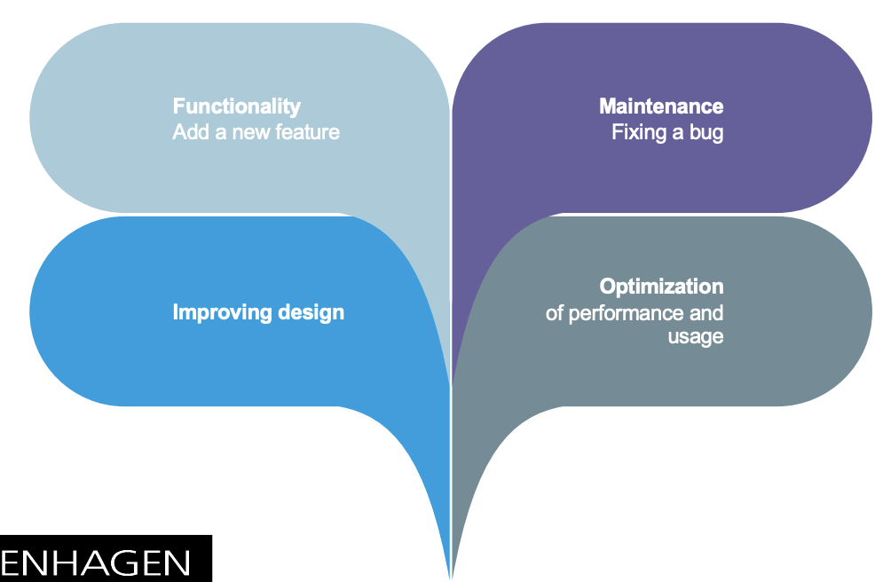
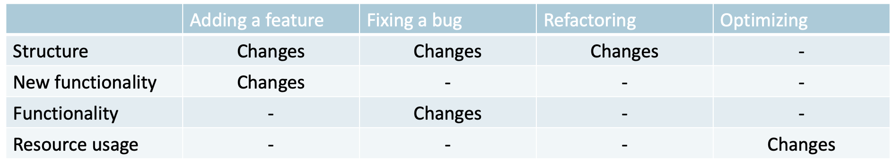
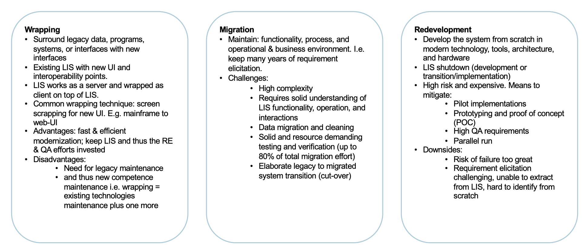
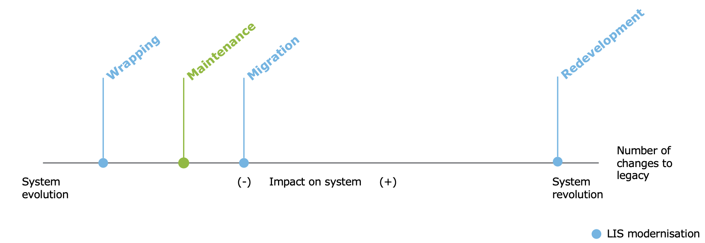

# Lecture 14 - Legacy systems and ethics 
## Why do we need to change software?
* **Functionality** Add new feature
* **Maintenance** Fixing a bug
* **Improve design**
* **Optimization** of performance and usage

## Legacy systems (LIS)
> **Definition**: any information system that significantly resists modification and evolution

### Changes to legacy software
> **Main issue**:
> How to maintain existing behavior after making changes to a legacy system?
>
> Either:
> * Edit and Pray
>* Cover and Modify

>**Legacy system/code definition no. 2**:
> In the industry, legacy code is often used as a slang term for difficult-to-change code that we don’t understand. […] To me, legacy code is simply code without tests.

### Legacy code change algorithm
1. Identify change points
2. Find test points
3. Break dependencies
4. Write tests
5. Make changes and refactor

> Problems:
>* obsolete hardware that is slow and expensive to maintain
>* documentation and understanding of system details is often lacking
>* tracing faults is costly and time consuming
>* lack of clean interfaces makes integration with other systems difficult
>* difficult, if not impossible, to extend

### Means of addressing challenges

> **Wrapping**: 
> Surround legacy data, programs, systems, or interfaces with new interfaces
> Existing LIS with new UI and interoperability points.
> LIS works as a server and wrapped as client on top of LIS.
> Common wrapping technique: screen scrapping for new UI. E.g. mainframe to web-UI
>
> Advantages:
> * fast & efficient modernization; keep LIS and thus the RE & QA efforts invested
>
> Disadvantages:
> * Need for legacy maintenance and thus competence maintenance i.e. wrapping = existing technologies maintenance plus one more

> **Migration**:
> Maintain: functionality, process, and operational & business environment. I.e. keep many years of requirement elicitation.
>
> Challenges:
> * High complexity
> * Requires solid understanding of LIS functionality, operation, and interactions
> * Data migration and cleaning
> * Solid and resource demanding testing and verification (up to 80% of total migration effort)
> * Elaborate legacy to migrated system transition (cut-over)

> **Redevelopment**: 
> Big bang, cold turkey
> Develop the system from scratch in modern technology, tools, architecture, and hardware.
>
> LIS shutdown (development or transition/implementation): 
> * High risk and expensive. Means to mitigate:
>     * Pilot implementations
>     * Prototyping and proof of concept (POC)
>     * High QA requirements
>     * Parallel run
>
> Downsides:
>* Risk of failure too great
>* Requirement elicitation challenging, unable to extract from LIS, hard to identify from scratch

## Ethics
> Think about data, and what you are working with in your system design.
>
> Code of ethics in software engineering is rather “subjective” and not widely established. I.e. it is up to the individual’s idea of “proper” and “correct” rather than widely-established rules and guidelines. 

### ACM SE Code of Ethics
1. PUBLIC – Software engineers shall act consistently with the public interest.
2. CLIENT AND EMPLOYER – Software engineers shall act in a manner that is in the best interests of their client and
employer consistent with the public interest.
3. PRODUCT – Software engineers shall ensure that their products and related modifications meet the highest
professional standards possible.
4. JUDGMENT – Software engineers shall maintain integrity and independence in their professional judgment.
5. MANAGEMENT – Software engineering managers and leaders shall subscribe to and promote an ethical approach
to the management of software development and maintenance.
6. PROFESSION – Software engineers shall advance the integrity and reputation of the profession consistent with
the public interest.
7. COLLEAGUES – Software engineers shall be fair to and supportive of their colleagues.
8. SELF – Software engineers shall participate in lifelong learning regarding the practice of their profession and shall
promote an ethical approach to the practice of the profession.