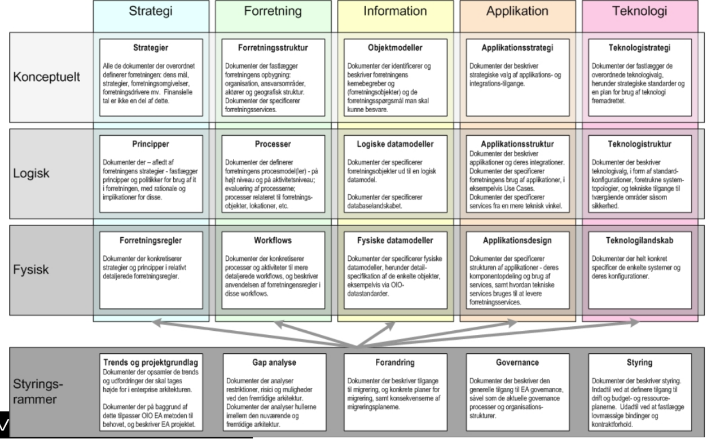

# Lecture 2 - Architectural Descriptions

## Summary

The main purpose of description is communication

Large, complex software systems cannot be effectively described from one point of view

A development time, runtime, and deployment time view is a reasonable subset of views

The 3+1 approach includes these views

- Development time: module view
- Runtime view: component & connector (C&C) view
- Deployment time view: deployment view

UML can be used for (architectural) design documentation

- Module view: class diagrams with packages and classes
- C&C view: class diagrams with objects and links, sequence diagrams
- Deployment view: deployment diagram with nodes and components

UML may not be sufficiently formal for precise analysis

- Formal approaches exist

---

*What is Software Architecture?*
> The software architecture of a computing system is the structures of the system, which comprise software elements, the externally visible properties of those elements, and the relationships among them.

*What is architecture and what is not?*
> Most *box-and-line* drawings are in fact not architecture at all. But simply box-and-line drawings

Take the following descriptions as an example: 

* What COBRA is does not matter, but these descriptions show allow to infer information (stand on their own)
* Which these do not
* We have to think about how we communicate our architecture. 

## Views
>**Definition (View)**:
> *A view represents a partial aspect of a software architecture that shows specific properties of software system*
* Can be seen as different lenses that we examine the software at
* We need to establish rules on how to examine these software

*Ideal scenario*: We have 1 or 2 views that we update everytime our system evolves

## Elements of an architectural description

**Architectural view:**
* *What is the software architecture?*
* Multiple viewpoints (in the case of 3+1)
  * Module viewpoint
  * Component & Connector Viewpoint
  * Allocation viewpoint
* Design decisions

**Architecturally significant requirements:**
* *Why is the software the way it is?*
* Scenario-based requirements
* QUality-attribute-bases requirement
  * Primary concerts (critical quality requirements)
  * Quality attribute specifications

## 3+1 View

### Component & Connector View
How is the functionality of the system mapped to runtime components and their interaction?

**Elements**:
* Components
  * Funcitonal behavior
  * What part of the system is doing what?

**Relations**
* Connectors
  * Control and communication aspects
  - Define protocols for control and data exchange
      - Incoming and  outgoing operations
      - Mandates ordering of operations
      - Define roles for attached components

### Model View
How is the functionality of the system to be mapped into implementation

**Elements**:
- Classes, packages, interfaces

**Relations**:
- Associations, generalizations, realizations, dependencies

### Allocation/Deployment View
How are software elements mapped onto environmental structures?

**Elements**:
- Software elements: Components, objects
- Environmental elements: Nodes

**Relations**:
- Allocated-to
- Dependencies
- Connections (communication paths)

### Purpose of views

*What is the purpose?*
> important for precise communication and documentation
* Views are important for precise **communication** and **documentation**
---
Architecture as a means for **communication** among stakeholders:
* Need suitable representations
* Architect to Developer
  * Needs precise understnading of design choices
  * Architecture as *blueprint* for development
* Architect to Customer
  * Precision needs to balanced with ability to understand
    * Formal vs. Informal 
---
Architecture as a basis for **design** and **evaluation**:

* Precise semantics of description beneficial to analyze non-trivial properties
* Support analytical evaluation

So for this we introduce:

### Architectural Description Languages (ADL's)

> Languages for describing software architectures
* Broad categories
  * Box-and-line drawings (just an architectural description)
  * Formal descriptions
  * Multiple-view based description

We use **Unified Modelling Langauge** (we use a subset of UML), in the context of **multiple-view descriptions**.

### The Start Knucheten 4+1

* **Design View**
  * Vocabulary of problem and its solution
  * Primarily supports functional requirements
* **Process View**
  * threads and processes / concurrency & synchronization
  * addresses performance, scalability and throughput
* **Implementation View**
  * components & files used to assemble and release the physical system
  * addresses configuration management
* **Deployment view**
  * encompasses the nodes / hardware topology
  * addresses distribution, delivery, installation of part that make up the physical system.

### Hofmeister et al, 2000

## Enterprise Architecture (EA)

> **Definition:**
> *Structues that include elements, element properties, and relationships*

Interplay between:
* Business 
* Processes
* Organization
* Technical (including software)

Essentially; *Software Architecture in a wider context (i.e. enterprise)*

### Zachman
- Known as the father of this
- Software (Solution) Architecutre related

### TOGAF
- As-Is architecture (where we are), To-Be architecture (where do we want to go)
- Explain the gap, ie how do we from the As-Is to the To-Be.

### Danish Public Architecture FDA 

The main point of all these is that these include Software Architecture (Solution Architecture), ie. these are two sides of the same coin.

## Advanced Descriptions

### Formal Description Languages
* Architecture-specific

