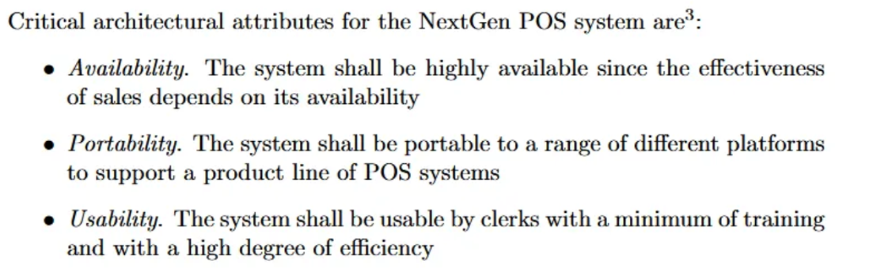
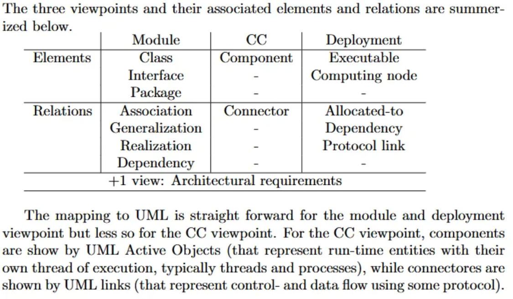

# An Approach to Software Architecture Description Using UML

- Software architecture represents an appropriate level of abstraction for many system development activities.
    - Appropriate software architectural descriptions may support, e.g., stakeholder communication, iterative and incremental architectural design, or evaluation of architectures

***Three view points:***

- A Module viewpoint concerned with how functionality of the system maps to static development units,
- A Component & Connector viewpoint concerned with the runtime mapping of functionality to components of the architecture, and
- An Allocation viewpoint concerned with how software entities are mapped to environmental entities

We recommend collecting architecturally significant requirements (see Section 2) in the architecture documentation.

## Architectural Requirements

Two types of descriptions of architecturally significant requirements are appropriate: 

- scenario-based and
- quality attribute-based requirements

The architecturally significant scenarios (or use cases) contain a subset of the overall scenarios providing the functional requirements for the system.

- They can be augmented with requirements on performance, availability, reliability etc. related to the scenarios. Moreover, “non-functional” scenarios, e.g., describing modifiability of the system may be useful as a supplement.

The goal of describing architectural requirements is to enable the construction of a set of “test cases” against which different architectural designs may be compared and/or evaluated.

## Architectural Description

It is beneficial, when documenting software architecture, to apply different viewpoints to the system. Otherwise the description of the system will be incomprehensible.

1. A viewpoint which describes the functionality of the system in terms of how functionality is mapped into implementation
2. Describe how the functionality of the system maps to components and interaction among component
3. How software components map onto the environment, in particular hardware structures.

These three viewpoints are the *module*, *component & connector*, and *allocation* viewpoints

### Module Viewpoint

> Concerned with how the functionality is mapped to the units of implementation.
> 

***Concerns***

Visualizes the static view of the systems architecture by showing the elements that comprise the system and their relationships

***Stakeholder Roles***

Viewpoint is important to architects and developers working on or with the system.

***Elements and Relations***

- Class, Package, Interface
- Association, Generalization, Realization, Dependency

### omponents and Connectors (C&C) Viewpoint

> Concerned with the run-time functionality of the system—i.e. what does the system do?
> 

***Concerns***

- Software systems are perceived as consisting of components which are black-box units of functionality and connectors which are first-class representations of communication paths between components.
- Components embody functional behaviour while control and communication aspects are defined by the connectors.

**Stakeholder Roles**

Important to architects, developers, and may also serve to give an impression of the overall system runtime behaviour to customers and end users.

**Elements and Relations**

The C&C viewpoint has one element type and one relation type:

- Component: A functional unit that has a well-defined behavioural responsibility.
- Connector: A communication relation between components that defines how control and data is exchanged.

### Allocation Viewpoint

**Concerns**

Concerned with how the software elements of the system – in particular the C&C viewpoint elements and relations – are mapped to platform elements in the environment of the system.

**Stakeholder Roles**

Important to a number of stakeholders: Maintainers needing to deploy and maintain the system, to users/customers who need to know how functionality is mapped to hardware, to developers who need to implement the system, and to architects.

**Elements and Relations**

The deployment viewpoint has two primary element types:

- Software elements: These may be, e.g., executables or link libraries containing components from the C&C views.
- Environmental elements: Nodes of computing hardware

There are three main relation types:

- Allocated-to relations: Shows to which environmental elements software elements are allocated at runtime. These relations may be either static or dynamic (e.g., if components move between environmental elements).
- Dependencies among software elements
- Protocol links among environmental elements showing a communication protocol used between nodes.

### General Overview

