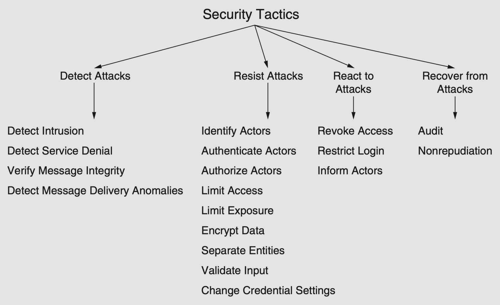

# Lecture 3 - Architectural Synthesis

## The synthesis process
> **Architectural Synthesis (AS)**
> Proposing a coollection of architecture solutions to address the ASRs that are identified during Architectural Analysis.
> This activity essentially links the problem to the solution space.

### Why is synthesis important
> Proposed architecture *defines the framework in which the rest of the development will fit in*.
> Forces you to think deep upfront. Even if often it must be iterated

### A rational design process: why you can’t have it
> Stakeholders do not necessarily know what they want or are unable to tell all they know.
> Even if:
> * many details only become known during implementation
> * projects are subject to change for external reasons
> * people make mistakes
> * the conflict of qualities. Many system qualities are in direct conflict – they must be balanced!. 
>     * Security vs. Performance / Usability

### A rational design process: how to fake it
> Fake end result = appears as if a rational process was followed.
> * Requirements are clear,
> * design is well-described,
> * it is argued that design meets requirements

We are interested in the end result, not the steps going into producing it

#### A fake synthesis process
1. Choose architectural style(s) according to quality requirements.
2. Create overall, tentative structure
   1. >Q1: What is the context of the system? 
   Describe tentatively the other systems and actors the system interacts with.
   2. > Q2: What functionality is needed? 
   Describe tentatively components (i.e. functionality) & connectors. Describe where components are to be deployed
   3. >Q3: How do you divide the work of implementing functionality? 
   Describe tentative modules (e.g. packages)
   4. > The result of (2) is the set of initial architectural UML models corresponding to the **3+1 approach**
3. Refine initial structure through quality attribute scenarios.
   > For each quality attribute scenario apply architectural tactics for the main quality attribute. Consider applying tactics also for quality attributes for which you do not have scenarios.
4. Consider architectural and business qualities
   1. >Correctness and completeness. 
   Do you cover functional requirements correctly?
   2. > Feasibility
   With the resources available, is it possible to realize the
system?
5. Maintain an architectural backlog.
   1. >For each step, note questions and uncertainty in the backlog
   2. >Many decisions might need to be taken when more information is available
   3. > Sometimes it’s better to delay the most important decisions… don’t commit to something before it’s necessary

## Architectural styles/patterns
> **Architectural styles/patterns**
> Reusable solutions to commonly occurring problems in software
architecture

> Architectural pattern defines
> * types of *elements* and *relationships* that *work together* in order to solve a particular problem.
### View vs Viewpoint
> A **viewpoint** defines the types of the elements and relationships in a set of views.
> A **view** is an actrual representation of a system from the perspective oof a related set of concerns.
>
> In short:
> **Viewpoint = abstract solution**
> **View = instance of abstract solution**

### Patterns and viewpoints

#### Viewpoint: Component Interaction
> System is seen as number of independent but interacting components.

> Concerns
> * How do the independent components interact with each other?
> * How are the individual components decoupled from each other?
> * How are the quality attributes of modifiability and integrability supported?

> Examples:
> * Client server
> * Peer to peer
> * Publish/Subscribe

#### Viewpoint: Adaptation
> The system is viewed as a core part that remains invariable and adaptable part that can
change over time or in different versions.

>Concerns
>* How can a system adapt to evolution over time or to multiple different versions of a basic
architecture?
>* What is the system functionality that is more likely to change and what will possibly remain
invariable?
>* How do the invariable parts communicate with the adaptable parts?
>* How are the quality attributes of modifiability, reusability, evolvability, and integrability
supported?

> Example:
> * Microkernel
> * Plugin Architecture

#### Viewpoint: Data flow
> System is seen as a number of subsequent transformations upon streams of input
data

> Concerns
> * What are the elements that perform the transformations?
>* What are the elements that carry the streams of data?
>* How are the two aforementioned types of elements connected to each other?
>* How are the quality attributes of performance, scalability, modifiability, reusability,
and integrability supported?

> Example:
> * Pipes and filters

#### Viewpoint: Distribution
> tackles concerns about disseminating components in a networked environment

> Concerns
> * How do the distributed components interact with each other?
>* How are the distributed components decoupled from each other?
>* How are the quality attributes of interoperability, location-transparency,
performance, and modifiability supported?

> Example:
> * Message queue
> * Event broker
> * Microservices
> * Monolith

#### Viewpoint: Data centered
> system is seen as a persistent shared data stored that is accessed and modified by a number of elements.

> Concerns
> * How is the shared data store created, accessed, and updated?
>* How is data distributed?
>* Is the data store passive or active, i.e. does it notify its accessors or are the accessors
responsible of finding data of interest to them?
>* How does the data store communicate with the elements that access it?
>* Do the accessor elements communicate indirectly through the shared data or also
directly with each other?
>* How are the quality attributes of scalability, modifiability, reusability, and integrability
supported?

> Example:
> * Shared repository

#### Viewpoint: Layers
> the system is viewed as a complex heterogeneous entity decomposed in interacting parts.

> Concerns:
>* What are the parts that make up the whole system?
>* How do these parts interact with each other?
>* How do the parts perform their functionality and still remain decoupled from each
other?
>* How are the quality attributes of modifiability, portability, and performance
supported?

> Example:
> * Layered Architecture

#### Viewpoint: User Interaction
> system is seen as a part that represents the user interface and a part that contains application logic.

> Concerns
>* How is the user interface decoupled from the application logic?
>* How are the quality attributes of usability, modifiability, and reusability supported?
>* What is the data and the application logic that is associated to the user interface?

> Example:
> * MVC

#### Viewpoint: Language Extension
> concerned with how systems offer an abstraction layer to the computation infrastructure.

> Concerns
>* How can a part of the system that is written in a nonnative language be integrated
with the software system?
>* How can the non-native part be translated into the native environment?

> Example
> * Interpreter

## Architectural tactics
> **Architectural tactics**
> Surgical means of supporting qualities.
> Architectural decisions that influence the achievement of quality attribute.

> *They directly affect system’s response to a **stimulus***.

> **Characteristics**
>* Capture what architects do in practice
>* May influence more than one quality attribute

> *Collection of tactics = strategy*

### Relationship to patterns
>A pattern (or several) might not completely solve the architect’s problem completely.
>If no pattern exists for a given goal, tactics can construct a solution from “first
principles” 

### Categories of tactics
1. Availability
2. Modifiability
3. Performance
4. Security
5. Testability
6. Usability
7. Interoperability

### Availability tactics
> A property of software that it is there and ready to carry out its task when it is required.  
> Encompasses what is normally called reliability but adds to it the notion of recovery (repair)

> Availability tactics … keep *faults* from becoming *failures*!.
> A **failure**: when the system no longer delivers a service consistent with its specification – observable by the users.
A **fault** is a malfunction that has the potential to cause a failure.
**Availability tactics** enable a system to endure faults so that services remain compliant with their specifications.

### Modifiability tactics

### Performance tactics

### Security tactics
> Security is a measure of the system’s ability to protect data and information from unauthorized access.

> Main Characteristics of Security
> * **Confidentiality** is the property that data or services are protected from unauthorized access. (e.g. hacker cannot access your income tax returns on a government computer)
> * **Integrity** is the property that data or services are not subject to unauthorized manipulation. (e.g. your grade has not been changed since your instructor assigned it)
>* **Availability** is the property that the system will be available for legitimate use. (e.g. a denial-of-service attack won’t prevent you from ordering a book from an online bookstore)

