# Lecture 4 - Detailed Design

### What is detailed design?
* We are working closer to the implementation level
* The goal is define how to implement software architecture
* Since we are closer to implementation level, techniques are not (necessarily) paradigm independent.
  * What may work for OO may not work for others

### What is system design?
* the result of the process of defining the architecture, components, interfaces, and other characteristics of a system or component

### Detailed design vs. Architectural design

We destinguish between detailed software design and software architecture (architectural design):
  1. Software architecture is concerned with describing the overall structure of systems
  2. Software design is concerned with describing each component in such a detail that it may be constructed

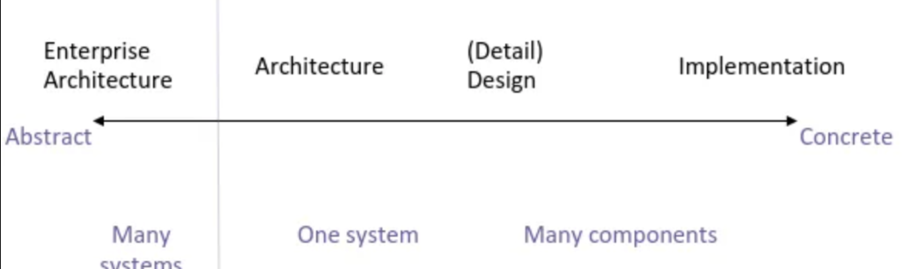

### 1. Design Models
* Computational models
  * Turing machines (models for reasoning about algorithms)
  * In general too detailed for our discussion
- Abstractions for reasoning about certain structural aspects of software
- Relevant for discussion in software design & architecture
- First-order, finite structure in mathematical logic
- Consist of atoms and relations among atoms

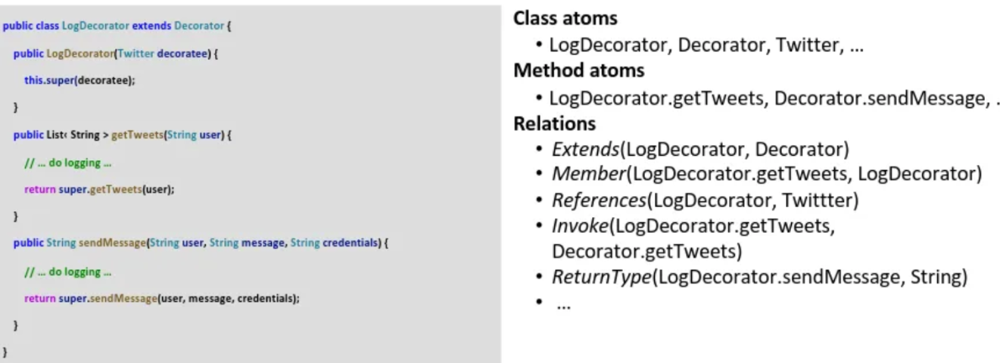

### 2. Specification

- Specifications = the set of formal languages of any order
- They include programming languages (e.g. Java, Haskell) and specification languages (e.g. Z, UML)
- Their semantics are described by design models

*Use some form of combination pseudocode and something else*

### 3. Intensionability vs. Extensionability

A specification is said to be intensional if there are infinitely many possible instances of it. Otherwise, it is said to be extensional

---

**An implementation** is *extentional*
* As a specification, an implementation is only associated with one design model
**Designs** are *intensional*
* Viewpoint is *intensional*, while a view is *extensional*

### 4. Non-Locality

Architectural decisions are usually concerned with the entire system:

- non-local i.e., all possible “implementations” of an architectural specification must meet the architectural specification

Local specifications can be satisfied in “some corner” of our program without this being affected in how the rest of the program is like.

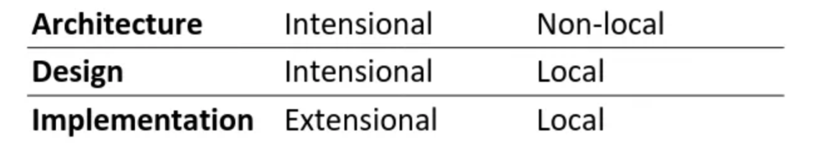

## Design Pattern

> A recurring solution to a problem in a context

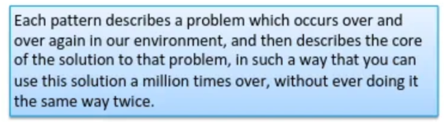

### Principles of compositional Design

*Object-oriented specific = so we are working in a specific domain*

Many object-oriented design patterns embed principles of compositional design

1. Program to an interface, not an implementation
2. Favor object composition over class inheritance
3. Encapsulate behavior that varies

Can be used individually, but often work nicely in concert, in the order: ***The 3-1-2 Process***

---

### 3. Encapsulate behavior that varies

Encapsulation = bundling together of data and functionality that belong together

- Why? This increases the chances that future changes to encapsulated objects do not require architectural changes

### 1. Program to an Interface not an Implementation

Let clients depend on **what** the code does, not **how** it is actually implemented.

- Why? This allows the implementation to change without affecting the clients. Forces you to think of responsibilities

---

**API Mandate = all capabilities to be designed and exposed as service APIs** (Jezz Bezos’ Big Mandate)

---

### 2. Favor object composition over class inheritance

Composition = “has a” relationship.
Inheritance = “is a” relationship.

- Why? Composition-based designs are more flexiblble
- Harder to change a parent class

**Problems with Inheritance**

- With inheritance you only have “one shot”
- You can’t change the superclass at runtime

## Design Patterns

### Strategy vs. State

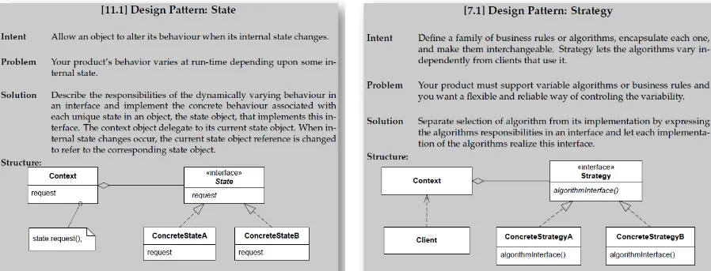

**Strategy**: Encapsulates a family of interchangeable algorithms in separate strategy classes so the client can switch behavior at runtime

**State**: Encapsulates varying behavior for an object based on its internal state in separate state classes, letting the object change its behavior at runtime by switching state instances.

### Abstract Factory

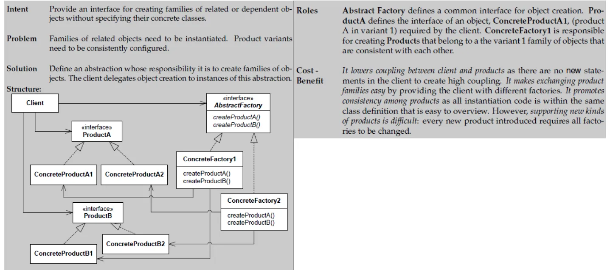

**Abstract Factory**: Provides an interface to create related objects without specifying their concrete classes, ensuring they’re used together correctly.

### Decorator

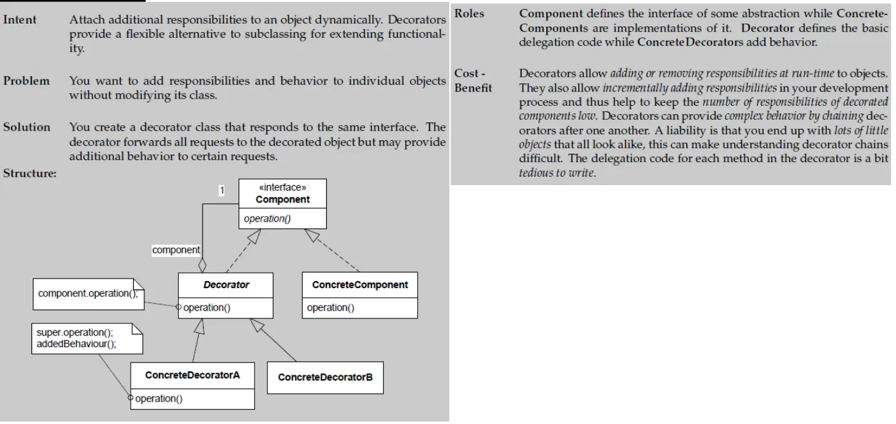

**Decorator**: Wraps an object to add or override responsibilities dynamically, preserving the original interface.

### Adapter 

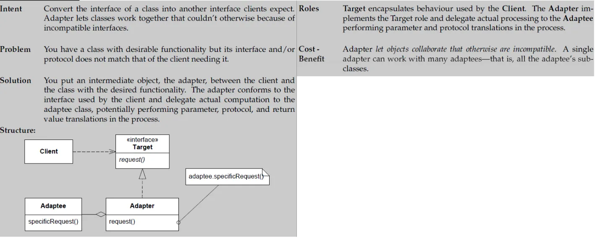

**Adapter**: Converts one interface into another that clients expect, allowing incompatible classes to work together.

### Builder

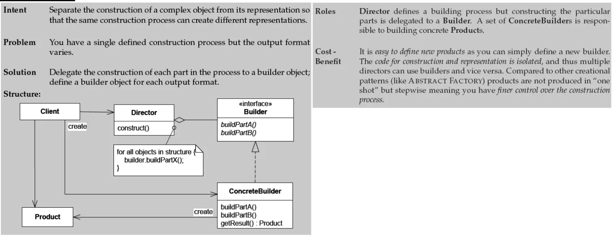

**Builder**: Separates complex object construction from its representation, letting you build different representations step by step.

### Command 

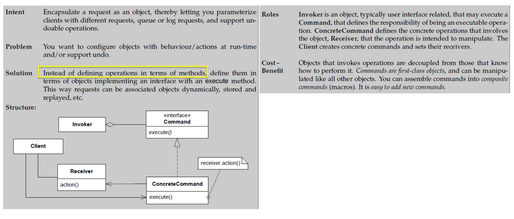

**Command**: Encapsulates a request as an object, decoupling the invoker from the executor and supporting undoable operations.

### Proxy

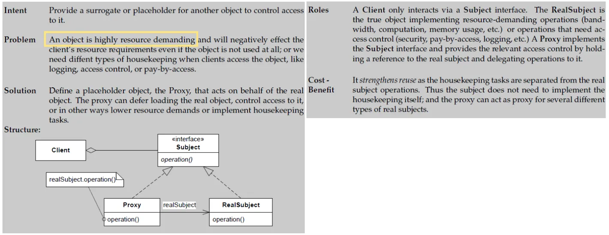

**Proxy**: Provides a surrogate or placeholder for another object to control access, defer costly operations, or add logging.

### Composite

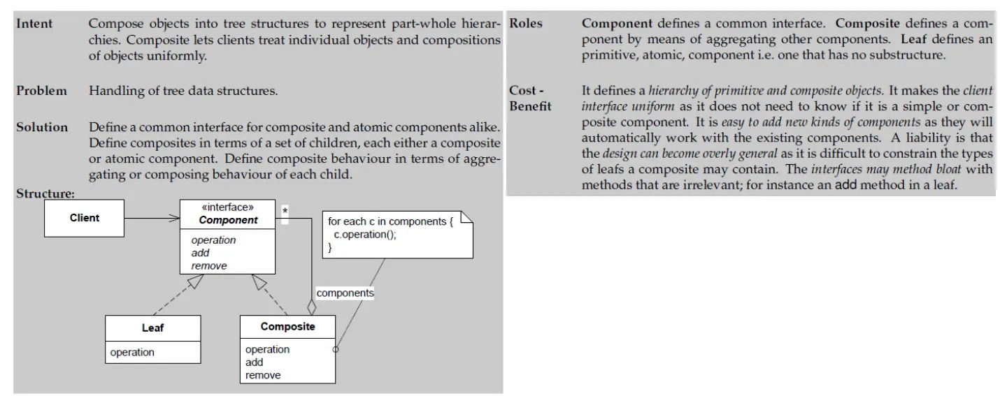

**Composite**: Lets you treat individual objects and compositions uniformly by organizing them into tree structures representing part–whole hierarchies.

### Observer

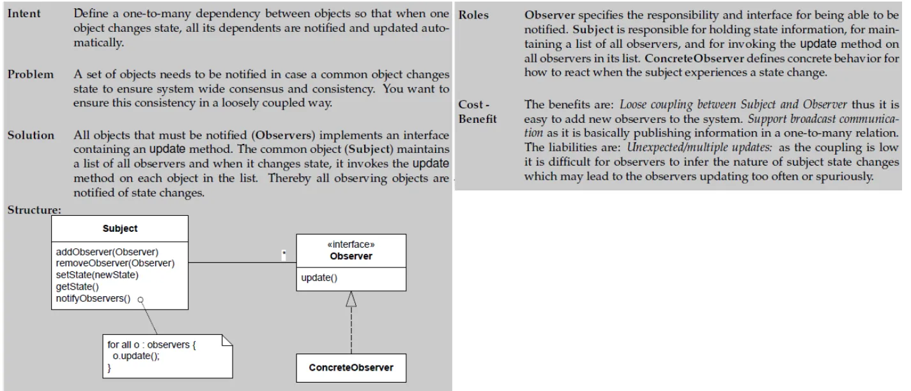

**Observer**: Defines a one-to-many dependency so that when one object changes state, all its dependents are notified and updated automatically.

## Summary

Detailed software design is concerned with local, intensional properties of software structure:
1. Local: design decisions are made for one (or a few) elements of a structure
2. Intensional: the tehcnique (pattern) may be instantiated in many ways and situations

The 3-1-2 process

Design patterns embody decisions that can be tkaen using the 3-1-2 process and that have been validated in real systems.

