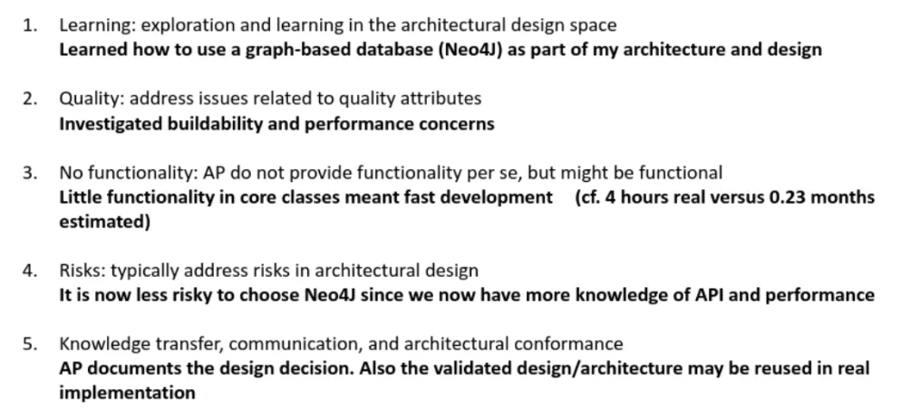

# Lecture 5 - Architectural Protoyping

*Who has the answer to questions like this?*

* React or Angular? Micro-services vs. layers? Is "hot restart" redundancy good enough for our system? etc.

**Architects**: As architects, sometimes you know and sometimes you do not know.

### The role of the Architect
- Knowledge
    - Experience
    - Ability to reflect & learn
- How to “shortcut” knowledge cycle
    - Learn from others
    - Try in small scale
        - Technology & literature reviews
        - Prototyping

Architects are expected to have a lot of knowledge. 

- The best way to try in **small scale** and **prototype**
    - We use it more than we think

---

Architectural (design) can be based on styles, patterns, tactics (a lot of theory), but what if:

- We are uncertain whether one or the other is better to choose (style, patterns, tactics etc.)?
- When we are uncertain whether the favorite architecture will have the right balance of conflicting quality attributes (doesn’t diminish them)?
- When we are uncertain that the spects of the third party vendor are real and not just empty sales talk?
- When we want to explore the *design space* and learn (become better architects)

This is where **prototyping** comes in, by helping us quell these uncertainties.

## Prototyping

### Prototyping - In general

- Doesn’t originate from software architecture
- Executable systems (involve an early practical demonstration of the systems capabilities)

### Applying this to software architecture

- An architectural prototype consists of a set of executables created to investigate architectural related to concerns raised by stakeholders of a system under development.
    - Apply in an academic like experiment and get a result
- Process of designing, building and evaluating architectural prototypes.

### Characteristics of Architectural Prototypes

1. **Learning**: exploration and learning in the architectural design space
2. **Quality**: address issues related to quality attributes
3. **No functionality**: AP do not provide functionality per se, but might be functional
    1. Usability: in the terms of usability two ways of structuring the architecture: the system is distributed or modular (the system builds it themselves). You can test these against each other. Help keep us in check that we are validating the architecture, and not specific functionality. 
4. **Risks**: typically address risks in architectural design
5. **Knowledge transfer, communication, architectural conformance**
    1. For why or why not we made a decision for the architecture (a means of communicating this to someone who comes later)

### Types of architectural prototypes

1. xploratory prototypes (more fluffy)
    1. Clarify architectural requirements with stakeholders
    2. Explore aspects of target system
    3. Discuss alternative solutions
2. Experimental prototypes
    1. Gauge adequacy of proposed architecture
    2. Quantitative measurements of quality attributes like performance
3. Evolutionary prototypes (becomes skeleton for the final system)
    1. Target environment
    2. Keep evolving prototype

---

- **Exploratory Prototypes**: Used early to clarify requirements and explore ideas. Disposable.
- **Experimental Prototypes**: Built to test specific hypotheses or technologies. Focus on feasibility.
- **Evolutionary Prototypes**: Continuously refined and improved, eventually becoming the final system.

---

It is worth noting that you prototype a corner (part) of the system, instead of the entire system.

### AP in Software Development

- RUP/Waterfall
    - Finding proposals, Evaluating proposals, Evolving proposals
    - In an ideal world;

What about iterative development?

- Agile/SCRUM
    - Similar to architectural design
        - Sprint 0 (optional) investigate the overall aspects (overall/intermediate level)
        - Parts of each sprint (intermediate/detailed)
- SAFe (arguably not agile)
    - Architectural & developers prototype & experiment with different qualities typically part of enablers.

(Unsure what this has to do with anything??)

### Twitter Case Study

