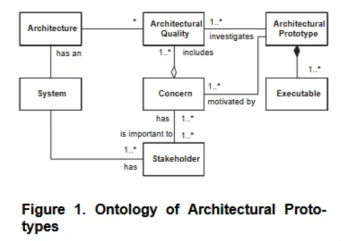
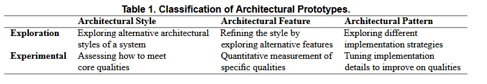
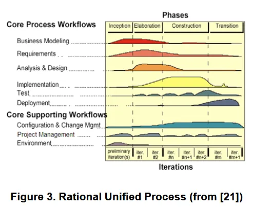

# Architectural Prototyping: An Approach for Grounding Architectural Design and Learning

## Introduction

However, abstract as they are, they provide the orbital view; and more often than not, architects need to “be there” to explore issues in sufficient detail to make qualified decisions.

- Explore architectural prototypes as the metaphorical equivalent of “being there”, i.e., scouting the architecture-to-be-implemented by actually building low-cost executable systems that reflect essential architectural qualities of a potential target system’s architecture.

## Architectural Prototyping

we may characterize architectural prototyping as a special class of software engineering prototyping with a number of distinct properties.

### Definition

We define the concept of architectural prototype as follows:

> An architectural prototype consists of a set of executables created to investigate architectural qualities related to concerns raised by stakeholders of a system under development. Architectural prototyping is the process of designing, building, and evaluating architectural prototypes.
> 

Architectural prototypes may investigate Architectural Qualities in a number of ways.

### Characteristics

1. Architectural prototypes are constructed for exploration and learning of the architectural design space.
    - Architectural prototyping is a way to break this circle as it allows the architect to learn and experiment at a low cost. That is, the architect’s “design vocabulary” is expanded
2. Architectural prototyping addresses issues regarding architectural quality attributes in the target system.
    - as qualities can be observed and measured directly
3. Architectural prototypes do not provide functionality per se.
4. Architectural prototypes typically address architectural risks.
5. Architectural prototypes address the problem of knowledge transfer and architectural conformance.
    - A major challenge in architecture centric development is ensuring that the architecture “as-built” is identical to the architecture “as-designed”.
    - Here the architecture prototype serves as a reference system that demonstrates key architectural decisions, patterns and style

## Classification of Architectural Prototypes

- **Exploration prototypes.** used to clarify requirements to the architecture together with its stakeholders, to explore aspects of the target system, and used to discuss alternative architectural solutions.
- **Experimental prototypes.** used to gauge the adequacy of a proposed architecture, or details hereof, before investing in a large-scale implementation of it. Experimental prototypes are typically used to measure software architecture qualities; e.g., to make quantitative measurement of performance or portability.

### Exploratory Architectural Prototypes

Once an architectural style has been decided upon it can be refined by exploring different features of the architecture like exploring types of components, connectors, or the topology of the architecture. Prototypes can be built to explore how the choice of certain features of the architecture influences the overall target system.

On a more detailed level, exploratory prototypes can be used to survey different strategies in implementation.

### Exploratory Architectural Prototypes

Experimental prototypes are used to measure specific aspects of a proposed architecture, or details hereof

Their main purpose is to establish experimentally if the proposed architecture meets the qualitative requirement.

Other stakeholders, like the customers, might, however, also be interested in an early proof of conformance to quality requirements.

- One might argue to what degree it is possible to obtain valid measurements for architectural qualities before the system is built.
- However, we would argue that if a certain architecture quality, like in this case performance, is
important, then it is imperative to start building for and evaluating performance at an early phase in the development,

On the most overall level, an experimental prototype can be build to assess how to meet core requirements to software qualities.

On an intermediate level, an experimental prototype can be used to quantitatively measure how well an architecture fulfils requirements to software qualities

On a detailed level, an experimental prototype can be built to test how the use of architectural and/or design patterns can help accomplish the overall architectural qualities.

## Architectural Prototypes and the Development Process

The UP process operates with four phases in which iterative development is performed:

- ***Inception*** is concerned with understanding what to build by among others establishing a business case and finding and describing major use cases
- ***Elaboration*** is concerned with understanding how to build what has been identified in the inception phase.
- ***Construction*** is concerned with incrementally building a functionally complete version of the system (typically a “beta version” of the system).
- ***Transition*** is concerned with building the final version of the product which may be finally shipped to customers.