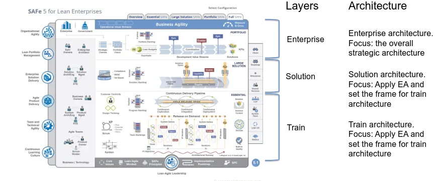
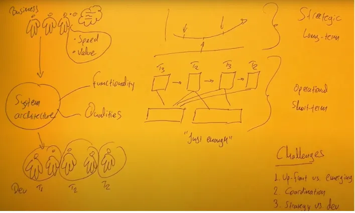
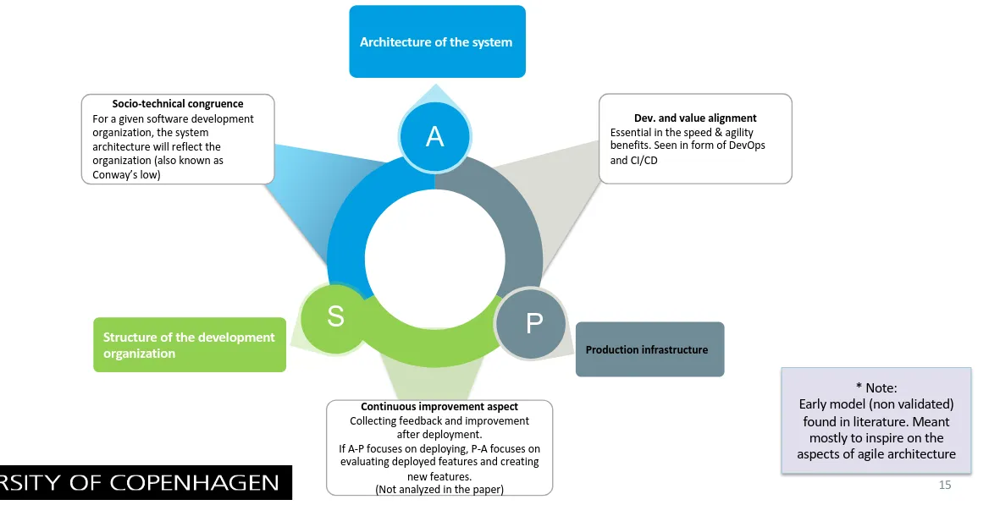
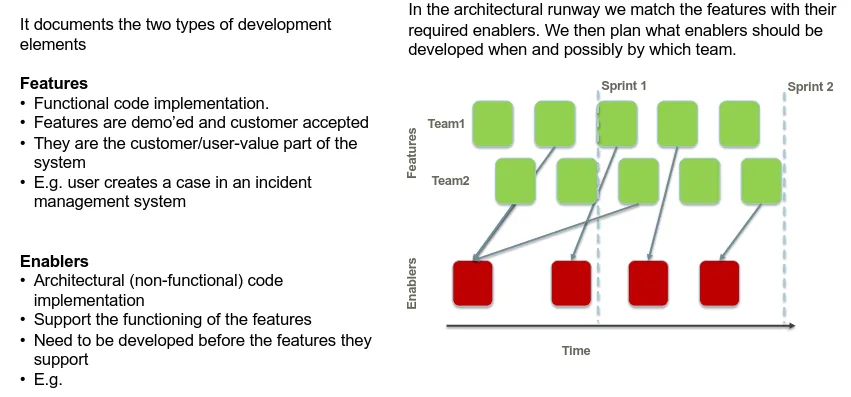
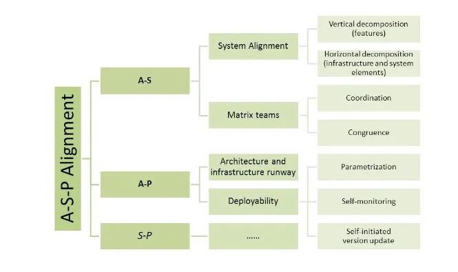

# Lecture 6 - Agile Architecture

## Agile Overview

### Different flavors of agile

- Everything started with the agile manifesto
    - Came as a reaction to the software creation tendencies
- The manifesto consists of these values and 12 principles
- Signed by 17 authors initially and many others afterwards
- Signified the era of software development where focus was on
value-creation and working software
    - opposed to verbose development models

### SCRUM 

- Development methodology that splits development to iterations (called
sprints) with each iteration:
    - Having a pre-agreed development scope
    - Having a standard duration
    - Finishes with a demonstration ofthe end-user functionality developed in the sprint
    - The customer and end-user approve the sprint demo and
- Comes with a set of concrete rituals that makes the adoption easy

*Comments*:
- Probably the most popular development methodology
- Build with customer value in focus
    - Requires customer and/or end user involvement
    - Sometimes end users are simulated from another role: ***Product Owner***
- Allows for unknowns and unpredictable situations
    - Each sprint (typically 3 weeks) starts with defining what should be the scope
- Meeting heavy; demo; estimation; scope, you use a lot of time; at the end of the day you still need to align with your team/peers.
  - But it allows us to change direction.

### KanBan

- Mainly managing resources and workload base on the “Lean” approach
- Work is visualized in a Kanban board
- A limit is set to how much Work In Progress is allowed
- Work toward not stopping production (flow) by:
    - Predicting the workflow stages and expected bottlenecks
    - Moving resources around to support flow

*Comments*:
- Applies to current organizational roles
    - typically no need for change
- Allows for tailoring to needs of the current development organization (modify the workflow)
- Focus on producing software
- Can be combined with other software development models e.g. SCRUM or DevOps.

### DevOps

- Methodology, toolset and culture that combines development & operations
- The team who is responsible for building the code, also deploys it in production
- Similarly, on infrastructure failure it is the development team that responds
- Requires by definition infrastructure as code and scripts are managed like code in SCM

*Comments*:

- Popular in web and cloud environments (among other)
- High focus on availability
- Existing ecosystem of tools to support DevOps
- No more development and operations as separate departments

### SAFE

- Scrum for large systems and/or organizations (> 3 Scrum teams)
- Teams are grouped together in Agile Release Trains (ART)
- Sprints are grouped in program increments (PIs):
    - Each PI contains x sprints
        - Sprint planning & demo: internally in the team
        - PI planning & demo with the whole ART
    - Organized in 3 abstraction layers

*Comments*:

- Popular in larger organizations
- High complexity
- Focus on value creation
- By definition: alignment and collaboration is a challenge

More defined than SCRUM

- SAFE: Enterprise-level Agile framework for coordinating multiple teams
- SCRUM: Team-level Agile framework for iterative development
- Differences:
    - **Scope**: SAFe = enterprise-wide, Scrum = team-level
    - **Structure**: SAFe = multi-layered, Scrum = single-team

## Agile Architecture

*Challenges*:

1. The more up-front the less it allows for innovation, which is why: up-front vs. emerging
2. what i am building today will not be the opposite of what team 3 is building ie. we are aligning; coordination
3. It is very hard to make long term architecture, since we need to allow for innovation (through agile); strategy vs dev

### Agile Architecture and Qualities

Agile development focuses on:

- Value creation
- Split development on iterations thus allow for changes in requirements

***The relevant focuses here are:***

- **Modifiability**
    - Facilitates the constant change in requirements
- **Interoperability**
    - Focus on the integration among the development of independent teams (especially in large systems)
- **Time-to-market**
    - Architect the system in such a way to allow for rapid release

Other “traditional” system qualities e.g. availability, security etc. will always be relevant

---

A note about *modifiability* :
As we can't predict what happens in later sprints, we try to achieve *modifiability*, such that it is possible to modify the ystem without it being too terrible/costly.

---

### Agile Architecture Structure

*Three Structures*

The we structure our organization will change our architecture/our system (Conway’s law)

- It would be the same for opposite; the architecture will also change our organization or how they communicate/collaborate.

A = Architecture of the System
P = Production Infrastructure
S = Structure of the deveglopment organization

- Socio-technical congruence (A/S)
  - For a given software development organization, the system architecture will reflect the organization
- Dev. and value alignment (A/P)
  - Speed & agility
- Continuous improvement aspect (S/P)
  - Collecting feedback and improvement after development

---

Konstatinos does not like this model:)

---

### Architectural Runway

The dilemma of agile architecture:

> *How to design architecture while allowing for independent development?*

We have to different types of architecture (in agile):

1. **Up-front or Intentional architecture**
    1. The architecture that is planed and designed before the development
2. **Emerging or evolving architecture**
    1. The architecture of the system as it evolves through the development

The spectrum of intentional design:

- **Too much intentional architecture does not leave space for innovation and modifiability** according to changes the environment around the system e.g. requirements or users being more knowledgeable.
- **Too little intentional architecture risks the commitment to the overall qualities of the system** or **introducing to much technical debt**.
    - *Implicit* vs *Explicit* Technical Debt (Bad/Dangerous vs Good)

---

The architectural runway is the method to design document and visualize the desired amount of intentional architecture.

It documents two types of development elements
- Functional Tasks = Features (green tickets)
- Enablers = non-functional code (red tickets)
- Enablers are stuff we need to do such that we can our features/functional tasks
    - Unsure if this can be called non-functional tasks (Konstantinos uses this word)
        - Can be seen as non-functional tasks (qualities)

*Who makes these enablers?*

### Horizontal vs. Vertical System Devomposition

***Who builds the enablers in the architectural runway?***

Three stages of maturity in an agile development project:

- **Horizontal decomposition**
    - Each team builds their own enablers to support their features
- **Enhanced horizontal decomposition**
    - Each team builds their own enablers but there exists a set of specs, documentation, standards etc. on how to build them
- **Vertical decomposition**
    - Each team builds their functionality utilizing the existing enablers. The enablers are either build as generic from each individual team or are provided by an infrastructure team that only builds enablers (applicable to large projects)

*Maturity*:

Low maturity = horizontal (no enabler teams, we build them ourselves)

High maturity = vertical composition (starting to have dedicated enabler teams)

A **mature architecture** is well-documented, modular, resilient, and capable of handling growth and change efficiently.

- **maturity** refers to the level of stability, scalability, maintainability, and adherence to best practices in a system.
- Levels of maturity

### A-S-P Alignment

