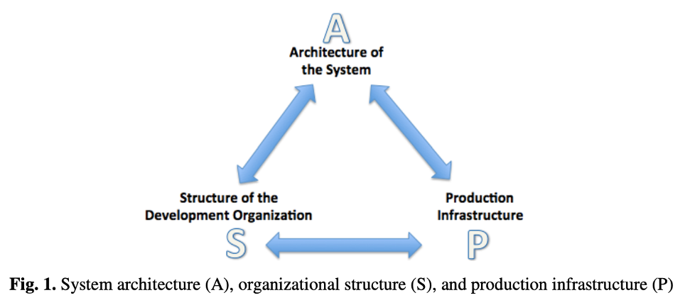

# Readings lecture 6

## Why Use Architecture Patterns (APs)
> * Executable software ensures nothing is overlooked.
> * Cost-effective and clear for stakeholders.
> * Helps maintain architectural consistency.
>* Useful for learning and gaining experience.

## Architecture in Agile Development
> **Key Idea**: In large-scale projects, architecture and agility support each other. Architecture enables team scaling; agile enables iterative architectural evolution.

> Three Key Structures
> * **A**: Software architecture.
>* **S**: Team/org structure.
>* **P**: Production infrastructure.
>
>Maintaining alignment among A-S-P is crucial to minimize technical, social, and infrastructure debt.

### Benefits of Architecture
>* Reduces team conflict via socio-technical congruence.
>* Enables common vocabulary, controlled dependencies, and manages technical debt.
>* Guides planning and configuration.

## Agile + Architecture Tactics
> **Vertical decomposition**: Teams own all parts of a feature → promotes autonomy.

> **Horizontal decomposition**: Teams focus on shared infrastructure → supports platform development.

> **Matrix structure**: Cross-cutting roles (e.g., architects) coordinate work across teams.

> **Architecture runway**: Prepares system/infrastructure to support future features without rework delays.

## Alignment Tactics
> **A-S**: Work assignment view, vertical/horizontal decomposition

> **A–P**: Install allocation view, runway building, deployability tactics

> **A–S–P**: Evolve all three over time; re-align regularly

### Deployability Tactics
> **Parameterization**: Configurable environments.

> **Self-monitoring**: System health tracking.

> **Self-initiated updates**: Auto-updating systems.

## Development Lifecycle Strategy
> **Early Phase**: Horizontal teams stabilize infrastructure and build the architecture runway.

> **Mid Phase**: Mixed teams begin implementing features; some maintain frameworks.

> **Later Phase**: Vertical teams build user features; occasional horizontal coordination continues.

## Conclusion
> To scale agile effectively:
>* Treat architecture as central and iterative.
>* Continuously realign architecture (A), structure (S), and infrastructure (P).
>* Use architectural tactics to reduce dependencies and maintain agility at scale.