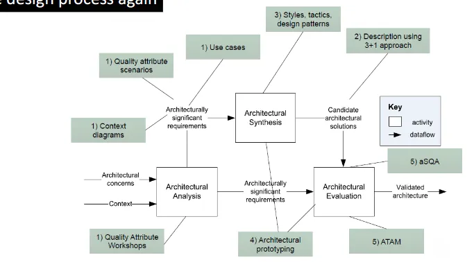
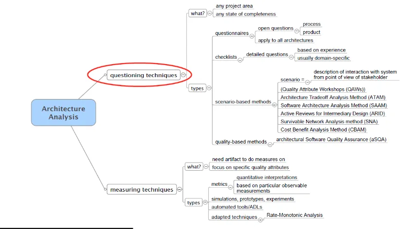
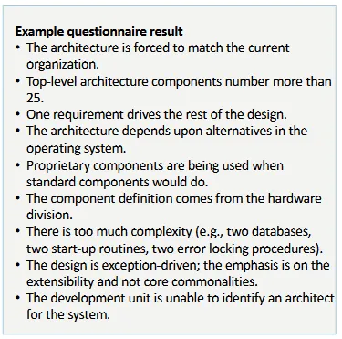
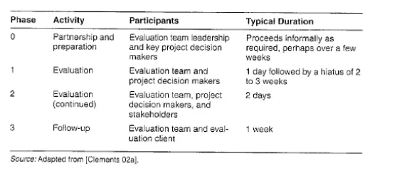
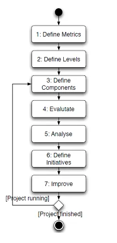
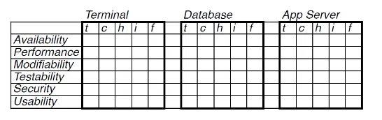
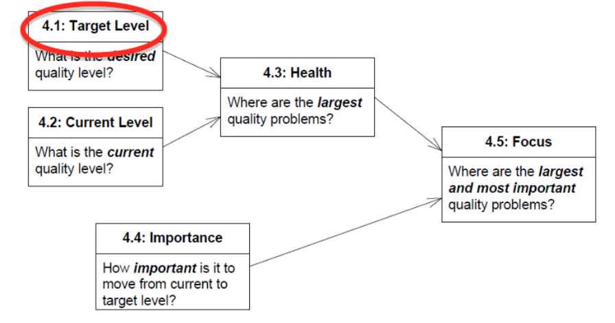
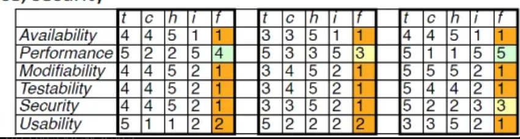

Lecture 7 - Architectural Evaluation

### The design Process 

- We now have a candidate architectural solution (from Architectural Synthesis). 
- Next up: Architectural Evaluation

---

*What can you evaluate given a software architecture (description)?*

*What are the limits of architectural evaluation?*
* There might not be anything tangible to actually evaluate (as in code). So we are challenged in our level of abstraction.

### Rationale for Architectural Evaluation

- Software architecture allows or precludes almost all system quality attributes
  - Allow for some, while making others difficult/impossible to achieve
- Architecture needs to be designed early
    - It is a prerequisite for work assignment
    - Cf. Sprint 0 in SCRUM or intentional architecture (SAFe)
- Need to evaluate impact of architectural design on quality attributes

### When should it be done?

Typically when architecture is designed, but design not implemented

- I.e., early in a cycle in an iteration – where we can still change things
- E.g., “We have designed this architecture will it possibly fit the quality requirements?

---

- Could also be earlier – when we do not have a design
  - E.g., “Will any architecture meet these quality requirements?”
- Could also be later – when we have an implementation

### Who?

Roles:
- **Evaluation team**
    - Preferably not process staff (objectivity reasons)
    - Often architect himself…
- **Project stakeholders**
    - Articulate requirements
    - “Garden variety” and decision makers
    - Producers
        - Software architect, developer, maintainer, integrator, standards expert,
- **Performance engineer, security expert, project manager, …**
    - Consumers
        - Customer, end user, application builder (for product line), persons in
- **Problem domain, …**
    - Servicers
    - System administrator, network administrator, service representatives, …

Needs depend on the actual type of evaluation

- From little stakeholder involvement to continuous involvement

---

There are questioning and measuring techniques
- analysis/evlauation
- Measuring techniques; quantitative

Just a general rule but not always the case. The second applies to a conceptual level very hard to do measuring techniques. As you need specific artifacts. 

So the focus of the lecture is on Questioning Techniques.

### Questioning Techniques

Analytical

- Any project artifact
- Typically in the form of a review
- Any state of completeness

Subtypes

- *Questionnaires*
- *Checklists*
- *Scenario-based methods*

### Questionnaires

- Interview-based list of relatively open questions
- Generic questions that can be reused/adopte
- Focus on both process and product questions

Pros:

- Apply to all architectures
- Can already be used early in the design

Cons:

- Abstract input (can) result to unconcreted results
- The quality of the review relies on the ability of the stakeholders

---

We assume that they have the level of understanding (are technical enough) and don’t misunderstand the questions. 

- Can be interpreted depending on your background
- So it’s easy to send out but probably not in-depth enough.

### Checklist

- Pre-defined checklist Interview-based list of relatively open questions

Pros:

- Validated and proven method
- Time & resource efficient – value for money

Cons:

- Specific to a domain or focus area
- Fail to identify issues in the intersection of fields

### Scenario-based Methods

**Scenarios**

- Description of interaction with system from the point of view of a stakeholder
- System-specific – developed as part of project
- Cf. quality-attribute scenarios as in [Bass et al., 2003]

**Types**

- *Quality Attribute Workshops (QAW)*
    - Structured way of involving stakeholders in scenario generation and prioritization
- *Architecture Trade-off Analysis Method (ATAM)*
    - Creates utility trees to represent quality attribute requirements
    - Analysis of architectural decisions to identify sensitivity points, trade-offs, and risks
- *Software Architecture Analysis Method (SAAM)*
    - Brainstorming of modifiability and functionality scenarios
    - Scenario walkthrough to verify functionality support and estimate change costs
- *Active Reviews for Intermediary Designs (ARID)*
    - Active Design Review of software architecture
        - E.g., “Is the performance of each component adequately specified” vs. “For each component,
    - Write down its maximum execution time and list the shared resources that it may consume”
- *Survivable Network Analysis method (SNA)*
    - Focus on survivability as quality attribute
    - Process
        - Determine essential components based on essential services and assets
        - Map intrusion scenarios onto architecture to find “soft-spot” components (essential, but
        
         vulnerable)
        
        - Analyse these wrt
            - Resistance
            - Recognition
            - Recovery of/from attacks

### Measuring Techniques

- May answer specific quality attribute scenarios
    - Cf. experimental vs. exploratory prototyping
- Prerequisite
    - Artifacts to do measurements on…
- Types
    - Metrics
    - Simulation, prototypes, experiments
    - Domain-specific analyses
        - E.g., Rate-Monotonic Analysis
    - ADL-based

---

## The Architecutre Trade-off Analysis Method (ATAM)

**Goals**

- Reveal how well architecture satisfies quality goals
- Insight into tradeoffs among quality attributes
- Identify risks

**Structured method**

- Repeatable analysis
    - Should yield same results when applied twice
    - Cf. “methods & research questions”
- Guides users to look for conflicts and resolutions

*Participants*

1. Stakeholders
2. Project decision makers
3. Evaluation team
    1. Team lead (customer-facing)
    2. Evaluation lead
    3. Scenario scribe
    4. Timekeeper
    5. Proceedings scribe
    6. Process observer
    7. Process enforcer
    8. Questioner

### Conducting

### ATAM Steps - Investigation and ANalysis

1. *Present the ATAM*
    1. Evaluation leader describes method
2. *Present Business Drivers*
    1. Most important functions
    2. Relevant constraints
    3. Technical, managerial, economic
    4. Business goals
    5. Major stakeholders
    6. Architectural drivers
    7. Major quality attribute goals, which shape architecture
3. *Present the Architecture*
    1. In terms of views…
    2. Focus on how drivers are met
4. *Identify Architectural Approaches Used*
    1. Architect names approaches used
        1. Approach = here, set of architectural
    2. decisions, e.g., tactics or styles that are used
    3. Goal
        1. Eventually match desired qualities and decisions
5. *Generate the Quality Attribute Utility Tree*
    1. Decision managers refine most important quality attribute goals e.g.:
        1. Qualities: Performance
            1. Refinement: Data latency
                1. Scenario: Deliver video in real-time
        
        (Note scenarios either 6parts or at least 3: stimulus, environment, response)
        
    2. Specify prioritization
        1. Importance with respect to system success
            1. High, Medium, Low
        2. Difficulty in achieving
            1. High, Medium, Low
        3. i(H,H), (H,M), (M,H) most interesting
6. *Analyses Architectural Approaches*
    1. Match quality requirements in utility tree with architectural approaches
        1. How is each high priority scenario realized?
        2. Quality- and approach-specific questions asked – e.g., well-known weaknesses of approach
    2. Decision makers identify
        1. Sensitivity points
        
        Property of component(s) critical in achieving particular quality attribute response
        
        1. E.g., security: level of confidentiality vs. number of bits in encryption key
        1. Trade-off points
            1. Property that is sensitivity point for more than one attribute
            2. E.g., encryption level vs. security and performance, in particular if hard real-time guarantees are required
        
        i. Risks
        
        1. Potentially unacceptable values of responses

### ATAM Steps - Testing

1. *Brainstorm and Prioritize Scenarios*
    1. Similar to QAWs
    2. Larger groups of stakeholders
    3. Place results in utility tree
2. *Analyse Architectural Approaches*
3. *Present Results*
    1. Outputs
        1. Documented architectural approaches
        2. Set of scenarios and prioritizations
        3. Utility tree
        4. (Non)risks
        5. Sensitivity and trade-off points

## Architectural SOftware Quality Assurance (aSQA)

In (agile) development, how do we focus architectural work in the next iteration/increment?

Architectural Software Quality Assurance (SQA)

- Architecture- and quality attribute-driven approach to architectural evaluation
    - Choose quality attribute framework
    - Divide architecture into components
    - Assess each component
    - Combine to system-level assessment
- Hybrid technique
    - Assessment of levels may be based on questioning (in relation to scenarios) or in measurements

*Steps*:

### aSQA Steps - 1

***Define Metrics***

Define quality framework and ways to measure quality attributes

Main types:

- Scenario-based
- Measurement-based
- Judgment

Let’s use Bass et al. here

### aSQA Steps - 2

*Define Levels*

Problem

- Want to compare across attributes
- Need a common scale

Define ordinal scale

- 1 („bad“ / „low“), 2, 3, 4, 5 („good“ / „high“)

Generic levels

- Level 1: Unacceptable
    - Important stakeholders find system unacceptable because of quality level of the attribute in question
- Level 3: Adequate
    - No relevant stakeholder find system unacceptable because of quality level of the attribute in question
- Level 5: Excellent
- All relevant stakeholder are highly satisfied by the quality level of the attribute in question

### aQSA Steps - 3

*Define components*

### aSQA Steps - 4

#### 4.1: Set Target

For each component/attribute, determinte target level

#### 4.2: Measure Levels

Use metrics for each component/attribute in order to determinte current level. May be delegated to architect/lead developer for each component.

#### 4.3: Determinte Health

Use target and levels to determinte health
* health = 5 - max (0, (target - current))

#### 4.4: Determine Importance

Determine importance of component/quality. Based on architect's call, project roadmap etc.

#### 4.5: Determine Focus

Use health and importance to determinte focus 
* focus = [(6 - health) * importance / 5]
Prioritize focus for quality

### ASQA Steps - Results

Continuous assessment of quality level

- E.g., at the end of a sprint or as necessary
- May have low overhead depending on metrics and tool support

Health as well as focus on an overview level

- Useful as a tool for communicating with management
- Useful for prioritization of development effort

---

4.5 Decide whether you want to go for a qualitative or quantitively method

The aSQA is made for being rerun every three weeks or after every sprint. 

Make use of quality that is relevant for your architecture (using your architectural drivers)

## Summary

A wide range of evaluation approaches exist
* Questioning techniques
* Measuring techniques

Establishing suitability of architecture as main goal
* Does architecture fulfill quality goals?
* Is architecture buildable within project constraints?
* Utility of approaches dependent on context: project state, expertise, tools used, domain, …
The Architecture Tradeoff Analysis method is a prominent method
* Based on the same framework as QAWs
* Two phases and analysis of scenarios

Architectural Software Quality Assurance is aimed at lightweight evaluation/quality assurance
* Assumes a defined architecture and a set of metrics for quality attributes
* Applied repeatedly to establish “health” of component

